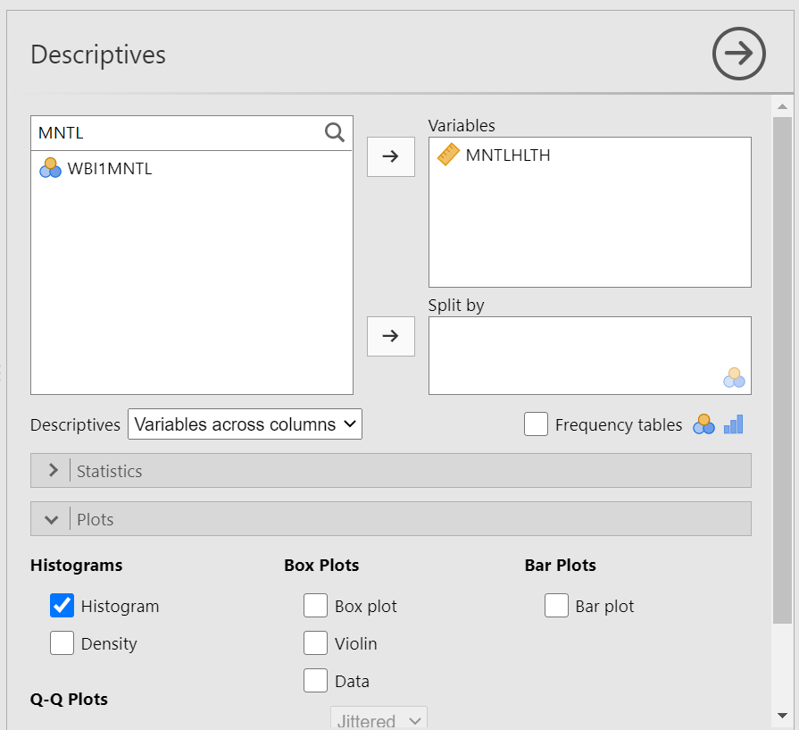

# Lab 1: Graphing Data
<script>
$("#coverpic").hide();
</script>


<span class="newthought">
The commonality between science and art is in trying to see profoundly - to develop strategies of seeing and showing.
-Edward Tufte
</span>

As we have found out from the textbook and lecture, when we measure things, we get lots of numbers. Too many. Sometimes so many your head explodes just thinking about them. One of **the most helpful things** you can do to begin to make sense of these numbers, is to look at them in graphical form. Unfortunately, for sight-impaired individuals, graphical summary of data is much more well-developed than other forms of summarizing data for our human senses. Some researchers are developing auditory versions of visual graphs, a process called **sonification**, but we aren't prepared to demonstrate that here. Instead, we will make charts, and plots, and things to look at, rather than the numbers themselves, mainly because these are tools that are easiest to get our hands on, they are the most developed, and they work really well for visual summary. If time permits, at some point I would like to come back here and do the same things with sonification. I think that would be really, really cool!

## General Goals

Our general goals for this first lab are to get your feet wet, so to speak. We'll do these things:

1. Load in some data to a statistical software program
2. Talk a little bit about how the data is structured
3. Make graphs of the data so we can look at it and make sense of it.

We will use the EngageNS data to accomplish these goals.

### Important info

1. Data for NYC film permits was obtained from the NYC open data website. The .csv file can be found here: <a href="https://raw.githubusercontent.com/CrumpLab/statisticsLab/master/data/Film_Permits.csv" download>Film_Permits.csv</a>


2. Gapminder data from the gapminder project (copied from the R gapminder library) can be downloaded in .csv format here: <a href="https://raw.githubusercontent.com/CrumpLab/statisticsLab/master/data/gapminder.csv" download>gapminder.csv</a>


## R 

### Download the lab templates

You will be completing each lab by writing your code and notes in an R Markdown document. 

1. Download the [RMarkdownsLab.zip](https://github.com/CrumpLab/statisticsLab/raw/master/RMarkdownsLab.zip) to your computer.
2. Unzip the file, this will produce a new folder with three important parts
    a. data folder (contains data files for all labs)
    b. LabTemplates folder (contains blank templates for completing all the labs)
    c. RMarkdownsLab.Rproj A file with a little blue cube with an R in it.
3. Double-click the RMarkdownsLab.Rproj file, this will automatically open R-studio (if you are at home, you must [install R and R-studio first](https://crumplab.github.io/statisticsLab/software.html#installing-r-and-r-studio), or you can use [R-studio Cloud](https://crumplab.github.io/statisticsLab/software.html#r-studio-cloud) through your web-browser)
4. Copy the template .Rmd file for lab 1 from the LabTemplates folder into the main folder, then open it, and use it to begin adding your code and notes for lab 1.
5. Watch this screencast to help you get started.

<iframe width="560" height="315" src="https://www.youtube.com/embed/voMIi1fpe5c" frameborder="0" allow="autoplay; encrypted-media" allowfullscreen></iframe>

Your lab instructor will show you how to open R-studio on the lab computer. Just find it and double-click. Now you have R-studio. Your lab instructor will also walk you through the steps to get started completing the first lab. We also wrote down the steps [here](https://crumplab.github.io/statisticsLab/software.html#how-to-complete-the-r-labs).

There are numerous resources for learning about R, we put some of them on the course website, under the [resouces page](https://crumplab.github.io/psyc3400/Resources.html). You will find these resources helpful as you learn. We also have a kind of [general introduction to R and Rstudio here](https://crumplab.github.io/statisticsLab/software.html#r). This shows you how to download R and R-studio at home (it's free). Throughout the labs you will be writing things called R Markdown documents. You will learn how to do this throughout the labs, but it can also be worthwhile reading other tutorials, such as the one provided by [R Markdown](https://rmarkdown.rstudio.com/lesson-1.html).

When we made this course, we assumed that most students would be unfamiliar with R and R-studio, and might even be frightened of it, because it is a computer programming language (OOOOHHH NOOOOOOO, I NEED TO DROP THIS COURSE NOW)...Don't worry. It's going to be way easier than you think. Let's compare to other statistics courses where you would learn something like SPSS. That is also a limited programming language, but you would mostly learn how to point with a mouse, and click with button. I bet you already know how to do that. I bet you also already know how to copy and paste text, and press enter. That's mostly what we'll be doing to learn R. We will be doing statistics by typing commands, rather than by clicking buttons. However, lucky for you, all of the commands are already written for you. You just have to copy/paste them. 

We know that this will seem challenging at first. But, we think that with lots of working examples, you will get the hang of it, and by the end of the course you will be able to do things you might never have dreamed you can do. It's really a fantastic skill to learn, even if you aren't planning on going on to do research in Psychology (in which case, this kind of thing is necessary skill to learn). With that, let's begin.

### Get some data

In order to graph data, we need to have some data first...Actually, with R, that's not quite true. Run this bit of code and see what happens:

```{r}
hist(rnorm(100, mean=50, sd=25))
```

You just made R sample 100 numbers, and then plot the results in a histogram. Pretty neat. We'll be doing some of this later in the course, where get R to make fake data for us, and then we learn to think about how data behaves under different kinds of assumptions.

For now, let's do something that might be a little bit more interesting...what movies are going to be filming in NYC? It turns out that NYC makes a lot of data about a lot things open and free for anyone to download and look at. This is the NYC Open Data website: [https://opendata.cityofnewyork.us](https://opendata.cityofnewyork.us). I searched through the data, and found a data file that lists the locations of film permits for shooting movies all throughout the Burroughs. There are multiple ways to load this data into R.

1. If you have downloaded the [RMarkdownsLab.zip](https://github.com/CrumpLab/statisticsLab/raw/master/RMarkdownsLab.zip) file, then you already have the data file in the data folder. Assuming you are working in your main directory (your .rmd file is saved in the main folder that contains both the data and template folders), then use the following commands to load the data.

```{r}
library(data.table)
nyc_films <-fread("data/Film_Permits.csv")
```

2. If the above method doesn't work, you can try loading the data from the course website using:

```{r, eval=F}
library(data.table)
nyc_films <- fread("https://raw.githubusercontent.com/CrumpLab/statisticsLab/master/data/Film_Permits.csv")
```

If you are having issues getting the data loaded, then talk to your lab instructor

### Look at the data

You will be downloading and analyzing all kinds of data files this semester. We will follow the very same steps every time. The steps are to load the data, then look at it. You want to see what you've got.

In R-studio, you will now see a variable called `nyc_films` in the top right-hand corner of the screen, in the environment tab. If you click this thing, it will show you the contents of the data in a new window. The data is stored in something we call a `data frame`. It's R lingo, for the thing that contains the data. Notice is a square, with rows going across, and columns going up and down. It looks kind of like an excel spreadsheet if you are familiar with Excel.

It's useful to know you can look at the data frame this way if you need to. But, this data frame is really big, it has 50,728 rows of data. That's a lot too much to look at.

#### summarytools

The summarytools packages give a quick way to summarize all of the data in a data frame. Here's how. When you run this code you will see the summary in the viewer on the bottom right hand side. There's a little browser button (arrow on top of little window) that you can click to expand and see the whole thing in a browser.

```{r, eval=F}
library(summarytools)
view(dfSummary(nyc_films))
```

That is super helpful, but it's still a lot to look at. Because there is so much data here, it's pretty much mind-boggling to start thinking about what to do with it.

### Make Plots to answer questions

Let's walk through a couple questions we might have about this data. We can see that there were 50,728 film permits made. We can also see that there are different columns telling us information about each of the film permits. For example, the `Borough` column lists the Borough for each request, whether it was made for: Manhattan, Brooklyn, Bronx, Queen's, or Staten Island. Now we can ask our first question, and learn how to do some plotting in R. 

#### Where are the most film permits being requested?

Do you have any guesses? Is it Manhattan, or Brooklyn, of the Bronx? Or Queen's or Staten Island? We can find out by plotting the data using a bar plot. We just need to count how many film permits are made in each borough, and then make different bars represent the the counts.

First, we do the counting in R. Run the following code.

```{r}
library(dplyr)

counts <- nyc_films %>%
          group_by(Borough) %>%
          summarize(count_of_permits = length(Borough))

```

The above grouped the data by each of the five Borough's, and then counted the number of times each Borough occurred (using the `length` function). The result is a new variable called `count`. I chose to name this variable `count`. You can see that it is now displayed in the top-right hand corned in the environment tab. If you gave `count` a different name, like `muppets`, then it would be named what you called it.

If you click on the `counts` variable, you will see the five boroughs listed, along with the counts for how many film permits were requested in each Borough. These are the numbers that we want to plot in a graph.

We do the plot using a fantastic package called `ggplot2`. It is very powerful once you get the hand of it, and when you do, you will be able to make all sorts of interesting graphs. Here's the code to make the plot

```{r 1borough}
library(ggplot2)

ggplot(counts, aes(x = Borough, y = count_of_permits )) +
  geom_bar(stat="identity")

```


There it is, we're done here! We can easily look at this graph, and answer our question. Most of the film permits were requested in Manhattan, followed by Brooklyn, then Queen's, the Bronx, and finally Staten Island. 

#### What kind of "films" are being made, what is the category?

We think you might be skeptical of what you are doing here, copying and pasting things. Soon you'll see just how fast you can do things by copying and pasting, and make a few little changes. Let's quickly ask another question about what kinds of films are being made. The column `Category`, gives us some information about that. Let's just copy paste the code we already made, and see what kinds of categories the films fall into. See if you can tell what I changed in the code to make this work, I'll do it all at once:

```{r 1category}

counts <- nyc_films %>%
          group_by(Category) %>%
          summarize(count_of_permits = length(Category))

ggplot(counts, aes(x = Category, y = count_of_permits )) +
  geom_bar(stat="identity")+ 
  theme(axis.text.x = element_text(angle = 90, hjust = 1))

```

OK, so this figure might look a bit weird because the labels on the bottom are running into each other. We'll fix that in a bit. First, let's notice the changes. 

1. I changed `Borough` to `Category`. That was the main thing

2. I left out a bunch of things from before. None of the `library()` commands are used again, and I didn't re-run the very early code to get the data. R already has those things in it's memory, so we don't need to do that first. If you ever clear the memory of R, then you will need to reload those things. First-things come first.

Fine, so how do we fix the graph? Good question. To be honest, I don't know right now. I totally forgot how. But, I know ggplot2 can do this, and I'm going to Google it, right now. Then I'm going to find the answer, and use it here. The googling of your questions is a fine way to learn. It's what everybody does these days....[goes to Google...].

Found it, actually found a lot of ways to do this. The trick is to add the last line. I just copy-pasted it from the solution I found on [stack overflow](https://stackoverflow.com/questions/1330989/rotating-and-spacing-axis-labels-in-ggplot2) (you will become friend's with stack overflow, there are many solutions there to all of your questions)


```{r 1categoryB}

counts <- nyc_films %>%
          group_by(Category) %>%
          summarize(count_of_permits = length(Category))

ggplot(counts, aes(x = Category, y = count_of_permits )) +
  geom_bar(stat="identity")+ 
  theme(axis.text.x = element_text(angle = 90, hjust = 1))

```

### ggplot2 basics

Before we go further, I want to point out some basic properties of ggplot2, just to give you a sense of how it is working. This will make more sense in a few weeks, so come back here to remind yourself. We'll do just a bit a basics, and then move on to making more graphs, by copying and pasting.

The ggplot function uses layers. Layers you say? What are these layers? Well, it draws things from the bottom up. It lays down one layer of graphics, then you can keep adding on top, drawing more things. So the idea is something like: Layer 1 + Layer 2 + Layer 3, and so on. If you want Layer 3 to be Layer 2, then you just switch them in the code.

Here is a way of thinking about ggplot code

```
ggplot(name_of_data, aes(x = name_of_x_variable, y = name_of_y_variable)) +
    geom_layer()+
    geom_layer()+
    geom_layer()

```

What I want you to focus on in the above description is the $+$ signs. What we are doing with the plus signs is adding layers to plot. The layers get added in the order that they are written. If you look back to our previous code, you will see we add a `geom_bar` layer, then we added another layer to change the rotation of the words on the x-axis. This is how it works.

BUT WAIT? How am I supposed to know what to add? This is nuts! We know. You're not supposed to know just yet, how could you? We'll give you lots of examples where you can copy and paste, and they will work. That's how you'll learn. If you really want to read the [help manual](https://ggplot2.tidyverse.org/reference/index.html) you can do that too. It's on the ggplot2 website. This will become useful after you already know what you are doing, before that, it will probably just seem very confusing. However, it is pretty neat to look and [see all of the different things you can do](http://www.ggplot2-exts.org/gallery/), it's very powerful.

For now, let's the get the hang of adding things to the graph that let us change some stuff we might want to change. For example, how do you add a title? Or change the labels on the axes? Or add different colors, or change the font-size, or change the background? You can change all of these things by adding different lines to the existing code.

#### ylab() changes y label

The last graph had `count_of_permits` as the label on the y-axis. That doesn't look right. ggplot2 automatically took the label from the column, and made it be the name on the y-axis. We can change that by adding `ylab("what we want")`. We do this by adding a $+$ to the last line, then adding `ylab()`

```{r 1categoryC}
ggplot(counts, aes(x = Category, y = count_of_permits )) +
  geom_bar(stat="identity") + 
  theme(axis.text.x = element_text(angle = 90, hjust = 1)) +
  ylab("Number of Film Permits")
```

#### xlab() changes x label

Let's slightly modify the x label too:

```{r 1categoryD}
ggplot(counts, aes(x = Category, y = count_of_permits )) +
  geom_bar(stat="identity") + 
  theme(axis.text.x = element_text(angle = 90, hjust = 1)) +
  ylab("Number of Film Permits") + 
  xlab("Category of film")
```


#### ggtitle() adds title

Let's give our graph a title

```{r 1categoryE}
ggplot(counts, aes(x = Category, y = count_of_permits )) +
  geom_bar(stat="identity") + 
  theme(axis.text.x = element_text(angle = 90, hjust = 1)) +
  ylab("Number of Film Permits") + 
  xlab("Category of film") +
  ggtitle("Number of Film permits in NYC by Category")
```

#### color adds color

Let's make the bars different colors. To do this, we add new code to the inside of the `aes()` part:

```{r 1categoryF}
ggplot(counts, aes(x = Category, y = count_of_permits, color=Category )) +
  geom_bar(stat="identity") + 
  theme(axis.text.x = element_text(angle = 90, hjust = 1)) +
  ylab("Number of Film Permits") + 
  xlab("Category of film") +
  ggtitle("Number of Film permits in NYC by Category")
```

#### fill fills in color

Let's make the bars different colors. To do this, we add new code to the inside of the `aes()` part...Notice I've started using new lines to make the code more readable. 

```{r 1categoryG}
ggplot(counts, aes(x = Category, y = count_of_permits, 
                   color=Category, 
                   fill= Category )) +
  geom_bar(stat="identity") + 
  theme(axis.text.x = element_text(angle = 90, hjust = 1)) +
  ylab("Number of Film Permits") + 
  xlab("Category of film") +
  ggtitle("Number of Film permits in NYC by Category")
```

#### get rid of the legend

Sometimes you just don't want the legend on the side, to remove it add 

`theme(legend.position="none")`

```{r 1categoryH}
ggplot(counts, aes(x = Category, y = count_of_permits, 
                   color=Category, 
                   fill= Category )) +
  geom_bar(stat="identity") + 
  theme(axis.text.x = element_text(angle = 90, hjust = 1)) +
  ylab("Number of Film Permits") + 
  xlab("Category of film") +
  ggtitle("Number of Film permits in NYC by Category") +
  theme(legend.position="none")
```

#### theme_classic() makes white background

The rest is often just visual preference. For example, the graph above has this grey grid behind the bars. For a clean classic no nonsense look, use `theme_classic()` to take away the grid.

```{r 1categoryI}
ggplot(counts, aes(x = Category, y = count_of_permits, 
                   color=Category, 
                   fill= Category )) +
  geom_bar(stat="identity") + 
  theme(axis.text.x = element_text(angle = 90, hjust = 1)) +
  ylab("Number of Film Permits") + 
  xlab("Category of film") +
  ggtitle("Number of Film permits in NYC by Category") +
  theme(legend.position="none") +
  theme_classic()
```

#### Sometimes layer order matters

Interesting, `theme_classic()` is misbehaving a little bit. It looks like we have some of our layer out of order, let's re-order. I just moved `theme_classic()` to just underneath the `geom_bar()` line. Now everything get's drawn properly.

```{r 1categoryJ}
ggplot(counts, aes(x = Category, y = count_of_permits, 
                   color=Category, 
                   fill= Category )) +
  geom_bar(stat="identity") + 
  theme_classic() +
  theme(axis.text.x = element_text(angle = 90, hjust = 1)) +
  ylab("Number of Film Permits") + 
  xlab("Category of film") +
  ggtitle("Number of Film permits in NYC by Category") +
  theme(legend.position="none") 
  

```

#### Font-size

Changing font-size is often something you want to do. ggplot2 can do this in different ways. I suggest using the `base_size` option inside `theme_classic()`. You set one number for the largest font size in the graph, and everything else gets scaled to fit with that that first number. It's really convenient. Look for the inside of `theme_classic()`

```{r 1categoryK}
ggplot(counts, aes(x = Category, y = count_of_permits, 
                   color=Category, 
                   fill= Category )) +
  geom_bar(stat="identity") + 
  theme_classic(base_size = 15) +
  theme(axis.text.x = element_text(angle = 90, hjust = 1)) +
  ylab("Number of Film Permits") + 
  xlab("Category of film") +
  ggtitle("Number of Film permits in NYC by Category") +
  theme(legend.position="none") 
  

```
or make things small... just to see what happens

```{r 1categoryL}
ggplot(counts, aes(x = Category, y = count_of_permits, 
                   color=Category, 
                   fill= Category )) +
  geom_bar(stat="identity") + 
  theme_classic(base_size = 10) +
  theme(axis.text.x = element_text(angle = 90, hjust = 1)) +
  ylab("Number of Film Permits") + 
  xlab("Category of film") +
  ggtitle("Number of Film permits in NYC by Category") +
  theme(legend.position="none") 
  

```

#### ggplot2 summary

That's enough of the ggplot2 basics for now. You will discover that many things are possible with ggplot2. It is amazing. We are going to get back to answering some questions about the data with graphs. But, now that we have built the code to make the graphs, all we need to do is copy-paste, and make a few small changes, and boom, we have our graph.

### More questions about NYC films

#### What are the sub-categories of films?
 
Notice the `nyc_films` data frame also has a column for `SubCategoryName`. Let's see what's going on there with a quick plot.

```{r 1subcategory}

# get the counts (this is a comment it's just here for you to read)

counts <- nyc_films %>%
          group_by(SubCategoryName) %>%
          summarize(count_of_permits = length(SubCategoryName))

# make the plot

ggplot(counts, aes(x = SubCategoryName, y = count_of_permits, 
                   color=SubCategoryName, 
                   fill= SubCategoryName )) +
  geom_bar(stat="identity") + 
  theme_classic(base_size = 10) +
  theme(axis.text.x = element_text(angle = 90, hjust = 1)) +
  ylab("Number of Film Permits") + 
  xlab("Sub-category of film") +
  ggtitle("Number of Film permits in NYC by Sub-category") +
  theme(legend.position="none") 

```

I guess "episodic series" are the most common. Using a graph like this gave us our answer super fast.

#### Categories by different Boroughs

Let's see one more really useful thing about ggplot2. It's called `facet_wrap()`. It's an ugly word, but you will see that it is very cool, and you can do next-level-super-hero graph styles with `facet_wrap` that other people can't do very easily. 

Here's our question. We know that some films are made in different Boroughs, and that same films are made in different categories, but do different Boroughs have different patterns for the kinds of categories of films they request permits for? Are their more TV shows in Brooklyn? How do we find out? Watch, just like this:

```{r 1facetwrap}

# get the counts (this is a comment it's just here for you to read)

counts <- nyc_films %>%
          group_by(Borough,Category) %>%
          summarize(count_of_permits = length(Category))

# make the plot

ggplot(counts, aes(x = Category, y = count_of_permits, 
                   color=Category, 
                   fill= Category )) +
  geom_bar(stat="identity") + 
  theme_classic(base_size = 10) +
  theme(axis.text.x = element_text(angle = 90, hjust = 1)) +
  ylab("Number of Film Permits") + 
  xlab("Category of film") +
  ggtitle("Number of Film permits in NYC by Category and Borough") +
  theme(legend.position="none") +
  facet_wrap(~Borough, ncol=3)

```

We did two important things. First we added `Borough` and `Category` into the `group_by()` function. This automatically gives separate counts for each category of film, for each Borough. Then we added `facet_wrap(~Borough, ncol=3)` to the end of the plot, and it automatically drew us 5 different bar graphs, one for each Borough! That was fast. Imagine doing that by hand.

The nice thing about this is we can switch things around if we want. For example, we could do it this way by switching the `Category` with `Borough`, and facet-wrapping by Category instead of Borough like we did above. Do what works for you.


```{r 1facetwrap2}
ggplot(counts, aes(x = Borough, y = count_of_permits, 
                   color=Borough, 
                   fill= Borough )) +
  geom_bar(stat="identity") + 
  theme_classic(base_size = 10) +
  theme(axis.text.x = element_text(angle = 90, hjust = 1)) +
  ylab("Number of Film Permits") + 
  xlab("Borough") +
  ggtitle("Number of Film permits in NYC by Category and Borough") +
  theme(legend.position="none") +
  facet_wrap(~Category, ncol=5)

```

### Gapminder Data

[https://www.gapminder.org](https://www.gapminder.org) is an organization that collects some really interesting worldwide data. They also make cool visualization tools for looking at the data. There are many neat examples, and they have visualization tools built right into their website that you can play around with [https://www.gapminder.org/tools/](https://www.gapminder.org/tools/). That's fun check it out.

There is also an R package called `gapminder`. When you install this package, it loads in some of the data from gapminder, so we can play with it in R.

If you don't have the gapminder package installed, you can install it by running this code

```{r, eval=FALSE}
install.packages("gapminder")
```

Once the package is installed, you need to load the new library, like this. Then, you can put the `gapminder` data into a data frame, like we do here: `gapminder_df`.

```{r}
library(gapminder)
gapminder_df<-gapminder
```

#### Look at the data frame

You can look at the data frame to see what is in it, and you can use `summarytools` again to view a summary of the data.

```{r, eval=FALSE}
view(dfSummary(gapminder_df))
```

There are 1704 rows of data, and we see some columns for country, continent, year, life expectancy, population, and GDP per capita.

### Asking Questions with the gap minder data

We will show you how to graph some the data to answer a few different kinds of questions. Then you will form your own questions, and see if you can answer them with ggplot2 yourself. All you will need to do is copy and paste the following examples, and change them up a little bit

#### Life Expectancy histogram

How long are people living all around the world according to this data set? There are many ways we could plot the data to find out. The first way is a histogram. We have many numbers for life expectancy in the column `lifeExp`. This is a big sample, full of numbers for 142 countries across many years. It's easy to make a histogram in ggplot to view the distribution:

```{r 1gapminder}
ggplot(gapminder_df, aes(x=lifeExp))+
  geom_histogram(color="white")
```

See, that was easy. Next, is a code block that adds more layers and settings if you wanted to modify parts of the graph:

```{r 1gapminderB}

ggplot(gapminder_df, aes(x = lifeExp)) +
  geom_histogram(color="white")+ 
  theme_classic(base_size = 15) +
  ylab("Frequency count") + 
  xlab("Life Expectancy") +
  ggtitle("Histogram of Life Expectancy from Gapminder")

```

The histogram shows a wide range of life expectancies, from below 40 to just over 80. Histograms are useful, they can show you what kinds of values happen more often than others.

One final thing about histograms in ggplot. You may want to change the bin size. That controls how wide or narrow, or the number of bars (how they split across the range), in the histogram. You need to set the `bins=` option in `geom_histogram()`.

```{r 1gapminderC}

ggplot(gapminder_df, aes(x = lifeExp)) +
  geom_histogram(color="white", bins=50)+ 
  theme_classic(base_size = 15) +
  ylab("Frequency count") + 
  xlab("Life Expectancy") +
  ggtitle("Histogram of Life Expectancy from Gapminder")

```

See, same basic patter, but now breaking up the range into 50 little equal sized bins, rather than 30, which is the default. You get to choose what you want to do.

#### Life Expectancy by year Scatterplot

We can see we have data for life expectancy and different years. So, does worldwide life expectancy change across the years in the data set? As we go into the future, are people living longer?

Let's look at this using a scatter plot. We can set the x-axis to be year, and the y-axis to be life expectancy. Then we can use `geom_point()` to display a whole bunch of dots, and then look at them. Here's the simple code:

```{r 1scatterplot}
ggplot(gapminder_df, aes(y= lifeExp, x= year))+
  geom_point()
```

Whoa, that's a lot of dots! Remember that each country is measured each year. So, the bands of dots you see, show the life expectancies for the whole range of countries within each year of the database. There is a big spread inside each year. But, on the whole it looks like groups of dots slowly go up over years.

#### One country, life expectancy by year

I'm (Matt) from Canada, so maybe I want to know if life expectancy for Canadians is going up over the years. To find out the answer for one country, we first need to split the full data set, into another smaller data set that only contains data for Canada. In other words, we want only the rows where the word "Canada" is found in the `country` column. We will use the `filter` function from `dplyr` for this:

```{r 1scatterB}
# filter rows to contain Canada

smaller_df <- gapminder_df %>% 
                 filter(country == "Canada")

# plot the new data contained in smaller_df

ggplot(smaller_df, aes(y= lifeExp, x= year))+
  geom_point()

```

I would say things are looking good for Canadians, their life expectancy is going up over the years!

#### Multiple countries scatterplot

What if we want to look at a few countries altogether. We can do this too. We just change how we filter the data so more than one country is allowed, then we plot the data. We will also add some nicer color options and make the plot look pretty. First, the simple code:

```{r 1scatterC}

# filter rows to contain countries of choice

smaller_df <- gapminder_df %>% 
                 filter(country %in% c("Canada","France","Brazil") == TRUE)

# plot the new data contained in smaller_df

ggplot(smaller_df, aes(y= lifeExp, x= year, group= country))+
  geom_point()

```

Nice, we can now see three sets of dots, but which are countries do they represent? Let's add a legend, and make the graph better looking.

```{r 1scatterD}
ggplot(smaller_df,aes(y= lifeExp, x= year, 
                      group= country, color = country)) +
  geom_point()+ 
  theme_classic(base_size = 15) +
  ylab("Life Expectancy") + 
  xlab("Year") +
  ggtitle("Life expectancy by year for three countries")

```

#### geom_line() connecting the dots

We might also want to connect the dots with a line, to make it easier to see the connection! Remember, ggplot2 draws layers on top of layers. So, we add in a new `geom_line()` layer.

```{r 1scatline}
ggplot(smaller_df,aes(y= lifeExp, x= year, 
                      group= country, color = country)) +
  geom_point()+ 
  geom_line()+
  theme_classic(base_size = 15) +
  ylab("Life Expectancy") + 
  xlab("Year") +
  ggtitle("Life expectancy by year for three countries")

```

### Generalization Exercise

The following generalization exercise and writing assignment is also in your lab R Markdown document for this lab. Complete your work in that document and hand it in.

(1 point - Pass/Fail)

Use the code from above to attempt to solve the extra things we ask you do for this assignment. You generalization exercises are as follows:

1. Make a graph plotting Life Expectancy by year for the five continents, using the `continent` factor. Make sure you change the title so it reads correctly

2. Make a graph plotting GDP per capita by year for the USA, Canada, and Mexico. Use the `gdpPercap` column for the GDP per capita data

3. Make a new graph plotting anything you are interested in using the gapminder dataset. It just needs to be a plot that we have not given an example for

### Writing assignment

Complete the writing assignment described in your R Markdown document for this lab. When you have finished everything. Knit the document and hand in your stuff (you can submit your .RMD file to blackboard if it does not knit.)

The question for this lab is a long answer question about histograms. Here is the question:

Describe what histograms are, how to interpret them, and what they are useful for. You should answer each of these questions:

The answers to each of these questions are worth .25 points each, for a total of 2 points

a. What do the bars on a histogram represent?
b. How many bars can a histogram have?
c. What do the heights of the bars tell you
d. What is on the x-axis and y-axis of a histogram
e. What does the tallest bar on a histogram tell you?
f. What does the shortest bar on a histogram tell you?
g. What are some uses for histograms, why would you want to look at a histogram of some numbers that you collected?
h. Imagine you had two histograms, one was very wide and spread out, the other was very narrow with a very tall peak. Which histogram would you expect to contain more consistent numbers (numbers that are close to each other), explain why.

**Rubric**

General grading. 

- You will receive 0 points for missing answers (say, if you do not answer question c, then you will receive 0 out .25 points for that question)
- You must write in complete sentences. Point form sentences will be given 0 points.
- Completely incorrect answers will receive 0 points. For example, if you incorrectly describe what the x and y-axes refer to, then you will receive 0 points for that question.
- If your answer is generally correct but very difficult to understand and unclear you may receive half points for the question


## Excel

## SPSS


In this lab, we will get you acquainted with the SPSS software layout and graph some sample data to make sense of it. We will be doing the following:

1. Opening SPSS and the SPSS layout 
2. Reviewing variable properties and the Variable View tab
3. Opening a data file and producing different types of graphs


### Opening SPSS and the SPSS layout


Your lab instructor will take you through the process of opening the SPSS program. You may double-click on its icon located on the desktop of your lab computer, or you may find it using the Start menu. Once the program loads,  you will be prompted with a pop-up window that asks you which file you would like to open. For now, we will be examining the basic layout of SPSS without a data set, so you can click <span style="color:blue">Cancel</span>. 

Once you do, the main SPSS spreadsheet should open. It will look like this, a basic spreadsheet:

```{r , fig.cap="Empty SPSS spreadsheet", echo=FALSE,dev='png'}
knitr::include_graphics('img/1.4.11.png')
```

Notice at the bottom of your window there are two tabs; "Data View" and "Variable View". In data view, we enter data into our spreadsheet. You will notice that rows are numbered on the left-hand side of the spreadsheet, while columns are labeled "var". This is an indication of the general structure of SPSS: Variables are contained in the columns, and rows indicate individual observations.  For example, if you obtained the heights (in inches) of 5 people {x= 64, 70, 63, 62, 65} and wanted to enter their data into SPSS, each person's height would be entered in a new row, not across the columns, as seen below:


```{r , echo=FALSE,dev='png'}
knitr::include_graphics('img/1.4.12.png')
```


### Reviewing variable properties and the Variable View tab


Now that we have some data entered, we might want to name our variable so that it's evident our measurements represent heights. In order to view or modify variable names and other properties, look to the bottom of your SPSS window and switch over to the "Data View" tab. Once you do this, your window will appear as follows:


```{r , echo=FALSE,dev='png'}
knitr::include_graphics('img/1.4.13.png')
```

Here, you can edit the name of your variables, and specify their properties. Variable names can be anything you like, with the restriction that you cannot use numbers or spaces. Next, notice several other important properties of variables you may at some point need to set or modify:

+ Name: the name of your variable that will appear as a column header in Data View. No spaces or numerals.
+ Type: Your data will most often be Numeric, but sometimes, as in data representing currency or data in scientific notation, you may change the data type appropriately. If your data is simply a label, word, or response (such as an open-ended response to a survey question), choose "String": this tells SPSS not to treat this variable as a number. (Nota bene: if you select the wrong type of variable, SPSS may not be able to process your requested calculations, so always remember to check this parameter!)
+ Width: This refers to how many digits will be visible by default.
+ Decimals: This refers to how many decimal places will be visible by default.
+ Label: This is a description of the variable. Any information too long to be included in the variable name goes here.
+ Values: For nominal scale data, let's say 1 represents male and 2 represents female, this is where you include the values and their corresponding labels. 
+ Measure: This variable property allows you to specify the nature of your data. Depending on the kind of scale you are using, you will choose a different measure type. Nominal and ordinal are chosen for nominal and ordinal scales, respectively. "Scale" is used when your data is measured on a ratio or interval scale. 


### Opening a data file and producing different types of graphs


Now that we know about the properties of the SPSS spreadsheet window, let's open a data file and learn how to make some sense of it by creating different types of graphs. Use the 'nyc_films.sav' file from the zip file you downloaded in section 0.2.3, which contains information about film permits (requests made by film companies to shoot TV shows and movies on location) filed in New York City.

Once you open the data file, browse through to familiarize yourself with the variables that are being measured. Switch over to Variable View for details of each variable. 


#### Bar Graphs


Now, back to Data View. We will not be working with every single variable in this spreadsheet, but we'll select a few interesting ones with which to answer questions. Let's start with `borough`. Suppose we wanted to know which borough receives the most film permits (you can probably guess which one is most popular). Let's use SPSS to produce a graph to answer this question. With your data file open, go up to the top menu and choose <span style="color:blue">Graphs</span>, then <span style="color:blue">Legacy Dialogs</span>. You will see an entire list of possible graphs we can use to plot our data. 

Let's think about the nature of our question: we would like to know how many permits were filed for each borough. Borough is simply a label or a name for a region, and we want to know the frequency of permits for each borough. This is a nominal scale variable and so, we will appropriately choose a BAR graph to plot it. Select <span style="color:blue">Bar...</span>

```{r , echo=FALSE,dev='png'}
knitr::include_graphics('img/1.4.14.png')
```

The next window will ask you to specify what kind of graph you would like. Select <span style="color:blue">Simple</span> and then <span style="color:blue">Define</span>. 
```{r , echo=FALSE,dev='png'}
knitr::include_graphics('img/1.4.15.png')
```
The following window will ask which variable you'd like to plot. Select `borough` from the left-hand list and use the arrow to move it into the field labeled "Category Axis". Then click <span style="color:blue">OK</span>. 

```{r , echo=FALSE,dev='png'}
knitr::include_graphics('img/1.4.16.png')
```

SPSS will produce a new output window which will contain the bar graph you have generated. Notice which borough receives the most film permits. Note: your graph might be a different colour.

```{r , echo=FALSE,dev='png'}
knitr::include_graphics('img/1.4.17.png')
```


#### Histograms


Now, let's use a different data set to plot a histogram. The defining difference between a histogram and a bar graph (although they look very similar as they both utilize bars) is that a histogram is used to display a continuous variable (interval or ratio scale). In the previous example, boroughs were simply labels or names, so we used a nominal scale and therefore a bar graph. Here, we will deal with life expectancy (measured in years), an interval scale measure. Open life_expectancy.sav (from the zip file you downloaded from 0.2.3). Open this file and examine its rows and columns. Each column represents a year during which life expectancy was measured. Each row represents a different country. 

Let's first get an idea about life expectancy in general. We want to plot a histogram with life expectancy on the x-axis and frequency on the y-axis. Choose <span style="color:blue">Graphs</span> in the top menu, then <span style="color:blue">Legacy Dialogs</span>. From here, remember we want a histogram, not a bar graph, so let's select <span style="color:blue">Histogram...</span>. 

```{r , echo=FALSE,dev='png'}
knitr::include_graphics('img/1.4.18.png')
```

The window that appears contains every variable in your spreadsheet listed on the left-hand side. We can choose one variable at a time to plot. Let's scroll all the way down the list and choose `2017 [v219]`. This is the variable containing life expectancies for the year 2017. Using the arrow, move that variable into the field labeled "Variable:", then click <span style="color:blue">OK</span>.

```{r , echo=FALSE,dev='png'}
knitr::include_graphics('img/1.4.19.png')
```

SPSS will produce an output window containing the distribution of life expectancy for the year 2017. Note: You may get different axis intervals/labels than what is shown here.

```{r , echo=FALSE,dev='png'}
knitr::include_graphics('img/1.4.20.png')
```


#### Scatterplots


Now, we will look to a different type of data plot; the scatterplot. A scatterplot allows us to visualize bivariate data, that is, data for which there are two measurements per individual. For example, we may ask whether life expectancy in a country (or how long you live, on average) is related to the average income. Using the life_expectancy.sav data file, let's plot both variables: `2017 [v219]` and `income`. The income variable in the spreadsheet refers to data collected in 2017 by the Better Life Initiative. Notice not all the countries listed have estimates for average annual income. For those that do, this value represents household net adjusted income (annual) in US dollars. 

To create the scatterplot, let's go to <span style="color:blue">Graphs</span> in the menu toolbar, then <span style="color:blue">Legacy Dialogs</span>, then <span style="color:blue">Scatter</span>. 

```{r , echo=FALSE,dev='png'}
knitr::include_graphics('img/1.4.21.png')
```

You will choose <span style="color:blue">Simple</span> scatter, then click <span style="color:blue">Define</span>.
```{r , echo=FALSE,dev='png'}
knitr::include_graphics('img/1.4.22.png')
```

Next, indicate which variables (there are 2 this time!) you would like in the x- and y-axes. Use the arrows to place `income` in the x-axis field, and `2017 (V219)` in the y-axis field. (For the purposes of graphing a scatterplot, it does not matter which variable goes into the y-axis and x-axis fields for now; you can reverse them if you'd like and you can still interpret the data similarly)

```{r , echo=FALSE,dev='png'}
knitr::include_graphics('img/1.4.23.png')
```

Then click <span style="color:blue">OK</span>. 
SPSS will produce output containing a scatterplot. What relationship do you notice? What happens to life expectancy the more individuals earn, on average?

```{r , echo=FALSE,dev='png'}
knitr::include_graphics('img/1.4.24.png')
```


### Homework
___

Create the following three graphs in a single SPSS output file (*.spv). Upload this file to Moodle and use the graphs to answer the questions in the homework "quiz" on Moodle. Note that you can attempt the quiz as many times as you like before the due date and only your highest mark will be counted.

1. Create a histogram for life expectancy in the year 1800.
2. If you haven't already, create a histogram for life expectancy in the year 2017.
3. Create a scatterplot of life expectancy of each country in 1800 vs. that of 2018. 

## JAMOVI - Week 4 - February 4th, 5th, & 6th

<div class="marginnote">
This section is  copied almost verbatim, with some editorial changes, from [Answering questions with data: The lab manual for R, Excel, SPSS and JAMOVI, Lab 1, Section 1.4, SPSS](https://www.erinmazerolle.com/statisticsLab/lab-1-graphing-data.html#spss-1), according to its [CC license](https://creativecommons.org/licenses/by-sa/4.0/deed.ast). Thank you to Crump, Krishnan, Volz, &   Chavarga (2018). 
</div>

In this lab, it is hoped you will become more acquainted with the jamovi software layout and graph some sample data to make sense of it. We will be doing the following:

1. Deciding on which is the best graph based on the scale of measurement
2. Reviewing variable attributes (or properties) using the Edit (in Variables menu) or Setup (in Data menu) buttons 
3. Opening a data file and producing different types of graphs 


### Getting ready for this lesson

Please complete all of these tasks before your lab starts. Do these tasks as soon as possible and post to the Q&A forum or come to Help Hours if you run into any problem.s

You will need to use the EngageNS data set and data dictionary during this lab. Be sure to have the data set (in its original state; without analyses) opened in JAMOVI and the data dictionary opened in Preview or Adobe.

Read over all of Sections 1.5.4 and 1.5.5.

### Opening JAMOVI and Reviewing the JAMOVI Layout


To open jamovi if you are using Windows, either double-click its icon located on the desktop of your computer, or click it in the Start menu. 

To open jamovi if you are using a Mac, find the icon in your Applications folder and double-click it.

Once the program loads, you can click on the button that looks like three horizontal lines at the top left. This bottom reveals a menu. Take note that you have some familiar options here: <span style="color:blue">New</span> (for a new file), <span style="color:blue">Open</span> (to open an existing file), and <span style="color:blue">Save</span>. For now, we will be reviewing the basic layout of jamovi without a data set, so you can click the left facing arrow to close this menu.

Once you do, the main jamovi spreadsheet should be apparent. It will look like this, with a basic spreadsheet on the left and a results panel on the right:

```{r , fig.cap="Empty jamovi spreadsheet", echo=FALSE,dev='png'}

```

As explained in [Section 0.6.1.2](https://www.erinmazerolle.com/statisticsLab/software.html#getting-started-with-jamovi), you can slide the separating line between these two panels to make one panel or the other larger. You should also recall that, in the spreadsheet, each row represents a case or a *participant* and each column represents a *variable*. (For more details about the jamovi program, see Section 0.6.) If, for example, you obtained the heights (in inches) of 5 people {x = 64, 70, 63, 62, 65} and wanted to enter their data into jamovi, each person’s height would be entered in a new row, as seen below, not across the columns:


```{r , echo=FALSE,dev='png'}
knitr::include_graphics('img/1.5.1.2.png')
```


### Reviewing Variable Properties and the Edit or Setup button


Now that we have some data entered, we might want to name our variable so that it’s evident our measurements represent heights. In order to view or modify variable names and other properties, look to the menu ribbon at the top of the jamovi window. Notice that when you are enterring data, you are working in the <span style="color:blue">Data</span> tab or menu (look at the top set of menu options). While you are within any column representing a variable, you can click the <span style="color:blue">Setup</span> button. This <span style="color:blue">Setup</span> button will reveal, in a top panel, information about the attributes of the variable. (You may recall from lab that the other way to access this panel is to have the variable name highlighted while in the <span style="color:blue">Variables</span>) menu and to click the <span style="color:blue">Edit</span> button.)

```{r , echo=FALSE,dev='png'}
knitr::include_graphics('img/1.5.2.1A.png')
```

Once selected, your window will appear as follows:

```{r , echo=FALSE,dev='png'}
knitr::include_graphics('img/1.5.2.1B.png')
```

A more detailed description of variable types is presented in [Section 0.6.3](https://www.erinmazerolle.com/statisticsLab/software.html#the-spreadsheet). Within this variable panel, you can edit the name of your variables and specify their properties. Variable names can be anything you like (*without the restrictions that SPSS has*). Based on some user feedback, however, you may want to consider using Camel Case or underscores in variable names to play it safe (ex. ParticipantNumber or Participant_Number). Also, you may want to consider how much of the variable name you will see in the spreadsheet panel based on the size of screen and the number of variables you have in your data set.

```{r , echo=FALSE,dev='png'}
knitr::include_graphics('img/1.5.2.2A.png')
```

```{r , echo=FALSE,dev='png'}
knitr::include_graphics('img/1.5.2.2B.png')
```

Below the variable name is a place for a description of the data. Below the description is a drop-down menu allowing you to identify the measure type: nominal, ordinal, continuous, or ID. Below that is a drop-down menu allowing you to identify the data type: Integer, Decimal, or Text. The final variable attribute on the left side is a place for you to identify any missing values. To the left of the measure type, data type, and missing values is a box wherein levels can be specified. If you need to code data, this is the place to do so. (Just in case it helps you to know this: It is similar to the Values column in the Variable View of SPSS.) Selecting the “Retain unused levels” radio button forces the program to keep levels even if they do not appear in the data set.

```{r , echo=FALSE,dev='png'}
knitr::include_graphics('img/1.5.2.3.png')
```

You may want to click the arrowhead that points to the left or right to move to an adjacent variable. Alternatively, clicking the <span style="color:blue">Setup</span> button again or clicking the upward facing arrow will hide this variable attribute information from your view.


### Opening a Data File (Through the JAMOVI Software)


Now that we know about the properties of the jamovi spreadsheet window, let’s open a data file and learn how to make some sense of it by creating different types of graphs. (It is not important for you to <span style="color:blue">Save</span> the jamovi file you just created because we will not be doing anything with those fictitious height data). 

For a previous lab, you agreed to some terms of use regarding the data set we will be using in this lab. Then, you downloaded the data file and saved the file somewhere sensible on your computer so you could find it later.

In jamovi, click the button that looks like three horizontal lines at the top left. Select <span style="color:blue">Open</span>. Click <span style="color:blue">Browse</span>, locate the jamovi file you  downloaded (*EngageNS_StartingFile_2023.omv*), and double click. It is a somewhat large file and will take a few minutes to import. Once it is finished, we want to save it in jamovi format (.omv) using a new name to indicate you will change it for the lab demonstration. Click the button that looks like three horizontal lines at the top left. Select <span style="color:blue">Save As</span>, type a sensible name for your file, ensure it is set to "jamovi file (.omv)", click browse and select the folder in which to save your file, and click <span style="color:blue">Save</span>. (Mac users may need to copy the file, paste it, and rename it.) Remember that EngageNS surveyed Nova Scotians about various aspects of their quality of life. 

The data dictionary, which is a .pdf file (in this case), lists all the variables that were included in the EngageNS survey and shows how these variables were measured.You should open this file, too. (It is not a jamovi file, and you should be able to open it by double-clicking on the file name - *CIW-NovaScotia2019-SurveyDataDictionary* - wherever you saved the file.)

Once you open the data file, browse through to familiarize yourself with the variables that are being measured. Take a look at the rows and columns in each file. Each **column** represents a **different variable** that was measured in the EngageNS survey. Each **row** represents the responses of a **single survey respondent**.

After opening the data file and data dictionary, browse through both files to familiarize yourself with the variables that are being measured. After you review the “Variable label” (second column) and the “Response options” (third column) in the data dictionary, switch over to Variable View in the data file to check the variable attributes of each variable.

Switch over to the <span style="color:blue">Variables</span> menu for a list of variables, and a quick view of the details of each variable (See the icon to the left of the variable name and the description to the right of the variable name). Sometimes this information is correct, but sometimes it is erroneous. We can use the data dictionary and what we know about scales of measurement to input the correct scales of measurement as needed.

The scale of measurement will help us consider the most appropriate type of graph for the data collected on any given variable.


### Producing Different Types of Graphs


#### Bar Graphs and Histograms


Bar graphs and histograms are different types of graphs. Bar graphs are used for nominal variables. The *y*-axis of a bar graph could be the mean of each level, the frequency of each level, or some other summary of each level. 

Histograms are used for continuous variables (interval or ratio scales of measurement). The *y*-axis is always frequency. Sometimes they are labeled "count" or "density," but they always represent the number of times certain values appear in the data.

Are ordinal variables continuous? No. However, many ordinal variables can be conceptualized as quasi-interval. Likert scales are often quasi-interval. For the scale to be quasi-interval, we generally require at least five options or levels on the scale. In addition, it should be reasonable to assume equal spacing between options on the scale. For example, a scale with the following options might be considered quasi-interval, because there are five options and they all seem equally spaced from one another:
Strongly disagree, somewhat disagree, neither agree or disagree, somewhat agree, strongly agree

A quirk of JAMOVI is that histograms do not include numbers across all of the *y*-axis, which makes them difficult to read. However, bar graphs do include numbers below each bar on the *y*-axis in JAMOVI. For small, quasi-interval scales, you **could** (*See note that follows this paragraph.*) approximate a histogram with a bar graph. The biggest difference is that usually histograms do not have any space between the bars, whereas bar graphs do have space between the bars, but this is not problematic for small, quasi-interval scales. (**Remember: In 292, you will treat Likert scales that are quasi-interval with *reasonably equal intervals* as interval scales. Therefore, you will use histograms when graphing these quasi-interval scales.**)


#### Bar Graphs

Now, let’s have a look at the EngageNS data set using the <span style="color:blue">Data</span> menu. We will not be working with every single variable in this spreadsheet, but we’ll select a few interesting ones with which to answer questions. Let’s start with `PARSPORT`. Suppose we want to know how many respondents in the EngageNS survey are members of or participants in sports or recreational organizations. Let’s use JAMOVI to produce a graph to answer the question. Go up to the top menu and choose <span style="color:blue">Analyses</span>, then select <span style="color:blue">Exploration</span>, and then select <span style="color:blue">Descriptives</span>. 

Let’s think about the nature of our question.  We want to know how many people in the data set indicated that they participate in sports and/or recreational organizations. From a quick check in the data dictionary, we can determine that `PARSPORT` is the name of the variable, it represents whether the survey respondent is a member or participant in sports or recreational activities, and it is measured using Yes/No response options. These response options represent a nominal scale, so we will appropriately choose a BAR graph to plot it. (Bar graphs are used to represent nominal scales because nominal scales are not continuous. In bar graphs, the bars do not touch – showing the non-continuous nature of the scale.)


```{r , echo=FALSE,dev='png'}
knitr::include_graphics('img/PARSPORTinDataDictionary.png')
```


If this information is not in your current EngageNS file (and it should not be in the Starting File you are using), please add it to the variable attributes. Then, in the analysis panel (the view to the left in JAMOVI), select the variable of interest for the graph by highlighting `PARSPORT` and using the right-facing arrow to move it to that Variables field on the right. 


```{r , echo=FALSE,dev='png'}
knitr::include_graphics('img/MovingPARSPORTToVarField.png')
```

Then, click on the <span style="color:blue">Plots</span> ribbon. You will see a number of options available. Select  <span style="color:blue">Bar plot</span>…

```{r , echo=FALSE,dev='png'}
knitr::include_graphics('img/PARSPORTBarGraphCommands.png')
```

In the Results panel, you will see a Descriptives table was produced when you selected the variable, and a bar graph was produced when you selected `Bar plot.`  Notice how many respondents are involved in sports/recreational organizations and how many are not. Roughly how many people participate in sports/recreational organizations? How many do not?

```{r , echo=FALSE,dev='png'}
knitr::include_graphics('img/PARSPORTBarGraph.png')
```

Your bar graph will have as many bars as there are categories in your nominal variable. For example, if you want to know how many respondents were from each region of NS, create a bar graph for REGION. The number of regions from which the survey participants come is represented by the number of bars on your graph. If you want to construct this graph without moving both `PARSPORT` and `REGION` into the same Descriptives table, you can click on the arrow that faces to the right to close the Descriptives analysis and bar plot that you just completed.

```{r , echo=FALSE,dev='png'}
knitr::include_graphics('img/PARSPORTBarGraphCommitToResults.png')
```

Then, click on the <span style="color:blue">Exploration</span> and <span style="color:blue">Descriptives</span> commands again. Now, you can repeat the process looking at only `REGION`. From how many regions in Canada did the survey participants come? (Yes, the labelling of the *x*-axis is very difficult to read with the words overlapping.)

```{r , echo=FALSE,dev='png'}

```

#### Histograms


Now, let’s use a different variable to plot a histogram. The defining difference between a histogram and a bar graph (although they look very similar as they both utilize bars) is that a histogram is used to display a continuous variable (interval or ratio scale). A second difference, and one that is more noticeable, is that, in histograms, the bars touch one another while there are gaps between the bars in bar graphs. This is a visual way to show that these types of graphs represent variables measured on different scales of measurement. Histograms are used to represent variables that are measured on continuous scales (e.g., interval or ratio scales). The bars in a histogram touch indicating the continuous nature of the measurement scale. 

In the previous example, respondents indicated simply whether they were or were not participants in sports/recreational organizations. Their responses were either yes or no; therefore, the data is categorical and was measured on a nominal scale. Given that the data is categorical, the gaps between the bars in the bar graph we made earlier represent the non-continuous nature of the data.

Here, we will deal with people’s self-reported mental health, `MNTLHLTH`. In the EngageNS survey, respondents were asked to rate their own mental health on a 5-point scale, ranging from 1 to 5 where 1 = poor, 2 = fair, 3 = good, 4 = very good, and 5 = excellent. *This is a good example of a real data set where there is inaccurate information in the file you have been given.* Having looked at the data dictionary and viewed the response options, you would consider `MNTLHLTH` to have a quasi-interval scale; however, in JAMOVI we see the variable attributes indicating `MNTLHLTH` has a nominal scale (under Measure type). Depending on where you land on the quasi-interval scale controversy, you should change the “Measure type” to ordinal or continuous.(In 292, select continuous.)

```{r , echo=FALSE,dev='png'}
knitr::include_graphics('img/MNTLHLTHWrongScale.png')
```

Let’s plot a histogram for this variable. (Remember to close the Descriptives menu, by clicking on the arrow facing to the right, before you keep going unless you want to run the same analyses on a number of variables.) We want to put our variable of interest - `MNTLHLTH` or mental health - on the *x*-axis and frequency for each score on the *y*-axis. If you will recall, there were a number of options for types of graphs in the sub-menu we used for the bar graph. It is in that sub-menu where we will find the histogram option.
Under the <span style="color:blue">Analyses</span> tab, choose <span style="color:blue">Exploration</span> and <span style="color:blue">Descriptives</span>. Let’s either use the search function or scroll through the variable list to find `MNTLHLTH`. Using the arrow or dragging the highlighted variable and dropping it, move `MNTLHLTH` into the Variables field. Now, click on the <span style="color:blue">Plots</span> ribbon. From here, remember we want a histogram, not a bar graph, so let’s select <span style="color:blue">Histogram</span>…

```{r , echo=FALSE,dev='png'}

```

JAMOVI will produce, in the Results panel, the distribution of scores for respondents’ self-reported mental health. (Remember to save your file – using a different name than that you use for your starting file – if you think you may want to look at it again in the future.)

```{r , echo=FALSE,dev='png'}
knitr::include_graphics('img/MNTLHLTHHistogram.png')
```

### APA-formatting of Figures

In the **desktop app** for Microsoft Excel, create the figure of your choice. For our lab example, let’s add these values into an Excel spreadsheet and create a bar graph from them.

```{r , fig.cap="Empty SPSS spreadsheet", echo=FALSE,dev='png'}
knitr::include_graphics('img/1.5.APAFigValues.png')
```

When you set up your data, resize the chart data range to only include the means that you want to be included. In the next column, input the standard deviations to be used. Highlight the levels of the variable (or the group names) and the means. 
 
Then, click Insert, Insert Column or Bar Chart, 2-D Column, and Clustered Column:

```{r , fig.cap="Empty SPSS spreadsheet", echo=FALSE,dev='png'}

```
 
Then, follow these steps to make the figure following the APA formatting requested for this lab.

Step 1 - Remove the Border from the Outside of the Figure
-	Right-click on the empty space of your graph and select “Format Chart Area.”
-	Under the Paint Bucket icon on the right of your screen, select Border, and select “No Line.”
	
Step 2 - Change all Font to Times New Roman (size 12).
-	Click on your graph so that the whole area is selected and then in the Home menu up above change the Font to Times New Roman.

Step 3 - Review/Edit your Axis Titles and Legend Contents
-	If you do not see axis titles, click on the Chart Elements (little plus sign in right corner), and select Axis Titles. You can enter the titles by clicking on the box and typing.
-	Be sure that all Axis Titles and Legend Contents are spelled correctly and appear in Title Case. 
-	Click on each Axis Title, and change the font to Bold (can be found right below where you went to change the font style).
-	Note: If you included a legend, its contents can be edited by changing the text from where the legend is taken in your Excel data file.

Step 4 - Delete the Chart Title
-	Select the box that contains the Chart Title above your graph, and hit Delete, or Cut.

Step 5 - Delete the Gridlines
	Click on Chart Elements (little plus sign in right corner) and deselect Gridlines.

Step 6 - Include a y-Axis Line
-	Click on the axis scale (the numbers on the y-axis), and a Format Axis menu will appear to the right.
-	Under the paint bucket, select Solid line and adjust the Color just below to a grey matching the other axis.

Step 7 - Check that the x-Axis Scale Reads Appropriately
-	Click on the x-axis scale and a menu will appear to the right
-	Select the option that shows the three bars
-	Under “bounds” - minimum – type “0” and maximum can be left at 3.75 (adjust if yours did not produce this as a max)
-	Adjust the scale so that minimum and maximum make sense based on the range of the data

Step 8 - Format the Legend (if one is included) and Drag It within the Borders of Figure
-	In Chart Elements (little plus sign in right corner), let your mouse hover over the word “Legend” and click the arrow that appears next to it. Then, select “More Options.” This opens options to format your legend. 
-	Under Legend Options:
a)	Under the Paint Bucket icon, select “Solid Line” for the Border. 
b)	Under the Bar Graph icon, select “Right” as the Legend Position. 
-	Reposition the legend so that it falls within the borders of the graph. You may want to drag on a corner of your graph to resize it; a slightly larger area will make it easier to fit the legend inside your graph without hiding any of the other elements. Click on your legend, pick it up and drag it somewhere within the graph, but where it is not hiding any graph content. 

Step 9 - Include Error Bars (Unless otherwise instructed, use Standard Deviation for error bars in your Psych 292 lab assignments.)
-	In Chart Elements (little plus sign in right corner), let your mouse hover over the words “Error Bars” and click the arrow that appears next to it. Then, select “More Options.” This opens options to format the error bars.
-	Under the Bar Graph icon, select Custom. Then, the button reading “Specify Value” will be active. Click that button. 
 
 ```{r , fig.cap="Empty SPSS spreadsheet", echo=FALSE,dev='png'}
knitr::include_graphics('img/1.5.APAFig_ErrorBars.png')
```

-	A pop-up window will appear, and you will indicate from which cells Excel can get the information about the standard deviations (SDs) by clicking on the upward-facing arrows and highlighting all the cells under “SD” in the spreadsheet. Click enter. Do this for both the “Positive Error Value” field and the “Negative Error Value” field.

 ```{r , fig.cap="Empty SPSS spreadsheet", echo=FALSE,dev='png'}

```
 
-	Click “Ok.”

Step 10 - Change Color to Grayscale (While you could simply Print in Grayscale, this fix doesn’t help you when you are submitting electronic copies. Furthermore, the coloured graph may appear in a different grey/black than the remainder of your text.)
-	Click Chart Styles (the paint brush symbol to the right of your graph).
-	Select “Color” and then click on a Grey color pallet. 

Step 11 - Review your Figure and Be Sure All Elements are Legible and Clear
-	You may need to click on and drag your Axis Titles away from the axes slightly so that they are easier to read. In the process of editing, they may have become overlapped with the borders of your graph. Make sure your Legend contents are all visible (again, may need to resize). 

Step 12 - Copy your Figure and Paste into Microsoft Word
-	Select your Figure in Excel, right-click, and Copy (or click Control/Command + C). Move to a Word doc, and paste (Control/Command + V). 
-	You should be able to reposition and resize your Figure so that it takes up about half of the page. There should not be a big empty space above your graph, and it should be centered as much as possible.

Step 13 - Directly above your Figure, Include Figure # (Figure 1.1.) and Title and below your Figure, Provide a Note if Necessary
-	Move your cursor to the line above the graph and enter Figure + number of the figure (ex. Figure 1). Be sure to make this font bolded.
-	On the next line, include a title for your graph. Title should be brief but descriptive about what is being displayed in the figure. Be sure to make this font italicized.
-	Move your cursor to beneath the graph and enter any notes the reader may need (ex. units of measurement, what error bars represent, etc.). The word Note should be in italics and followed by a period. The text of the note is not in italics.
-	See the Sample Figure Page below for the formatting and an example of the type of information included. 
-	Figure #, Title and Note should all be in Times New Roman 12 for this course.

This figure can be moved into your Microsoft Word document. 

Figures contain many of the same elements as and follow similar formatting rules to tables (a list of rules follows in the next section). Include the word “Figure” and the figure number – both in bold font, return, and then include a figure title that is descriptive – using italicized font. Next, you will include the image. An image might include a graph, chart, drawing, map, or photograph – anything that is not a table, but is a visual representation of information. *In lab, We will practice creating a graph since you will include at least one in your final term paper (Part 2 of the Term Project).* Finally, you will include a note if necessary. One feature unique to the figure (not included in tables) is that you might also have a legend which should appear inside the borders of the figure and should explain any symbols used.
<div class="marginnote">
This section is adapted, with some verbatim content and some editorial changes, from "Publication Manual of the American Psychology Association, 7th ed.", (2020), and [APA Style: Figure Setup](https://apastyle.apa.org/style-grammar-guidelines/tables-figures/figures), (2023), according to copyright licenses. The information is used here for educational purposes in our Psychology labs. 
</div>


### APA-formatting of Tables


While JAMOVI does produce tables that mimic APA-formatted tables, you should be aware that you need to add or edit items. Also, please know that copying the tables produced into your word processing program (Microsoft Word or Google Docs) may result in images that have poor resolution. 

For the sake of lab assignments, you should construct your tables inside your word processing program (ex. Microsoft Word or Google Docs). The following instructions will help with the use of Microsoft Word, a program you all have access to through Outlook (the program used by the university for your email accounts). 

The following information about table formatting comes from the Publication Manual of the American Psychological Association, 7th edition (2020) and APA Style: Table Setup (2023):
<div class="marginnote">
This section is adapted, with some verbatim content and some editorial changes, from "Publication Manual of the American Psychology Association, 7th ed.", (2020), and [APA Style: Table Setup](https://apastyle.apa.org/style-grammar-guidelines/tables-figures/tables), (2023), according to copyright licenses. The information is used here for educational purposes in our Psychology labs. 
</div>

1.	Ask yourself if the table is necessary. If you can easily communicate the information in a sentence or two, a table may not be necessary. If, however, you think many sentences would be required and those sentences might be too cumbersome a reading task for your reader, a table may be necessary.
2.	The font used in a table should be the same as the font used in the rest of your paper.
3.	Note that tables are numbered and that the capitalized word “Table” and the corresponding number appear above the table title. This “Table #” text should be in bold font. (Note: There are no quotation marks around this text in your paper.)
4.	The table title is placed after “Table #” and above the table. The title should be descriptive – generally informing your reader about the table's contents. Use title case (ex. Demographic Characteristics of Participants; Correlations among Parenting Styles, Attachment Types, and Bonding in Adult Relationships). This text – the table title – should be italicized.
5.	The table comes next. Notice that no vertical lines are used. There are only horizontal lines. 
6.	All tables include column headings and a stub heading. The table will include as many rows and columns as necessary to depict the information. 
7.	Generally, information in each cell within the body will be centered, but alignment can be used to improve readability. The table body text (the information in the cells) can be single spaced, one-and-a-half spaced, or double spaced.
8.	If necessary, one of three types of notes can be included below the last horizontal line outlining the table. Notes defining abbreviations, attributing copyright, or explaining asterisks used to indicate p-values may be included. In most other cases, no note is required.

If helpful, view the [sample table with notes] (https://apastyle.apa.org/style-grammar-guidelines/tables-figures/tables), or these [sample tables] (https://apastyle.apa.org/style-grammar-guidelines/tables-figures/sample-tables).


### Homework


See Moodle.


### Thinking about Data - Practice Questions


1. Describe what histograms are, how to interpret them, and what they are useful for. You should answer each of these questions:

The answers to each of these questions are worth .25 points each, for a total of 2 points.

- What do the bars on a histogram represent?
- How many bars can a histogram have?
- What do the heights of the bars tell you?
- What is on the *x*-axis and *y*-axis of a histogram?
- What does the tallest bar on a histogram tell you?
- What does the shortest bar on a histogram tell you?
- What are some uses for histograms, or why would you want to look at a histogram of some numbers that you collected?
- Imagine you had two histograms, one was very wide and spread out while the other was very narrow with a very tall peak. Which histogram would you expect to contain more consistent numbers (numbers that are close to each other)? Explain why.

Rubric
General grading.

You will receive 0 points for missing answers (say, if you do not answer question c, then you will receive 0 out .25 points for that question)

You must write in complete sentences. Point form sentences will be given 0 points.

Completely incorrect answers will receive 0 points. For example, if you incorrectly describe what the x and y-axes refer to, then you will receive 0 points for that question.

If your answer is generally correct but very difficult to understand and unclear, you may receive half points for the question.

2. Create the appropriate graph for the HB_SUBUSE variable.  In this variable, respondents were asked “In the past week, I engaged in substance use (e.g., recreational drugs).”  Responses were measured on a 7-point scale where 1 = very strongly disagree to 7 = very strongly agree, with 4 = neutral.  What do you learn by looking at the graph? 

3. Create the appropriate graph for GAMBLING.  In this variable, respondents were asked “In the past year, how often did you engage in gambling (e.g., video lottery; lottery tickets)?  Responses were measured on the following scale: 1 = never, 2 = once in the past year, 3 = at least once every 6 months, 4 = at least once every 3 months, 5 = at least once a month, 6 = at least once a week.  What do you learn by looking at the graph? 

4. Use the data dictionary to find a variable you are interested in.  Create the appropriate graph.  What do you learn by looking at the graph?