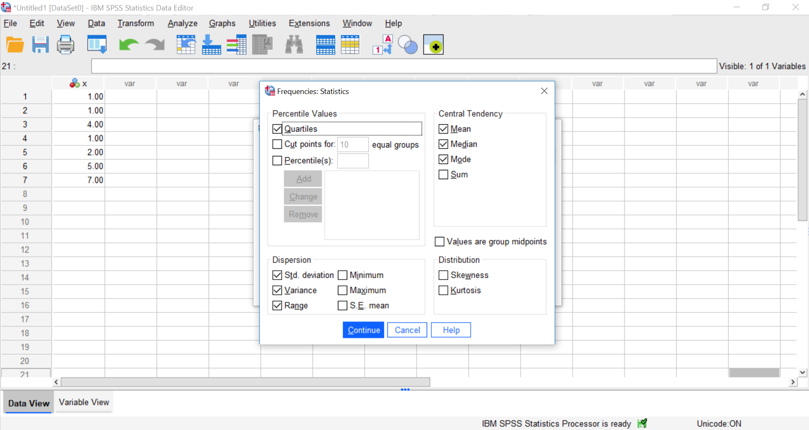
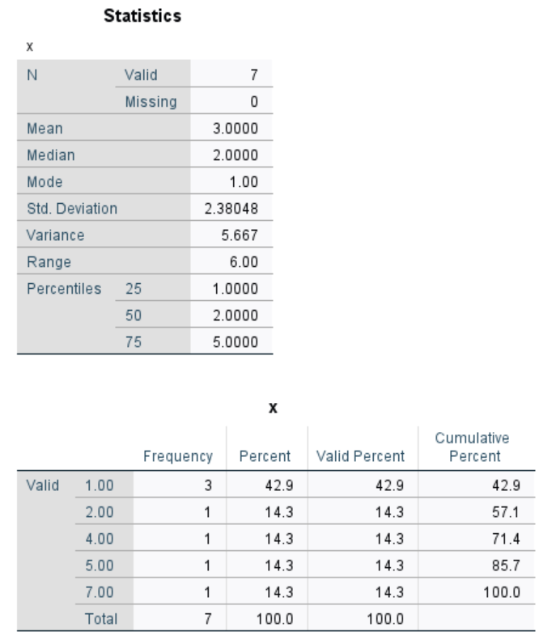
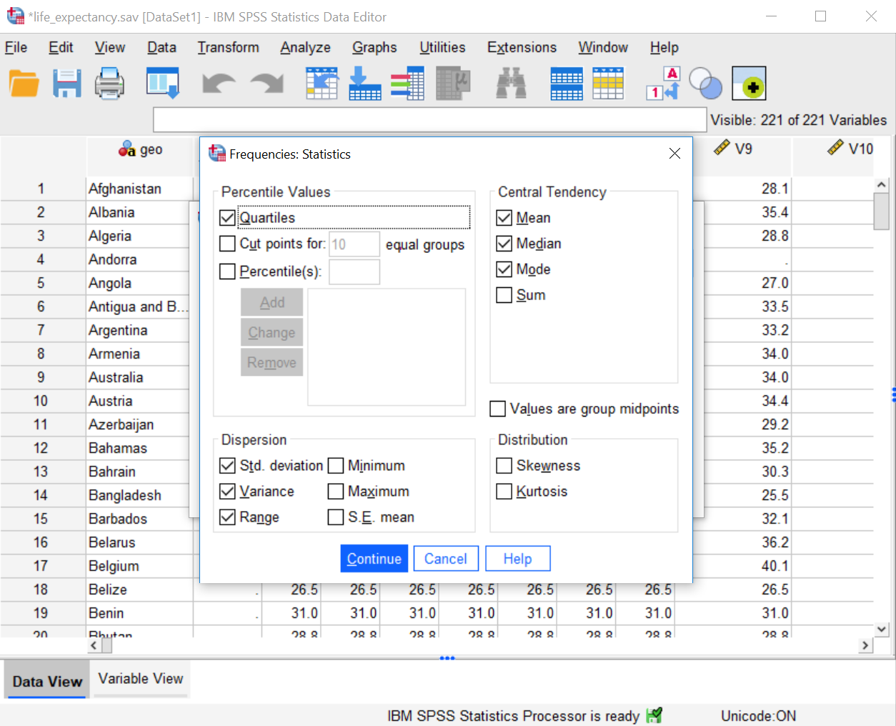
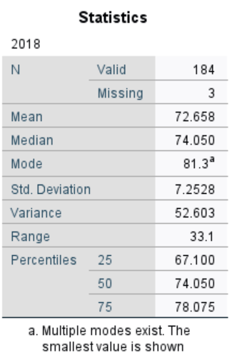
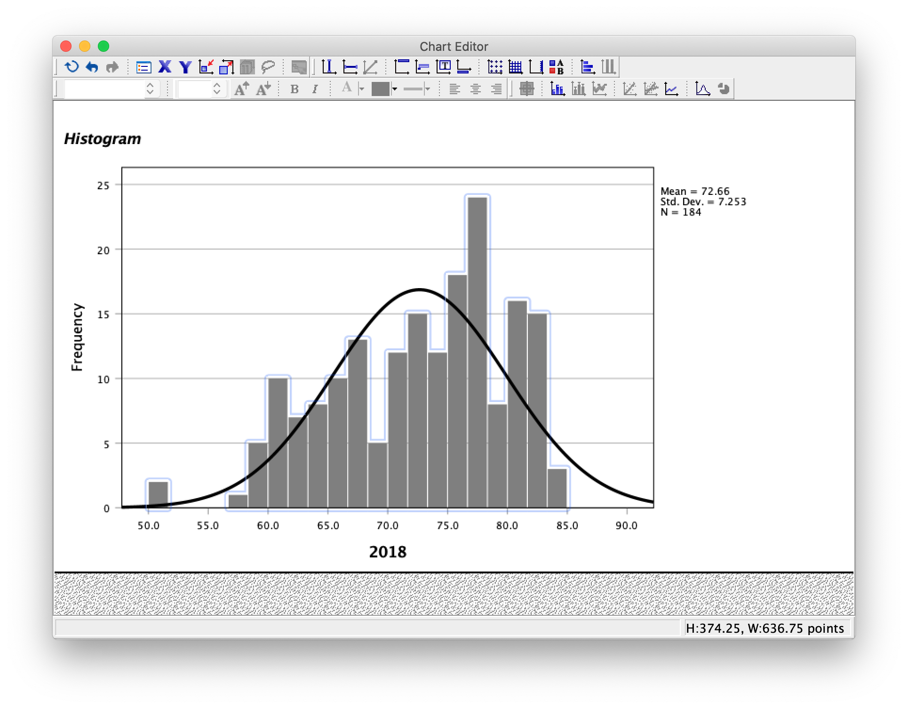
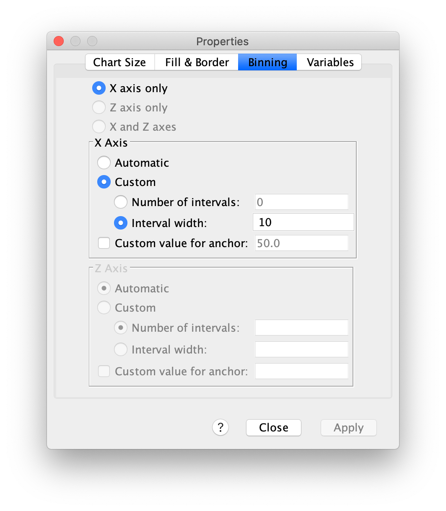
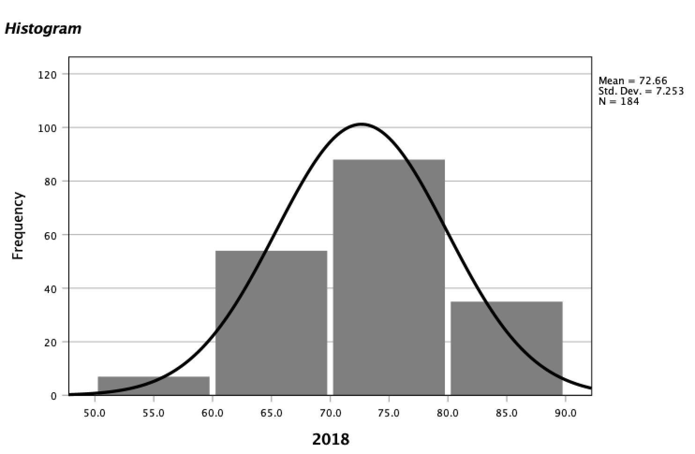
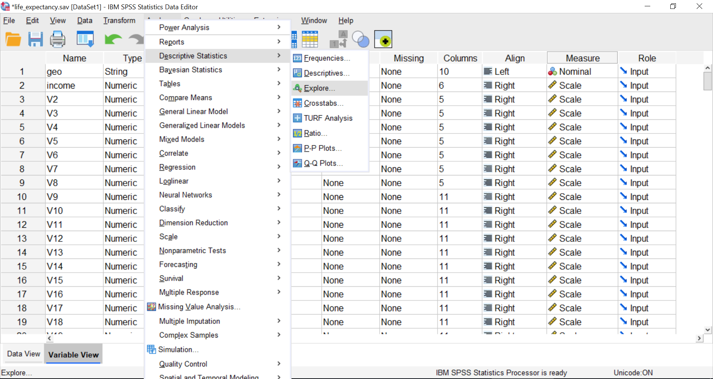
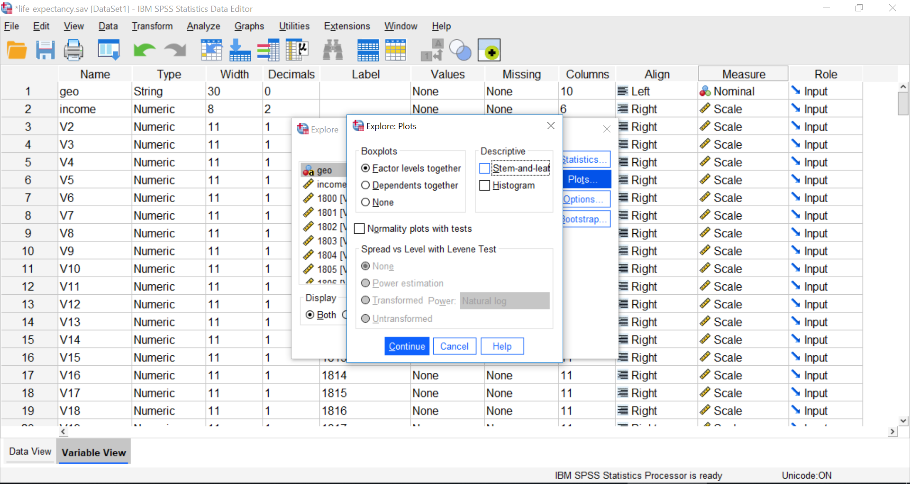
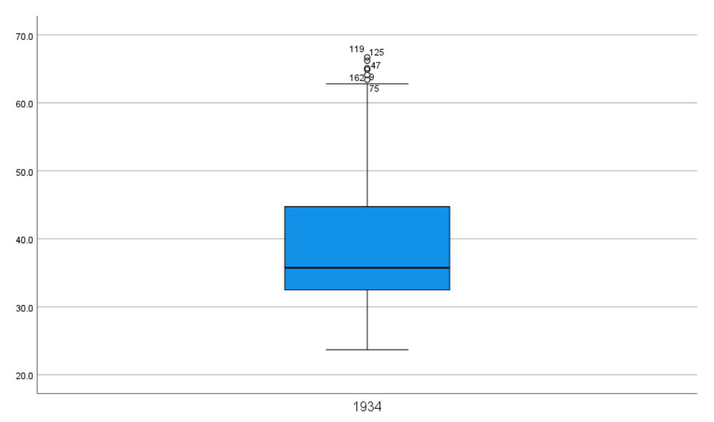

# Lab 2: Descriptive Statistics (and more graphs)

<script>
$("#coverpic").hide();
</script>

<span class="newthought">
Describing comic sensibility is near impossible. It's sort of an abstract silliness, that sometimes the joke isn't the star.
---Dana Carvey
</span>

The purpose of this lab is to show you how to compute basic descriptive statistics, including measures of central tendency (mean, mode, median) and variation (range, variance, standard deviation). 

## General Goals

1. Compute measures of central tendency using software
2. Compute measures of variation using software
3. Ask some questions of a data set using descriptive statistics

### Important info

We will be using data from the gapminder project. You can download a small snippet of the data in .csv format from this link (note this dataset was copied from the gapminder library for R) <a href="https://raw.githubusercontent.com/CrumpLab/statisticsLab/master/data/gapminder.csv" download>gapminder.csv</a>. If you are using R, then you can install the gapminder package. This method is described later in the R section.


## R

### Descriptives basics in R

We learned in lecture and from the textbook that data we want to use ask and answer questions often comes with loads of numbers. Too many numbers to look at all at once. That's one reason we use descriptive statistics. To reduce the big set of numbers to one or two summary numbers that tell use something about all of the numbers. R can produce descriptive statistics for you in many ways. There are base functions for most of the ones that you want. We'll go over some R basics for descriptive statistics, and then use our new found skills to ask some questions about real data.

#### Making numbers in R

In order to do descriptive statistics we need to put some numbers in a variable. You can also do this using the `c()` command, which stands for combine

```{r}
my_numbers <- c(1,2,3,4)
```

There a few other handy ways to make numbers. We can use `seq()` to make a sequence. Here's making the numbers from 1 to 100

```{r}
one_to_one_hundred <- seq(1,100,1)
```

We can repeat things, using rep. Here's making 10 5s, and 25 1s:

```{r}
rep(10,5)
rep(1,25)
all_together_now <- c(rep(10,5),rep(1,25)) 
```

#### Sum

Let's play with the number 1 to 100. First, let's use the `sum()` function to add them up

```{r}
one_to_one_hundred <- seq(1,100,1)
sum(one_to_one_hundred)
```

#### Length

We put 100 numbers into the variable `one_to_one_hundred`. We know how many numbers there are in there. How can we get R to tell us? We use `length()` for that. 

```{r}
length(one_to_one_hundred)
```

### Central Tendency

#### Mean

Remember the mean of some numbers is their sum, divided by the number of numbers. We can compute the mean like this:

```{r}
sum(one_to_one_hundred)/length(one_to_one_hundred)
```

Or, we could just use the `mean()` function like this:

```{r}
mean(one_to_one_hundred)
```

#### Median

The median is the number in the exact middle of the numbers ordered from smallest to largest. If there are an even number of numbers (no number in the middle), then we take the number in between the two (decimal .5). Use the `median` function. There's only 3 numbers here. The middle one is 2, that should be the median

```{r}
median(c(1,2,3))
```

#### Mode

R does not a base function for the Mode. You would have to write one for yourself. Here is an example of writing your own mode function, and then using it. Note I searched how to do this on Google, and am using the mode defined by [this answer on stack overflow](https://stackoverflow.com/questions/2547402/is-there-a-built-in-function-for-finding-the-mode)

Remember, the mode is the most frequently occurring number in the set. Below 1 occurs the most, so the mode will be one.

```{r}

my_mode <- function(x) {
  ux <- unique(x)
  ux[which.max(tabulate(match(x, ux)))]
}

my_mode(c(1,1,1,1,1,1,1,2,3,4))


```

### Variation

We often want to know how variable the numbers are. We are going to look at descriptive statistics to describe this such as the **range**, **variance**, the **standard deviation**, and a few others.

First, let's remind ourselves what variation looks like (it's when the numbers are different). We will sample 100 numbers from a normal distribution (don't worry about this yet), with a mean of 10, and a standard deviation of 5, and then make a histogram so we can see the variation around 10..

```{r}
sample_numbers <- rnorm(100,10,5)
hist(sample_numbers)
```

#### range

The range is the minimum and maximum values in the set, we use the `range` function.

```{r}
range(sample_numbers)
```

#### var = variance

We can find the sample variance using `var`. Note, divides by (n-1)

```{r}
var(sample_numbers)

```

#### sd = standard deviation

We find the sample standard deviation us SD. Note, divides by (n-1)

```{r}
sd(sample_numbers)
```

Remember that the standard deviation is just the square root of the variance, see:

```{r}
sqrt(var(sample_numbers))
```

#### All Descriptives

Let's put all of the descriptives and other functions so far in one place:

```{r}
sample_numbers <- rnorm(100,10,5)

sum(sample_numbers)
length(sample_numbers)
mean(sample_numbers)
median(sample_numbers)
my_mode(sample_numbers)
range(sample_numbers)
var(sample_numbers)
sd(sample_numbers)

```

### Descriptives by conditions

Sometimes you will have a single variable with some numbers, and you can use the above functions to find the descriptives for that variable. Other times (most often in this course), you will have a big data frame of numbers, with different numbers in different conditions. You will want to find descriptive statistics for each the sets of numbers inside each of the conditions. Fortunately, this is where R really shines, it does it all for you in one go. 

Let's illustrate the problem. Here I make a date frame with 10 numbers in each condition. There are 10 conditions, each labelled, A, B, C, D, E, F, G, H, I, J.

```{r}
scores <- rnorm(100,10,5)
conditions <- rep(c("A","B","C","D","E","F","G","H","I","J"), each =10)
my_df <- data.frame(conditions,scores)
```

If you look at the `my_df` data frame, you will see it has 100 rows, there are 10 rows for each condition with a label in the `conditions` column, and 10 scores for each condition in the `scores` column. What if you wanted to know the mean of the scores in each condition? You would want to find 10 means.

The slow way to do it would be like this:

```{r}
mean(my_df[my_df$conditions=="A",]$scores)
mean(my_df[my_df$conditions=="B",]$scores)
mean(my_df[my_df$conditions=="C",]$scores)
# and then keep going
```

Nobody wants to do that! Not, me I stopped doing it that way, you should to.

#### group_by and summarise

We can easily do everything all at once using the `group_by` and `summarise` function from the `dplyr` package. Just watch

```{r}
library(dplyr)

my_df %>%
  group_by(conditions) %>%
  summarise(means = mean(scores))

```

A couple things now. First, the print out of this was ugly. Let's fix that. we put the results of our code into a new variable, then we use `knitr::kable` to print it out nicely when we `knit` the document


```{r}

summary_df <- my_df %>%
               group_by(conditions) %>%
               summarise(means = mean(scores))

knitr::kable(summary_df)

```

#### multiple descriptives

The best thing about the `dplyr` method, is that we can add more than one function, and we'll get more than one summary returned, all in a nice format, let's add the standard deviation:

```{r}

summary_df <- my_df %>%
               group_by(conditions) %>%
               summarise(means = mean(scores),
                         sds = sd(scores))

knitr::kable(summary_df)

```

We'll add the min and the max too:

```{r}

summary_df <- my_df %>%
               group_by(conditions) %>%
               summarise(means = mean(scores),
                         sds = sd(scores),
                         min = min(scores),
                         max = max(scores))

knitr::kable(summary_df)

```

### Describing gapminder

Now that we know how to get descriptive statistics from R, we cam do this will some real data. Let's quickly ask a few question about the gapminder data. 

```{r}
library(gapminder)
gapminder_df <- gapminder
```

Note: The above code will only work if you have installed the gapminder package. Make sure you are connected to the internet, then choose the Packages tab from the bottom right panel, and choose install. Thens search for gapminder, choose it, and install it. 

#### What are some descriptive for Life expectancy by continent?

Copy the code from the last part of descriptives using `dplyr`, then change the names like this:

```{r}

summary_df <- gapminder_df %>%
               group_by(continent) %>%
               summarise(means = mean(lifeExp),
                         sds = sd(lifeExp),
                         min = min(lifeExp),
                         max = max(lifeExp))

knitr::kable(summary_df)

```

### Generalization Exercise

(1 point - Pass/Fail)

Complete the generalization exercise described in your R Markdown document for this lab.

1. What is the mean, standard deviation, minimum and maximum life expectancy for all the gapminder data (across all the years and countries). Hint: do not use `group_by`

2. What is the mean, standard deviation, minimum and maximum life expectancy for all of the continents in 2007, the most recent year in the dataset. Hint: add another pipe using `filter(year==2007) %>%`

### Writing assignment

(2 points - Graded)

Complete the writing assignment described in your R Markdown document for this lab. When you have finished everything. Knit the document and hand in your stuff (you can submit your .RMD file to blackboard if it does not knit.)

Your writing assignment is to answer these questions in full sentences using simple plain langauge:

1. Define the mode.
2. Explain what would need to happen in order for a set of numbers to have two modes
3. Define the median
4. Define the mean
5. Define the range
6. When calculating the standard deviation, explain what the difference scores represent
7. Explain why the difference scores are squared when calculating the standard deviation
8. If one set of numbers had a standard deviation of 5, and another had a standard deviation of 10, which set of numbers would have greater variance, explain why.

**Rubric**

General grading. 

- You will receive 0 points for missing answers (say, if you do not answer question c, then you will receive 0 out .25 points for that question)
- You must write in complete sentences. Point form sentences will be given 0 points.
- Completely incorrect answers will receive 0 points. 
- If your answer is generally correct but very difficult to understand and unclear you may receive half points for the question


## Excel

How to do it in Excel

## SPSS

In this lab, we will use SPSS to calculate a variety of descriptive statistics. SPSS allows us to specify which statistics we would like calculated and produce them all in one output table. Here, we will learn to:

1. Calculate descriptive statistics
2. Graph data using a histogram
3. Edit graphs
4. Create and interpret a boxplot

Let's begin with a short data set {x= 1, 1, 4, 1, 2, 5, 7}

Suppose we want to calculate the measures of central tendency (mean, median, and mode) as well as variability (range, standard deviation, and variance). First, we will have to enter our data into the SPSS spreadsheet. There are 7 measurements, so we will need 7 rows of data (I have also changed the name of this variable in Variable View to `x`:

```{r , echo=FALSE,dev='png'}
knitr::include_graphics('img/2.4.11.png')
```

### Calculating Descriptive Statistics

---

From here, go to the top menu and choose <span style="color:blue">Analyze</span>, then <span style="color:blue">Descriptive Statistics</span> and then <span style="color:blue">Frequencies</span>:


```{r , echo=FALSE,dev='png'}
knitr::include_graphics('img/2.4.12.png')
```

A new window will ask you to specify for which variables you want descriptives statistics calculated. Use the arrow to move the `x` variable from the left-hand to the right-hand field. 

```{r , echo=FALSE,dev='png'}
knitr::include_graphics('img/2.4.13.png')
```

Now, click the <span style="color:blue">Statistics</span> button. This will open a new window containing a list of statistics. You can choose as many as you want to be calculated. We will choose <span style="color:blue">mean, median, mode, range, standard deviation, and variance</span>. SPSS will not create a table with the inter-quartile range (IQR); however, we will select <span style="color:blue">quartiles</blue> which will allow us to calculate IQR ourselves (recall that IQR = Q3 - Q1).

```{r , echo=FALSE,dev='png'}

```


Then click <span style="color:blue">Continue</span>, and then <span style="color:blue">OK</span>. SPSS will produce a set of two output tables: one containing the descriptive statistics we have chosen, and the other a frequency table--a list of all the possible values in our data set and their corresponding frequencies.

```{r , echo=FALSE,dev='png'}

```

### Descriptive Statistics and Histograms

---


Now let's use a real dataset to calculate the same measures of central tendency and variability as in the last example, but with the addition of a histogram to visualize a distribution. We want to relate the visualization back to the descriptive statistics. Use the life_expectancy.sav you downloaded from Section 0.2.3 (the same file we used for our lab session on graphing last week). 

Suppose we wanted to know about life expectancy (around the world) in 2018. This will include calculating descriptive statistics, as well as graphing a histogram to examine the distribution of our data. While the last section of the lab manual showed how to use the <span style="color:blue">Graphs</span> menu to accomplish this task, SPSS often has neat shortcuts to graph data within other menu options. In other words, there is sometimes more than one way to get SPSS to do what we want it to do. For example, in the process of asking SPSS to produce a table of descriptive statistics, we can also add a histogram to the output without having to go to the <span style="color:blue">Graphs</span> menu. 

First, we go to <span style="color:blue">Analyze</span>, then <span style="color:blue">Descriptive Statistics</span>, then <span style="color:blue">Frequencies</span>.

```{r , echo=FALSE,dev='png'}
knitr::include_graphics('img/2.4.16.png')
```

A window will appear asking us to indicate which variable to use. We will scroll all the way down in the list of variables on the left, choose `2018 [V220]`, and then move it into the field on the right using the arrow. 

```{r , echo=FALSE,dev='png'}
knitr::include_graphics('img/2.4.17.png')
```

As in the previous example, we will click the <span style="color:blue">Statistics</span> button next, and choose our measures of central tendency <span style="color:blue">(mean, median, mode)</span> as well as variability <span style="color:blue">(range, quartiles, standard deviation, variance)</span>. 

```{r , echo=FALSE,dev='png'}

```

Once we click continue, we are back to the previous window. Here, we can conveniently ask SPSS to insert a histogram. Let's click on the <span style="color:blue">Charts</span> button:

```{r , echo=FALSE,dev='png'}
knitr::include_graphics('img/2.4.19.png')
```

This will open a new window that asks us to specify the type of chart we would like. Let's select <span style="color:blue">Histogram</span>, and check off <span style="color:blue">Show normal curve on histogram</span>:

```{r , echo=FALSE,dev='png'}
knitr::include_graphics('img/2.4.20.png')
```

Click <span style="color:blue">Continue</span>, and then <span style="color:blue">OK</span>.

SPSS will produce a table of the requested descriptive statistics, a frequency table (we will ignore this for now because it is long and not relevant to this exercise), and finally, a histogram showing the distribution of life expectancy (in years) with a normal distribution superimposed for comparison. 

```{r , echo=FALSE,dev='png'}

```

```{r , echo=FALSE,dev='png'}
knitr::include_graphics('img/2.4.22.png')
```

Something to think about: What do the mean, median, and mode indicate about the shape of the distribution? Is it confirmed when we look at the histogram? How does the shape of this distribution compare to the symmetrical normal distribution which is superimposed over it? 

### Editing graphs

---
It is helpful to know how to manipulate not just the superficial, cosmetic appearance of data visualizations, but also the components of graphs that communicate important information. For example, when you are trying to compare multiple graphs, it is very helpful if all of the features of the graphs are the same.

#### Editing the axes

To modify the scale of an axis in a graph, first <span style="color:blue">double-click</span> on the graph itself in the output window. A Chart Editor should pop up. 

```{r , echo=FALSE,dev='png'}
knitr::include_graphics('img/2.4.23.png')
```

Now, hover your mouse over one of the values on the x-axis, and click down once. You will see all the x-axis values suddenly highlight:

```{r , echo=FALSE,dev='png'}
knitr::include_graphics('img/2.4.24.png')
```

Now that you know how to select the entire axis, <span style="color:blue">double click</span> on it. A properties window will pop up:

```{r , echo=FALSE,dev='png'}
knitr::include_graphics('img/2.4.25.png')
```

Notice that in the default tab, you can change the fill color of components of your graph. For now, we will select the <span style="color:blue">Scale</span> tab instead:

```{r , echo=FALSE,dev='png'}
knitr::include_graphics('img/2.4.26.png')
```

Notice in this tab, we can change the minimum, maximum, and increments of our scale. Let's change the major increment to 5:

```{r , echo=FALSE,dev='png'}
knitr::include_graphics('img/2.4.27.png')
```


Click <span style="color:blue">Apply</span>. 

#### Editing the bin width

Another important aspect of a histogram's appearance is the bin width. You can change the bin width in the Chart Editor. Double click on one of the bars to bring the Properties window up. 

```{r , echo=FALSE,dev='png'}

```

The default tab, <span style="color:blue">Binning</span>, will allow you to change the properties of the bins. You can set the bin width or the number of bins in this tab. For example, to set the bin width, select <span style="color:blue">Custom</span> (in the X Axis box, about halfway down the Properties window). Then select <span style="color:blue">Interval width</span>, input your chosen bin width (in this example, <span style="color:blue">10</span>), and hit <span style="color:blue">Apply</span>.

```{r , echo=FALSE,dev='png'}

```

Then <span style="color:blue">Close</span>. Click the x to close the Chart Editor window. The SPSS output window will now contain your edited graph:

```{r , echo=FALSE,dev='png'}

```

### Boxplots

Let’s look at another useful graph: the boxplot. A boxplot, or box plot, gives us a visual representation of a data set in terms of its quartiles.You might think about the data in terms of four groups, each with 25% of the total set. Inside the box are the two middle groups. The line inside the box is the median, which is the same as the second quartile. The two ends of the box mark the first (or lower) quartile and the third (or upper) quartile. The difference between the first and third quartile is known as the interquartile range (IQR). 

Outside the box are two whiskers. The end of the lower whisker is the minimum score (excluding any outliers - we’ll get to what those are later) and the end of the higher/upper whisker is the maximum score (again, excluding any outliers). Note that boxplots can be presented horizontally or vertically. These graphs allow us to visualize the median, quartiles, interquartile range, range, and any potential outliers.

Using the life_expectancy.sav data file, let's create a boxplot to visually inspect the distribution of the data for the variable: `1934 [v136]`. To create the boxplot, let's go to <span style="color:blue">Analyze</span> in the menu toolbar, then <span style="color:blue">Descriptives</span>, then <span style="color:blue">Explore</span>.

```{r , echo=FALSE,dev='png'}

```

If you click on <span style="color:blue">Plots</span>, you will notice that SPSS has, by default, settings that will provide both a Boxplot and a Stem-and-Leaf graph. You can deselect <span style="color:blue">Stem-and-Leaf</span>. 

```{r , echo=FALSE,dev='png'}

```

Next, click <span style="color:blue">Continue</span> and <span style="color:blue">OK</span>.  
 
SPSS will produce output containing a boxplot. What do you notice about the relative sizes of the second and third quartiles? Are the whiskers the same size? If not, how might you explain the difference?

```{r , echo=FALSE,dev='png'}

```

Notice the circles with numbers next to them in the boxplot. These circle represent outliers, and the numbers correspond to the case/participant/subject number that is being recorded. Sometimes, you will see asterisks with numbers next to them in the boxplot. These asterisks represent extreme outliers. You can imagine that the identification of these outliers gives you reason to go investigate your data more closely.

### Homework

___

1. Create a single SPSS output file (.spv) and upload it to Moodle. The file should contain the following:

1a. Using the life expectancy data set, produce a table of output showing the descriptive statistics (measures of central tendency and variability - don't forget to include quartiles so you can calculate IQR) for both years 1800 and 1934 (during the Great Depression). Note: We are looking for a single table that contains the descriptives for both years. 

1b. Plot histograms of life expectancy for both 1800 and 1934. How are these distributions different? Note: We are looking for two histograms, one for each year. (Hint: Make sure the axes and bins of both graphs are the same, so the histograms are comparable).

2. Download the CCHS Annual 2017 2018 (SPSS sav file) from the "Team Project" section at the bottom of our lab Moodle page. 

3. Use the information on your .spv file and the CCHS .sav file to answer the questions in the homework “quiz” on Moodle. Note that you can attempt the quiz as many times as you like before the due date and only your highest mark will be counted.

## JAMOVI

<div class="marginnote">
This section is  copied almost verbatim, with some editorial changes, from [Answering questions with data: The lab manual for R, Excel, SPSS and JAMOVI, Lab 2, Section 2.4, SPSS](https://www.erinmazerolle.com/statisticsLab/lab-2-descriptive-statistics-and-more-graphs.html#spss-2), according to its [CC license](https://creativecommons.org/licenses/by-sa/4.0/deed.ast). Thank you to Crump, Krishnan, Volz, &   Chavarga (2018). 
</div>

In this lab, we will use jamovi to calculate a variety of descriptive statistics. jamovi allows us to specify which statistics we would like calculated and produces them all in one output table. Here, we will learn to:

1. Calculate descriptive statistics
2. Edit graphs
3. Create and interpret a boxplot

Let's begin with a short data set {x = 1, 1, 4, 1, 2, 5, 7}

Suppose we want to calculate the measures of central tendency (mean, median, and mode) as well as variability (range, standard deviation, and variance). First, we will have to enter our data into the jamovi spreadsheet. There are 7 measurements (1 measurement from each of 7 individual cases), so we will need 7 **rows** of data (In <span style="color:blue">Setup</span>, I have also changed the name of this variable to `X` and changed the scale to continuous.):

```{r , echo=FALSE,dev='png'}
knitr::include_graphics('img/2.5.1.png')
```

### Calculating Descriptive Statistics

---

From here, go to the top menu, click on <span style="color:blue">Analyses</span>, <span style="color:blue">Exploration</span>, and <span style="color:blue">Descriptives</span>. These commands should feel familiar if you completed the lab on creating graphs (bar graphs and histograms):


```{r , echo=FALSE,dev='png'}
knitr::include_graphics('img/2.5.2.png')
```

As soon as you select the variable of interest, `X`, and use the arrow to move it to the “Variables” window, you will notice that jamovi produces a Descriptives table in the Results pane. By default, jamovi will show you the sample size, number of missing case measurements, mean, median, standard deviation, minimum, and maximum. 

```{r , echo=FALSE,dev='png'}
knitr::include_graphics('img/2.5.3.png')
```

Recall from the earlier instructions that we would also like to look at the mode, range, and variance – which are not included by default. To include these descriptive statistics, click the <span style="color:blue">Statistics</span> button. Clicking on this button will open a new window containing a list of statistics. You can choose as many as you want to be calculated. We will select those which were missing from the default settings: <span style="color:blue"> mode, range, and variance</span>. Another descriptive statistic of interest may be the interquartile range. Let’s select it, too. Click on <span style="color:blue"> IQR</span>.

```{r , echo=FALSE,dev='png'}
knitr::include_graphics('img/2.5.4.png')
```


In the Results pane, you should see the additional descriptive statistics appear as you select them. 

```{r , echo=FALSE,dev='png'}
knitr::include_graphics('img/2.5.5.png')
```

### Descriptive Statistics and Histograms

---

Now, let's use a real dataset to calculate the same measures of central tendency and variability as in the last example, but with the addition of a histogram to visualize a distribution. We want to relate the visualization back to the descriptive statistics. Use the [EngageNS data set](To be determined: how to link). 

Suppose we wanted to know about Nova Scotian’s sleep habits. We wonder how much sleep they get each night. This will include calculating descriptive statistics, as well as graphing a histogram to examine the distribution of our data. We will combine the statistical software skills learned earlier in this section with those we learned the last section of the lab manual. 
Let’s consider the variable of interest. According to the data dictionary, `SLEEP` is the number of hours participants’ reported sleep per day, and it includes both night time and naps. As there are many variables in the data set, I suggest you use to the sliding bar at the bottom of the spreadsheet panel to move about 6/10 of the way to the far right. While `SLEEP` is highlighted, click on the <span style="color:blue">Settings</span> button. Consider including a variable description and ensure that the information jamvoi included for the variable attributes is correct based on your interpretation of this variable. On which scale of measurement is `SLEEP` measured? What type of data is recorded for `SLEEP`?
After you have considered the variable attributes, click on <span style="color:blue">Descriptives</span> again, or click on the upward facing arrow to close the Settings panel. As you will recall, to get jamovi to produce a table of descriptive statistics, we begin in the top menu by selecting <span style="color:blue">Analyses</span>, <span style="color:blue">Exploration</span>, and <span style="color:blue">Descriptives</span>. Select `SLEEP` and use the arrow to move it to the “Variable” window at the right. Remember: You may be able to find the variable of interest more quickly if you use the “Search” function by clicking on the magnifying glass and searching with the variable name.

```{r , echo=FALSE,dev='png'}
knitr::include_graphics('img/2.4.16.png')
```

The default settings may not give us all descriptive statistics in which we are interested. Let’s consider the scale of measurement. Which measure(s) of central tendency is(are) appropriate to consider based on this scale of measurement? 

```{r , echo=FALSE,dev='png'}
knitr::include_graphics('img/2.4.17.png')
```

As in the previous example, we will click the <span style="color:blue">Statistics</span> button next, and choose our measures of central tendency <span style="color:blue">(mean, median, mode)</span> as well as variability <span style="color:blue">( standard deviation, variance, range)</span>, and <span style="color:blue">(IQR)</span>. 

```{r , echo=FALSE,dev='png'}

```

As we click to indicate these commands, we will see the resulting Descriptives table in the Results panel. Now, we can conveniently ask SPSS to insert a histogram. Let's click on the <span style="color:blue">Plots</span> button, and select <span style="color:blue">Histogram</span>:

```{r , echo=FALSE,dev='png'}
knitr::include_graphics('img/2.4.19.png')
```

Below the table of requested descriptive statistics, jamovi will produce a histogram showing the distribution of sleep (in hours). 

```{r , echo=FALSE,dev='png'}

```

Some ideas to think about: What do the mean, median, and mode indicate about the shape of the distribution? Is it confirmed when we look at the histogram? How does the shape of this distribution compare to the symmetrical normal distribution which is superimposed over it? 


### Editing graphs

---
It is helpful to know how to manipulate not just the superficial, cosmetic appearance of data visualizations, but also the components of graphs that communicate important information. For example, when you are trying to compare multiple graphs, it is very helpful if all of the features of the graphs, such as the axis scales and the bin widths, are the same. Unfortunately, this is not easy to accomplish in jamovi. (I might suggest using Excel to quickly chart your graphs, edit them, and compare/contrast them.)

### Boxplots

Let’s look at another useful graph: the boxplot. A boxplot, or box plot, gives us a visual representation of a data set in terms of its quartiles. You might think about the data in terms of four groups, each with 25% of the total set. Inside the box are the two middle groups. The line inside the box is the median, which is the same as the second quartile (Q2). The two ends of the box mark the first (or lower) quartile (also called Q1) and the third (or upper) quartile (also called Q3). These lines marking the sides of the box might be considered as the medians of the lower half of the data set and the upper half of the data set. The difference between the first and third quartile is known as the interquartile range (IQR). In effect, IQR = Q3 – Q1.

Outside the box are two whiskers. The end of the lower whisker is the minimum score (excluding any outliers - we’ll get to what those are later) and the end of the higher/upper whisker is the maximum score (again, excluding any outliers). Note that boxplots can be presented horizontally or vertically. These graphs allow us to visualize the median, quartiles, interquartile range, range, and any potential outliers.

Using the `SLEEP` data, let's create a boxplot to visually inspect the distribution of the data for the variable. To create the boxplot, let's go to <span style="color:blue">Analyze</span> in the top menu, then <span style="color:blue">Exploration</span>, and then <span style="color:blue">Descriptives</span>. From there, we can click on <span style="color:blue">Plots</span and select <span style="color:blue">Box plot</span

```{r , echo=FALSE,dev='png'}

```

In the Results panel, jamovi will produce output containing a boxplot. What do you notice about the relative sizes of the second and third quartiles? Are the whiskers the same size? If not, how might you explain the difference?

```{r , echo=FALSE,dev='png'}

```

Notice the circles beyond the whiskers in the boxplot. These circle represent outliers. You can imagine that the identification of these outliers gives you reason to go investigate your data more closely.


### Homework

Some concepts can be measured at multiple scales. If the scale is considered nominal, we usually look at the mode for information about central tendency. If the scale is considered ordinal, we usually look at the median for information about central tendency. The measurement of central tendency used for data measured on interval or ratio scales may depend on whether the distribution is skewed. If the distribution is not skewed, we would usually consider the mean. If the distribution is skewed, we might look to the median to avoid the influence the outliers have on the mean. 

Consider, for example, exercise behaviour of Nova Scotians. The descriptive statistics you choose to calculate usually depend on the scale of measurement. If we look at `HB_EXERCISE`, we see that the variable asks participants to indicate their agreement with the following statement: “In the past week, I regularly engaged in good quality exercise.” Participants’ agreement is indicated using a Likert scale, ranging from 1 to 7, wherein 1 = very strongly disagree and 7 = very strongly agree. It is debatable whether we might consider Likert scales as ordinal or interval. You will need to take a stance on this matter, but your stance will impact the descriptive statistics that are more useful. If we consider the scale ordinal, we would probably report the median. If we consider the scale interval, we would most likely report the mean.

If, however, we look at `PA_VIGOROUS`, we see that the variable ask participants to indicate their physical activity participation in the previous month. Participants indicate this participation using an open numeric entry. (WHAT DOES THIS NUMBER MEAN? IS IT MEANT TO REPORT THE NUMBER OF HOURS SPENT INVOLVED IN VIGOROUS EXERCISE?) This variable is measured on a ratio scale. Unless the data are skewed, we would likely report the mean. You can see that the answer to a research question about Nova Scotian’s exercise, as well as the statistics you consider to formulate that answer, will depend upon the variable at which you look.  

1. Be sure to consider the scales of measurement as you answer the following questions. Calculate the appropriate descriptive statistics and write a paragraph to summarize:

a. Internet access of Nova Scotians using any 2 of the following 3 variables: `INTERNET`, `NET_QUAL`,  and `COMPUTE_HR`.

b. Education of Nova Scotians using any 2 of the following 4 variables `EDU_PREP`, `EDUCAT`, ` EDOPP_A1`, and `CRS_INT`. 

c. Employment of Nova Scotians using the following 2 variables: ` WORKSCHED` and ` WORKHR`. 

Rubric – 0.125 pt for correctly identifying scale of measurement for each variable
0.125 for correctly measuring central tendency based on scale
-0.25 for not writing in a sentence
2. a. What have you learned about Nova Scotians by completing this activity? 

b. Share one question about Nova Scotians on a related topic that you would like to explore further.


### Practice Questions

1. Were participants likely to have attended a local/municipal council meeting? How do you know?

2. What is the most populated postal code prefix among participants? What measure of central tendency did you use to determine this, and why? Integrating skills (advanced question): Can you figure out what geographic area this corresponds to? 

3. Can you calculate mean and median postal code prefix? Why or why not?

4. Calculate the mean, median, and mode of ETHNIC1. Which is the most useful and why?

5. Who do Nova Scotians trust more: people in their neighbourhood, people they go to work/school with, or strangers? What measure of central tendency did you use to determine this, and why?

6. How would you have answered homework Question #2 differently had you been asked to look at `INCOME` and `NUMJOB`?


