# Lab 2: Descriptive Statistics (and more graphs)

<script>
$("#coverpic").hide();
</script>


<span class="newthought">
Describing comic sensibility is near impossible. It's sort of an abstract silliness, that sometimes the joke isn't the star.
-Dana Carvey
</span>


The purpose of this lab is to show you how to compute basic descriptive statistics, including measures of central tendency (mean, mode, median) and variation (range, variance, standard deviation). 

## General Goals

1. Compute measures of central tendency using software
2. Compute measures of variation using software
3. Ask some questions of a data set using descriptive statistics


## JAMOVI - Week 5 - February 3rd, 4th, & 5th

<div class="marginnote">
This section is  copied almost verbatim, with some editorial changes, from [Answering questions with data: The lab manual for R, Excel, SPSS and JAMOVI, Lab 2, Section 2.4, SPSS](https://www.erinmazerolle.com/statisticsLab/lab-2-descriptive-statistics-and-more-graphs.html#spss-2), according to its [CC license](https://creativecommons.org/licenses/by-sa/4.0/deed.ast). Thank you to Crump, Krishnan, Volz, &   Chavarga (2018). 
</div>


In this lab, we will use JAMOVI to calculate a variety of descriptive statistics. JAMOVI allows us to specify which statistics we would like calculated and produces them all in one output table. Here, we will practice and learn how to:

1. Navigate between data set and data dictionary to determine scales of measurement for variables of interest
2. Select and calculate descriptive statistics
3. Create and interpret a boxplot (if lab time permits)


### Getting ready for this lesson


<b>Please complete all of these tasks before your lab starts.</b> Do these tasks as soon as possible and post to the Q&A forum or come to help hours if you run into any trouble. 

You will need access to the EngageNS dataset for this lesson. Be sure you completed the Terms of Use quiz in Moodle and downloaded the data set before lab. Check for the "StartingFile" version you saved in your OneDrive folder.

You should also have downloaded the data dictionary. It is the pdf file in the OneDrive directory from which you  downloaded the .omv file. The data dictionary contains important information about what the data mean.

Open JAMOVI. It might be slow to open.

Click on the three lines near the top left of the JAMOVI window (circled in red below).

```{r , echo=FALSE,dev='png'}
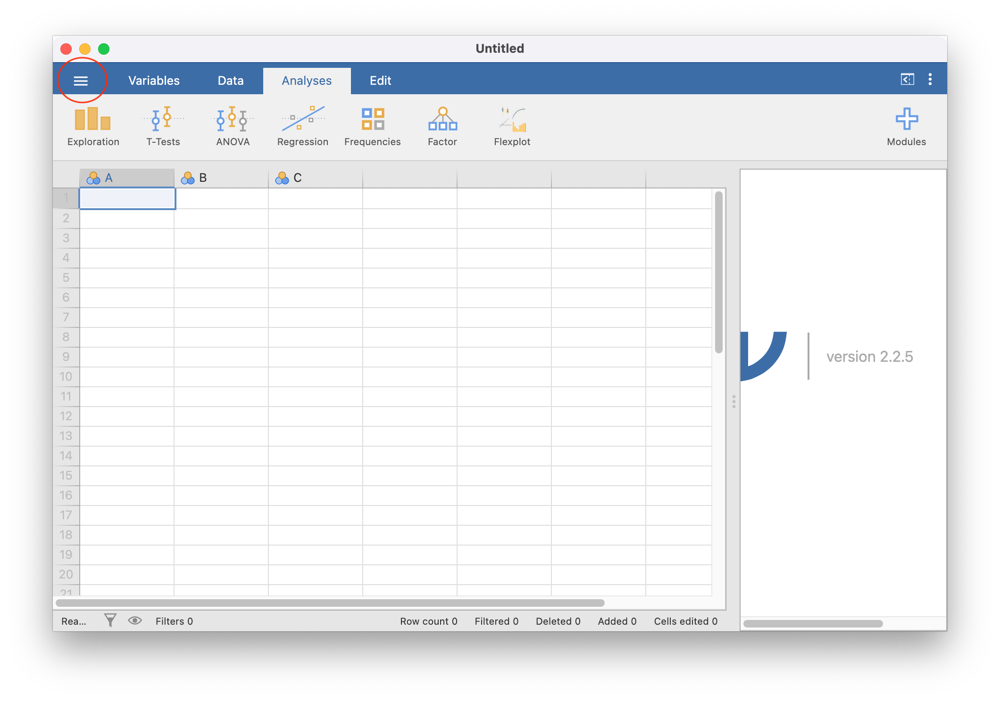
```

Click <span style="color:blue">Open</span> and then <span style="color:blue">Browse</span>.

Find the EngageNS .omv data file you downloaded. Select it and click open. It may take a few minutes to open.

When it has finished opening, your JAMOVI window should look something like this:

```{r , echo=FALSE,dev='png'}
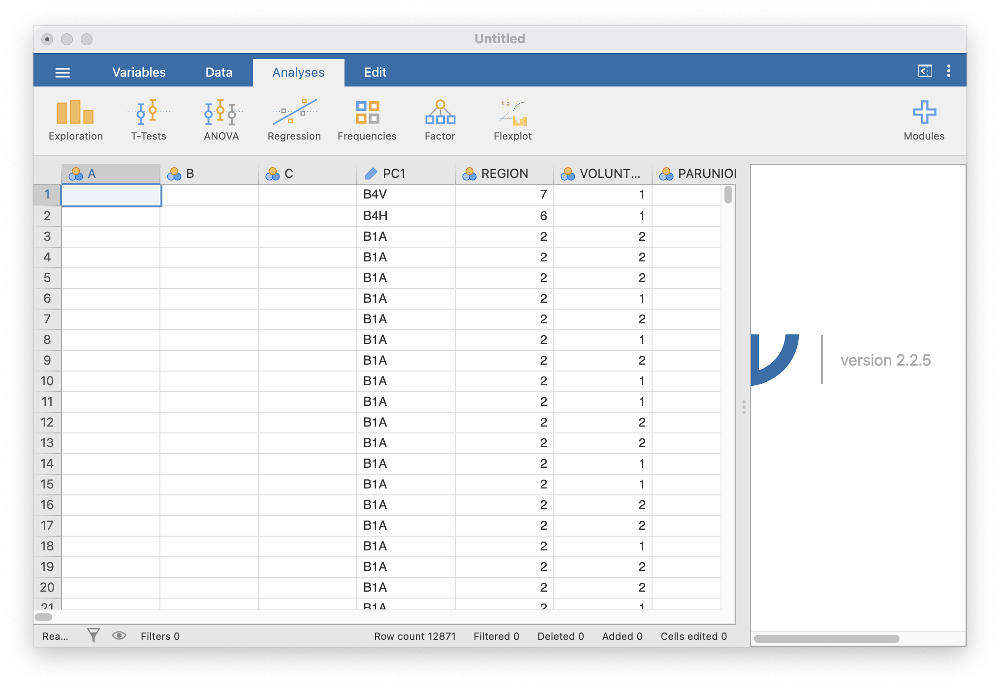
```

Now, you are going to be sure you save(d) the JAMOVI (.omv) file. Click the three horizontal lines, then click <span style="color:blue">Save As</span>. Input a sensible file name (perhaps with the term "StartingFile" or "Original_Data") and make sure your file type is set to `jamovi file (.omv)` (red circle below). 

```{r , echo=FALSE,dev='png'}
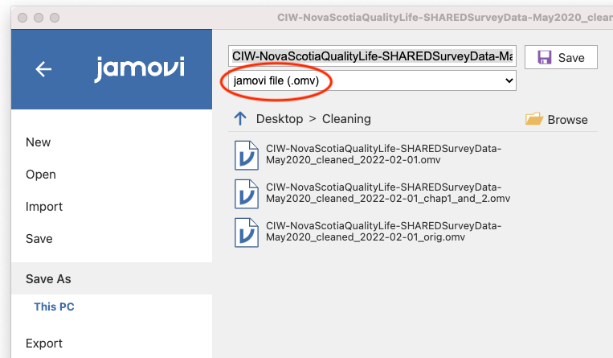
```

Browse to your PSYC 292 lab folder, and click save.

Read over the remainder of Chapter 2.2 of this lab manual. 

Now, you are all ready for lab! You can close everything for now, but <b>before your lab session begins, open your .omv file in JAMOVI and your data dictionary pdf in a pdf viewer such as Preview or Adobe.</b>


### The basics


In JAMOVI, click the three horizontal lines and then click <span style="color:blue">New</span> to open a new file.

Let's begin with a short data set {x = 1, 1, 4, 1, 2, 5, 7}

Suppose we want to calculate the measures of central tendency (mean, median, and mode) as well as variability (range, standard deviation, and variance). First, we will have to enter our data into our new JAMOVI spreadsheet. There are 7 measurements (1 measurement from each of 7 individual cases), so we will need 7 **rows** of data (In <span style="color:blue">Setup</span>, I have also changed the name of this variable to `X` and changed the scale to continuous.):

```{r , echo=FALSE,dev='png'}
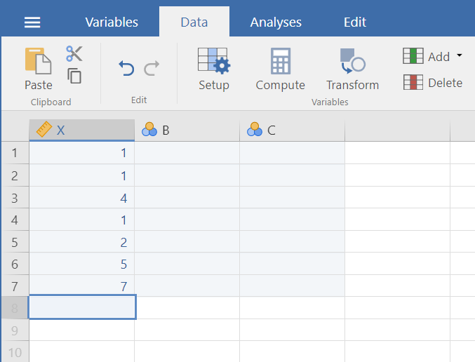
```


### Calculating Descriptive Statistics


From here, go to the top menu, click on <span style="color:blue">Analyses</span>, <span style="color:blue">Exploration</span>, and <span style="color:blue">Descriptives</span>. 


```{r , echo=FALSE,dev='png'}
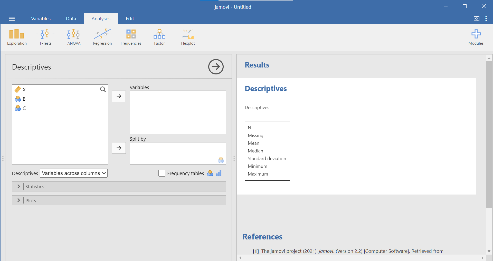
```

As soon as you select the variable of interest, `X`, and use the arrow to move it to the “Variables” window, you will notice that JAMOVI produces a Descriptives table in the Results pane. By default, JAMOVI will show you the sample size, number of cases with missing measurements, mean, median, standard deviation, minimum, and maximum. 

```{r , echo=FALSE,dev='png'}
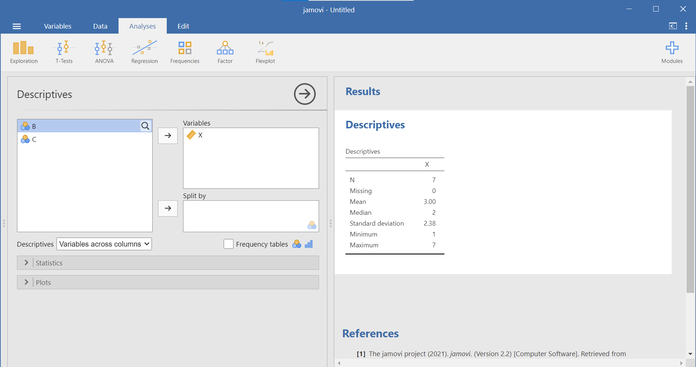
```

Recall from the earlier instructions that we would also like to look at the mode, range, and variance – which are not included by default. To include these descriptive statistics, click the <span style="color:blue">Statistics</span> button. Clicking on this button will open a new window containing a list of statistics. You can choose as many as you want to be calculated. We will select those which were missing from the default settings: <span style="color:blue"> mode, range, and variance</span>. Another descriptive statistic of interest may be the interquartile range. Let’s select it, too. Click on <span style="color:blue"> IQR</span>.

```{r , echo=FALSE,dev='png'}
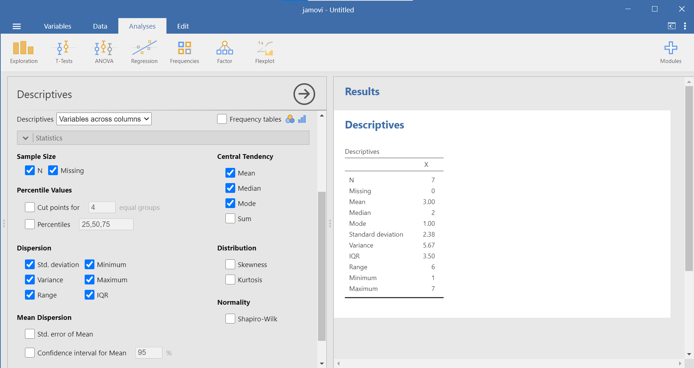
```

In the Results pane, you should see the additional descriptive statistics appear as you select them. 

```{r , echo=FALSE,dev='png'}
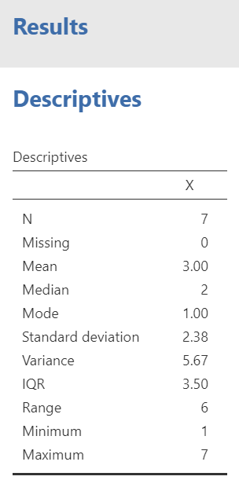
```


### Descriptive Statistics and Graphs


#### Example 1: Sleep

Now, let's use a real dataset to calculate the same measures of central tendency and variability as in the last example, but with the addition of a histogram to visualize a distribution. We want to relate the visualization back to the descriptive statistics. Use the EngageNS data. Remember, you should have already opened your .omv (JAMOVI file) of the EngageNS data on your computer. 

Because .omv files contain both the data and the output, we want to save a new file before each analysis. So, before you start following along, save a new copy of your .omv file by clicking on the three lines and selecting <span style="color:blue">Save As</span>. Give the file a new name (for example, Lab5_DescStats_LabDemo). A file name related to the date and or the lab lesson might be helpful. Now, as you generate output by following the instructions below, you can continue to save this file. **When you are ready to start your homework, you can open the *original* or *starting* file, save a copy with a new name (for example, Lab5_DescStats_Homework), and create your homework output in that new file.**

Suppose we wanted to know about Nova Scotians' sleep duration. We can use both descriptive statistics and graphs such as histograms to explore a variable such as sleep duration. 

You can find information about the `SLEEP` variable in the data dictionary.

```{r , echo=FALSE,dev='png'}
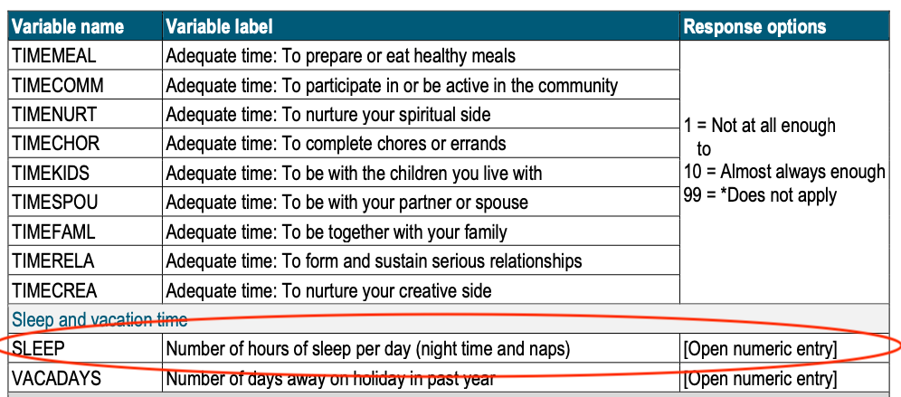
```

According to the data dictionary, `SLEEP` is the number of hours participants’ reported sleep per day, and it includes both night time and naps. To find the `SLEEP` variable, first click on the Variables tab near the top left (red circle). Now you can search for your variable of interest by typing in the search bar. 

```{r , echo=FALSE,dev='png'}
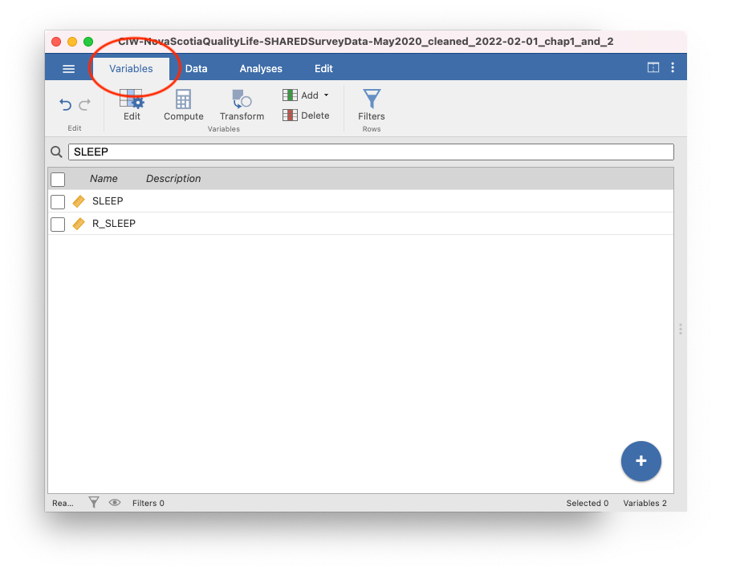
```

You will notice that there are two variables with similar names, `SLEEP` and `R_SLEEP`. As we mentioned in the last lab, in the EngageNS data, variables that start with `R_` are revised variables. This means they have been cleaned in some way. Not all variables needed cleaning, so they do not have a `R_` version. Always use the `R_` variable if it is there. We will see why in a minute!

For our purposes right now, select `SLEEP` from the list by checking the box. When you click back to the Data tab (next to the Variables tab), you will be on the `SLEEP` variable.

While `SLEEP` is highlighted, click on the <span style="color:blue">Setup</span> or <span style="color:blue">Edit</span> button depending on which menu you are in: <span style="color:blue">Data</span> or <span style="color:blue">Variables</span>, respectively. Let's include a variable description based on the information in the EngageNS data dictionary. Also, ensure that the information JAMOVI included for the variable attributes is correct based on your interpretation of this variable. `SLEEP` is measured in number of hours. It has equal intervals and a true zero (you can't have negative sleep). So, our `SLEEP` variable is a ratio scale. The measure type is set to continuous, so we are good to go. 

After you have considered the variable attributes, click on <span style="color:blue">Edit</span> (or <span style="color:blue">Setup</span>) again, or click on the up arrow to close the Setup panel. As you will recall, to get JAMOVI to produce a table of descriptive statistics, we begin in the top menu by selecting <span style="color:blue">Analyses</span>, <span style="color:blue">Exploration</span>, and <span style="color:blue">Descriptives</span>. Click on the magnifying glass icon at the top of the list of variables to search. Select `SLEEP` and use the right arrow to move it to the “Variable” window at the right. 

```{r , echo=FALSE,dev='png'}
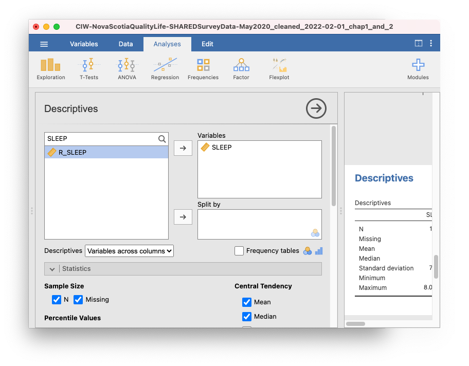
```

The default settings may not give us all descriptive statistics in which we are interested. Let’s consider the scale of measurement. Which descriptive statistics are appropriate to consider based on this scale of measurement? The most typical choice for a ratio scale of measurement is to report the mean for central tendency, and the standard deviation for variation. Other choices might also be correct, depending on the data and your research question.

As in the previous example, we will click the <span style="color:blue">Statistics</span> button next, and choose our measures of central tendency <span style="color:blue">(mean, median, mode)</span> as well as variability (<span style="color:blue">standard deviation, variance, range</span>, and <span style="color:blue">IQR</span>). As we click to indicate these commands, we will see the resulting Descriptives table in the Results panel.

```{r , echo=FALSE,dev='png'}
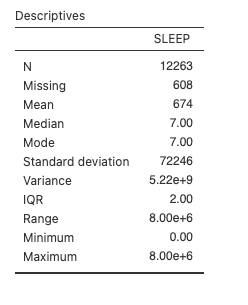
```

So, we have a mean of 674, a median of 7, and a mode of 7. Pause for a moment and think about that. What does the `SLEEP` variable represent again? Hours of sleep per day. This table is saying that, on average, Nova Scotians sleep for 674 hours per day. What's going on?

In brief, the `SLEEP` variable contains some garbage data. You can see that the maximum is 8.00e+6 or 8 million hours of sleep. Another way to evaluate the data is to look at the histogram. Scroll down below the descriptive statistics you selected to the Plots section, and select Histogram.

```{r , echo=FALSE,dev='png'}
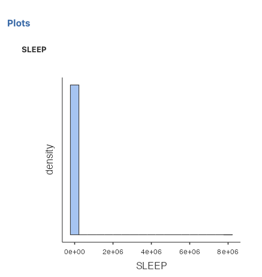
```

The *x*-axis on this histogram is too big because of the garbage data. It doesn't make sense to look at a histogram of sleep from 0 to 8 million hours. Assuming you could fit about 5 bars between 0 and 2 million (2e+06), all that tall bar tells us is that most people sleep between 0 and 400 000 hours. Not very helpful. 

Luckily, we can check the revised sleep variable, `R_SLEEP`. The data in this variable have been cleaned to remove any values above 23. Even a sleep duration of 23 would be a bit silly (Would you even have time to fill out the survey if you slept for 23 hours a day?), but at least it is a lower number than the number of hours in the day. Back at the top of this window, move the `R_SLEEP` variable into the Variables box. This will add a new column to our Descriptives table:

```{r , echo=FALSE,dev='png'}
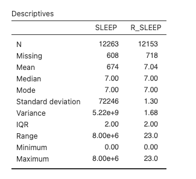
```

The mean of `R_SLEEP` is 7.04 hours. Much more sensible than 674 hours!

We can also ask for a histogram of `R_SLEEP`:

```{r , echo=FALSE,dev='png'}
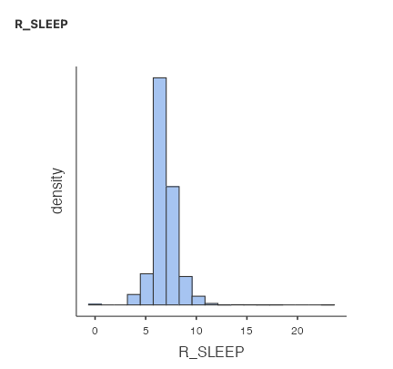
```

Now that the *x*-axis stops at 23 instead of 8e+6, we can see the shape of the distribution much better. The tallest bar is somewhere around 7. Almost all of the responses are between 4 and 10. 

You often have to write sentences to report your descriptive statistics. For sleep, you might write: Nova Scotians who participated in the study reported a mean of 7.04 hours of sleep per day (*M* = 7.04, *SD* = 1.30). 
Or like this...
The mean (standard deviation) hours of sleep per day reported by Nova Scotians was 7.04 (1.30).


#### Example 2: Volunteering


Let's look at another variable. If you simply select another variable as you did just before with `R_SLEEP`, the new variable will appear in the same table. To begin a new analysis, close the analysis you just completed by clicking on the right-facing arrow (circled in red in the image below) in the Descriptives menu: 

```{r , echo=FALSE,dev='png'}
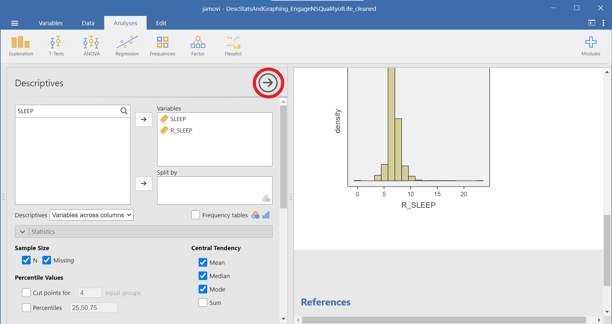
```

The `VOLUNTEER` variable represents whether participants volunteered in the past year. A 1 means they did, and a 2 means they didn't. (**Notice the variable description and/or coding may need to be updated based on what you find in the data dictionary.**) Take a moment and make a prediction: What percentage of participants do you expect have volunteered in the past year?

Back in the <span style="color:blue">Variables</span> tab, search for VOLUNTEER. Select it by clicking so the check box is visible, and then click the <span style="color:blue">Data</span> tab. Click <span style="color:blue">Setup</span>. The measurement type is nominal, which is correct: the `VOLUNTEER` variable does not have order, equal spacing between intervals, or a true 0. We don't need to fix anything here. 

Click the <span style="color:blue">Analyses</span> tab, click <span style="color:blue">Exploration</span> and then click <span style="color:blue">Descriptives</span>. Search for VOLUNTEER and move the variable into the Variables box (Note: There's no `R_VOLUNTEER` variable, so we don't have to worry about that in this case). As before, select all the measures of Central Tendency and Dispersion. Your table should look like this:

```{r , echo=FALSE,dev='png'}
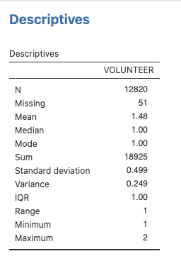
```

We can use this table to check our prediction from above. The mode is 1, so most participants reported volunteering in the past year.

We could ask more questions about this variable. How many participants volunteered? You can get that information a few different ways. First, select Frequency tables (red circle):

```{r , echo=FALSE,dev='png'}
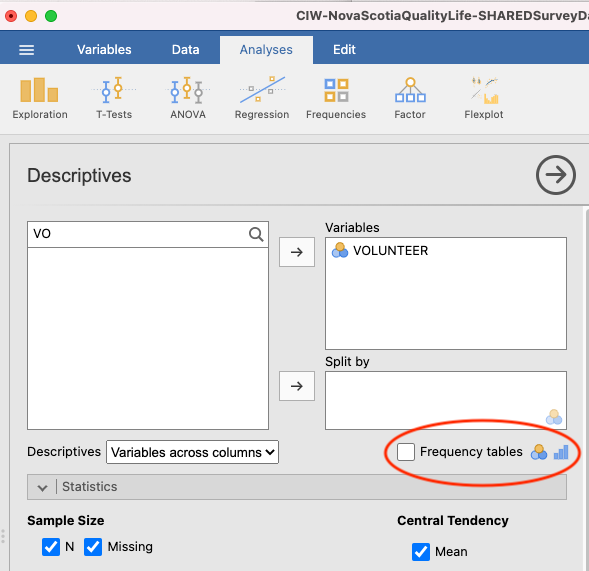
```

The output panel will now include a new table, Frequencies of VOLUNTEER:

```{r , echo=FALSE,dev='png'}
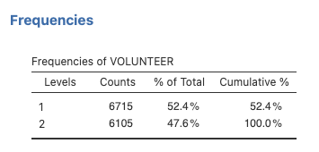
```

This table shows that 6715 participants answered with a 1, meaning they did volunteer in the past year, and 6105 answered with a 2, meaning they did not. 

You can also get this information from a bar graph. Under <span style="color:blue">Plots</span>, select Bar plot:

```{r , echo=FALSE,dev='png'}
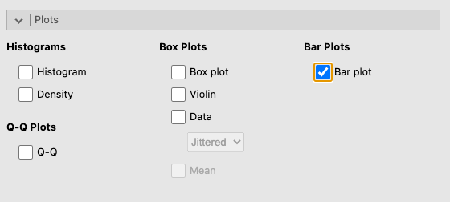
```

Your output panel should now include the following graph: 

```{r , echo=FALSE,dev='png'}
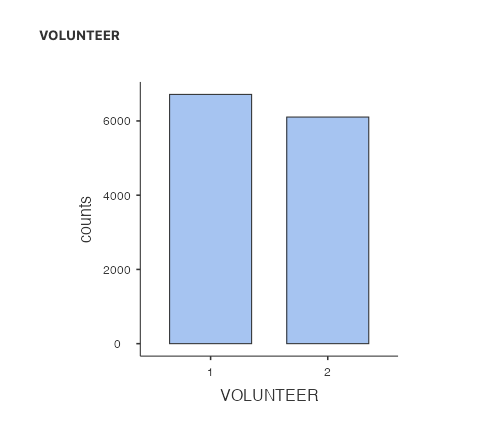
```

Can you see how the frequencies table and bar plot are related?


### Selecting the appropriate descriptive statistics


We usually report at least two descriptive statistics for each variable: a measure of central tendency and a measure of variation.


#### Selecting the central tendency measure


Choosing the right descriptive statistics for a given variable depends on understanding the distribution or shape of the data. It also depends on the scale of measurement of your variable. Sometimes, there can be more than one right answer.

  Scale of measurement    Central tendency
  ----------------------- --------------------------
  Nominal                 Mode
  Ordinal                 Median
  Quasi-interval          *Your choice of how to treat this scale affects which descriptive statistics will be used*
  Interval                Mean *OR Median if the distribution is skewed or there are outliers*
  Ratio                   Mean *OR Median if the distribution is skewed or there are outliers*

If the measurement scale is nominal, we usually look at the mode for information about central tendency. If the measurement scale is ordinal, we usually look at the median for information about central tendency. The central tendency measure used for interval or ratio scales of measurement can vary. If the distribution is not skewed, we would usually consider the mean. If the distribution is skewed, we might look to the median to avoid the influence the long, asymmetric tail of the distribution has on the mean. The median is also a good choice for interval or ratio data if there are outliers present. This is because the mean is "sensitive" to outliers - outliers can impact the mean a lot. The median is not sensitive to outliers.

The `SLEEP` variable is an example of how a skewed distribution and/or outliers can impact the mean. 

Some concepts can be measured at multiple scales of measurement. Consider, for example, exercise behaviour of Nova Scotians. The descriptive statistics you choose to calculate usually depend on the scale of measurement. While browsing through the data dictionary, if we look at `HB_EXERCISE`, we see that the variable asks participants to indicate their agreement with the following statement: “In the past week, I regularly engaged in good quality exercise.” Participants’ agreement is indicated using a Likert scale, ranging from 1 to 7, wherein 1 = very strongly disagree and 7 = very strongly agree. Likert scales such as this one are ordinal; however, we often treat them as interval. In this case, we call it a quasi-interval scale. If we consider the scale ordinal, we would probably report the median. If we consider the scale quasi-interval, we would most likely report the mean. **(For 292 labs in the Winter of 2026, you are asked to consider *Likert scales with four or more levels that have reasonably equal intervals* as interval scales. Based on what you read in the data dictionary about how the data for this variable were measured and what you know about the scales of measurement, determine if the variable attributes, specifically "Measure type", should be changed in your JAMOVI file or the current attribute is correct.)**

If, however, we look at `PA_VIGOROUS`, we see that the variable asks participants to indicate their physical activity participation in the previous month. Participants were instructed to enter the number of times they engaged in a a vigorous activity in the past month. This variable is measured on a ratio scale. Unless the data are skewed or there are outliers, we would likely report the mean. You can see that the answer to a research question about Nova Scotians' exercise, as well as the statistics you consider to formulate that answer, will depend upon the variable at which you look.  


#### Selecting the variation measure


To select the appropriate measure of variation, choose the one that goes best with the central tendency measure you chose. 

  Central tendency        Variation
  ----------------------- --------------------------
  Mode                    Frequency of each category
  Median                  IQR
  Mean                    SD

As you read more psychology research articles, you might notice it's unusual to see statistical variance reported. In addition, we often report the range in addition to another measure of variation.


#### Example: Sense of belonging


Participants were also asked about their sense of belonging to the community. As you will see in the data dictionary, their answers could range from 1 = very weak, to 7 = very strong. While it is not explicitly shown, a 4 would be neutral.

Thinking about scales of measurement, this could **arguably** be perceived as an example of an ordinal variable. Let's look at the `BELONGING` variable in the dataset. Select the variable (remember you can search in the <span style="color:blue">Variables</span> tab first to find it faster) and click <span style="color:blue">Setup</span>.

```{r , echo=FALSE,dev='png'}
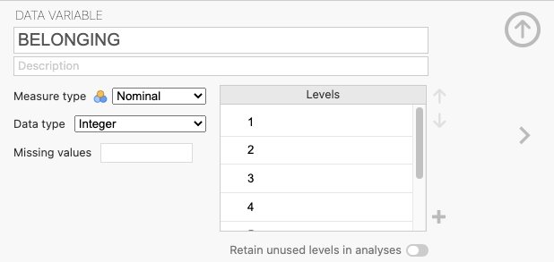
```

This time, we need to change the measurement type. JAMOVI thinks this is a nominal variable, but we know it is ordinal. Change it in the drop-down menu. You may get an error and it may not appear to work. Check whether it worked by closing the Setup panel by clicking the up arrow. You should notice that the icon next to `BELONGING` in the spreadsheet now corresponds to an ordinal variable, so we know we successfully set the measurement type to ordinal.

```{r , echo=FALSE,dev='png'}
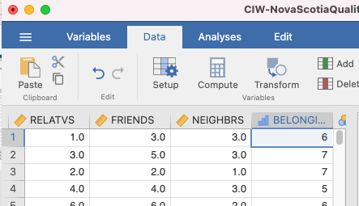
```

Let's look at how Nova Scotians rated their sense of belonging. As before, click <span style="color:blue">Analyses</span>, <span style="color:blue">Exploration</span>, and then <span style="color:blue">Descriptives</span>. Search for the `BELONGING` variable and move it into the Variable box. This time, we are going to **select only the descriptive statistics that are appropriate**. BELONGING is measured on an ordinal scale of measurement, so we are going to use the **median** as a measure of central tendency, and the **IQR** as a measure of variation. Your JAMOVI window will look like this:

```{r , echo=FALSE,dev='png'}

```

You could write a sentence to report these results like this: Participants reported a sense of belonging corresponding to somewhere between neutral and somewhat strong (*Med* = 5.00) with a discrepancy of 2 (*IQR* = 2.00).
Or like this...
Participants reported a median (IQR) sense of belonging of 5 (2), corresponding to a sense of belonging between neutral and somewhat strong.

Let's say you felt that the `BELONGING` variable had equal spacing between intervals, so that you could consider it a quasi-interval variable. In that case, you might wish to report the mean and standard deviation. (Remember: This is the default choice in 292 Labs for the Winter of 2026.)

```{r , echo=FALSE,dev='png'}
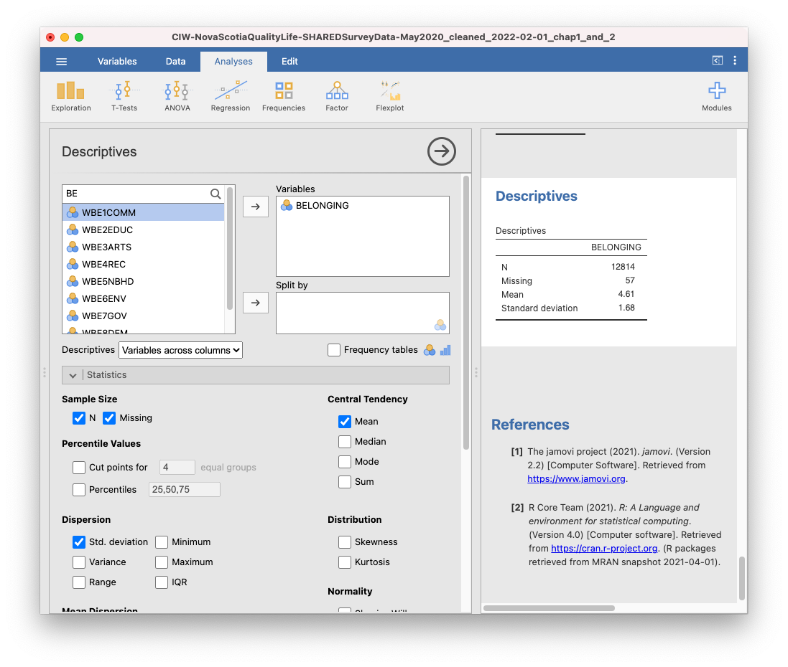
```

Now, you might describe your results with a sentence such as: Participants reported a mean sense of belonging between neutral and very strong (*M* = 4.61, *SD* = 1.68).
Or like this...
Participants reported a mean (SD) sense of belonging of 4.61 (1.68), corresponding to a sense of belonging between neutral and very strong.

Finally, you might want to look at the data graphically. A histogram would be appropriate if you are considering `BELONGING` to be quasi-interval or interval.

```{r , echo=FALSE,dev='png'}
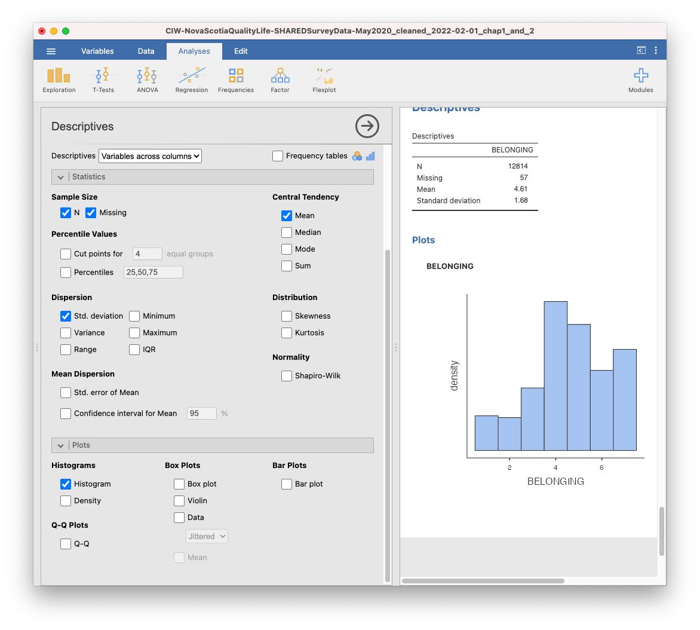
```

### Boxplots


Let us look at another useful graph: the boxplot. A boxplot, or box plot, gives us a visual representation of a data set in terms of its quartiles. You might think about the data in terms of four groups, each with 25% of the total set. Inside the box are the two middle groups. The line inside the box is the median, which is the same as the second quartile (Q2). The two ends of the box mark the first (or lower) quartile (also called Q1) and the third (or upper) quartile (also called Q3). These lines marking the sides of the box might be considered as the medians of the lower half of the data set and the upper half of the data set. The difference between the first and third quartile is known as the interquartile range (IQR). In effect, IQR = Q3 – Q1.

Outside the box are two whiskers. The end of the lower whisker is the minimum score (excluding any outliers - we’ll get to what those are later), and the end of the higher/upper whisker is the maximum score (again, excluding any outliers). Note that boxplots can be presented horizontally or vertically. These graphs allow us to visualize the median, quartiles, interquartile range, range, and any potential outliers.

Using the `SLEEP` and `R_SLEEP` variables, we can create boxplots. You should now feel comfortable accessing descriptive statistics and graphs in the JAMOVI menus (Click <span style="color:blue">Analyses</span>, <span style="color:blue">Exploration</span>, and <span style="color:blue">Descriptives</span>). Move both variables into the Variables box. Under <span style="color:blue">Plots</span>, select Box plot. In the Results panel, JAMOVI will produce output containing two boxplots.

```{r , echo=FALSE,dev='png'}
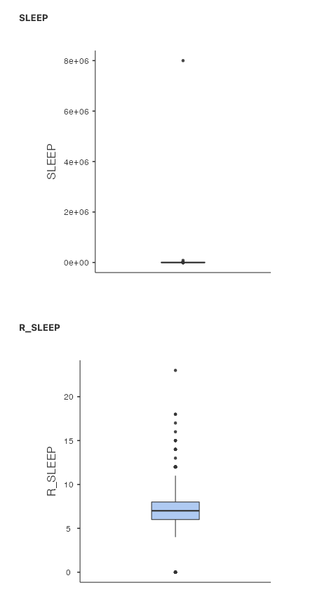
```

Just like when we looked at the histograms, looking at the boxplot for the `SLEEP` variable isn't very helpful. The garbage data (participants reporting 8e+06 or 8 million hours of sleep per day) squishes the boxplot, making the individual features impossible to see. The boxplot for `R_SLEEP` is more helpful. We can clearly see the median, IQR, whiskers (min/max excluding outliers), and outliers (black dots).

Remember to save your file before closing JAMOVI by clicking on the three lines near the top left and selecting the appropriate command. You might have saved the .omv file you created as a newly named file as you began reading and following along in this section. If not, you might want to use <span style="color:blue">Save As</span> now and give the file a new name. The .omv file will have both data and the results of analyses you conducted. Reminder: To save just your output, after clicking the three lines, select <span style="color:blue">Export</span>. This will allow you to save a pdf. 


### Editing graphs


It is helpful to know how to manipulate not just the superficial, cosmetic appearance of data visualizations, but also the components of graphs that communicate important information. For example, when you are trying to compare multiple graphs, it is very helpful if all of the features of the graphs, such as the axis scales and the bin widths, are the same. Unfortunately, this is not easy to accomplish in JAMOVI. We suggest using Excel to quickly chart your graphs, edit them, and compare/contrast them.


### Homework


Because .omv files contain both the data and the output, we want you to save a new file before each novel analysis task. The lab demonstration would be one analysis task. The homework is another analysis task. So, before you start your homework, open the starting JAMOVI file with which you were provided and save a new version of your .omv file by clicking on the three lines and selecting <span style="color:blue">Save As</span>. Give the file a new name. Then, as you generate output by following the instructions below, you can continue to save this file.

Recall that to save just your output, you can click the three lines and select <span style="color:blue">Export</span>. This will allow you to save a pdf. 

See [Moodle](https://moodle.stfx.ca/course/view.php?id=29319) for the homework questions.


### Practice Questions


1. Were participants likely to have attended a local/municipal council meeting? How do you know?

2. What is the most populated postal code prefix among participants? What measure of central tendency did you use to determine this, and why? Integrating skills (advanced question): Can you figure out what geographic area this corresponds to? 

3. Can you calculate mean and median postal code prefix? Why or why not?

4. Calculate the mean, median, and mode of ETHNIC1. Which is the most useful and why?

5. Who do Nova Scotians trust more: people in their neighbourhood, people they go to work/school with, or strangers? What measure of central tendency did you use to determine this, and why?

6. How would you have answered homework Question #2 differently had you been asked to look at `INCOME` and `NUMJOB`?
