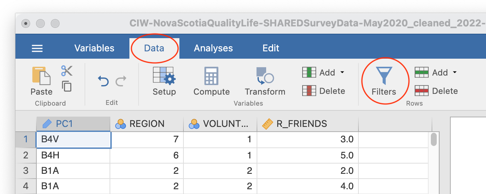

# Lab 3: Sampling and Sampling Distributions

<script>
$("#coverpic").hide();
</script>

## R

How to do it in R

## Excel

How to do it in Excel

## SPSS

How to do it in SPSS

## JAMOVI - Week 7 - March 8 & 9

<div class="marginnote">
This lab activity was developed by Erin Mazerolle and Sherry Neville-MacLean.
</div>

### Learning Objectives

1. Create sampling distributions from a "population" dataset.
2. Interpret sampling distributions, especially with respect to sample size.
3. Use the <span style="color:blue">Filter</span> function to randomly sample from a dataset.
4. Use the <span style="color:blue">Filter</span> function to select specific cases from a dataset.

### Pre-lab tasks

In order for our computers to run a bit faster, we use a version of the EngageNS Quality of Life data that only contains four variables for this activity. It can be downloaded from   <a href="https://moodle.stfx.ca/course/view.php?id=26030#section-10">Moodle</a>. Download this file to your computer before the beginning of your lab session. Have it open in JAMOVI at the beginning of your lab session.

In addition, have a new Excel spreadsheet open. You can use Excel on your computer or <a href="https://www.office.com/launch/excel?auth=2">Office365</a>.

### The impact of sampling on research results

When we read about research, only one set of results are presented to us - the results from the sample obtained by the researchers. However, it's important to realize that the particular results obtained are completely dependent on the sample. This means if they repeated the exact same data collection, but the sample included different participants, the results would be different. "How different?" is an extremely important question. Through this lab activity, you will see that the answer depends quite a bit on sample size.

For the purpose of this lab activity, we are going to define all the data in the EngageNS dataset as the population (i.e., all 12871 rows). We are going to randomly sample from that population, using different sample sizes.

You should have four columns of data in the "Simplified_CIW-NovaScotiaQualityofLife-SHAREDSurveyData-May2020_cleaned_2022-02-28_SamplingLabActivity.omv" dataset: `PC1`, `REGION`, `VOLUNTEER`, and `R_FRIENDS`.

```{r , echo=FALSE,dev='png'}
knitr::include_graphics('img/simplified_file.png')
```

First, we need to set up our analysis. As we have done in previous labs, click on <span style="color:blue">Analyses</span>, <span style="color:blue">Exploration</span>, and <span style="color:blue">Descriptives</span>. Move the `R_FRIENDS` variable into the "Variables" box or window.

```{r , echo=FALSE,dev='png'}
knitr::include_graphics('img/AnalysisWithFriendsVariable.png')
```

Remember, you can use the data dictionary to learn what the variables are. `R_FRIENDS` is the revised (cleaned) `FRIENDS` variable. `FRIENDS` is described in the data dictionary as:

```{r , echo=FALSE,dev='png'}
knitr::include_graphics('img/FRIENDSdictionary.png')
```

Ask yourself, what is the scale of measurement of `R_FRIENDS`? Is it recorded correctly in JAMOVI?

Back to the JAMOVI program, expand the "Statistics" section. For this activity, we are going to focus on the mean and the sample size, so deselect everything else. Your JAMOVI window should look something like this:

```{r , echo=FALSE,dev='png'}
knitr::include_graphics('img/AnalysisSetup.png')
```

<div class="marginnote">
While the file has 12871 rows, your table will display an *N* of 12710. This is because there is no data in this column for some participants. 
</div>

We are going to repeatedly randomly sample using different sample sizes and record the mean each time.

Click the <span style="color:blue">Data</span> tab, and then click <span style="color:blue">Filters</span>:

```{r , echo=FALSE,dev='png'}

```

The following Row Filters panel will be displayed:

```{r , echo=FALSE,dev='png'}

```

Filters allow us to select a subset (or sample) of the data. In this case, we are going to randomly select samples of different sizes. You can see that all the rows are selected by looking at the "Filter 1" column that has appeared as the leftmost column. The green checks indicate that those rows are included. 

We will start with a sample size of 5 (*N* = 5). To create a sample from our population of 12871, we are going to use the SAMPLE function. This will tell JAMOVI to select 5 rows at random. Type SAMPLE(REGION,5) after the equals sign, as follows:

```{r , echo=FALSE,dev='png'}
knitr::include_graphics('img/SAMPLEN5.png')
```

We use `REGION` in this filter as a placeholder. The filter also works if you use `VOLUNTEER`.

Now, most of the data are excluded, as indicated by the red Xs. If you scroll around, you should be able to find five rows with a green check. Your rows might look something like this:

```{r , echo=FALSE,dev='png'}
knitr::include_graphics('img/Filters_redX.png')
```

You will also have a new Results table. Yours might have different numbers, but mine looks like this:

```{r , echo=FALSE,dev='png'}

```

Not only might the value of the mean you see be different from the result above, but also the value of *N* recorded in your Descriptives table might not be exactly 5. This difference in *N* would be the result of your random sample including rows with missing data.

In your Excel spreadsheet, name a column "Means for N = 5" and input your mean into the next row:

```{r , echo=FALSE,dev='png'}
knitr::include_graphics('img/ExcelN5.png')
```

You can sample a new set of 5 rows by turning the filter on and off. Move the slider to change the filter from active:

```{r , echo=FALSE,dev='png'}

```

to inactive:
```{r , echo=FALSE,dev='png'}

```

When you move the slider back to "active," you should have a different sample in your results table. It will probably have a different mean from your previous sample.

Repeat this process 19 more times, to record the mean from 20 random samples. 

Once you have 20 samples, input your means into the class [spreadsheet](https://moodle.stfx.ca/course/view.php?id=26030#section-10).

Then, create a new column in your Excel spreadsheet, "Means for N = 500" and repeat the process, but this time select random samples of 500. This means you need to adjust your filter so that it reads SAMPLE(REGION,500), and you have to continue to inactivate and activate the filter until you have 20 means with *N* = 500.

```{r , echo=FALSE,dev='png'}

```

```{r , echo=FALSE,dev='png'}
knitr::include_graphics('img/RepeatingTheFilter2.png')
```

Once you have 20 samples with *N* = 500, input those into the class [spreadsheet](https://moodle.stfx.ca/course/view.php?id=26030#section-10).

Once everyone has completed these tasks, we will make histograms of the means for both sample sizes as a group. While you are waiting, complete the lab activities described in the next sections.

### Other types of filters

Perhaps you are interested in the number of friends reported by those who volunteer versus those who don't volunteer. You can use a filter in JAMOVI to get the mean number of friends for each group.

To find out the number of friends reported by those who volunteer, type VOLUNTEER==1 into the filter function:

<div class="marginnote">
The double equals sign (==) checks for equivalence. This is commonly used in programming language because a single equals sign (=) is used to assign or set a value to a given variable.
</div>

```{r , echo=FALSE,dev='png'}

```

We see that the mean number of friends reported by participants who volunteer is 5.71:

```{r , echo=FALSE,dev='png'}
knitr::include_graphics('img/MeanFriendsVolunteers.png')
```


### Homework Problems 

See <a href="https://moodle.stfx.ca/course/view.php?id=26030#section-10">Moodle</a>.
