# Lab 4: t-Test (one-sample, paired sample)
<script>
$("#coverpic").hide();
</script>


<span class="newthought">
Any experiment may be regarded as forming an individual of a 'population' of experiments which might be performed under the same conditions. A series of experiments is a sample drawn from this population.
-William Sealy Gossett
</span>


<div class="marginnote">
This lab is modified and extended from [Open Stats Labs](https://sites.trinity.edu/osl). Thanks to Open Stats Labs (Dr. Kevin P. McIntyre) for their fantastic work.
</div>

## Intro material for activities

### Does Music Convey Social Information to Infants?

This lab activity uses the open data from Experiment 1 of Mehr, Song, and Spelke (2016) to teach one-sample and paired samples *t*-tests. Results of the activity provided below should exactly reproduce the results described in the paper.

#### Study description

Parents often sing to their children and, even as infants, children listen to and look at their parents while they are singing. Research by Mehr, Song, and Spelke (2016) sought to explore the psychological function that music has for parents and infants, by examining the hypothesis that particular melodies convey important social information to infants. Specifically, melodies convey information about social affiliation.

The authors argue that melodies are shared within social groups. Whereas children growing up in one culture may be exposed to certain songs as infants (e.g., “Rock-a-bye Baby”), children growing up in other cultures (or even other groups within a culture) may be exposed to different songs. Thus, when a novel person (someone who the infant has never seen before) sings a familiar song, it may signal to the infant that this new person is a member of their social group.

To test this hypothesis, the researchers recruited 32 infants and their parents to complete an experiment. During their first visit to the lab, the parents were taught a new lullaby (one that neither they nor their infants had heard before). The experimenters asked the parents to sing the new lullaby to their child every day for the next 1-2 weeks.

Following this 1-2 week exposure period, the parents and their infant returned to the lab to complete the experimental portion of the study. Infants were first shown a screen with side-by-side videos of two unfamiliar people, each of whom were silently smiling and looking at the infant. The researchers recorded the looking behavior (or gaze) of the infants during this ‘baseline’ phase. Next, one by one, the two unfamiliar people on the screen sang either the lullaby that the parents learned or a different lullaby (that had the same lyrics and rhythm, but a different melody). Finally, the infants saw the same silent video used at baseline, and the researchers again recorded the looking behavior of the infants during this ‘test’ phase.For more details on the experiment’s methods, please refer to Mehr et al. (2016) Experiment 1.

### Lab skills learned

1. Conducting a one-sample *t*-test
2. Conducting a paired samples *t*-test
3. Plotting the data
4. Discussing inferences and limitations


### Important Stuff
- citation: Mehr, S. A., Song. L. A., & Spelke, E. S. (2016). For 5-month-old infants, melodies are social. Psychological Science, 27, 486-501.
- [Link to .pdf of article](http://journals.sagepub.com/stoken/default+domain/d5HcBHg85XamSXGdYqYN/full)
- <a href="https://raw.githubusercontent.com/CrumpLab/statisticsLab/master/data/MehrSongSpelke2016.csv" download>Data in .csv format</a>
- [Data in SPSS format](https://drive.google.com/open?id=0Bz-rhZ21ShvOa3c4X3hqOWxwcUU)


## JAMOVI - Week 10 - March 17th, 18th, & 19th


<div class="marginnote">
This lab activity was developed by Erin Mazerolle, Christine Lomore, and Sherry Neville-MacLean.
</div>


### Learning Objectives

In this lab, we will use jamovi to:

1. Perform a paired-sample *t*-test (an inferential statistic)
2. Use descriptive statistics and graphs to give context to inferential statistics
3. Report a paired-sample *t*-test in APA format
4. Perform a one-sample *t*-test


### Research Context for Data Set

Once again, we will be working with the Psych 291 data set. As you may recall, this data set is from an online survey. Participants were students in a 200-level, Research Methods in Psychology course. They responded to questions about anxiety, stress, sleep, self-care, and substance use. We are using a subset of the data from the survey for this lab.

The survey was delivered to the same class of students twice during the semester - once early in the term and once immediately after the course midterm. The person who constructed the data file used T1_ and T2_ before variable names to denote whether the data came from the beginning of the term (T1) or immediately after the midterm (T2).


### Performing a Paired-Samples *t*-Test


#### Motivation to perform statistical analyses

Imagine you are a researcher who is interested in how midterms impact students' sleep patterns. You are curious about whether the number of nightly sleep hours changes during midterm time. You plan to use the survey data described above to answer your question.

First, what is your research question? 

Possible research question: Do the number of hours of sleep change between the beginning of term and the time during midterms?

Note that this is just one possible research question. You might also ask a directional question. Consider the following example: Do the number of hours of sleep decrease during midterms? We will use the non-directional research question (the first possible research question) for now.


#### Using descriptive statistics to look at the question


What might you do to answer this question? You can use some JAMOVI skills we’ve already learned to explore the differences in sleep duration between the two time points: descriptive statistics! graphing! You should recall the commands used to request [descriptive statistics](https://www.erinmazerolle.com/statisticsLab/lab-2-descriptive-statistics-and-more-graphs.html#jamovi---week-3---january-24th-25th) and [graphs](https://www.erinmazerolle.com/statisticsLab/lab-1-graphing-data.html#jamovi---week-4---january-30th-31st) from previous chapters. Let's make those requests now.

```{r , echo=FALSE,dev='png'}
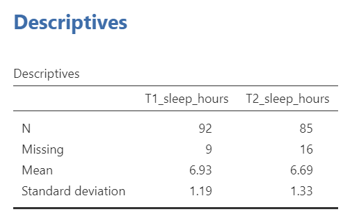
```

```{r , echo=FALSE,dev='png'}
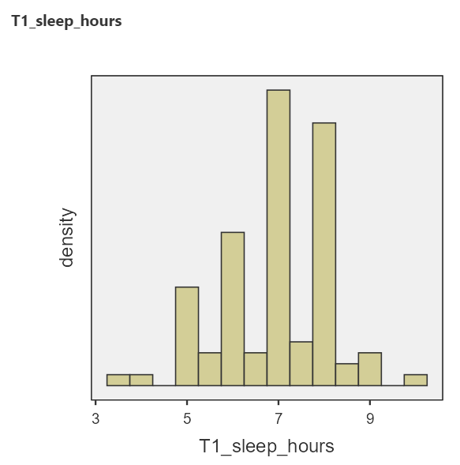
```

```{r , echo=FALSE,dev='png'}
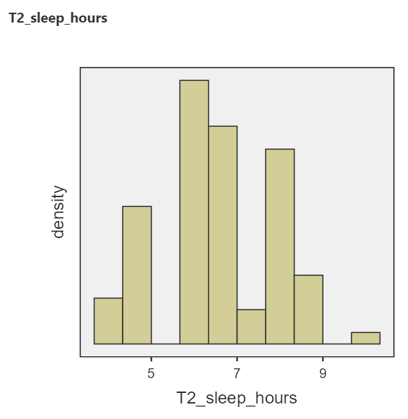
```

Stretch your Thinking: Why do the histograms look high-low-high-low? 

(Answer: because people tend to write/remember whole hours, so those values occur more frequently in the data).

#### Motivation to perform inferential statistics

Having looked at the descriptive statistics and graphs, we see differences between the sleep scores at the two time points. It looks like the mean sleep duration is slightly lower during midterms, compared to the beginning of term. But, how confident are we that that the means are truly different? That is, do the differences between these time points represent true differences in the sleep of students between the beginning of term and midterms? Or, could the differences explained by sampling error? 

Remember: Each sample is different. If you repeated these surveys with a different sample, would you expect to get the same results? (Answer: **No.**) Do the differences between time points exist in the population of all students? That is what inferential statistics will help us decide. 
 
We use a paired-samples *t*-test in this case because the data are paired. The survey was completed by the same participants at both time points. Paired-samples *t*-tests are also known as paired *t*-tests, matched *t*-tests, and dependent *t*-tests. 
 
First, we need to set up our null and alternative hypotheses. Remember our research question: Do the number of hours of sleep change between the beginning of term and the time during midterms?
So, our null hypothesis ($H_0$) is there is no difference in sleep between the two time points: $\mu_{T1}$ = $\mu_{T2}$.
Our alternative hypothesis ($H_A$ or $H_1$) is there is a difference: $\mu_{T1}$ $\neq$ $\mu_{T2}$.
 
Question: Why are our hypotheses about the mean, as opposed to a different measure of central tendency, or the distributions? Answer: *t*-tests answer questions about means. Other tests can be used for research questions about different statistics.

#### Using JAMOVI to request the paired-samples *t*-test

You can find the paired *t*-tests in JAMOVI by clicking <span style="color:blue">Analyses</span> menu, <span style="color:blue">T-Tests</span>, and then, <span style="color:blue">Paired Samples T-Test</span>:


```{r , echo=FALSE,dev='png'}
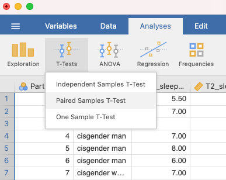
```

Move your two variables of interest to "Paired Variables":

```{r , echo=FALSE,dev='png'}
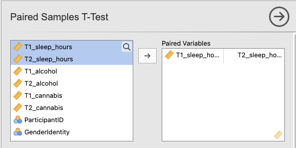
```

Under **Tests**, "Student's" should be selected (Student was the pseudonym of the person who invented the *t*-test). Also, make sure Measure 1 $\neq$ Measure 2 under **Hypothesis** (because we have a non-directional hypothesis for this example):

```{r , echo=FALSE,dev='png'}
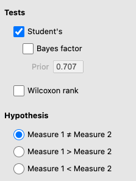
```

Under **Additional Statistics**, select Mean difference and under that, Confidence Interval. Select Effect size. You can also select Descriptives and Descriptive Plots:

```{r , echo=FALSE,dev='png'}
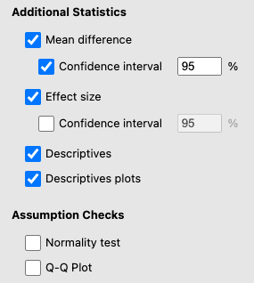
```

There will now be some output in the JAMOVI output panel. The first table is Paired Samples T-Test. It names the variables that were used in the test (`T1_sleep_hours` and `T2_sleep hours`), gives the Student's *t*-value (under the statistic column), the degrees of freedom (df), the *p*-value (p), the mean difference, the standard error (SE) of the difference, the 95% Confidence Interval lower and upper bounds, and Cohen's *d* (under the Effect size column). This table is quite wide, so we've split it into two below:

```{r , echo=FALSE,dev='png'}
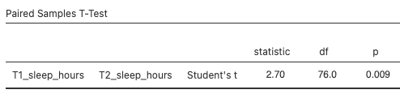
```

```{r , echo=FALSE,dev='png'}
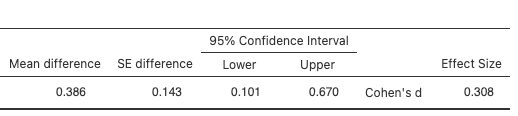
```

The Descriptives table gives some descriptive statistics, which is convenient for writing up your results:

```{r , echo=FALSE,dev='png'}
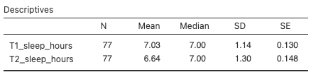
```

Compare these descriptive statistics to the ones we generated earlier via the Exploration function. Why are they different? We'll answer this question below.

The plot includes both the mean and the median of both variables. The mean has "whiskers" that represent the 95% confidence interval. You can think of this plot as a bar graph, without the bars: 

```{r , echo=FALSE,dev='png'}
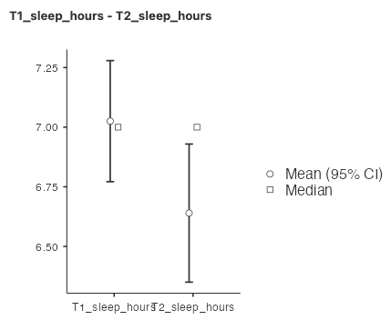
```

**Tip**: If you would like to make a bar graph corresponding to a paired *t*-test, it's a bit tricky in JAMOVI. We recommend using Excel to plot your means. Usually, the standard errors (SE), which can be found in the Descriptives table, are a good choice for your error bars.

#### Interpreting the Paired Samples *t*-Test output

What output do you look at to determine the answer to your research question (Do the number of hours of sleep change between the beginning of term and the time during midterms?)? The Paired Samples T-Test table has two particularly important numbers, the *p*-value (in this case, 0.009) and the effect size (in this case, 0.308). The *p*-value is the probability of observing a difference as extreme, or more extreme, than the one you observed, assuming the null hypothesis is true (that is, assuming that sleep duration at time 1 is the same as sleep duration at time 2). In this case, the probability is 0.009, or 0.9%, which is very low. How do you decide if your *p*-value is "low enough"? We typically use a cutoff, called an alpha, of 0.05 or 5%. If the *p*-value is lower than the alpha value, we conclude that it is very unlikely that the null hypothesis is true. We often call this rejecting the null hypothesis. In this case, 0.009 < 0.05, so we reject the null hypothesis. Note that we **do not accept the alternative hypothesis**!

In research papers, we often use the phrase "statistically significant" or "significantly different" to mean reject the null hypothesis. For example, we observed significantly different sleep durations at time 1 versus time 2.

The effect size gives us a sense for how large the difference is. Cohen's *d* is the appropriate effect size for a *t*-test, but you may learn about effect sizes for other tests as you progress in studies of statistics. Cohen's *d* tells us how large the mean difference is, in units of standard deviation. In this case, Cohen's *d* is 0.308, so the difference in sleep duration between time 1 and time 2 is about 0.3 standard deviations. 

The degrees of freedom (*df*) for a paired *t*-test is equal to the number of participants included in the test minus one:
$df = N - 1$

<div class="marginnote">
Note: Different tests use different formulas for df.
</div>

Our *df* = 76, meaning that 77 participants were included in the paired *t*-test. There were actually 103 participants (and 101 participants' scores are shown in the data set), but not all participants had sleep duration data for both time points. Participants with missing data at one or both time points get excluded from the test. This is why the descriptives statistics are different depending on whether you generate them via the <span style="color:blue">Exploration</span> panel or the <span style="color:blue">Paired T-Test</span> command. The <span style="color:blue">Exploration</span> descriptives table includes all participants with data, whereas the <span style="color:blue">Paired T-Test</span> descriptives table only includes participants with data at both time points.

The 95% confidence interval for a paired *t*-test are limits constructed such that, for 95% of samples, the population mean difference will fall within the limits. This means that, assuming our sample belongs to that 95% of samples, the population mean difference is between 0.101 and 0.670. Remember, if we collected the data again using a different sample, we would get a different estimate for the population mean.

### Writing results in APA format

We can write sentences in APA format to describe our results. Such sentences are what you tend to see in Results sections of research papers. For the paired *t*-test example above, we would write a sentence such as:

Using a paired *t*-test, we observed a significant difference in sleep duration between the beginning of term and midterms (*t*(76) = 2.70, *p* = .009, *d* = 0.31). Mean (standard deviation) sleep duration at the beginning of term was 7.03 (1.14) hours, dropping to 6.64 (1.30) hours at midterms. The mean difference was 0.39 hours (95% CI [0.10, 0.67]).

Alternatively, you might write something like this:
The results of a paired *t*-test indicated a significant difference in sleep duration between the beginning of term and midterms (*t*(76) = 2.70, *p* = .009, *d* = 0.31). Sleep duration, measured in hours, was higher at the beginning of term  (*M* = 7.03, *SD* = 1.14) than at midterm time (*M* = 6.64, *SD* = 1.30) hours at midterms. The mean difference was 0.39 hours (95% CI [0.10, 0.67]).

Can you find where all the numbers in the sentence came from in the two tables?

A few notes about APA format:

1. Always note the name of the test you performed (in this case, paired *t*-test) and whether the result is significant or non-significant (*Note: We do not use the word insignificant.*). 

2. We usually round to two decimal places, except for *p*-values. If you know the exact *p*-value, you round to two or three decimal places, except if that means it is *p* = .000. In this case, you would indicate *p* < .001.

3. Do not include a leading 0 before the decimal for the *p*-value (*p* = .009, **not** *p* = 0.009)

<div class="marginnote">
Yes, I'm serious. No, I don't know why. Yes, it does seem a bit silly. Yes, you lose points if you don't adhere to APA format when asked to do so.
</div>

4. Pay attention to spaces, parentheses, etc. APA is very picky about that. For example, it's *t*(76) = 2.70 **not** *t*(76)=2.70. 

5. Symbols such as *M*, *SD*, *t*, *p*, and *d* are italicized.


### Performing a one-sample *t*-test

Sometimes you are interested in whether a sample's mean is different from a  specific value. For example, you might wonder whether students are getting 8 hours of sleep per night at the start of term. To ask this question, we use a one-sample *t*-test. Click <span style="color:blue">Analyses</span> menu, then choose <span style="color:blue">T-Tests</span>, and then, <span style="color:blue">One-Sample T-test</span>: 

```{r , echo=FALSE,dev='png'}
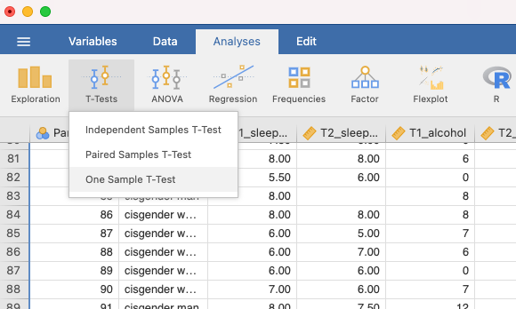
```

Move your variable of interest (`T1_sleep_hours`) into the Dependent Variables box.

Under **Hypothesis**, be sure to set your "Test value" to 8. If you leave it at 0, it will test whether the mean sleep duration is equal to 0. So, your null hypothesis is that sleep duration at the start of term is equal to 8 hours, i.e., $H_0: \mu = 8$

Your output will look like this:

```{r , echo=FALSE,dev='png'}
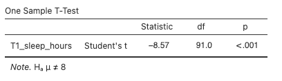
```

The *p*-value is less than .05, so we reject our null hypothesis. Sleep duration is significantly different from 8 hours per night at the beginning of term.

You can also add the outputs we included for the paired *t*-test, including mean difference, confidence interval, descriptives, and descriptive plots. 


### Homework Questions

See Moodle.
 
### Practice Questions

1. Canada’s Healthy Drinking Guidelines suggest that women should consume “no more than 2 standard drinks on most days and no more than 10 drinks per week.” Using the data collected in PSYC 291, select only those participants who identify as cisgender women (hint: review lab manual section on [filters](https://www.erinmazerolle.com/statisticsLab/lab-3-sampling-and-sampling-distributions.html#other-types-of-filters)). Compare the number of drinks women in PSYC 291 consumed in the week prior to Time 1 (September) to the healthy drinking standard. Conduct the appropriate *t*-test. What can you conclude? Write your answer in APA format, including the 95% confidence interval, and effect size (Cohen’s *d*).

2. Is there a significant difference in cannabis use between the beginning of term versus midterms? Report your results in APA format.

3. Consider the sleep duration example. Use JAMOVI to perform a directional test, such that the alternative hypothesis is that sleep duration at the beginning of term is longer than sleep duration at midterms. Compare your results to the non-directional test. What are the similarities and what are the differences?

4. Does it matter in what order you input the variables for the paired *t*-test? Why or why not? If you aren't sure, given it a try!

