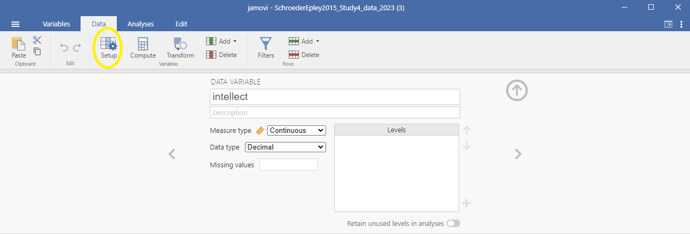
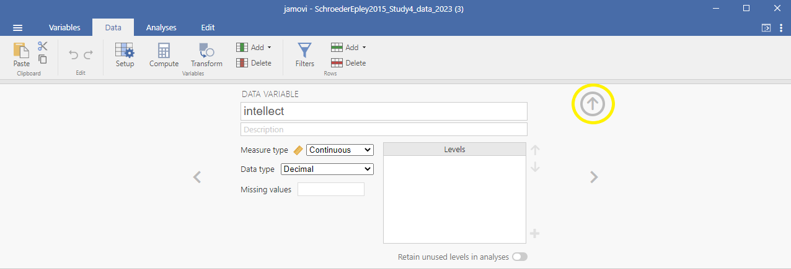
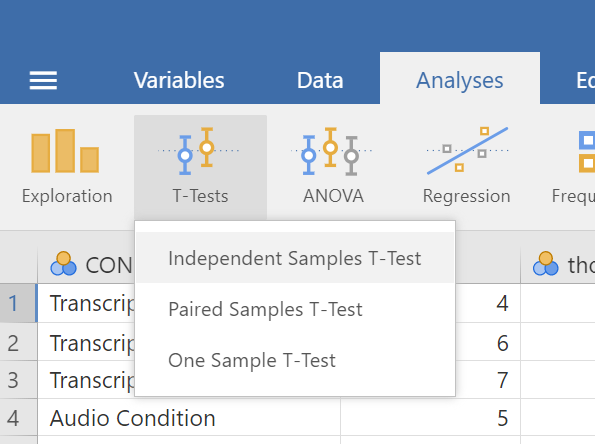
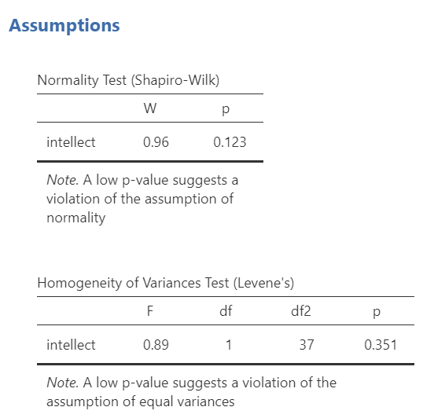
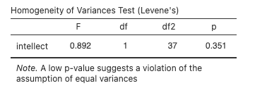
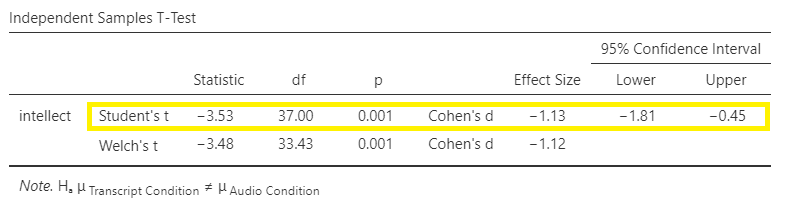
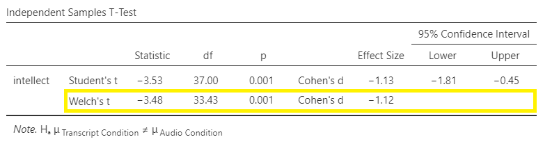
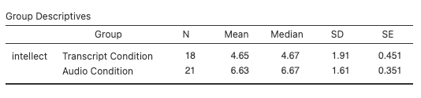

# Lab 5: *t*-test (Independent Sample)
<script>
$("#coverpic").hide();
</script>


<span class="newthought">
I think he [Gosset] was really the big influence in
statistics... he asked the questions and Pearson and Fisher put them into statistical language, and then Neyman came to work with the mathematics. But I think
most of it came from Gosset.
-F. N. David
</span>


<div class="marginnote">
This lab is modified and extended from [Open Stats Labs](https://sites.trinity.edu/osl). Thanks to Open Stats Labs (Dr. Kevin P. McIntyre) for their fantastic work.
</div>

## Do you come across as smarter when people read what you say or hear what you say?

### STUDY DESCRIPTION

Imagine you were a job candidate trying to pitch your skills to a potential employer. Would you be more likely to get the job after giving a short speech describing your skills, or after writing a short speech and having a potential employer read those words? That was the question raised by Schroeder and Epley (2015).The authors predicted that a person’s speech (i.e., vocal tone, cadence, and pitch) communicates information about their intellect better than their written words (even if they are the same words as in the speech).

To examine this possibility, the authors randomly assigned 39 professional recruiters for Fortune 500 companies to one of two conditions. In the audio condition, participants listened to audio recordings of a job candidate’s spoken job pitch. In the transcript condition, participants read a transcription of the job candidate’s pitch. After hearing or reading the pitch, the participants rated the job candidates on three dimensions: intelligence, competence, and thoughtfulness. These ratings were then averaged to create a single measure of the job candidate’s intellect, with higher scores indicating the recruiters rated the candidates as higher in intellect. The participants also rated their overall impression of the job candidate (a composite of two items measuring positive and negative impressions). Finally, the participants indicated how likely they would be to recommend hiring the job candidate (0 - not at all likely, 10 - extremely likely).

What happened? Did the recruiters think job applicants were smarter when they read the transcripts, or when the heard the applicants speak? We have the data, we can find out.

## Lab skills learned

1. Conduct independent samples *t*-tests
2. Generate figures
3. Discuss the results and implications

## Important Stuff
- citation: Schroeder, J., & Epley, N. (2015). The sound of intellect: Speech reveals a thoughtful mind, increasing a job candidate’s appeal. Psychological Science, 26, 877-891.
- [Link to .pdf of article](http://journals.sagepub.com/stoken/default+domain/PhtK6MPtXvkgnYRrnGbA/full)
- <a href="https://raw.githubusercontent.com/CrumpLab/statisticsLab/master/data/SchroederEpley2015data.csv" download>Data in .csv format</a>
- [Data in SPSS format](https://drive.google.com/open?id=0Bz-rhZ21ShvOVXlDMjEzQU1oY1k)


## JAMOVI - Week 11 - March 24th, 25th, & 26th


<div class="marginnote">
This section is copied almost verbatim, with some editorial changes, from [Answering questions with data: The lab manual for R, Excel, SPSS and JAMOVI, Lab 7, Section 7.6, SPSS](https://www.crumplab.com/statisticsLab/lab-7-t-test-independent-sample.html#spss-7), according to its [CC license](https://creativecommons.org/licenses/by-sa/4.0/deed.ast). Thank you to Crump, Krishnan, Volz, & Chavarga (2018). 
</div>

In this lab, we will use jamovi to:

1. Perform an independent-samples *t*-test
2. Graph the data
3. Report the results of an independent-samples *t*-test


### Pre-lab reading and tasks


1. Read the following section about an experiment performed by Schroeder and Epley.
2. Download the data set (instructions are below).
3. Have the data set opened in JAMOVI before lab begins.


#### Experiment Background


Schroeder and Epley (2015) conducted an experiment to determine whether a person’s speech (i.e., vocal tone, cadence, and pitch) communicates information about their intellect better than their written words (even if they are the same words as in the speech).

To conduct this study, the authors randomly assigned 39 professional recruiters for Fortune 500 companies to one of two conditions. In the audio condition, participants listened to audio recordings of a job candidate’s spoken job pitch. In the transcript condition, participants read a transcription of the job candidate’s pitch. After hearing or reading the pitch, the participants rated the job candidates on three dimensions: intelligence, competence, and thoughtfulness. These ratings were then averaged to create a single measure of the job candidate’s intellect, with higher scores indicating the recruiters rated the candidates as higher in intellect. The participants also rated their overall impression of the job candidate (a composite of two items measuring positive and negative impressions). Finally, the participants indicated how likely they would be to recommend hiring the job candidate (0 - not at all likely, 10 - extremely likely).

So, what happened? Did the recruiters think job applicants were smarter when they read the transcripts or when they heard the applicants speak? We have the data, and we can find out.

**Note**: This dataset includes variables that have very similar names. Be careful to select the correct variable as you complete the exercises.


#### Download and open the data


The dataset described above can be downloaded from your [lab Moodle site](https://moodle.stfx.ca). Look under the grid section called "Data Sets." Remember, if double-clicking on the downloaded data file does not result in it opening on your laptop or computer, you should, first, open the JAMOVI program first, and then, from within the program, click the three horizontal lines, click <span style="color:blue">Open</span>, and browse for the downloaded file.

```{r , echo=FALSE,dev='png'}
knitr::include_graphics('img/OpenFileFromWithinJAMOVI.png')
```


### Performing an independent-samples *t*-test


For our analysis, we will focus on only one of the three measures mentioned above: `intellect`. We want to know if perceived intellect is different in the audio condition (where recruiters listened to a job pitch) than in the transcript condition (where recruiters read a transcript of a job pitch). 

Before we run the *t*-test, let's review the variable attributes by using the <span style="color:blue">Data</span> menu and the <span style="color:blue">Setup</span> button (or using the <span style="color:blue">Variables</span> menu and the <span style="color:blue">Edit</span> button), available at the top of our jamovi spreadsheet window. Check `CONDITION`. 

```{r , echo=FALSE,dev='png'}
knitr::include_graphics('img/VariableAttributesForConditionVariable.png')
```

When you check `CONDITION`, notice that this <span style="color:blue">Setup</span> button has revealed the values used to signify the Audio and Transcript groups. Take note that these groups are signified by 0s and 1s. This coding helps the program to run our *t*-test. Keep in mind that whether we look at the codes or labels does not change anything about the data itself or any subsequent analyses; it is merely a cosmetic change. 

Remember to check `intellect` while considering the information about the study (the context). Is `intellect` a variable measured on a continuous scale? Does it get represented by decimal-type data? (*Hint: Be sure to carefully read the names of the variables during these exercises. Some variable names are similar and can lead to confusion when you select the variables to be included in your analysis.*)

```{r , echo=FALSE,dev='png'}
knitr::include_graphics('img/VariableAttributesForIntellVariable.png')
```

Remember to press the <span style="color:blue">Setup</span> button again (or the <span style="color:blue">Edit</span> button again if you are using the <span style="color:blue">Edit</span> menu) or to press the upward facing arrows to return to a more full version of your data spreadsheet and Results panel:

```{r , echo=FALSE,dev='png'}

```

Or

```{r , echo=FALSE,dev='png'}

```

Now, we're ready to run the independent-samples *t*-test. Go to <span style="color:blue">Analyses</span>, then <span style="color:blue">T-Tests</span>, then <span style="color:blue">Independent Samples T-test</span>.

```{r , echo=FALSE,dev='png'}

```

A window will appear asking you to specify which variable to use in this analysis. Remember, we are only using `intellect`, so find this variable in the left-hand list. One way you can find the `intellect` variable by clicking on the search icon, the one that looks like a magnifying glass, and then typing the name of the variable. Another way to find the variable is to use the slider at the right of the list of variables and move down until you see the `intellect` variable. Then, move the variable into the **Dependent Variables** field on the right by highlighting the variable and using the arrow to move it. 

```{r , echo=FALSE,dev='png'}
knitr::include_graphics('img/MovingDVInIndependTTest.png')
```

For the field labeled **Grouping Variable**, we will specify which variable is our independent variable. That variable is `CONDITION` (we have two conditions: audio and transcript). Move `CONDITION` into the **Grouping Variable** field. 

```{r , echo=FALSE,dev='png'}
knitr::include_graphics('img/MovingIVInIndependTTest.png')
```

In the Results panel, jamovi will produce an output tables as follows:

```{r , echo=FALSE,dev='png'}
knitr::include_graphics('img/IndependTTestResults.png')
```

The *t*-test output share some similarities with the paired *t*-test output we saw in Chapter 4 of this lab manual. The Independent Samples T-Test table contains a *t*-statistic obtained, the degrees of freedom, and a *p*-value. Much like we learned when discussing the paired-samples *t*-test output, we can click on the Independent Samples T-Test table to reveal the <span style="color:blue">Analyses</span> menu again, and click the <span style="color:blue">Descriptives</span> button to request a second table that contains useful descriptive statistics that help us understand the pattern of results and contextualize our inferential statistics. We can also request <span style="color:blue">Effect size</span>, the 95% <span style="color:blue">Confidence interval</span>, <span style="color:blue">Welch's</span>, and some **Assumption Checks**. 

```{r , echo=FALSE,dev='png'}
knitr::include_graphics('img/IndependTTestCommandsInFull.png')
```

In the case of an independent-samples *t*-test, one assumption made is that there is equality of variances. The groups being compared are assumed to  have roughly equal variances. This test is called the Levene's test. Simply click on <span style="color:blue">Homogeneity test</span>, and the table showing the results will appear between the table depicting the independent-samples *t*-test and the Descriptives table. Conveniently, in jamovi, you can request another test to determine if the assumption of normality is also upheld. This test is called the Shapiro-Wilk test. It, too, is conveniently requested by clicking on <span style="color:blue">Normality test</span>. The results will appear right after the Independent Samples T-Test table.

```{r , echo=FALSE,dev='png'}

```

Let’s examine the results of these assumption checks.

```{r , echo=FALSE,dev='png'}
knitr::include_graphics('img/NormalityCheck.png')
```

When interpreting the second output table, or Shapiro-Wilk test, the rule is as follows: If the *p*-value in the table is smaller than your alpha level, which is often the conventional .05, then your data are **not** normally distributed. Is this a problem? It depends. Remember, the normality assumption of the *t*-test refers to the sampling distribution, not the distribution of the sample. If your sample size is reasonably large (N >= 30), you can usually rely on the central limit theorem to assuming your **sampling distribution** is normal. 

The next output table is Levene's test, which checks the assumption of homogeneity of variance.

```{r , echo=FALSE,dev='png'}

```

When interpreting Levene's test, the rule is as follows: If the *p*-value in the table is smaller than your alpha level, then your variances are **not** equal and you should request <span style="color:blue"> Welch’s</span> *t*-test. If the *p*-value for Levene's test is larger than alpha, then you can use the Student’s *t*-test that is automatically generated when you request an independent *t*-test. 

```{r , echo=FALSE,dev='png'}

```

Some people may recommend that you **always** use <span style="color:blue"> Welch’s</span> *t*-test (referred to as a *t*-test with Welch's adjustment) - whether the assumptions are upheld or violated. 

```{r , echo=FALSE,dev='png'}

```

In this example, the *p*-value associated with the Shapiro-Wilk test is .12, which is greater than the conventional alpha level of .05, so the assumption of normality is upheld. The *p*-value associated with the Levene's test is .35, which is greater than the conventional alpha level of .05, so the assumption of homogeneity is upheld. You **could** report the results of the Student *t*-test (i.e., we do not need to use the *t*-test with Welch's adjustment for this example). The *t*-statistic for our independent-samples *t*-test is -3.53, the degrees of freedom are 37, and the *p*-value for the *t*-test is .001. **Note**: Be sure to look at the *p*-value associated with the *t*-test - and not Levene's test - when you are interpreting your *t*-test results. 

What does the *t*-test tell us about the data? We can put our finding into words to clarify:

Recruiter ratings of candidates' intellect when the recruiters heard audio job pitches (*M* = 6.63, *SD* = 1.61) are higher than recruiters' ratings of candidates' intellect when they read transcripts of pitches (*M* = 4.65, *SD* = 1.91). An independent *t*-test revealed that this difference is significant, *t*(37) = -3.53, *p* = .001, *d* = -1.13, 95% CI [-1.81,-0.45].

What if you had reported the *t*-test with Welch's adjustment in this case? Well, the *t*-statistic for our independent-samples *t*-test is -3.48, the degrees of freedom are adjusted to 33.43, and the *p*-value for the *t*-test is .001. 

We can also look at the descriptive statistics to better understand what happened in the experiment:

```{r , echo=FALSE,dev='png'}

```

What does the *t*-test tell us about the data? We can put our finding into words to clarify:

Recruiter ratings of candidates' intellect when the recruiters heard audio job pitches (*M* = 6.63, *SD* = 1.61) are higher than their ratings of candidates' intellect when they read transcripts of pitches (*M* = 4.65, *SD* = 1.91). An independent *t*-test with Welch's adjustment revealed that this difference is significant, *t*(33.43) = -3.48, *p* = .001, *d* = -1.12, 95% CI [-1.81,-0.45].


### Some APA formatting reminders for writing results sections


1. Always note the name of the test you performed (in this case, independent *t*-test, or independent-samples *t*-test) and whether the result is significant or non-significant (*Note: We do not use the word insignificant.*). 

2. We usually round to two decimal places, except for *p*-values. If you know the exact *p*-value, you round to two or three decimal places, except if that means it is *p* = .000. In this case, you would indicate *p* < .001.

3. Do not include a leading 0 before the decimal for the *p*-value (*p* = .001, **not** *p* = 0.001; or *p* < .001, **not** *p* < 0.001).

<div class="marginnote">
Yes, I'm serious. No, I don't know why. Yes, it does seem a bit silly. Yes, you lose points if you don't adhere to APA format when requested to do so.
</div>

4. Pay attention to spaces, parentheses, etc. APA is very picky about that. For example, it's *t*(33.43) = -3.48 **not** *t*(33.43)=-3.48. There are spaces on either side of =, >, or < symbols.

5. Italicize symbols such as *M*, *SD*, *p*, *t*, and *d*.


### Graphing your data


`CONDITION` in this experiment represents a discrete, categorical variable. Therefore, we will be using a bar chart to visualize this data. To begin, go to <span style="color:blue">Analyses</span>, then <span style="color:blue">Exploration</span>, and then <span style="color:blue">Descriptives</span>.

```{r , echo=FALSE,dev='png'}
knitr::include_graphics('img/GraphingCommands.png')
```

Next, move `intellect` to the “Variables” window by highlighting the variable and using the arrow, and move `CONDITION` to the “Split by” window. 

```{r , echo=FALSE,dev='png'}
knitr::include_graphics('img/GraphingVariablesForIndTest.png')
```

Click on <span style="color:blue">Plots</span>, and then click <span style="color:blue">Bar plot</span>.

```{r , echo=FALSE,dev='png'}
knitr::include_graphics('img/GraphingCommandsForBarGraph.png')
```

jamovi will produce a bar graph of your mean ratings for both audio and transcript conditions. 

```{r , echo=FALSE,dev='png'}
knitr::include_graphics('img/BarGraphForIndTTest.png')
```

**Note**: It's always a good idea to compare your graph to the descriptive statistics to make sure it looks right. 
**Another Important Note**: Unfortunately, you cannot simply copy and paste the graph from jamovi into a paper that requires APA formatting. Be sure to use/model the other resources provided to you so as to create properly formatted graphs for your course assignments.


### Optional exercises 


At this point, you've covered everything you need to successfully complete the homework assignment below. However, there are a number of different analyses we can practice with this dataset. This section walks you through some optional analyses to consolidate what we've already covered as well as add breadth. If you're running out of time, skip down to the Homework now. You can return to these exercises later (i.e., when studying).


#### Using a cut point to define groups for an independent *t*-test


Sometimes you will see groups defined with a non-nominal independent variable. For example, we might talk about defining countries as "overweight" or "not overweight" depending on whether 50% of their population was classified as overweight. The rate of overweight is known for each country, but we can divide the countries into two groups at an arbitrary cut point (in this case, a rate of 50%). Aside: This is a good example of how an ordinal, interval, or ratio variable might be considered to have distinct categories - you have to define the boundaries of the categories yourself first.

A commonly used cut point is the median value (this is called a "median split"). Let's use the example of `age` in the current dataset. You can find the median value of `age` in different ways. Let's go with a familiar path: Click <span style="color:blue">Analyses</span>, then <span style="color:blue">Exploration</span>, and then <span style="color:blue"> Descriptive Statistics</span>. Move `age` to the “Variables” field. If the median were not showing in the table visible in the Results panel, we could click <span style="color:blue">Statistics</span> and select <span style="color:blue">Median</span> . The first output table contains the median:

```{r , echo=FALSE,dev='png'}
knitr::include_graphics('img/DescriptivesTableForAgeVariable.png')
```

We can use the median of 29 as the cut point. We'll be running an independent *t*-test to determine whether there is a significant difference in `intellect` between candidates under 29 years old and over 29 years old. 

First, we will need to transform the `age` variable. Click <span style="color:blue">Data</span>, then <span style="color:blue">Add</span>, and then either <span style="color:blue">Insert</span> or <span style="color:blue">Append</span>. Notice that when you use <span style="color:blue">Insert</span>, the new, transformed variable is added to the left of whichever variable you have highlighted or were last working in (so I highlighted `time`). When you use <span style="color:blue">Append</span>, the new, transformed variable is added to the far right of all the variables. 

```{r , echo=FALSE,dev='png'}
knitr::include_graphics('img/InsertTransformedVariableToLeft.png')
```

After clicking the commands to get the transformed variable, be sure to name the variable and to write a description. Select the <span style="color:blue">Source variable</span>, by clicking on the drop-down menu and selecting `age`.

```{r , echo=FALSE,dev='png'}
knitr::include_graphics('img/TransformingAgeVariable1.png')
```

Then, create a rule for jamovi to follow to populate the new variable column. To do so, click on <span style="color:blue">using transform</span> and <span style="color:blue">Create New Transform</span>. 

```{r , echo=FALSE,dev='png'}
knitr::include_graphics('img/TransformingAgeVariable2.png')
```

A new panel will pop up and we will enter our transform rule here. First, we should name the transformation; we might use "AgeMedSplit" for the transformation name. Next, we must write the recoding rule. Click on <span style="color:blue">Add recode condition</span>.  

```{r , echo=FALSE,dev='png'}
knitr::include_graphics('img/TransformingAgeVariable3.png')
```

Since our median is 29, we might show that if our source variable has data that is equal to or less than 29, it should be recoded as a 1 which we will consider as a younger age group. The second part of the recoding rule will indicate what code we want to use if the first part of the rule is not true. Let’s use 2 as our other code, for an older age group. We can also indicate that the “Measure type” is nominal; we have younger and older groups. Clarifying the scale of measurement is an important step as you want to use this transformed variable as a grouping variable later.

```{r , echo=FALSE,dev='png'}
knitr::include_graphics('img/TransformingAgeVariable4.png')
```

Click the downward facing arrow to close the transformation window.

```{r , echo=FALSE,dev='png'}
knitr::include_graphics('img/ClosingTransformationWindow1.png')
```

Click the upward facing arrow to close the transformed variable window.

```{r , echo=FALSE,dev='png'}
knitr::include_graphics('img/ClosingTransformationWindow2.png')
```

Having split the data by age group, we can now run the *t*-test on `intellect`. (Question: When considering the experimental design, would you say these age groups are manipulated or measured?) Click <span style="color:blue">Analyses</span>, <span style="color:blue">T-Tests</span>, and <span style="color:blue">Independent Samples T-Test</span>. Move `intellect` into the “Dependent Variables” field by highlighting the variable and using the arrow. Move your newly created, the transformed variable, into the “Grouping Variable” field in much the same way. In this image, you will see I named the transformed variable `Age_MedianSplit`. 

```{r , echo=FALSE,dev='png'}
knitr::include_graphics('img/IndependTTestWithMedSplit.png')
```

Remember to click <span style="color:blue">Descriptives</span>, <span style="color:blue">Effect size</span>, and the 95% <span style="color:blue">Confidence interval</span> under “Additional Statistics” to get the Descriptives table and <span style="color:blue">Welch’s</span> so that you can report the *t*-test without worrying whether or not the assumptions of homogeneity of variance and normality have been violated. You can also click to request these tests: <span style="color:blue">Homogeneity test</span> and <span style="color:blue">Normality test</span>.

```{r , echo=FALSE,dev='png'}
knitr::include_graphics('img/IndependTTestCommandsInFullForMedSplit.png')
```

Practice writing a sentence describing the results, and then compare it to #1 in the "Example answers to optional activities" below.


#### Example answers to optional activities


Intellect ratings for candidates aged 29 or younger (*M* = 5.65, *SD* = 2.32) were not significantly different from intellect ratings for candidates over age 29 (*M* = 5.51, *SD* = 1.83), as demonstrated by an independent *t*-test [*t*(32) = 0.19, *p* > .05].
**Note**: If you included Cohen's *d*, the value was 0.07, but we often don't report effect size if the effect was not significant. 

or if you reported the statistics adding the Welch's adjustment...

Intellect ratings for candidates aged 29 or younger (*M* = 5.65, *SD* = 2.32) were not significantly different from intellect ratings for candidates over age 29 (*M* = 5.51, *SD* = 1.83), as demonstrated by an independent *t*-test with Welch's adjustment [*t*(32) = 0.19, *p* > .05].


### Lab Homework #7


See [Moodle](https://moodle.stfx.ca).


### Practice Problems


1. Using the data collected in PSYC 291, perform a median split on the Time 2 alcohol consumption variable.  Do people who are higher consumers of alcohol report different sleep durations at Time 2 (i.e., during midterms) compared to lower consumers of alcohol?  Conduct the appropriate *t*-test. What can you conclude?  Write your answers in APA format, including the 95% confidence interval and effect size (Cohen’s *d*). Graph the results.

2. Using the EngageNS data, run an independent-samples *t*-test to examine whether people who volunteer in their community (variable name = VOLUNTEER; 1 = yes, 2 = no) report feeling higher perceptions of belonging in the community (variable name = BELONGING).  Run a second independent-samples *t*-test to examine whether volunteers report feeling more satisfied with their well-being (CIW_WELLB).  What can you conclude from each *t*-test?  Write your answers in APA format, including the 95% confidence intervals and effect sizes (Cohen’s *d*). Graph the data (Note that you will need to make separate graphs to report the result of each of the *t*-tests).    

3. Using the EngageNS data, run 3 separate independent samples *t*-tests to examine whether people who were born in Canada (BORN_CAN; 1 = yes, 2 = no) experience different levels of a) discrimination (DISCRIM1) due to their ethnicity/race/skin colour, b) life satisfaction (LIFESAT), and c) job security (SECURITY) than those not born in Canada.  What can you conclude from each *t*-test?  Write your answers in APA format, including the 95% confidence intervals and effect sizes (Cohen’s *d*). Graph the data (Note that you will need to make separate graphs to report the result of each of the *t*-tests).

4. Using the EngageNS data, run 3 separate independent samples *t*-tests to examine whether people who have internet access at home (INTERNET; 1 = yes, 2 = no) report different levels of a) work-life balance (WL_BALANCE), b) reading books for pleasure (HM_READ), and c) playing board games/cards with family/friends (HM_CARDS) than those who do not have internet access at home.  What can you conclude from each *t*-test?  Write your answers in APA format, including the 95% confidence intervals and effect sizes (Cohen’s *d*). Graph the data (Note that you will need to make up separate graphs to report the result of each of the *t*-tests).  

