# Lab 6: Correlation & Regression
<script>
$("#coverpic").hide();
</script>

# Correlation

<span class="newthought">
If ... we choose a group of social phenomena with no antecedent knowledge of the causation or absence of causation among them, then the calculation of correlation coefficients, total or partial, will not advance us a step toward evaluating the importance of the causes at work.
-Sir Ronald Fisher
</span>

In lecture and in the textbook, we have been discussing the idea of correlation. This is the idea that two things that we measure can be somehow related to one another. For example, your personal happiness, which we could try to measure say with a questionnaire, might be related to other things in your life that we could also measure, such as number of close friends, yearly salary, how much chocolate you have in your bedroom, or how many times you have said the word Nintendo in your life. Some of the relationships that we can measure are meaningful, and might reflect a causal relationship where one thing causes a change in another thing. Some of the relationships are spurious, and do not reflect a causal relationship.

In this lab you will learn how to compute correlations between two variables in software, and then ask some questions about the correlations that you observe.

## General Goals

1. Compute Pearson's *r* between two variables using software
2. Discuss the possible meaning of correlations that you observe


## JAMOVI - Week 12 - April 1st, 2nd, & 3rd - For PSYC 292 Students

<div class="marginnote">
Some of this section is copied almost verbatim, with some editorial changes, from [Answering questions with data: The lab manual for R, Excel, SPSS and JAMOVI, Lab 3, Section 3.4, SPSS](https://www.crumplab.com/statisticsLab/lab-3-correlation.html#spss-3), according to its [CC license](https://creativecommons.org/licenses/by-sa/4.0/deed.ast). Thank you to Crump, Krishnan, Volz, & Chavarga (2018). 
</div>


In this lab, we will use jamovi to calculate the correlation coefficient. We will focus on the most commonly used Pearson's coefficient, *r*. We will learn how to:

1. Calculate the Pearson's *r* correlation coefficient for bivariate data
2. Produce a correlation matrix, reporting Pearson's *r* for more than two variables at a time
3. Produce a scatterplot
4. Applying a filter to the data set for further analysis

### Pre-lab reading and tasks

#### Assumptions of correlation

This lab will focus on Pearson's correlation. For the calculation to make sense, the data must meet certain criteria. These are known as the assumptions of Pearson's correlation. 

Pearson's correlation assumes:

1. There is a linear relation between the two variables. For this to be assessed, the scale of measurement of both variables must be at least interval. You cannot assess whether the relation is linear without equal spacing between intervals. **Do not run Pearson's correlation on nominal or ordinal variables**.

2. There are no outliers. We are not going to get too much into outliers. If you have a point in your data set that is really far away from the other points, you might have an outlier.

<div class="marginnote">
Field, A (2018) *Discovering Statistics Using IMB SPSS Statistics*, 5th edition. Sage: California.
</div>

Additionally, if you want to look at the *p*-value associated with Pearson's correlation (i.e., if you want to make inferences), the data must adhere to the normality assumption. If your sample size is large, you don't need to worry about normality. If your sample size is small, you should check that your variables are normally distributed.

#### Download and open data

For the purpose of this lab, a version of the PSYC 291 survey data that contains "composite" scores for a few variables has been created. Remember composite scores are generated by combining other variables together. For example, the anxiety composite score was generated by averaging all the responses to survey questions about anxiety after reverse coding items that were "negatively" worded. Composite scores are very useful if you are interested in a construct that cannot be defined by a single question.

If you completed the Terms of Use quiz successfully, you gained access to downloading the other version of this data set,"PSYC 291 Survey Data_2026_Version2_updated". (Remember to open JAMOVI, and then open the downloaded file within the program if your computer does not allow you to open the file by double-clicking on the file name.)


### Correlation Coefficient for Bivariate Data

Bivariate is a fancy way of saying two variables. Let's say you were interested in the relationship between two variables: sleep quality and anxiety at the start of the semester. To calculate a correlation in JAMOVI, go to
<span style="color:blue">Analyses</span> -> <span style="color:blue">Regression</span> -> <span style="color:blue">Correlation Matrix</span>:

```{r , echo=FALSE,dev='png'}
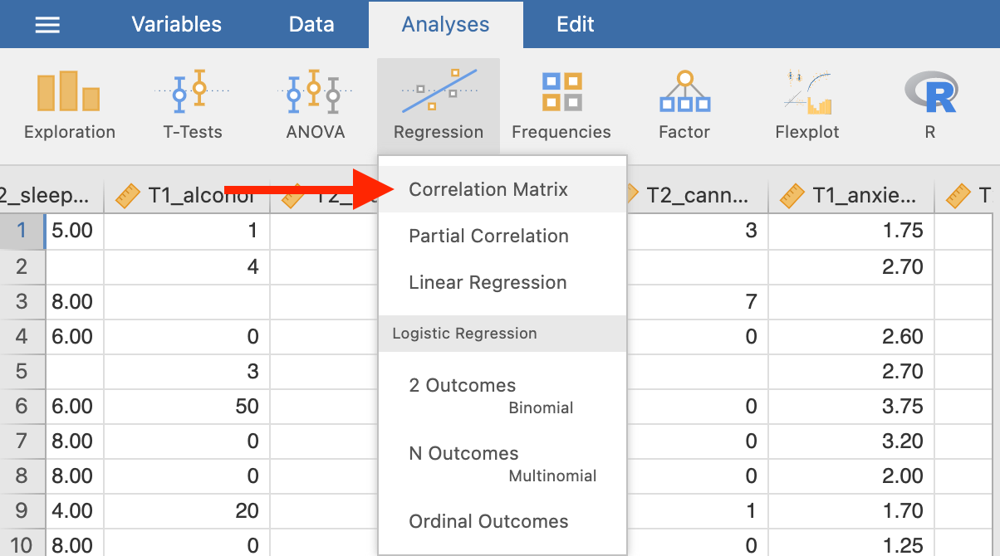
```

<br>

Move your variables of interest, `T1_sleep_quality_composite` and `T1_anxiety_composite`, to the right box:

```{r , echo=FALSE,dev='png'}
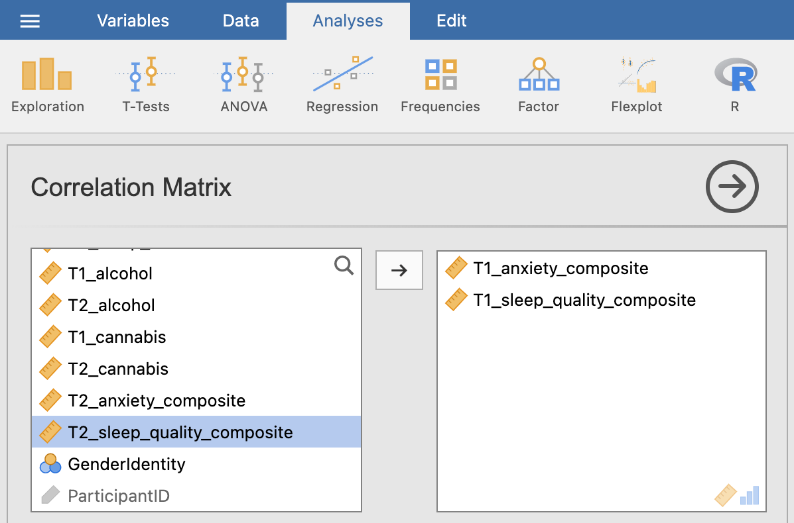
```

<br>

An output table will be generated in the results panel:

```{r , echo=FALSE,dev='png'}
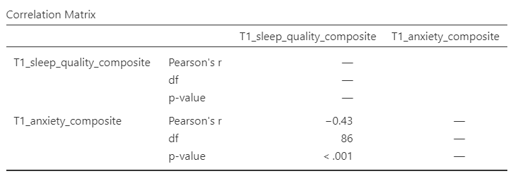
```

<br>

The table indicates that Pearson's *r* between the two variables is -0.43, with a *p*-value of less than .001. This is a negative correlation: as one variable goes up, the other goes down. **Note**: We know the correlation is significant because the *p*-value of less than .001, and we know the correlation is negative because the correlation coefficient, *r*, is a negative value.

### Correlation Matrix

In the event that you have more than two variables in your spreadsheet, and would like to evaluate correlations between several variables taken two at a time, you can enter multiple variables into the correlation window and obtain a correlation matrix. The correlation matrix is a table showing every possible bivariate correlation among a group of variables.

Let's add `T1_sleep_hours` to our correlation matrix. First move the variable to the right box:

```{r , echo=FALSE,dev='png'}
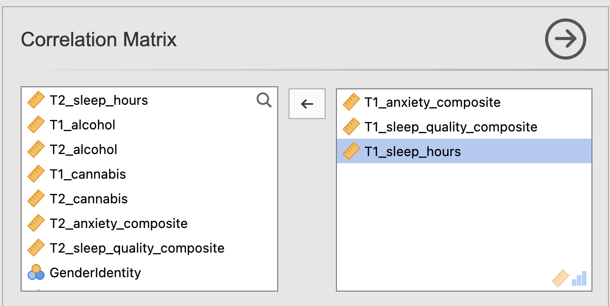
```

<br>

Now the output panel has three sets of results:

```{r , echo=FALSE,dev='png'}
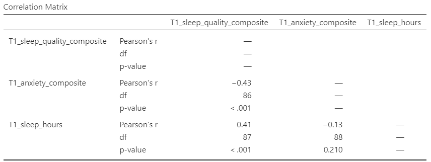
```

<br>

Note that some of the correlations are negative, and some are positive. Some are significant (with *p* < .05) and some are not (with *p* > .05).

### APA format reporting of a correlation

Recall the output for the correlation between `T1_sleep_quality_composite` and `T1_anxiety_composite`:

```{r , echo=FALSE,dev='png'}

```

Return to the Analysis panel (by clicking on the correlation matrix in the Results panel) and click to request the "Confidence intervals" under **Additional Statistics**.

```{r , echo=FALSE,dev='png'}
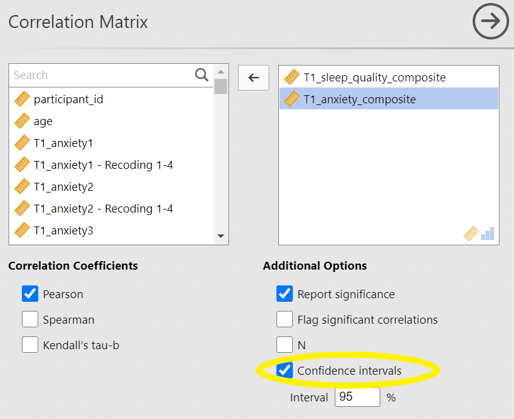
```

Now, JAMOVI give the confidence intervals for the correlation coefficient, *r*.

```{r , echo=FALSE,dev='png'}
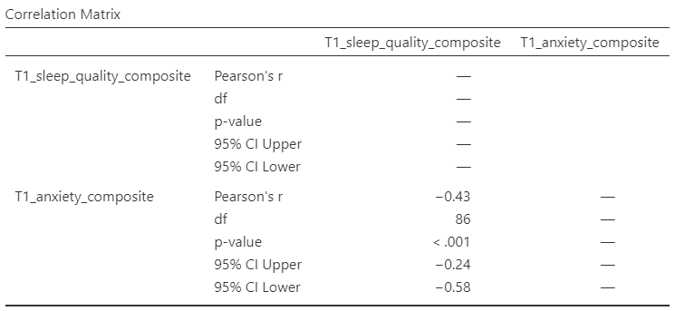
```

Ask yourself: Why are the degrees of freedom 86 if we have data from 101 participants in the file? Be prepared to offer your thoughts in lab.

<br>

You could write the results in APA format as follows:

>There was significant correlation between sleep quality and anxiety at the beginning of the term, Pearson's *r*(86) = -.43, 95% CI [-.58, -.24], *p* < .001.

<br>

Note that we did not use a leading zero for *r* and we rounded to two decimal places.

Now consider the example of the correlation between `T1_sleep_hours` and `T1_anxiety_composite`:

```{r , echo=FALSE,dev='png'}
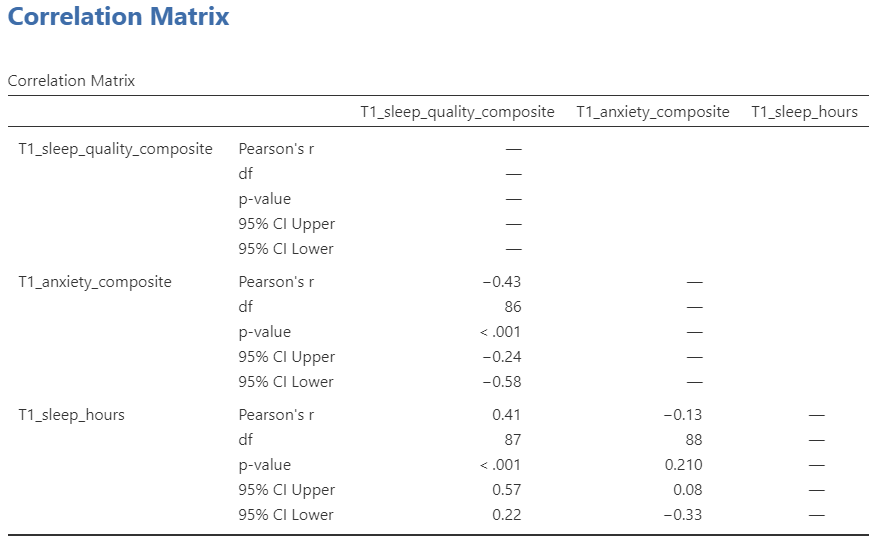
```

<br>

To report this result in APA format, you would write something such as:

>There was not a significant correlation between sleep duration and anxiety at the beginning of the term, Pearson's *r*(88) = -.13, 95% CI [-.33, .08], *p* = .210.

<br>

### Correlation and Scatterplots

To accompany the calculation of the correlation coefficient, the scatterplot is the relevant graph. Depending on your version of JAMOVI, you may have the option to enable a correlation matrix plot from the correlation matrix analysis panel:

```{r , echo=FALSE,dev='png'}
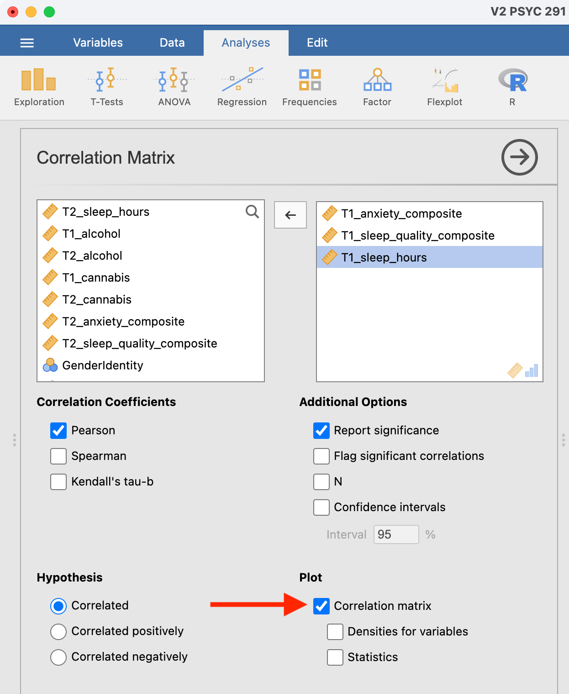
```

<br>


This will produce a scatterplot for each of the correlations you requested.

```{r , echo=FALSE,dev='png'}
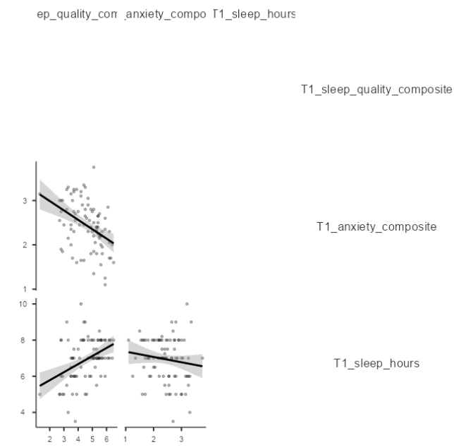
```

<br>


These are handy for having a quick look, but they are kind of small. 

#### Adding the Scatterplot module to jamovi

Before you can request a larger scatterplot in jamovi, you must add Scatterplot as a module. To do so, click on the addition sign which is white with a blue trim that has the word “Modules” underneath. 

```{r , echo=FALSE,dev='png'}

```

<br>


Click <span style="color:blue">jamovi library</span>.

```{r , echo=FALSE,dev='png'}
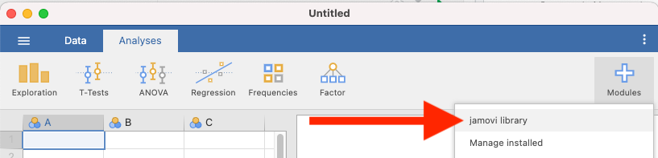
```

<br>


Under the “Available” tab, you should see a module called <span style="color:blue">scatr</span>. Click to <span style="color:blue">INSTALL</span> it. 

```{r , echo=FALSE,dev='png'}
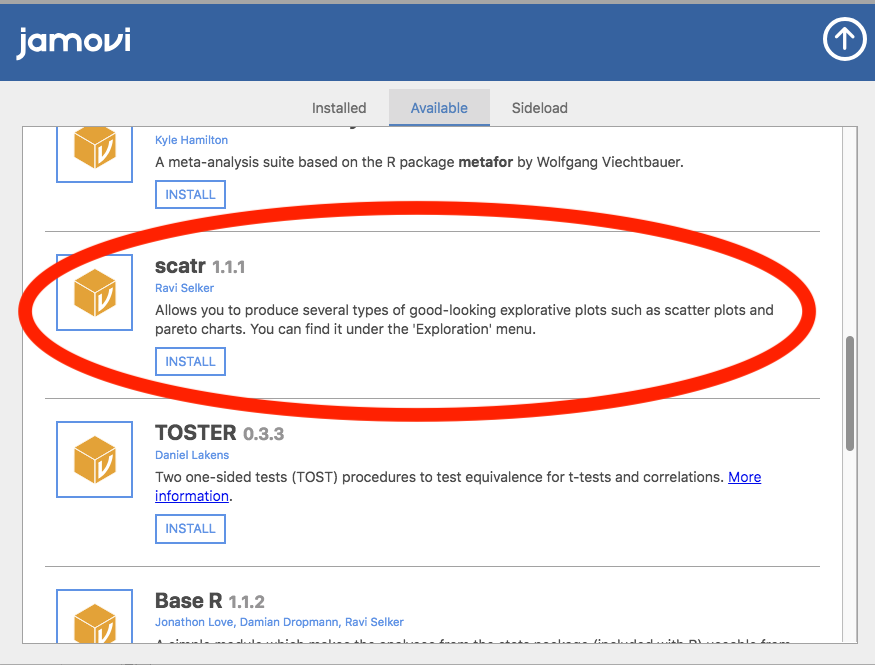
```

<br>


When it is installed, it will appear in your <span style="color:blue">Exploration</span> menu.

```{r , echo=FALSE,dev='png'}
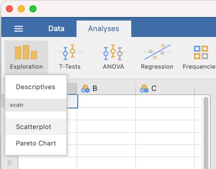
```

<br>


#### Getting a visual of the correlation

Let's continue to create the scatterplot for this data, starting with the `T1_sleep_quality_composite` and `T1_anxiety_composite` variables.

Go to <span style="color:blue">Analyses</span>, then <span style="color:blue">Exploration</span>, and then <span style="color:blue">Scatterplot</span>.

```{r , echo=FALSE,dev='png'}
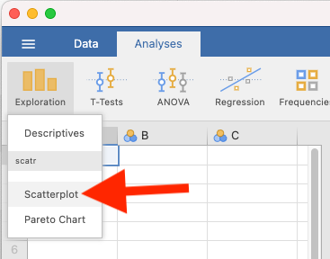
```

<br>


Move `T1_sleep_quality_composite` into the X-Axis box and `T1_anxiety_composite` into the Y-Axis box:

```{r , echo=FALSE,dev='png'}
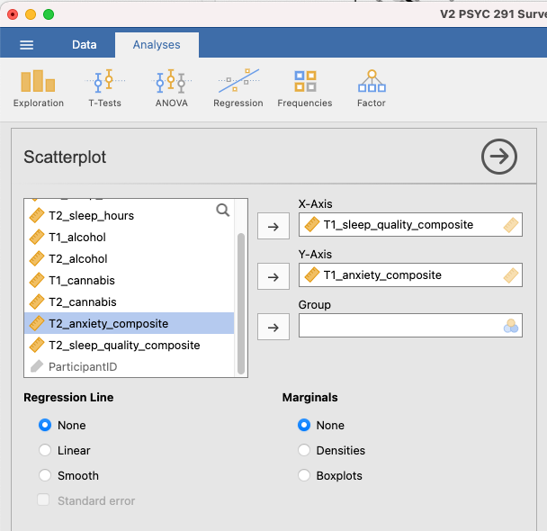
```

<br>


In the Results panel, jamovi will produce a scatterplot of your data, as follows:

```{r , echo=FALSE,dev='png'}
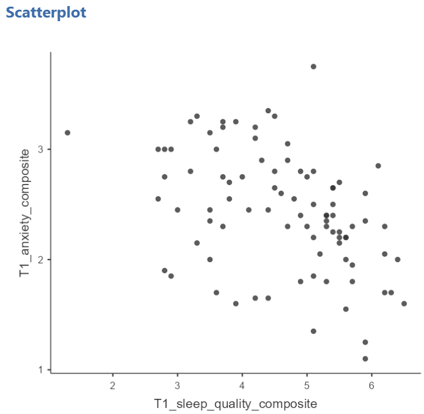
```

<br>


At this point, it would be equally correct to plot `T1_anxiety_composite` on the X-Axis and `T1_sleep_quality_composite` on the Y-Axis. Note that you get a different graph:

```{r , echo=FALSE,dev='png'}
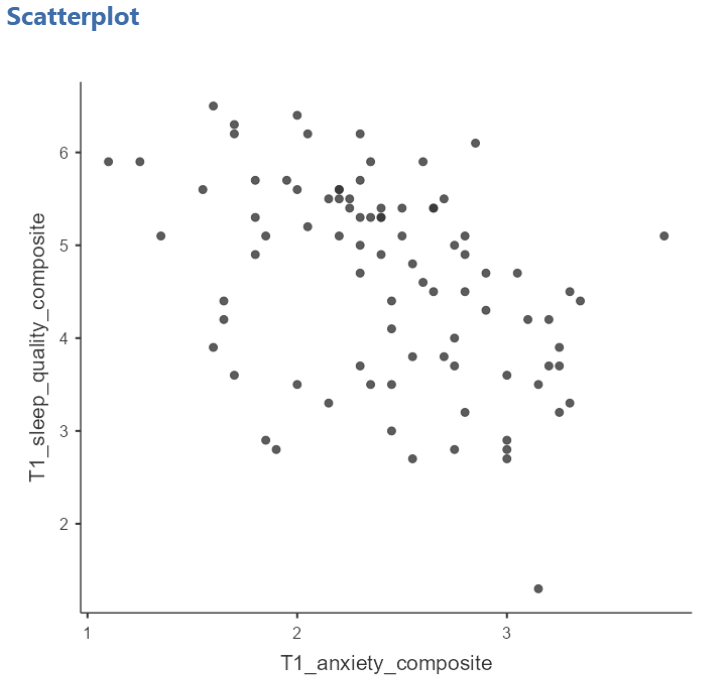
```

<br>


Let's continue with the second scatterplot, with `T1_anxiety_composite` on the X-Axis and `T1_sleep_quality_composite` on the Y-Axis. You can keep this scatterplot as it is, or, you can edit it to include a straight line that best fits the data points. This line is known as the best fit line because it minimizes the distance between the line and the data points. To include the line of best fit, click on <span style="color:blue">Linear</span> under the Regression Line heading. 

```{r , echo=FALSE,dev='png'}
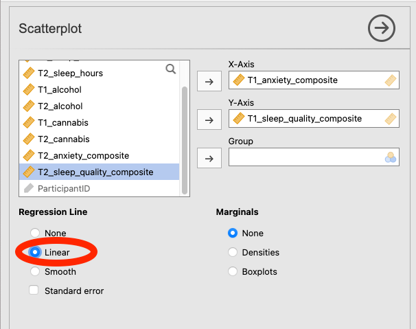
```

<br>


You will find that the graph in your Results panel has now updated and has a line drawn on it.

```{r , echo=FALSE,dev='png'}
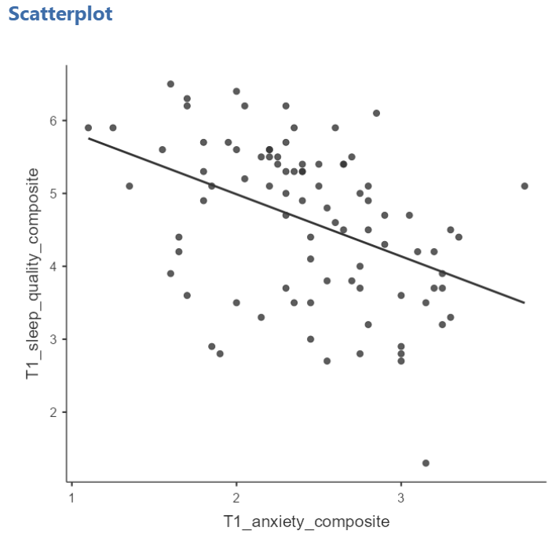
```

<br>


The best fit line goes from the top left to the bottom right; it has a negative slope. This is consistent with the negative Pearson's *r* we found in the correlation matrix. 

### Optional activities

Consider the experiment and dataset from the [independent *t*-test lab](https://www.erinmazerolle.com/statisticsLab/lab-5-t-test-independent-sample.html#jamovi). Let's say you had a different research question: Is the age of the candidate correlated with intellect ratings? You could answer this using correlation. Click <span style="color:blue">Analyses</span>, <span style="color:blue">Regression</span>, and <span style="color:blue">Correlation Matrix</span>.

```{r , echo=FALSE,dev='png'}
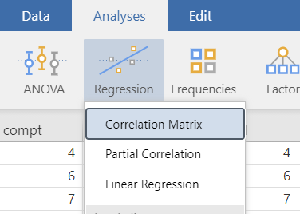
```

<br>

Then, move `age` and `intellect` into the untitled box at the right of the pop-up screeen:

```{r , echo=FALSE,dev='png'}
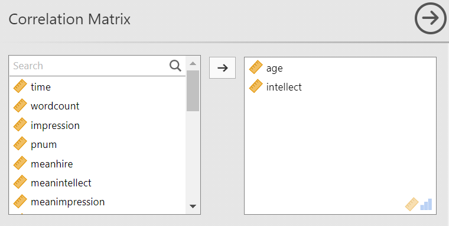
```

<br>

In the Results panel, the output table should look as follows:

```{r , echo=FALSE,dev='png'}
knitr::include_graphics('img/Image3_corroptional.png')
```

<br>

Write a sentence describing the results of this test. Compare your answer to #1 in the "Example answers to practice problems" below. 

Now, assume you are in the mood to do some exploratory data analysis. We can run multiple bivariate correlations at the same time in the same dialog. Click <span style="color:blue">Analyses</span>, then <span style="color:blue">Regression</span>, and then <span style="color:blue">Correlation Matrix</span> again. To the untitled variables box at the right, add `age`, `time`, `wordcount`, `intellect`,  and `impression`:

```{r , echo=FALSE,dev='png'}
knitr::include_graphics('img/Image4_corroptional.png')
```

<br>

In the Results panel, the output table contains the *r*- and *p*-values for each possible pair of the five variables:

```{r , echo=FALSE,dev='png'}
knitr::include_graphics('img/Image5_corroptional.png')
```

<br>

By default, jamovi does not flag significant correlations. Be sure to review the *p*-values careful and compare them to the alpha level you set.  How many significant correlations do you identify in the correlation matrix?

If you would like jamovi to flag significant correlations, you can click <span style="color:blue">Flag significant correlations</span> under “Additional options”. 

```{r , echo=FALSE,dev='png'}
knitr::include_graphics('img/Image6_corroptional.png')
```

<br>

Under the correlation matrix that appears in the Results panel, you will notice a note. If the *p*-value is under .05, jamovi will flag the correlation coefficient as * (significant at the .05 level); if the *p*-value is less than .01, jamovi will flag it as ** (significant at the .01 level); and if the *p*-value is less than .001, jamovi will flag it as *** (significant at the .001 level).

```{r , echo=FALSE,dev='png'}
knitr::include_graphics('img/Image7_corroptional.png')
```

<br>

Let's pick a few pairs of variables and make scatterplots. We have a good range of different correlations in this table, so we can use these data to practice identifying correlations of different strengths. Click <span style="color:blue">Analyses</span>, <span style="color:blue">Exploration</span>, and then <span style="color:blue">Scatterplot...</span>. Move `intellect` into the Y-Axis field and `age` into the X-Axis field. 

```{r , echo=FALSE,dev='png'}
knitr::include_graphics('img/Image8_corroptional.png')
```

<br>

These commands should produce a scatterplot in the Results panel. 

```{r , echo=FALSE,dev='png'}
knitr::include_graphics('img/Image9_corroptional.png')
```

<br>

Repeat for all correlations with `intellect`, using `intellect` on the *y*-axis each time to make it easier to compare to the example answers below (#2). Compare the pattern of dots in each scatterplot to the *r*-values reported in the tables. Can you see the differences between the plots? Can you tell from the scatterplots whether we have violated any of the assumptions of Pearson's *r* (i.e., linearity, no outliers)?


#### Applying a Filter

Next, consider the [EngageNS Quality of Life dataset](https://moodle.stfx.ca/mod/url/view.php?id=830017). Consider the question: does the number of hours per week a person spends working at their main job correlate with their computer game playing? Use the data [data dictionary](https://moodle.stfx.ca/mod/url/view.php?id=830017) to identify the relevant variables and run the appropriate correlation.

Next, what if we asked the question: For residents of the Antigonish and Guysborough regions only, does the number of hours per week a person spends working at their main job correlate with their computer game playing? Notice that this question is asking us to find the correlation between the same two variables we used in the previous example, but only in the case where the `REGION` is equal to 4 (see the [data dictionary](https://moodle.stfx.ca/mod/url/view.php?id=830017) for an explanation). To achieve this, we're going to utilize a function called filtering. Filtering the data set makes only those cases that meet our criteria available for use in the analysis to be run. For example, if we filter our data by region and calculate a correlation coefficient, jamovi will find Pearson *r* for only Antigonish and Guysborough, and not for other regions. 

In order to filter the data, we go to the top menu and choose <span style="color:blue">Data</span> and then <span style="color:blue">Filter</span>. In the next window, you must set up the filter; indicate which cases will be used. Under “Filter 1,” click on the formula editor, the <span style="color:blue">*f~x~*</span> button. Double click on the variable name (`REGION`), and it will be incorporated into the filter. Then, use two equal signs, and enter the code for the region of interest (4).

Notice that this will cause a new column in the spreadsheet wherein a green checkmark indicates the case/participant will be included in the analysis and a red “x” indicates the case/participant will be excluded from the analysis.

From here, any analysis you choose to do will be done for only the cases match the filter. Let's calculate the correlation coefficient, as usual. Click <span style="color:blue">Analyses</span>, then <span style="color:blue">Regression</span>, and then <span style="color:blue">Correlation Matrix</span>.

In the next window, select the variables to be used in the correlation (`WORKHR` and `HM_CGAME`). 

Notice that in the output now shows a correlation matrix with different results than you saw when you ran the correlation with the entire data set.

Again, you may want to inspect the scatterplot to get a visual representation of this correlation coefficient for the data collected from participants in the Antigonish-Guysborough region. Challenge: Give the creation of this scatterplot a try on your own. 

#### Removing the Filter

It is **very** important to remember that once you have applied a filter, every analysis will be done on the split variable. If you want to go back to performing analyses and calculating statistics for the data as a whole, you must delete the filter. To do this, you can highlight the column showing the filter in the spreadsheet, go to <span style="color:blue">Data</span>, and then <span style="color:blue">Delete</span>. You will be prompted with a question to verify that you want to delete the filter. Click <span style="color:blue">Yes</span>.

### Example answers to optional activities

1. Intellect ratings were not significantly correlated with the age of the candidates, *r* = .05, *p* > .05.

2. You should have created four scatterplots. They are included below as well as some notes about each. 

```{r , echo=FALSE,dev='png'}
knitr::include_graphics('img/7.4.69.png')
```

For the correlation between `age` and `intellect`, we found *r* was very close to 0, at .05. This is reflected in the pattern of dots, which are spread fairly uniformly across the entire plot. There are no concerns with violating the assumption of linearity on this plot. There are also no outliers.

```{r , echo=FALSE,dev='png'}
knitr::include_graphics('img/7.4.70.png')
```

For the correlation between `time` and `intellect`, we found *r* was also close to 0 but negative, at -.07. It is harder to link the *r* with the plot in this case because of the two dots far to the right in the plot. These might be outliers and could be investigated further, but how to do so is not covered in PSYC 292. 

```{r , echo=FALSE,dev='png'}
knitr::include_graphics('img/7.4.71.png')
```

The correlation between `wordcount` and `intellect` was *r* = -.24. This is a fairly weak correlation. The dot to the far right in the first plot might be an outlier and could be investigated further, but how to do so is not covered in PSYC 292. If you focus on the cluster of dots on the left, you can get the impression that there are more dots in the top left and bottom right than the other two quadrants. This is more obvious if we zoom in:

```{r , echo=FALSE,dev='png'}
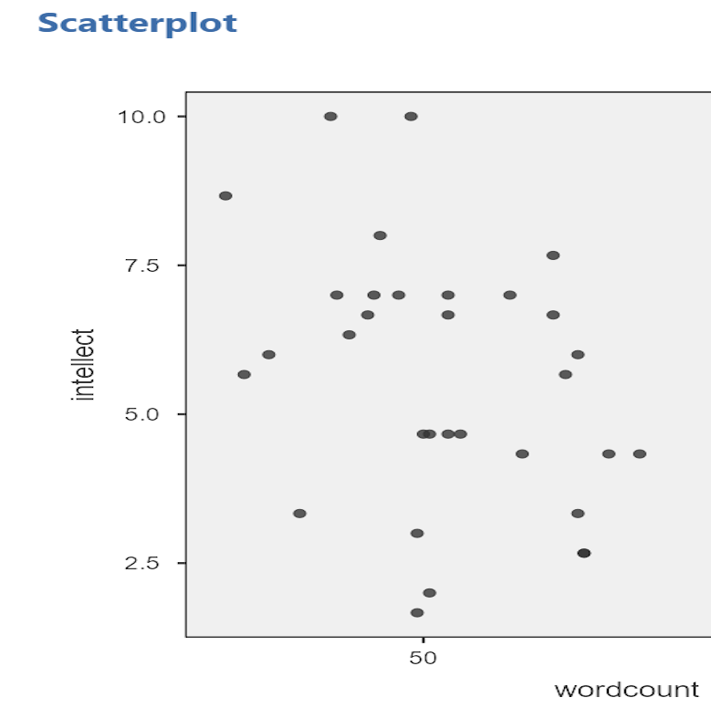
```

<br>

Next, let's look at the scatterplot for `impression` and `intellect`.

```{r , echo=FALSE,dev='png'}
knitr::include_graphics('img/7.4.72.png')
```

For `impression` and `intellect`, a correlation of *r* = .83 was observed. In the scatterplot, you can see the dots cluster around an imaginary line that goes from the bottom left corner to the top left corner. There are no concerns that the assumption of linearity has been violated. There is also no evidence of outliers.


### Homework

See [Moodle](https://moodle.stfx.ca/course/view.php?id=26030#section-13).


### Practice Problems

Use the [EngageNS Quality of Life dataset](https://moodle.stfx.ca/mod/url/view.php?id=830017) to answer questions 1-6.

1. Construct a scatterplot using R_FRIENDS on the x-axis and SOC_FRND on the y-axis to depict the results you found for the last homework question.

2. Can you run a Pearson’s correlation analysis on the following pairs of variables? Why or why not?
a) SEX and SLEEP?
b) COMP_TIME and SLEEP?
c) MAINACT and EDUCAT?

3. Run the correlation analysis for any set(s) of variables you determined to be appropriate for using Pearson’s correlation. Report the correlation coefficient. Is it considered statistically significant? Write your results following the APA rules discussed below.

**Some formatting guidelines for writing results sections:**

a. Note the name of the test you performed (in this case, Pearson's correlation) and whether the result is significant or non-significant (*Note: We do not use the word insignificant.*). 

b. We usually round to two decimal places, except for *p*-values. If your *p*-value was .0001, it would be okay to write *p* = .0001 or *p* < .001.

c. Do not include a leading 0 before the decimal for the *p*-value (*p* = .001 not *p* = 0.001, or *p* < .05 not *p* < 0.05) or for correlation coefficients, *r* (for example, *r* = .56).

<div class="marginnote">
Yes, I'm serious. No, I don't know why. Yes, it does seem a bit silly. Yes, you lose points if you don't adhere to APA format when requested to do so.
</div>

d. Pay attention to spaces, parentheses, etc. APA is very picky about that. For example, it's *t*(33.4) = -3.48 **not** *t*(33.4)=-3.48. There are spaces on either side of =, >, or < symbols.

e. Italicize symbols such as *M*, *SD*, *p*, and *r*.


 
4. Construct the scatterplot for any set(s) of variables you determined to be appropriate for using Pearson’s correlation. What do you notice about the scatterplot? Does the slope increase or decrease?
Do the dots closely follow the line of best fit?

5. Consider participants’ reported number of close friends and their reported time spent socializing with friends. Are these scores correlated? If so, report *r* and whether the correlation is significant or non-significant.

6. Apply a filter so that you are looking at only the data for participants’ whose main activity is going to school (**Hint**: Use the data dictionary to figure out how participants’ main activities were coded). Now, run the same correlation you looked at in #1. Are number of close friends and reported time spent socializing with friends correlated for students? Is the correlation significant? Compare these results to the results in #1. Is the correlation between number of close friends and reported time spent socializing with friends stronger or weaker for students than it is for Nova Scotians?

<div class="marginnote">
The following three questions are copied  verbatim from [Answering questions with data: The lab manual for R, Excel, SPSS and JAMOVI, Lab 3, Section 3.2.4, SPSS](https://www.crumplab.com/statisticsLab/lab-3-correlation.html#writing-assignment-2), according to its [CC license](https://creativecommons.org/licenses/by-sa/4.0/deed.ast). Thank you to Crump, Krishnan, Volz, & Chavarga (2018). 
</div>

7. Imagine a researcher found a positive correlation between two variables, and reported that the *r* value was +.3. One possibility is that there is a true correlation between these two variables. Discuss one alternative possibility that would also explain the observation of +.3 value between the variables.

8. Explain the difference between a correlation of *r* = .3 and *r* = .7. What does a larger value of *r* represent?

9. Explain the difference between a correlation of *r* = .5, and *r* = -.5.


## JAMOVI – Correlation – FOR PSYC 394 STUDENTS

<div class="marginnote">
Some of this section is copied almost verbatim, with some editorial changes, from [Answering questions with data: The lab manual for R, Excel, SPSS and JAMOVI, Lab 3, Section 3.4, SPSS](https://www.crumplab.com/statisticsLab/lab-3-correlation.html#spss-3), according to its [CC license](https://creativecommons.org/licenses/by-sa/4.0/deed.ast). Thank you to Crump, Krishnan, Volz, & Chavarga (2018). 
</div>


In this lab, we will use JAMOVI to calculate the correlation coefficient. We will focus on the most commonly used Pearson's coefficient, *r*. We will learn how to:

1. Calculate the Pearson's *r* correlation coefficient for bivariate data
2. Produce a correlation matrix, reporting Pearson's *r* for more than two variables at a time
3. Produce a scatterplot

### Pre-lab reading and tasks

#### Assumptions of correlation

This lab will focus on Pearson's correlation. For the calculation to make sense, the data must meet certain criteria. These are known as the assumptions of Pearson's correlation. 

Pearson's correlation assumes:

1. There is a linear relation between the two variables. To assess this, the scale of measurement of both variables must be at least interval. You cannot assess whether the relation is linear without equal spacing between intervals. **Do not run Pearson's correlation on nominal or ordinal variables**.

2. There are no outliers. We are not going to look deeply into outliers during this lab. If you have a point in your dataset that is quite far away from the other points, you might have an outlier.

<div class="marginnote">
This third assumption is paraphrased from Field, A (2018) *Discovering Statistics Using IMB SPSS Statistics*, 5th edition. Sage: California. This is a copyrighted textbook.
</div>

3. Additionally, the data must adhere to the normality assumption. Recall the central limit theorem. If your sample size is large, you don't need to worry about normality. If your sample size is small, you should check that your variables are normally distributed.

**You do not need to check the assumptions before lab.**

#### Download and open data 

For the purpose of the lab demonstration, we will work with a data set provided by Dolan, Oort, Stoel, and Wicherts (2009) in their investigation of measurement invariance. These data were collected from 500 psychology students at University of Amsterdam on the Big Five personality dimensions [Neuroticism (N), Extraversion (E), Openness to experience (O), Agreeableness (A), and Conscientiousness (C)] using the NEO-PI-R test . You can download the data [here]( https://moodle.stfx.ca/mod/resource/view.php?id=930539).

Have the file open in JAMOVI before the beginning of your lab session.

#### Install scatr module if required
As you read through this section on using JAMOVI to conduct correlations, you will see the need for the scatr module. The scatr module may be installed on your version of JAMOVI by default. If so, you should see it loaded under the <span style="color:blue">Analyses</span> ->and  <span style="color:blue">Exploration</span> -> menus:

```{r , echo=FALSE,dev='png'}
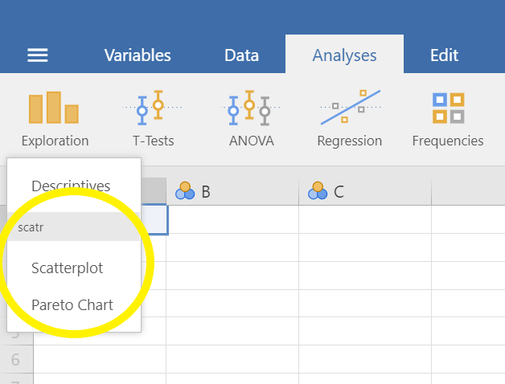
```

If you do not see this module on your version of JAMOVI, before lab, please download and install it using the add-on Modules icon (the plus sign at the top right) and JAMOVI library; due to the short duration of our labs, we will not have time during lab to wait for downloading and installation.

### Correlation Coefficient for Bivariate Data

Bivariate is a fancy way of saying two variables. Let's say you were interested in the relationship between two variables: `Neuroticism` and `Conscientiousness`. To calculate a correlation in JAMOVI, go to <span style="color:blue">Analyses</span> -> <span style="color:blue">Regression</span> -> <span style="color:blue">Correlation Matrix</span>:

```{r , echo=FALSE,dev='png'}
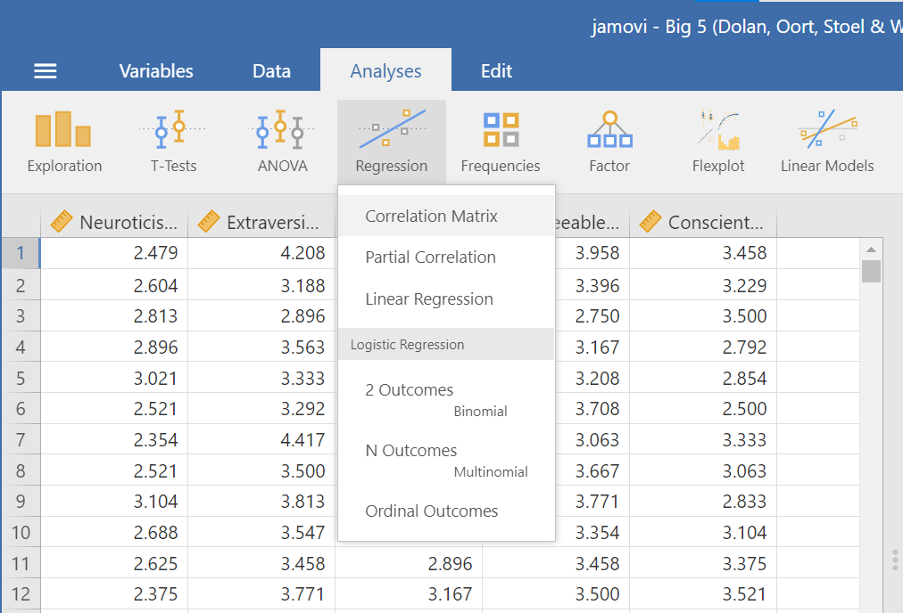
```

<br>

Move your variables of interest, ` Neuroticism ` and `Conscientiousness`, to the window on the right of the commands pane:

```{r , echo=FALSE,dev='png'}
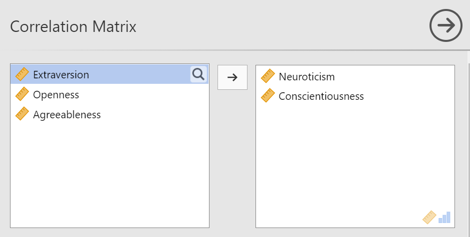
```

<br>

An output table will be generated in the results panel:

```{r , echo=FALSE,dev='png'}
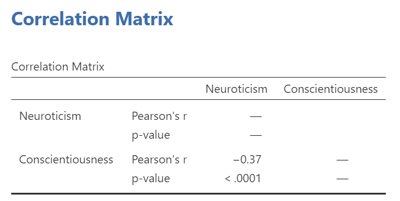
```

<br>

The table indicates that Pearson's *r* between the two variables is -0.37, with a *p*-value of less than .0001. This is a negative correlation: as the scores on one variable increase, the scores on the other variable decrease.

Notice the number of other options you might select in the commands pane. You could select <span style="color:blue"> Spearman</span> or <span style="color:blue">Kendall’s tau-b</span> correlations. These tests can be useful if the data are measured on an ordinal scale or if there are outliers. Also, notice the options to request that JAMOVI <span style="color:blue">flag significant correlations</span>  and to request the 95% confidence intervals. By default, the hypothesis is set as <span style="color:blue">Correlated</span> (a two-tailed hypothesis). You might change the default setting by selecting <span style="color:blue">Correlated positively</span> or <span style="color:blue">Correlated negatively</span> (both one-tailed hypotheses). 


```{r , echo=FALSE,dev='png'}
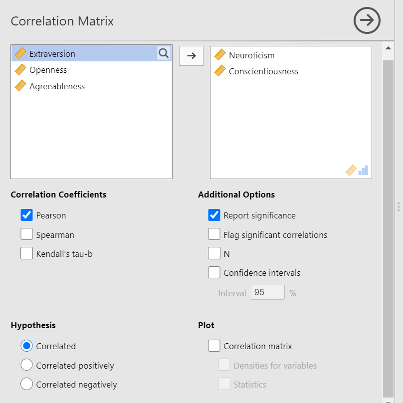
```

<br>


### Correlation Matrix

If you have more than two variables in your spreadsheet and would like to evaluate correlations between several variables taken two at a time, you can enter multiple variables into the correlation window and obtain a correlation matrix. The correlation matrix is a table showing every possible bivariate correlation amongst a group of variables.

Let's add all five variables to our correlation matrix. First, move the variable to the right box:

```{r , echo=FALSE,dev='png'}
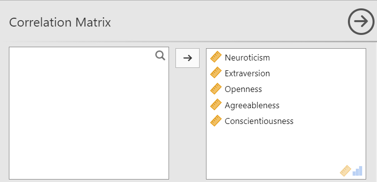
```

<br>

Now the output panel has 10 sets of results:

```{r , echo=FALSE,dev='png'}
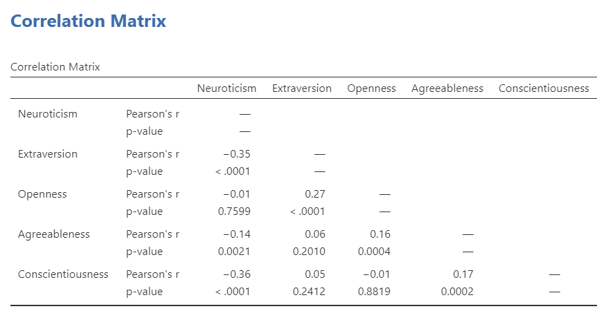
```

<br>

Note that some of the correlations are negative, and some are positive. Some are significant (with *p* < .05), and some are not.

If we request that JAMOVI flag the significant correlations, asterisks (\*) will be used to show the significance levels against three commonly used alpha levels (One asterisk denotes *p* < .05, two asterisks denote *p* < .01, and three asterisks denote *p* < .001.)

```{r , echo=FALSE,dev='png'}
knitr::include_graphics('img/Correlation2_Output_SigFlag.png')
```

<br>


### APA format reporting of a correlation

Recall the output for the correlation between `Neuroticism` and `Conscientiousness`:

```{r , echo=FALSE,dev='png'}

```

<br>

You could write the results in APA format as follows:

>A significant correlation was found between Neuroticism and Conscientiousness, Pearson's *r* = -.37, *p* < .0001.

<br>

Note that we did not use a leading zero for *r* and we rounded to two decimal places.

Now consider the example of the correlation between `Neuroticism` and `Openness`:

```{r , echo=FALSE,dev='png'}

```

<br>

To report this result in APA format, you would write something such as:

>There was not a significant correlation between Neuroticism and Openness, Pearson's *r* = -.01, *p* > .05.

**Some formatting guidelines for writing results sections:**

a. Indicate the name of the test you performed (in this case, Pearson's correlation) and whether the result is significant or non-significant (*Note: We do not use the word insignificant.*). 

b. We usually round to two decimal places, except for *p*-values. If your *p*-value was .0001, it would be okay to write *p* = .0001 or *p* < .001.

c. Do not include a leading 0 before the decimal for the *p*-value (*p* = .001 not *p* = 0.001, or *p* < .05 not *p* < 0.05) or for correlation coefficients, *r* (for example, *r* = .56).

<div class="marginnote">
Yes, I'm serious. No, I don't know why. Yes, it does seem a bit silly. Yes, you lose points if you don't adhere to APA format when requested to do so.
</div>

d. Pay attention to spaces, parentheses, etc. APA is very picky about that. For example, it's *t*(33.4) = -3.48 **not** *t*(33.4)=-3.48. There are spaces on either side of =, >, or < symbols.

e. Italicize symbols such as *M*, *SD*, *p*, and *r*.


### Correlation and Scatterplots

To accompany the calculation of the correlation coefficient, the scatterplot is the relevant graph. Depending on your version of JAMOVI, you may have the option to enable a correlation matrix plot from the correlation matrix commands panel. Let’s return to the first correlational analysis with only two variables, `Neuroticism` and `Conscientiousness`. Highlight those results in your Results pane, and click to add <span style="color:blue">Correlation matrix </span>  under the “Plot.”

```{r , echo=FALSE,dev='png'}
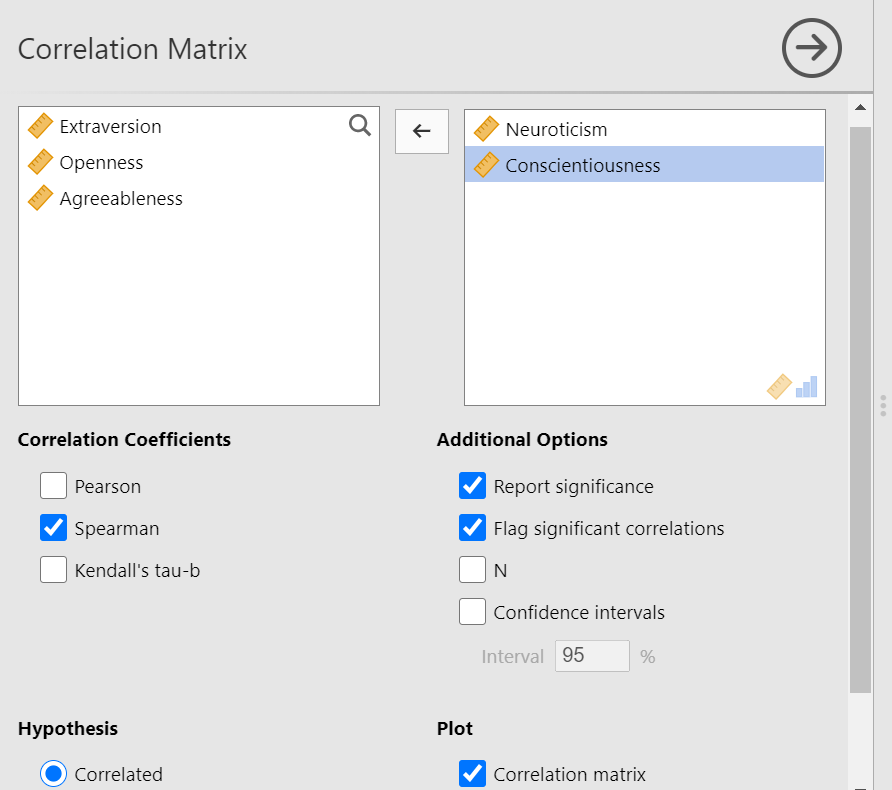
```

<br>


This will produce a scatterplot for the correlations.
```{r , echo=FALSE,dev='png'}
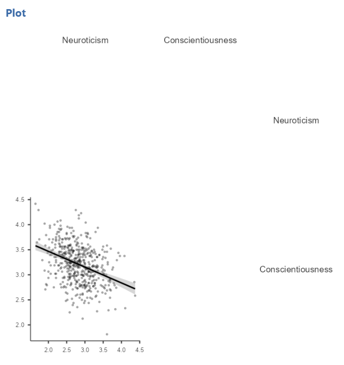
```

<br>


These plots are handy for having a quick look, but are relatively small. Furthermore, when there are a number of correlations requested, the labels or axes values may start to overlap resulting in a graph that is not easy to read. Consider this result generated when the plot is requested in the correlational analysis involving all five variables:

This will produce a scatterplot for the correlations.
```{r , echo=FALSE,dev='png'}
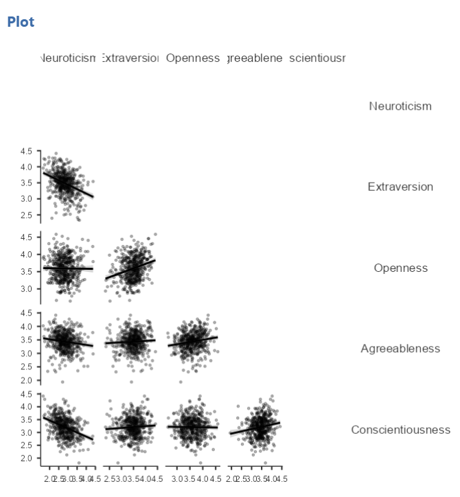
```

<br>


#### Getting a visual of the correlation

Let's continue to create the scatterplot for this data, starting with the `Neuroticism` and `Conscientiousness` variables.

Go to <span style="color:blue">Analyses</span>, then <span style="color:blue">Exploration</span>, and then <span style="color:blue">Scatterplot</span>.

```{r , echo=FALSE,dev='png'}
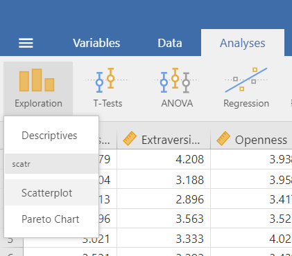
```

<br>


Move `Neuroticism` into the X-Axis box and `Conscientiousness` into the Y-Axis box.
 
```{r , echo=FALSE,dev='png'}
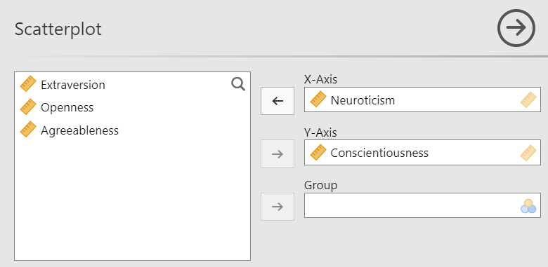
```

<br>


In the Results panel, JAMOVI will produce a scatterplot of your data, as follows:

```{r , echo=FALSE,dev='png'}
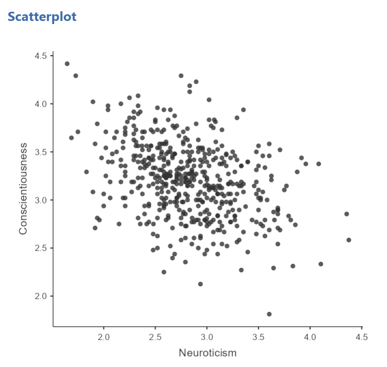
```

<br>


At this point, it would be equally correct to plot `Conscientiousness` on the *x*-axis and `Neuroticism` on the *y*-axis. Note that you get a different graph:

```{r , echo=FALSE,dev='png'}
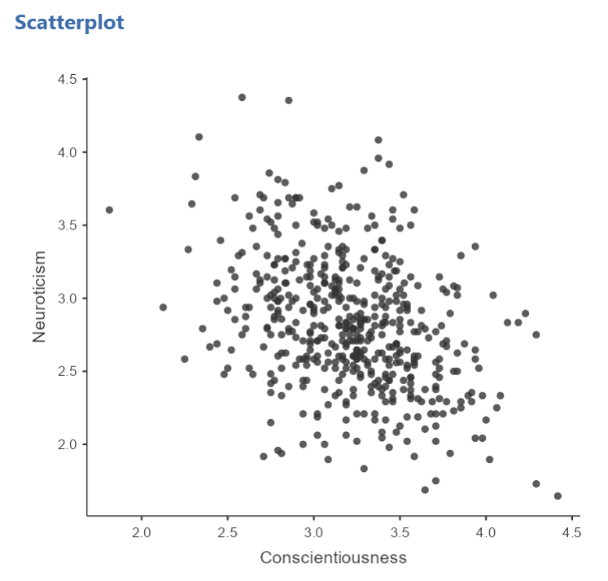
```

<br>


Let's continue with the second scatterplot, with `Conscientiousness ` on the *x*-axis and `Neuroticism` on the *y*-axis. You might keep this graph as it is, or you may choose to include a line through it. To add the line, select <span style="color:blue">Linear</span> under Regression Line. This line is known as the best fit line (or the line of best fit) because it minimizes the distance between the line and the data points.

```{r , echo=FALSE,dev='png'}
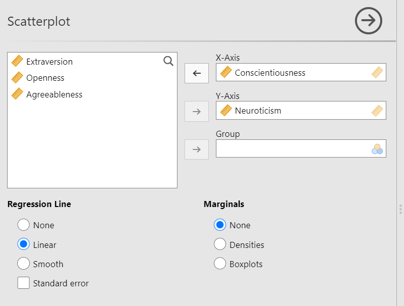
```

<br>

You will find that the graph in your Results panel has now updated and has a line drawn on it.

```{r , echo=FALSE,dev='png'}

```

<br>

This best fit line goes from the upper top left to the bottom right; it has a negative slope. This is consistent with the negative Pearson's *r* we found in the correlation matrix. 

### Optional activities

Consider a [dataset](https://moodle.stfx.ca/mod/resource/view.php?id=930603) from Schroeder and Epley (2005). Rather than asking about a difference in how candidates were perceived by recruiters as the authors did, imagine you had a different research question: Is the age of the candidate correlated with intellect ratings? You could answer this using correlation. Click <span style="color:blue">Analyses</span>, <span style="color:blue">Regression</span>, and <span style="color:blue">Correlation Matrix</span>.

```{r , echo=FALSE,dev='png'}
knitr::include_graphics('img/7.4.61.png')
```

<br>

Then, move `age` and `intellect` into the untitled box at the right of the pop-up screen:

```{r , echo=FALSE,dev='png'}
knitr::include_graphics('img/7.4.62.png')
```

<br>

In the Results panel, the output table should look as follows:

```{r , echo=FALSE,dev='png'}
knitr::include_graphics('img/7.4.63.png')
```

<br>

Write a sentence describing the results of this test. Compare your answer to #1 in the "Example answers to practice problems" below. 

Now, assume you are in the mood to do some exploratory data analysis. We can run multiple bivariate correlations at the same time in the same dialog. Click <span style="color:blue">Analyses</span>, then <span style="color:blue">Regression</span>, and then <span style="color:blue">Correlation Matrix</span> again. To the untitled variables box at the right, add `age`, `time`, `wordcount`, `intellect`,  and `impression`:

```{r , echo=FALSE,dev='png'}
knitr::include_graphics('img/7.4.64.png')
```

<br>

In the Results panel, the output table contains the *r*- and *p*-values for each possible pair of the five variables:

```{r , echo=FALSE,dev='png'}
knitr::include_graphics('img/7.4.65.png')
```

<br>

By default, JAMOVI does not flag significant correlations. Be sure to review the *p*-values careful and compare them to the alpha level you set.  How many significant correlations do you identify in the correlation matrix?

If you would like JAMOVI to flag significant correlations, you can click <span style="color:blue">Flag significant correlations</span> under “Additional options”. 

```{r , echo=FALSE,dev='png'}
knitr::include_graphics('img/7.4.66.png')
```

<br>

As aforementioned, under the correlation matrix that appears in the Results panel, you will notice a note. If the *p*-value is under .05, JAMOVI will flag the correlation coefficient as * (significant at the .05 level); if the *p*-value is less than .01, JAMOVI will flag it as ** (significant at the .01 level); and if the *p*-value is less than .001, JAMOVI will flag it as *** (significant at the .001 level).

```{r , echo=FALSE,dev='png'}
knitr::include_graphics('img/7.4.67.png')
```

<br>

Let's pick a few pairs of variables and make scatterplots. We have a good range of different correlations in this table, so we can use these data to practice identifying correlations of different strengths. Click <span style="color:blue">Analyses</span>, <span style="color:blue">Exploration</span>, and then <span style="color:blue">Scatterplot...</span>. Move `intellect` into the Y-Axis field and `age` into the X-Axis field. 

```{r , echo=FALSE,dev='png'}
knitr::include_graphics('img/7.4.68.png')
```

<br>

These commands should produce a scatterplot in the Results panel. 

```{r , echo=FALSE,dev='png'}
knitr::include_graphics('img/7.4.69.png')
```

<br>

Repeat for all correlations with `intellect`, using `intellect` on the *y*-axis each time to make it easier to compare to the example answers below (#2). Compare the pattern of dots in each scatterplot to the *r*-values reported in the tables. Can you see the differences between the plots? Can you tell from the scatterplots whether we have violated any of the assumptions of Pearson's *r* (i.e., linearity, no outliers)?

### Example answers to optional activities

1. Intellect ratings were not significantly correlated with the age of the candidates, *r* = .05, *p* > .05.

2. You should have created four scatterplots. They are included below as well as some notes about each. 

```{r , echo=FALSE,dev='png'}
knitr::include_graphics('img/7.4.69.png')
```
For the correlation between `age` and `intellect`, we found *r* was very close to 0, at .05. This is reflected in the pattern of dots, which are spread fairly uniformly across the entire plot. There are no concerns with violating the assumption of linearity on this plot. There are also no outliers.

```{r , echo=FALSE,dev='png'}
knitr::include_graphics('img/7.4.70.png')
```
For the correlation between `time` and `intellect`, we found *r* was also close to 0 but negative, at -.07. It is harder to link the *r* with the plot in this case because of the two dots far to the right in the plot. These might be outliers and could be investigated further. (Challenge yourself: Can you identify those cases that create the two dots off to the left? Are they outliers? How do you know? How would you deal with them if they are outliers? Why?) 

```{r , echo=FALSE,dev='png'}
knitr::include_graphics('img/7.4.71.png')
```
The correlation between `wordcount` and `intellect` was *r* = -.24. This is a fairly weak correlation. The dot to the far right in the first plot might be an outlier and could be investigated further. (Challenge yourself: Can you identify those cases that create the two dots off to the left? Are they outliers? How do you know? How would you deal with them if they are outliers? Why?) If you focus on the cluster of dots on the left, you can get the impression that there are more dots in the top left and bottom right than the other two quadrants. This is more obvious if we zoom in:

```{r , echo=FALSE,dev='png'}

```

Next, let's look at the scatterplot for `impression` and `intellect`.

```{r , echo=FALSE,dev='png'}
knitr::include_graphics('img/7.4.72.png')
```
For `impression` and `intellect`, a correlation of *r* = .83 was observed. In the scatterplot, you can see the dots cluster around an imaginary line that goes from the bottom left corner to the top left corner. There are no concerns that the assumption of linearity has been violated. There is also no evidence of outliers.


### Homework


See [Moodle]( https://moodle.stfx.ca/course/view.php?id=28797).


### Practice Problems


1. Check the data set used in the lab demonstration to see if it meets the assumptions of Pearson’s correlation. If not, indicate how you might “clean” the data. Justify your answer.

<div class="marginnote">
The following three questions are copied  verbatim from [Answering questions with data: The lab manual for R, Excel, SPSS and JAMOVI, Lab 3, Section 3.2.4, SPSS](https://www.crumplab.com/statisticsLab/lab-3-correlation.html#writing-assignment-2), according to its [CC license](https://creativecommons.org/licenses/by-sa/4.0/deed.ast). Thank you to Crump, Krishnan, Volz, & Chavarga (2018). 
</div>

2. Imagine a researcher found a positive correlation between two variables, and reported that the *r* value was +.3. One possibility is that there is a true correlation between these two variables. Discuss one alternative possibility that would also explain the observation of +.3 value between the variables.

3. Explain the difference between a correlation of *r* = .3 and *r* = .7. What does a larger value of *r* represent?

4. Explain the difference between a correlation of *r* = .5, and *r* = -.5.


# Lab 7: Linear Regression

```{=html}
<script>
$("#coverpic").hide();
</script>
```

## What is the difference beteween correlation and regression?

```{r , echo=FALSE,dev='png'} 
knitr::include_graphics('img/6.1.png') 
``` 

## Lab Skills Learned

In this lab, we will use JAMOVI to conduct a simple linear regression. We will learn how to: 

1. Request the statistical information for building a model to predict an outcome variable 
2. Read the results to interpret if the model is more helpful than knowing the mean 
3. Build the model with those statistics if appropriate 


## Background

### Assumptions of linear regression

As linear regression is a parametric analysis, there are assumptions which must be met for the results of the analysis to make sense. The assumptions of linear regression include: 

**1. Linearity:** Outcome variable should be linearly related to the predictor variable. (*Question*: Based on what you have learned thus far, how do you believe we can check this assumption?) 

**2. Independent Errors:** For any 2 observations, the residual terms should be uncorrelated. 

**3. Homoscedasticity (AKA homogeneity of variance):** The variability in the outcome variable around the regression line should be the same for all values of the predictor variable.  

**4. Normally Distributed Errors:** The residuals in the model are normally distributed with a mean of 0. 

### Context of data

For this week’s lab demonstration, let’s return to the a version of the PSYC 291 survey data that contains "composite" scores (Version 2) to see if sleep quality scores at the beginning of the semester could be used to predict anxiety at that time. To clarify, this is the research question: *Can we predict anxiety scores with sleep quality scores?* 

## Checking one assumption before conducting the analysis

Before we conduct the analysis, we can check the first assumption using a scatterplot. Click <span style="color:blue">Analyses</span>, <span style="color:blue">Exploration</span>, and <span style="color:blue">Scatterplot</span>. Move one variable to Y-Axis field and the other variable to X-Axis field.  

```{r , echo=FALSE,dev='png'} 
knitr::include_graphics('img/6.2.292.png') 
``` 

Remember: At this point, you can look at the scatterplot with either variable on the *x*-axis, but typically, as we progress and talk about predictor variables and outcome variables, we would place the predictor variable on the *x*-axis and the outcome variable on the *y*-axis. Also, you can add the line of best fit if you select Linear under Regression Line in the Analysis panel. 

```{r , echo=FALSE,dev='png'} 
knitr::include_graphics('img/6.2B.292.png') 
``` 

Looking at the resulting graph (depicted above), do you feel the assumption of linearity is met or violated? 

We can consider whether the data meet the other assumptions while conducting the analysis in JAMOVI. 

## Conducting the analysis 

To request linear regression, click <span style="color:blue">Analyses</span>, <span style="color:blue">Regression</span>, and <span style="color:blue">Linear Regression</span>. Move the outcome variable to the Dependent Variable field. In our example, `T1_anxiety_composite` is the outcome variable. Move the predictor variable to the to the Covariates window if the variable is measured on at least an interval scale or to the Factors window if the variable is measured on an ordinal or nominal scale).. In our example, `T1_sleep_quality_composite` is the predictor variable, it is measured at least at the interval scale, and we will place it in the Covariates window. 

```{r , echo=FALSE,dev='png'} 
knitr::include_graphics('img/6.3.292.png') 
``` 

Before we start interpreting the model, we should return to checking assumptions. Under the  Assumption Checks ribbon, click to select the Autocorrelation test, the Q-Q Plot, and the Residuals plot.
 
```{r , echo=FALSE,dev='png'} 
knitr::include_graphics('img/6.4.png') 
``` 

Recall that for the independence of error assumption, we indicated, for any two observations, the residual terms should be uncorrelated (or independent). When we selected Autocorrelation test, the Durbin-Watson test was conducted, and its results are displayed in the Results panel. When interpreting these results, know a value for the “DW Statistic” (as it is labeled in the table) close to 2 would indicate the assumption is upheld. Values less than 1 or greater than 3 are problematic and indicate we are violating this assumption. We also look at the *p*-value. A *p*-value representing a significant result (*p* < .05) indicates a violation of the assumption. 

```{r , echo=FALSE,dev='png'} 
knitr::include_graphics('img/6.5.292.png') 
``` 

*Question*: Given the DW statistic value is 1.76 and the *p*-value is .276, is the assumption of independent errors met or violated? 

For the assumption of homoscedasticity to be upheld, the variance of the residual terms should be constant at each level of the predictor vatriance. We will look to the Residuals plot. Notice that JAMOVI provides one plot of the overall model (Fitted) and one for each of your variables (predictor and outcomes). We will focus on the fitted plot. To meet the assumption, the residuals should appear as a random scattering of dots – evenly dispersed around 0 on the *y*-axis. Residuals appearing to be distributed in a funnel shape – with a wide spread on one end of the *x*-axis and a narrow spread on the other end of that axis – suggests a violation to the assumption of homoscedasticity.  

```{r , echo=FALSE,dev='png'} 
knitr::include_graphics('img/6.6.292.png') 
``` 

*Question*: Given given the distribution of the residuals, is the assumption of homoscedasticity met or violated? 

To determine whether the residuals are normally distributed, we can look at the Q-Q plot of the residuals. You may recall from earlier lessons about checking your data that the more closely the data (in this case the residual terms) hover around the line in a Q-Q plot, the more confidence we have that they are normally distributed. 

```{r , echo=FALSE,dev='png'} 
knitr::include_graphics('img/6.7.292.png') 
``` 

*Question*: Considering where the residual terms are located in relation to the line, is the assumption of normality of the residual terms met or violated? 

If we feel confident about meeting the assumptions, we can continue with the linear regression analysis. Having used the <span style="color:blue">Analyses</span>, <span style="color:blue">Regression</span>, and <span style="color:blue">Linear Regression</span> commands, two tables were generated in the Results panel. 

```{r , echo=FALSE,dev='png'} 
knitr::include_graphics('img/6.8.292.png') 
```  

The *R^2^* term in the first table tells us what percentage of the variance of the outcome variable can be accounted for by the model. According to our results, this linear regression model based on impression would account for 18% of the variance of anxiety at the beginning of the term The second table tells us about the slope of our regression line. We see that the *p*-value for the slope is significantly different from zero when we read the line for `T1_sleep_quality_composite`, where *p* < .001.  

We also want to be sure that this model is better than simply knowing and using the mean to make our predictions. As such, under the Model Coefficients ribbon, select the ANOVA test under Omnibus Test. The following table should appear in your Results panel: 

```{r , echo=FALSE,dev='png'} 
knitr::include_graphics('img/6.9.292.png') 
``` 

Looking at the *p*-value, we see a significant result. As such, we have reason to believe this model has more predictive power than simply knowing the mean.  

## Developing the regression model from the statistics 

You likely remember the linear equation from previous education: y = mx + b. The regression model (or equation) is derived from the linear equation, where *b~0~* represents the intercept of the line, *b~1~* represents the slope of the line, and *Ɛ~i~* represents the error in the model. 

Ŷ~i~ = (b~0~ + b~1~X~i~) + Ɛ~i~ 

Estimate of Outcome Variable = b~0~ + b~1~(Predictor Variable) + Ɛ~i~ 

Estimate of anxiety = 3.41 - 0.21(sleep quality) + Ɛ~i~ 

## Reporting the Results 

A regression model was created and is significant [*F*(1, 86) = 18.97, *p* < .001].  
This model can account for approximately 18% of the variability in Intellect scores (*R^2^* = .18). The slope of the regression line was significantly different from zero (B = -0.21, *t*(86) = -4.36, *p* < .001). 

## Homework 

See [Moodle](https://moodle.stfx.ca/)

