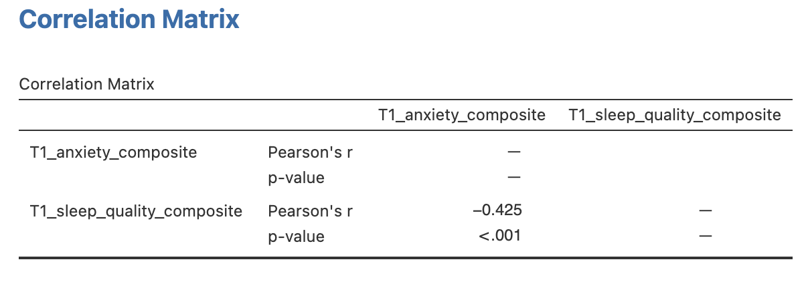
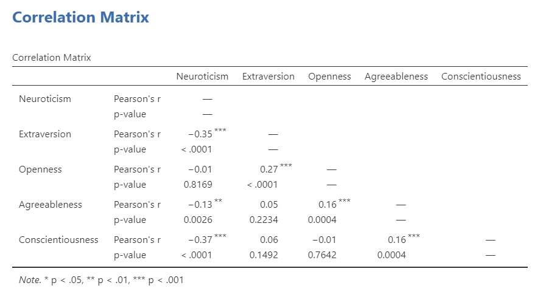

# Lab 6: Correlation
<script>
$("#coverpic").hide();
</script>


<span class="newthought">
If ... we choose a group of social phenomena with no antecedent knowledge of the causation or absence of causation among them, then the calculation of correlation coefficients, total or partial, will not advance us a step toward evaluating the importance of the causes at work.
-Sir Ronald Fisher
</span>

In lecture and in the textbook, we have been discussing the idea of correlation. This is the idea that two things that we measure can be somehow related to one another. For example, your personal happiness, which we could try to measure say with a questionnaire, might be related to other things in your life that we could also measure, such as number of close friends, yearly salary, how much chocolate you have in your bedroom, or how many times you have said the word Nintendo in your life. Some of the relationships that we can measure are meaningful, and might reflect a causal relationship where one thing causes a change in another thing. Some of the relationships are spurious, and do not reflect a causal relationship.

In this lab you will learn how to compute correlations between two variables in software, and then ask some questions about the correlations that you observe.

## General Goals

1. Compute Pearson's *r* between two variables using software
2. Discuss the possible meaning of correlations that you observe

### Important Info

We use data from the [World Happiness Report](http://worldhappiness.report). A .csv of the data can be found here: <a href="https://raw.githubusercontent.com/CrumpLab/statisticsLab/master/data/WHR2018.csv" download>WHR2018.csv</a>

## R

In this lab we use explore to explore correlations between any two variables, and also show how to do a regression line. There will be three main parts. Getting *r* to compute the correlation, and looking at the data using scatter plots. We'll look at some correlations from the World Happiness Report. Then you'll look at correlations using data we collect from ourselves. It will be fun.

### cor for correlation

R has the `cor` function for computing Pearson's *r* between any two variables. In fact this same function computes other versions of correlation, but we'll skip those here. To use the function you just need two variables with numbers in them like this:

```{r}
x  <- c(1,3,2,5,4,6,5,8,9)
y  <- c(6,5,8,7,9,7,8,10,13)
cor(x,y)
```
 Well, that was easy. 
 
#### scatterplots

Let's take our silly example, and plot the data in a scatter plot using ggplot2, and let's also return the correlation and print it on the scatter plot. Remember, ggplot2 wants the data in a data.frame, so we first put our x and y variables in a data frame.

```{r, warning=F, message=F}
library(ggplot2)

# create data frame for plotting
my_df <- data.frame(x,y)

# plot it
ggplot(my_df, aes(x=x,y=y))+
  geom_point()+
  geom_text(aes(label = round(cor(x,y), digits=2), y=12, x=2 ))
```

Wow, we're moving fast here.

#### lots of scatterplots

Before we move on to real data, let's look at some fake data first. Often we will have many measures of X and Y, split between a few different conditions, for example, A, B, C, and D. Let's make some fake data for X and Y, for each condition A, B, C, and D, and then use facet_wrapping to look at four scatter plots all at once

```{r}
x<-rnorm(40,0,1)
y<-rnorm(40,0,1)
conditions<-rep(c("A","B","C","D"), each=10)

all_df <- data.frame(conditions, x, y)

ggplot(all_df, aes(x=x,y=y))+
  geom_point()+
  facet_wrap(~conditions)

```

#### computing the correlations all at once

We've seen how we can make four graphs at once. Facet_wrap will always try to make as many graphs as there are individual conditions in the column variable. In this case there are four, so it makes four.

Notice, the scatter plots don't show the correlation (r) values. Getting these numbers on there is possible, but we have to calculate them first. We'll leave it to you to Google how to do this, if it's something you want to do. Instead, what we will do is make a table of the correlations in addition to the scatter plot. We again use `dplyr` to do this:

OK, we are basically ready to turn to some real data and ask if there are correlations between interesting variables...You will find that there are some... But before we do that, we do one more thing. This will help you become a little bit more skeptical of these "correlations".

#### Chance correlations

As you learned from the textbook. We can find correlations by chance alone, even when there is no true correlation between the variables. For example, if we sampled randomly into x, and then sampled some numbers randomly into y. We know they aren't related, because we randomly sampled the numbers. However, doing this creates some correlations some of the time just by chance. You can demonstrate this to yourself with the following code. It's a repeat of what we already saw, jut with a few more conditions added. Let's look at 20 conditions, with random numbers for x and y in each. For each, sample size will be 10. We'll make the fake data, then make a big graph to look at all. And, even though we get to regression later in the lab, I'll put the best fit line onto each scatter plot, so you can "see the correlations".

```{r}
x<-rnorm(10*20,0,1)
y<-rnorm(10*20,0,1)
conditions<-rep(1:20, each=10)

all_df <- data.frame(conditions, x, y)

ggplot(all_df, aes(x=x,y=y))+
  geom_point()+
  geom_smooth(method=lm, se=FALSE)+
  facet_wrap(~conditions)+
  theme_classic()

```

You can see that the slope of the blue line is not always flat. Sometimes it looks like there is a correlation, when we know there shouldn't be. You can keep re-doing this graph, by re-knitting your *r* Markdown document, or by pressing the little green play button. This is basically you simulating the outcomes as many times as you press the button.

The point is, now you know you can find correlations by chance. So, in the next section, you should always wonder if the correlations you find reflect meaningful association between the x and y variable, or could have just occurred by chance.

### World Happiness Report

Let's take a look at some correlations in real data. We are going to look at responses to a questionnaire about happiness that was sent around the world, from the [world happiness report](http://worldhappiness.report)

#### Load the data

We load the data into a data frame. Reminder, the following assumes that you have downloaded the [RMarkdownsLab.zip](https://github.com/CrumpLab/statisticsLab/raw/master/RMarkdownsLab.zip) file which contains the data file in the data folder.

```{r, warning=F, message=F}
library(data.table)
whr_data <- fread('data/WHR2018.csv')
```

You can also load the data using the following URL

```{r, warning=F, message=F, eval=F}
library(data.table)
whr_data <- fread("https://raw.githubusercontent.com/CrumpLab/statisticsLab/master/data/WHR2018.csv")
```

#### Look at the data

```{r, eval=FALSE, warning=F, message=F}
library(summarytools)
view(dfSummary(whr_data))
```

You should be able to see that there is data for many different countries, across a few different years. There are lots of different kinds of measures, and each are given a name. I'll show you some examples of asking questions about correlations with this data, then you get to ask and answer your own questions.

#### My Question #1
 
For the year 2017 only, does a country's measure for "Freedom to make life choices" correlate with that country's measure for " Confidence in national government"?

Let's find out. We calculate the correlation, and then we make the scatter plot.


```{r}

cor(whr_data$`Freedom to make life choices`,
    whr_data$`Confidence in national government`)

ggplot(whr_data, aes(x=`Freedom to make life choices`,
                     y=`Confidence in national government`))+
  geom_point()+
  theme_classic()

```

Interesting, what happened here? We can see some dots, but the correlation was NA (meaning undefined). This occurred because there are some missing data points in the data. We can remove all the rows with missing data first, then do the correlation. We will do this a couple steps, first creating our own data.frame with only the numbers we want to analyse. We can select the columns we want to keep using `select`. Then we use `filter` to remove the rows with NAs.

```{r, warning=F, message=F}
library(dplyr)

smaller_df <- whr_data %>%
               select(country,
                      `Freedom to make life choices`,
                      `Confidence in national government`) %>%
               filter(!is.na(`Freedom to make life choices`),
                      !is.na(`Confidence in national government`))

cor(smaller_df$`Freedom to make life choices`,
    smaller_df$`Confidence in national government`)
```

Now we see the correlation is .408. 

Although the scatter plot shows the dots are everywhere, it generally shows that as Freedom to make life choices increases in a country, that country's confidence in their national government also increase. This is a positive correlation. Let's do this again and add the best fit line, so the trend is more clear, we use `geom_smooth(method=lm, se=FALSE)`. I also change the `alpha` value of the dots so they blend it bit, and you can see more of them.

```{r}

# select DVs and filter for NAs

smaller_df <- whr_data %>%
               select(country,
                      `Freedom to make life choices`,
                      `Confidence in national government`) %>%
               filter(!is.na(`Freedom to make life choices`),
                      !is.na(`Confidence in national government`))

# calcualte correlation

cor(smaller_df$`Freedom to make life choices`,
    smaller_df$`Confidence in national government`)

# plot the data with best fit line

ggplot(smaller_df, aes(x=`Freedom to make life choices`,
                     y=`Confidence in national government`))+
  geom_point(alpha=.5)+
  geom_smooth(method=lm, se=FALSE)+
  theme_classic()


```

#### My Question #2

After all that work, we can now speedily answer more questions. For example, what is the relationship between positive affect in a country and negative affect in a country. I wouldn't be surprised if there was a negative correlation here: when positive feelings generally go up, shouldn't negative feelings generally go down?

To answer this question, we just copy paste the last code block, and change the DVs to be `Positive affect`, and `Negative affect`

```{r}

# select DVs and filter for NAs

smaller_df <- whr_data %>%
               select(country,
                      `Positive affect`,
                      `Negative affect`) %>%
               filter(!is.na(`Positive affect`),
                      !is.na(`Negative affect`))

# calcualte correlation

cor(smaller_df$`Positive affect`,
    smaller_df$`Negative affect`)

# plot the data with best fit line

ggplot(smaller_df, aes(x=`Positive affect`,
                     y=`Negative affect`))+
  geom_point(alpha=.5)+
  geom_smooth(method=lm, se=FALSE)+
  theme_classic()


```

Bam, there we have it. As positive affect goes up, negative affect goes down. A negative correlation.


### Generalization Exercise

This generalization exercise will explore the idea that correlations between two measures can arise by chance alone. There are two questions to answer. For each question you will be sampling random numbers from uniform distribution. To conduct the estimate, you will be running a simulation 100 times. The questions are: 

1. Estimate the range (minimum and maximum) of correlations (using pearons's r) that could occur by chance between two variables with n=10.

2. Estimate the range (minimum and maximum) of correlations (using pearons's r) that could occur bychance between two variables with n = 100.

Use these tips to answer the question.

Tip 1: You can use the `runif()` function to sample random numbers between a minimum value, and maximum value. The example below sample 10 (n=10) random numbers between the range 0 (min = 0) and 10 (max=10). Everytime you run this code, the 10 values in x will be re-sampled, and will be 10 new random numbers

```{r}
x <- runif(n=10, min=0, max=10)
```

Tip 2: You can compute the correlation between two sets of random numbers, by first sampling random numbers into each variable, and then running the `cor()` function.

```{r}
x <- runif(n=10, min=0, max=10)
y <- runif(n=10, min=0, max=10)
cor(x,y)
```

Running the above code will give different values for the correlation each time, because the numbers in x and y are always randomly different. We might expect that because x and y are chosen randomly that there should be a 0 correlation. However, what we see is that random sampling can produce "fake" correlations just by chance alone. We want to estimate the range of correlations that chance can produce. 

Tip 3: One way to estimate the range of correlations that chance can produce is to repeat the above code many times. For example, if you ran the above code 100 times, you could save the correlations each time, then look at the smallest and largest correlation. This would be an estimate of the range of correlations that can be produced by chance. How can you repeat the above code many times to solve this problem? 

We can do this using a `for` loop. The code below shows how to repeat everything inside the for loop 100 times. The variable `i` is an index, that goes from 1 to 100. The `saved_value` variable starts out as an empty variable, and then we put a value into it (at index position i, from 1 to 100). In this code, we put the sum of the products of x and y into the `saved_value` variable. At the end of the simulation, the `save_value` variable contains 100 numbers. The `min()` and `max()` functions are used to find the minimum and maximum values for each of the 100 simulations. You should be able to modify this code by replacing `sum(x*y)` with `cor(x,y)`. Doing this will allow you to run the simulation 100 times, and find the minimum correlation and maximum correlation that arises by chance. This will be estimate for question 1. To provide an estimate for question 2, you will need to change `n=10` to `n=100`.

```{r}
saved_value <- c() #make an empty variable
for (i in 1:100){
  x <- runif(n=10, min=0, max=10)
  y <- runif(n=10, min=0, max=10)
  saved_value[i] <- sum(x*y)
}

min(saved_value)
max(saved_value)

```


### Writing assignment

Answer the following questions with complete sentences. When you have finished everything. Knit the document and hand in your stuff (you can submit your .RMD file to blackboard if it does not knit.)

1. Imagine a researcher found a positive correlation between two variables, and reported that the *r* value was +.3. One possibility is that there is a true correlation between these two variables. Discuss one alternative possibility that would also explain the observation of +.3 value between the variables.

2. Explain the difference between a correlation of *r* = .3 and *r* = .7. What does a larger value of *r* represent?

3. Explain the difference between a correlation of *r* = .5, and *r* = -.5.

## Excel

How to do it in Excel

## SPSS


In this lab, we will use SPSS to calculate the correlation coefficient. We will focus on the most commonly used Pearson's coefficient, *r*. We will learn how to:

1. Calculate the Pearson's *r* correlation coefficient for bivariate data
2. Produce a correlation matrix, reporting Pearson's *r* for more than two variables at a time
3. Produce a scatterplot
4. Split a data file for further analysis

Let's first begin with a short data set we will enter into a new SPSS data spreadsheet. Remember, in order to calculate a correlation, you need to have bivariate data; that is, you must have at least two variables, x and y. You can have more than two variables, in which case we can calculate a correlation matrix, as indicated in the section that follows. 


### Correlation Coefficient for Bivariate Data: Two Variables


Let's use the following data set: {x= 1, 3, 2, 5, 4, 6, 5, 8, 9} {y= 6, 5, 8, 7, 9, 7, 8, 10, 13}. Notice there are two variables, `x` and `y`. Enter these into SPSS and name them appropriately. 

```{r , echo=FALSE,dev='png'}
knitr::include_graphics('img/3.4.11.png')
```

Next, click <span style="color:blue">Analyze</span>, then <span style="color:blue">Correlate</span>, then <span style="color:blue">Bivariate</span>:

```{r , echo=FALSE,dev='png'}
knitr::include_graphics('img/3.4.12.png')
```

The next window will ask you to select variables to correlate. Since we have two (`x` and `y`) move them both from the left-hand field to the right-hand field using the arrow. Notice that in this window, <span style="color:blue">Pearson</span> is selected. This is the default setting (and the one we want), but notice there are other ways to calculate the correlation between variables. We will stick with Pearson's correlation coefficient for this course. 

```{r , echo=FALSE,dev='png'}
knitr::include_graphics('img/3.4.13.png')
```

Now, click <span style="color:blue">OK</span>. 

SPSS will produce an output table containing the correlation coefficient requested. Notice that the table is redundant; it gives us the correlation between x and y, the correlation between y and x, the correlation between x and itself, and the correlation between y and itself. Any variable correlated with itself will result in an *r* of 1. The Pearson *r* correlation between variables x and y is .765.

```{r , echo=FALSE,dev='png'}
knitr::include_graphics('img/3.4.14.png')
```


### Correlation Matrix


In the event that you have more than two variables in your spreadsheet, and would like to evaluate correlations between several variables taken two at a time, you need not re-run the correlations in SPSS repeatedly. You can, in fact, enter multiple variables into the correlation window and obtain a correlation matrix--a table showing every possible bivariate correlation amongst a group of variables.

To illustrate how this is done, let's add a new variable to our existing spreadsheet: variable `z`, {z= 1, 4, 2, 9, 5, 7, 12, 5, 3}
```{r , echo=FALSE,dev='png'}
knitr::include_graphics('img/3.4.15.png')
```

From here, go to <span style="color:blue">Analyze</span>, then <span style="color:blue">Correlate</span>, then <span style="color:blue">Bivariate</span>:

```{r , echo=FALSE,dev='png'}
knitr::include_graphics('img/3.4.16.png')
```

Next, you will encounter the window that asks you to indicate which variables to correlate. Select all three variables (`x`, `y`, and `z`) and move them to the right-hand field using the arrow. 

```{r , echo=FALSE,dev='png'}
knitr::include_graphics('img/3.4.17.png')
```

Click <span style="color:blue">OK</span>. SPSS will produce an output table that contains correlations for every pairing of our three variables, along with the correlations of each variable with itself. 

```{r , echo=FALSE,dev='png'}
knitr::include_graphics('img/3.4.18.png')
```

According to this output:

1. The correlation coefficient between variables `x` and `y` is .765
2. The correlation coefficient between variables `x` and `z` is .294
3. The correlation coefficient between variables `y` and `z` is -.080


### Correlation and Scatterplots


To accompany the calculation of the correlation coefficient, the scatterplot is the relevant visualization tool. Let's use data from The World Happiness Report, a questionnaire about happiness. [Here](https://github.com/CrumpLab/statisticsLab/blob/master/data/spssdata/WHR2018.sav) is a link to the file named WHR2018.sav.

Using this data, let's answer the following question: does a country's measure for `Freedom to make life choices` correlate with that country's measure for `Confidence in national government`?

Let's find the correlation coefficient between these variables first. Go to <span style="color:blue">Analyze</span>, then <span style="color:blue">Correlate</span>, then <span style="color:blue">Bivariate</span>:

```{r , echo=FALSE,dev='png'}
knitr::include_graphics('img/3.4.19.png')
```

Next, a window will appear asking for the variables to be correlated. Go through the list on the left and find `Freedom to make life choices` as well as `Confidence in national government`. Move both of these variables to the field on the right using the arrow.

```{r , echo=FALSE,dev='png'}
knitr::include_graphics('img/3.4.20.png')
```
Click OK. SPSS will produce a correlation table.

```{r , echo=FALSE,dev='png'}
knitr::include_graphics('img/3.4.21.png')
```

Based on this output, the correlation between `Freedom to make life choices` and `Confidence in national government` is .408.

Let's continue to create the scatterplot for this data. Go to <span style="color:blue">Graphs</span>, then <span style="color:blue">Legacy Dialogs</span>, then <span style="color:blue">Scatter...</span>
```{r , echo=FALSE,dev='png'}
knitr::include_graphics('img/3.4.22.png')
```

In the next window, choose <span style="color:blue">Simple</span>, then <span style="color:blue">Define</span>:
```{r , echo=FALSE,dev='png'}
knitr::include_graphics('img/3.4.23.png')
```

Next, move your two variables (`Freedom to make life choices` and `Confidence in national government`) into the x-axis and y-axis fields. Again, it does not matter which variable goes where, for now.

```{r , echo=FALSE,dev='png'}
knitr::include_graphics('img/3.4.24.png')
```

Click <span style="color:blue">OK</span>. SPSS will produce a scatterplot of your data, as follows:

```{r , echo=FALSE,dev='png'}
knitr::include_graphics('img/3.4.25.png')
```

You can keep this scatterplot as it is, or, you can edit it to include a straight line that best fits the data points. This line is known as the best-fitting line as it minimizes the distance from it to all the data. To edit the scatterplot double click on the graph and a window labeled Chart Editor should appear:

```{r , echo=FALSE,dev='png'}
knitr::include_graphics('img/3.4.26.png')
```

In this window, find the button at the top that reads <span style="color:blue">Fit Line at Total</span> when you hover your mouse over it. Below, I have highlighted it for clarity:

```{r , echo=FALSE,dev='png'}
knitr::include_graphics('img/3.4.27.png')
```

Press this button and you will see a new menu. Make sure <span style="color:blue">Linear</span> is selected and click <span style="color:blue">Apply</span>.

```{r , echo=FALSE,dev='png'}
knitr::include_graphics('img/3.4.28.png')
```

Next, exit from the Chart Editor. This means you will hit the <span style="color:blue">X</span> in the corner of the window. You will find that the graph in your output window has now updated and has a line drawn on it.

```{r , echo=FALSE,dev='png'}
knitr::include_graphics('img/3.4.29.png')
```

This scatterplot is very important. The distance between the line and the data points is indicative of the strength of the correlation coefficient; they are directly related. For example, if the data were more clustered or tighter to the line, the correlation would be stronger. If the data points are more spread out and far from the line, the correlation is weaker. 


### Splitting a File


What if we asked the question: for the year 2017 only, does a country's measure for `Freedom to make life choices` correlate with that country's measure for `Confidence in national government`?

Notice that this question is asking us to find the correlation between the same two variables we used in the previous example, but only in the case where the year is 2017. To acheive this, we're going to utilize a function called splitting. Splitting takes the file as a whole, and sets it up so that every analysis is done on some subset of the data. For example, if we split our data by year and calculate a correlation coefficient, SPSS will find Pearson *r* for only 2017, and another for only 2016, and so on. 

In order to split the data, we go to the top menu and choose <span style="color:blue">Data</span>, then <span style="color:blue">Split file...</span>

```{r , echo=FALSE,dev='png'}
knitr::include_graphics('img/3.4.30.png')
```

In the next window, you must select <span style="color:blue">Organize output by groups</span> and then specify which variable will be used to split the data. Select `year` and move it to the right-hand field using the arrow. 

```{r , echo=FALSE,dev='png'}
knitr::include_graphics('img/3.4.31.png')
```

Click <span style="color:blue">OK</span>. Notice that this will cause the output window to produce some text indicating that you have split your file. You can ignore this and go back to your data window.

From here, any analysis you choose to do will be done separately for each year's worth of data. Let's calculate the correlation coefficient, as usual. Click <span style="color:blue">Analyze</span>, then <span style="color:blue">Correlate</span>, then <span style="color:blue">Bivariate</span>:

```{r , echo=FALSE,dev='png'}
knitr::include_graphics('img/3.4.32.png')
```

In the next window, select the variables to be used (they will be the same as in the last example). 

```{r , echo=FALSE,dev='png'}
knitr::include_graphics('img/3.4.33.png')
```

Click <span style="color:blue">OK</span>. Notice that in the output window you will see a bunch of correlation tables (13 of them to be exact), one for each year. Scroll down and find the table with the heading "year = 2017". That's the table we need in order to answer our question:

```{r , echo=FALSE,dev='png'}
knitr::include_graphics('img/3.4.34.png')
```

This table indicates that, if we only look at the year 2017, the correlation coefficient between `Freedom to make life choices` and `Confidence in national government` is .442.

It is VERY important to remember that once you have split a file, every analysis that follows the split will be done on the split variable. If you want to go back to performing analyses and calculating statistics for the data as a whole, you must UNSPLIT your data file (or undo the split). To do this, go to <span style="color:blue">Data</span>, then <span style="color:blue">Split file...</span>

```{r , echo=FALSE,dev='png'}
knitr::include_graphics('img/3.4.35.png')
```

Then make sure to select <span style="color:blue">Analyze all cases, do not create groups</span> and click <span style="color:blue">OK</span>.

```{r , echo=FALSE,dev='png'}
knitr::include_graphics('img/3.4.36.png')
```


### Practice Problems

___


1. For the year 2005 ONLY, find the correlation between “perceptions of corruption” and “positive affect”. Create a scatterplot to visualize this relationship. What are your conclusions about the relationship between affect and perceived corruption? Is this surprising to you?

2. What has happened to log GDP (consider this a measure of GDP) in the United States ONLY with time (as the year has increased)? Explain this relationship and provide a scatterplot.

3. Which country (or countries) have seen a more consistent and strong increase in log GDP over time? Which country (or countries) have seen a decrease over time?


## JAMOVI - Week 10 - March 28th & 29th 

<div class="marginnote">
Some of this section is copied almost verbatim, with some editorial changes, from [Answering questions with data: The lab manual for R, Excel, SPSS and JAMOVI, Lab 3, Section 3.4, SPSS](https://www.crumplab.com/statisticsLab/lab-3-correlation.html#spss-3), according to its [CC license](https://creativecommons.org/licenses/by-sa/4.0/deed.ast). Thank you to Crump, Krishnan, Volz, & Chavarga (2018). 
</div>


In this lab, we will use jamovi to calculate the correlation coefficient. We will focus on the most commonly used Pearson's coefficient, *r*. We will learn how to:

1. Calculate the Pearson's *r* correlation coefficient for bivariate data
2. Produce a correlation matrix, reporting Pearson's *r* for more than two variables at a time
3. Produce a scatterplot
4. Applying a filter to the data set for further analysis

### Pre-lab reading and tasks

#### Assumptions of correlation

This lab will focus on Pearson's correlation. For the calculation to make sense, the data must meet certain criteria. These are known as the assumptions of Pearson's correlation. 

Pearson's correlation assumes:

1. There is a linear relation between the two variables. For this to be assessed, the scale of measurement of both variables must be at least interval. You cannot assess whether the relation is linear without equal spacing between intervals. **Do not run Pearson's correlation on nominal or ordinal variables**.

2. There are no outliers. We are not going to get too much into outliers. If you have a point in your dataset that is really far away from the other points, you might have an outlier.

<div class="marginnote">
Field, A (2018) *Discovering Statistics Using IMB SPSS Statistics*, 5th edition. Sage: California.
</div>

Additionally, if you want to look at the *p*-value associated with Pearson's correlation (i.e., if you want to do inference), the data must adhere to the normality assumption. If your sample size is large, you don't need to worry about normality. If your sample size is small, you should check that your variables are normally distributed.

#### Download and open data & Install scatr module

For the purpose of this lab, we have created a version of the PSYC 291 survey data that contains a few more variables. Download it [here](https://moodle.stfx.ca/mod/url/view.php?id=837149). The file name starts with "V2 PSYC 291 ..." Note that this is a .omv file, so you can open it instead of importing. I created it with an older version of JAMOVI, so hopefully it opens on everyone's computer.

The new variables are "composite" scores. These are scores that are generated by combining other variables together. For example, the anxiety composite score was generated by averaging all the responses to survey questions about anxiety. Composite scores are very useful if you are interested in a construct that cannot be defined by a single question.

Have the file open in JAMOVI before the beginning of your lab session.

You will also want to read through this section, paying special attention to [Section 6.5.5](https://www.erinmazerolle.com/statisticsLab/lab-6-correlation.html#correlation-and-scatterplots-1), and the information about adding the scatr module to JAMOVI. Please download and install this module before lab; due to the short duration of our labs, we will not have time during lab to wait for downloading and installation.

### Correlation Coefficient for Bivariate Data

Bivariate is a fancy way of saying two variables. Let's say you were interested in the relationship between two variables: sleep quality and anxiety at the start of the semester. To calculate a correlation in JAMOVI, go to
<span style="color:blue">Analyses</span> -> <span style="color:blue">Regression</span> -> <span style="color:blue">Correlation Matrix</span>:

```{r , echo=FALSE,dev='png'}

```

<br>

Move your variables of interest, `T1_sleep_quality_composite` and `T1_anxiety_composite`, to the right box:

```{r , echo=FALSE,dev='png'}
knitr::include_graphics('img/corvars.png')
```

<br>

An output table will be generated in the results panel:

```{r , echo=FALSE,dev='png'}

```

<br>

The table indicates that Pearson's *r* between the two variables is -0.425, with a *p*-value of less than .001. This is a negative correlation: as one variable goes up, the other goes down.

### Correlation Matrix

In the event that you have more than two variables in your spreadsheet, and would like to evaluate correlations between several variables taken two at a time, you can enter multiple variables into the correlation window and obtain a correlation matrix. The correlation matrix is a table showing every possible bivariate correlation amongst a group of variables.

Let's add `T1_sleep_hours` to our correlation matrix. First move the variable to the right box:

```{r , echo=FALSE,dev='png'}
knitr::include_graphics('img/corvars2.png')
```

<br>

Now the output panel has three sets of results:

```{r , echo=FALSE,dev='png'}

```

<br>

Note that some of the correlations are negative, and some are positive. Some are significant (with *p* < .05) and some are not.

### APA format reporting of a correlation

Recall the output for the correlation between `T1_sleep_quality_composite` and `T1_anxiety_composite`:

```{r , echo=FALSE,dev='png'}

```

<br>

You could write the results in APA format as follows:

>There was significant correlation between sleep quality and anxiety at the beginning of the term, Pearson's *r* = -.43, *p* < .001.

<br>

Note that we did not use a leading zero for *r* and we rounded to two decimal places.

Now consider the example of the correlation between `T1_sleep_hours` and `T1_anxiety_composite`:
```{r , echo=FALSE,dev='png'}

```

<br>

To report this result in APA format, you would write something such as:

>There was not a significant correlation between sleep duration and anxiety at the beginning of the term, Pearson's *r* = .13, *p* > .05.

<br>

### Correlation and Scatterplots

To accompany the calculation of the correlation coefficient, the scatterplot is the relevant graph. Depending on your version of JAMOVI, you may have the option to enable a correlation matrix plot from the correlation matrix analysis panel:

```{r , echo=FALSE,dev='png'}

```

<br>


This will produce a scatterplot for each of the correlations you requested.
```{r , echo=FALSE,dev='png'}

```

<br>


These are handy for having a quick look, but are kind of small. 

#### Adding the Scatterplot module to jamovi

Before you can request a larger scatterplot in jamovi, you must add Scatterplot as a module. To do so, click on the addition sign which is white with a blue trim that has the word “Modules” underneath. 

```{r , echo=FALSE,dev='png'}
knitr::include_graphics('img/modulesplus.png')
```

<br>


Click <span style="color:blue">jamovi library</span>.

```{r , echo=FALSE,dev='png'}

```

<br>


Under the “Available” tab, you should see a module called <span style="color:blue">scatr</span>. Click to <span style="color:blue">INSTALL</span> it. 

```{r , echo=FALSE,dev='png'}
knitr::include_graphics('img/modules.png')
```

<br>


When it is installed, it will appear in your <span style="color:blue">Exploration</span> menu.

```{r , echo=FALSE,dev='png'}

```

<br>


#### Getting a visual of the correlation

Let's continue to create the scatterplot for this data, starting with the `T1_sleep_quality_composite` and `T1_anxiety_composite` variables.

Go to <span style="color:blue">Analyses</span>, then <span style="color:blue">Exploration</span>, and then <span style="color:blue">Scatterplot</span>.

```{r , echo=FALSE,dev='png'}

```

<br>


Move `T1_sleep_quality_composite` into the X-Axis box and `T1_anxiety_composite` into the Y-Axis box:

```{r , echo=FALSE,dev='png'}

```

<br>


In the Results panel, jamovi will produce a scatterplot of your data, as follows:

```{r , echo=FALSE,dev='png'}

```

<br>


At this point, it would be equally correct to plot `T1_anxiety_composite` on the X-Axis and `T1_sleep_quality_composite` on the Y-Axis. Note that you get a different graph:

```{r , echo=FALSE,dev='png'}

```

<br>


Let's continue with the second scatterplot, with `T1_anxiety_composite` on the X-Axis and `T1_sleep_quality_composite` on the Y-Axis. You can keep this scatterplot as it is, or, you can edit it to include a straight line that best fits the data points. This line is known as the best fit line because it minimizes the distance between the line and the data points. To include the line of best fit, click on <span style="color:blue">Linear</span> under the Regression Line heading. 

```{r , echo=FALSE,dev='png'}

```

<br>


You will find that the graph in your Results panel has now updated and has a line drawn on it.

```{r , echo=FALSE,dev='png'}

```

<br>


The best fit line goes from the top left to the bottom right; it has a negative slope. This is consistent with the negative Pearson's *r* we found in the correlation matrix. 

### Optional activities

Consider the experiment and dataset from the [independent *t*-test lab](https://www.erinmazerolle.com/statisticsLab/lab-5-t-test-independent-sample.html#jamovi). Let's say you had a different research question: Is the age of the candidate correlated with intellect ratings? You could answer this using correlation. Click <span style="color:blue">Analyses</span>, <span style="color:blue">Regression</span>, and <span style="color:blue">Correlation Matrix</span>.

```{r , echo=FALSE,dev='png'}
knitr::include_graphics('img/7.4.61.png')
```

<br>

Then, move `age` and `intellect` into the untitled box at the right of the pop-up screeen:

```{r , echo=FALSE,dev='png'}
knitr::include_graphics('img/7.4.62.png')
```

<br>

In the Results panel, the output table should look as follows:

```{r , echo=FALSE,dev='png'}
knitr::include_graphics('img/7.4.63.png')
```

<br>

Write a sentence describing the results of this test. Compare your answer to #1 in the "Example answers to practice problems" below. 

Now, assume you are in the mood to do some exploratory data analysis. We can run multiple bivariate correlations at the same time in the same dialog. Click <span style="color:blue">Analyses</span>, then <span style="color:blue">Regression</span>, and then <span style="color:blue">Correlation Matrix</span> again. To the untitled variables box at the right, add `age`, `time`, `wordcount`, `intellect`,  and `impression`:

```{r , echo=FALSE,dev='png'}
knitr::include_graphics('img/7.4.64.png')
```

<br>

In the Results panel, the output table contains the *r*- and *p*-values for each possible pair of the five variables:

```{r , echo=FALSE,dev='png'}
knitr::include_graphics('img/7.4.65.png')
```

<br>

By default, jamovi does not flag significant correlations. Be sure to review the *p*-values careful and compare them to the alpha level you set.  How many significant correlations do you identify in the correlation matrix?

If you would like jamovi to flag significant correlations, you can click <span style="color:blue">Flag significant correlations</span> under “Additional options”. 

```{r , echo=FALSE,dev='png'}
knitr::include_graphics('img/7.4.66.png')
```

<br>

Under the correlation matrix that appears in the Results panel, you will notice a note. If the *p*-value is under .05, jamovi will flag the correlation coefficient as * (significant at the .05 level); if the *p*-value is less than .01, jamovi will flag it as ** (significant at the .01 level); and if the *p*-value is less than .001, jamovi will flag it as *** (significant at the .001 level).

```{r , echo=FALSE,dev='png'}
knitr::include_graphics('img/7.4.67.png')
```

<br>

Let's pick a few pairs of variables and make scatterplots. We have a good range of different correlations in this table, so we can use these data to practice identifying correlations of different strengths. Click <span style="color:blue">Analyses</span>, <span style="color:blue">Exploration</span>, and then <span style="color:blue">Scatterplot...</span>. Move `intellect` into the Y-Axis field and `age` into the X-Axis field. 

```{r , echo=FALSE,dev='png'}
knitr::include_graphics('img/7.4.68.png')
```

<br>

These commands should produce a scatterplot in the Results panel. 

```{r , echo=FALSE,dev='png'}
knitr::include_graphics('img/7.4.69.png')
```

<br>

Repeat for all correlations with `intellect`, using `intellect` on the *y*-axis each time to make it easier to compare to the example answers below (#2). Compare the pattern of dots in each scatterplot to the *r*-values reported in the tables. Can you see the differences between the plots? Can you tell from the scatterplots whether we have violated any of the assumptions of Pearson's *r* (i.e., linearity, no outliers)?


#### Applying a Filter

Next, consider the [EngageNS Quality of Life dataset](https://moodle.stfx.ca/mod/url/view.php?id=830017). Consider the question: does the number of hours per week a person spends working at their main job correlate with their computer game playing? Use the data [data dictionary](https://moodle.stfx.ca/mod/url/view.php?id=830017) to identify the relevant variables and run the appropriate correlation.

Next, what if we asked the question: For residents of the Antigonish and Guysborough regions only, does the number of hours per week a person spends working at their main job correlate with their computer game playing? Notice that this question is asking us to find the correlation between the same two variables we used in the previous example, but only in the case where the `REGION` is equal to 4 (see the [data dictionary](https://moodle.stfx.ca/mod/url/view.php?id=830017) for an explanation). To achieve this, we're going to utilize a function called filtering. Filtering the data set makes only those cases that meet our criteria available for use in the analysis to be run. For example, if we filter our data by region and calculate a correlation coefficient, jamovi will find Pearson *r* for only Antigonish and Guysborough, and not for other regions. 

In order to filter the data, we go to the top menu and choose <span style="color:blue">Data</span> and then <span style="color:blue">Filter</span>. In the next window, you must set up the filter; indicate which cases will be used. Under “Filter 1,” click on the formula editor, the <span style="color:blue">*f~x~*</span> button. Double click on the variable name (`REGION`), and it will be incorporated into the filter. Then, use two equal signs, and enter the code for the region of interest (4).

Notice that this will cause a new column in the spreadsheet wherein a green checkmark indicates the case/participant will be included in the analysis and a red “x” indicates the case/participant will be excluded from the analysis.

From here, any analysis you choose to do will be done for only the cases match the filter. Let's calculate the correlation coefficient, as usual. Click <span style="color:blue">Analyses</span>, then <span style="color:blue">Regression</span>, and then <span style="color:blue">Correlation Matrix</span>.

In the next window, select the variables to be used in the correlation (`WORKHR` and `HM_CGAME`). 

Notice that in the output now shows a correlation matrix with different results than you saw when you ran the correlation with the entire data set.

Again, you may want to inspect the scatterplot to get a visual representation of this correlation coefficient for the data collected from participants in the Antigonish-Guysborough region. Challenge: Give the creation of this scatterplot a try on your own. 

#### Removing the Filter

It is **very** important to remember that once you have applied a filter, every analysis will be done on the split variable. If you want to go back to performing analyses and calculating statistics for the data as a whole, you must delete the filter. To do this, you can highlight the column showing the filter in the spreadsheet, go to <span style="color:blue">Data</span>, and then <span style="color:blue">Delete</span>. You will be prompted with a question to verify that you want to delete the filter. Click <span style="color:blue">Yes</span>.

### Example answers to optional activities

1. Intellect ratings were not significantly correlated with the age of the candidates, *r* = .05, *p* > .05.

2. You should have created four scatterplots. They are included below as well as some notes about each. 

```{r , echo=FALSE,dev='png'}
knitr::include_graphics('img/7.4.69.png')
```
For the correlation between `age` and `intellect`, we found *r* was very close to 0, at .05. This is reflected in the pattern of dots, which are spread fairly uniformly across the entire plot. There are no concerns with violating the assumption of linearity on this plot. There are also no outliers.

```{r , echo=FALSE,dev='png'}
knitr::include_graphics('img/7.4.70.png')
```
For the correlation between `time` and `intellect`, we found *r* was also close to 0 but negative, at -.07. It is harder to link the *r* with the plot in this case because of the two dots far to the right in the plot. These might be outliers and could be investigated further, but how to do so is not covered in PSYC 292. 

```{r , echo=FALSE,dev='png'}
knitr::include_graphics('img/7.4.71.png')
```
The correlation between `wordcount` and `intellect` was *r* = -.24. This is a fairly weak correlation. The dot to the far right in the first plot might be an outlier and could be investigated further, but how to do so is not covered in PSYC 292. If you focus on the cluster of dots on the left, you can get the impression that there are more dots in the top left and bottom right than the other two quadrants. This is more obvious if we zoom in:

```{r , echo=FALSE,dev='png'}

```

<br>

Next, let's look at the scatterplot for `impression` and `intellect`.

```{r , echo=FALSE,dev='png'}
knitr::include_graphics('img/7.4.72.png')
```
For `impression` and `intellect`, a correlation of *r* = .83 was observed. In the scatterplot, you can see the dots cluster around an imaginary line that goes from the bottom left corner to the top left corner. There are no concerns that the assumption of linearity has been violated. There is also no evidence of outliers.


### Homework

See [Moodle](https://moodle.stfx.ca/course/view.php?id=26030#section-13).


### Practice Problems

Use the [EngageNS Quality of Life dataset](https://moodle.stfx.ca/mod/url/view.php?id=830017) to answer questions 1-6.

1. Construct a scatterplot using R_FRIENDS on the x-axis and SOC_FRND on the y-axis to depict the results you found for the last homework question.

2. Can you run a Pearson’s correlation analysis on the following pairs of variables? Why or why not?
a) SEX and SLEEP?
b) COMP_TIME and SLEEP?
c) MAINACT and EDUCAT?

3. Run the correlation analysis for any set(s) of variables you determined to be appropriate for using Pearson’s correlation. Report the correlation coefficient. Is it considered statistically significant? Write your results following the APA rules discussed below.

**Some formatting guidelines for writing results sections:**

a. Note the name of the test you performed (in this case, Pearson's correlation) and whether the result is significant or non-significant (*Note: We do not use the word insignificant.*). 

b. We usually round to two decimal places, except for *p*-values. If your *p*-value was .0001, it would be okay to write *p* = .0001 or *p* < .001.

c. Do not include a leading 0 before the decimal for the *p*-value (*p* = .001 not *p* = 0.001, or *p* < .05 not *p* < 0.05) or for correlation coefficients, *r* (for example, *r* = .56).

<div class="marginnote">
Yes, I'm serious. No, I don't know why. Yes, it does seem a bit silly. Yes, you lose points if you don't adhere to APA format when requested to do so.
</div>

d. Pay attention to spaces, parentheses, etc. APA is very picky about that. For example, it's *t*(33.4) = -3.48 **not** *t*(33.4)=-3.48. There are spaces on either side of =, >, or < symbols.

e. Italicize symbols such as *M*, *SD*, *p*, and *r*.


 
4. Construct the scatterplot for any set(s) of variables you determined to be appropriate for using Pearson’s correlation. What do you notice about the scatterplot? Does the slope increase or decrease?
Do the dots closely follow the line of best fit?

5. Consider participants’ reported number of close friends and their reported time spent socializing with friends. Are these scores correlated? If so, report *r* and whether the correlation is significant or non-significant.

6. Apply a filter so that you are looking at only the data for participants’ whose main activity is going to school (**Hint**: Use the data dictionary to figure out how participants’ main activities were coded). Now, run the same correlation you looked at in #1. Are number of close friends and reported time spent socializing with friends correlated for students? Is the correlation significant? Compare these results to the results in #1. Is the correlation between number of close friends and reported time spent socializing with friends stronger or weaker for students than it is for Nova Scotians?

<div class="marginnote">
The following three questions are copied  verbatim from [Answering questions with data: The lab manual for R, Excel, SPSS and JAMOVI, Lab 3, Section 3.2.4, SPSS](https://www.crumplab.com/statisticsLab/lab-3-correlation.html#writing-assignment-2), according to its [CC license](https://creativecommons.org/licenses/by-sa/4.0/deed.ast). Thank you to Crump, Krishnan, Volz, & Chavarga (2018). 
</div>

7. Imagine a researcher found a positive correlation between two variables, and reported that the *r* value was +.3. One possibility is that there is a true correlation between these two variables. Discuss one alternative possibility that would also explain the observation of +.3 value between the variables.

8. Explain the difference between a correlation of *r* = .3 and *r* = .7. What does a larger value of *r* represent?

9. Explain the difference between a correlation of *r* = .5, and *r* = -.5.


## JAMOVI – Correlation – FOR PSYC 394 STUDENTS

<div class="marginnote">
Some of this section is copied almost verbatim, with some editorial changes, from [Answering questions with data: The lab manual for R, Excel, SPSS and JAMOVI, Lab 3, Section 3.4, SPSS](https://www.crumplab.com/statisticsLab/lab-3-correlation.html#spss-3), according to its [CC license](https://creativecommons.org/licenses/by-sa/4.0/deed.ast). Thank you to Crump, Krishnan, Volz, & Chavarga (2018). 
</div>


In this lab, we will use JAMOVI to calculate the correlation coefficient. We will focus on the most commonly used Pearson's coefficient, *r*. We will learn how to:

1. Calculate the Pearson's *r* correlation coefficient for bivariate data
2. Produce a correlation matrix, reporting Pearson's *r* for more than two variables at a time
3. Produce a scatterplot

### Pre-lab reading and tasks

#### Assumptions of correlation

This lab will focus on Pearson's correlation. For the calculation to make sense, the data must meet certain criteria. These are known as the assumptions of Pearson's correlation. 

Pearson's correlation assumes:

1. There is a linear relation between the two variables. To assess this, the scale of measurement of both variables must be at least interval. You cannot assess whether the relation is linear without equal spacing between intervals. **Do not run Pearson's correlation on nominal or ordinal variables**.

2. There are no outliers. We are not going to look deeply into outliers during this lab. If you have a point in your dataset that is quite far away from the other points, you might have an outlier.

<div class="marginnote">
This third assumption is paraphrased from Field, A (2018) *Discovering Statistics Using IMB SPSS Statistics*, 5th edition. Sage: California. This is a copyrighted textbook.
</div>

3. Additionally, the data must adhere to the normality assumption. Recall the central limit theorem. If your sample size is large, you don't need to worry about normality. If your sample size is small, you should check that your variables are normally distributed.

**You do not need to check the assumptions before lab.**

#### Download and open data 

For the purpose of the lab demonstration, we will work with a data set provided by Dolan, Oort, Stoel, and Wicherts (2009) in their investigation of measurement invariance. These data were collected from 500 psychology students at University of Amsterdam on the Big Five personality dimensions [Neuroticism (N), Extraversion (E), Openness to experience (O), Agreeableness (A), and Conscientiousness (C)] using the NEO-PI-R test . You can download the data [here]( https://moodle.stfx.ca/mod/resource/view.php?id=930539).

Have the file open in JAMOVI before the beginning of your lab session.

#### Install scatr module if required
As you read through this section on using JAMOVI to conduct correlations, you will see the need for the scatr module. The scatr module may be installed on your version of JAMOVI by default. If so, you should see it loaded under the <span style="color:blue">Analyses</span> ->and  <span style="color:blue">Exploration</span> -> menus:

```{r , echo=FALSE,dev='png'}

```

If you do not see this module on your version of JAMOVI, before lab, please download and install it using the add-on Modules icon (the plus sign at the top right) and JAMOVI library; due to the short duration of our labs, we will not have time during lab to wait for downloading and installation.

### Correlation Coefficient for Bivariate Data

Bivariate is a fancy way of saying two variables. Let's say you were interested in the relationship between two variables: `Neuroticism` and `Conscientiousness`. To calculate a correlation in JAMOVI, go to <span style="color:blue">Analyses</span> -> <span style="color:blue">Regression</span> -> <span style="color:blue">Correlation Matrix</span>:

```{r , echo=FALSE,dev='png'}

```

<br>

Move your variables of interest, ` Neuroticism ` and `Conscientiousness`, to the window on the right of the commands pane:

```{r , echo=FALSE,dev='png'}
knitr::include_graphics('img/Correlation_Variables.png')
```

<br>

An output table will be generated in the results panel:

```{r , echo=FALSE,dev='png'}
knitr::include_graphics('img/Correlation_Output.png')
```

<br>

The table indicates that Pearson's *r* between the two variables is -0.37, with a *p*-value of less than .0001. This is a negative correlation: as the scores on one variable increase, the scores on the other variable decrease.

Notice the number of other options you might select in the commands pane. You could select <span style="color:blue"> Spearman</span> or <span style="color:blue">Kendall’s tau-b</span> correlations. These tests can be useful if the data are measured on an ordinal scale or if there are outliers. Also, notice the options to request that JAMOVI <span style="color:blue">flag significant correlations</span>  and to request the 95% confidence intervals. By default, the hypothesis is set as <span style="color:blue">Correlated</span> (a two-tailed hypothesis). You might change the default setting by selecting <span style="color:blue">Correlated positively</span> or <span style="color:blue">Correlated negatively</span> (both one-tailed hypotheses). 


```{r , echo=FALSE,dev='png'}
knitr::include_graphics('img/Correlation_ExtraCommands.png')
```

<br>


### Correlation Matrix

If you have more than two variables in your spreadsheet and would like to evaluate correlations between several variables taken two at a time, you can enter multiple variables into the correlation window and obtain a correlation matrix. The correlation matrix is a table showing every possible bivariate correlation amongst a group of variables.

Let's add all five variables to our correlation matrix. First, move the variable to the right box:

```{r , echo=FALSE,dev='png'}
knitr::include_graphics('img/Correlation2_Variables.png')
```

<br>

Now the output panel has 10 sets of results:

```{r , echo=FALSE,dev='png'}
knitr::include_graphics('img/Correlation2_Output.png')
```

<br>

Note that some of the correlations are negative, and some are positive. Some are significant (with *p* < .05), and some are not.

If we request that JAMOVI flag the significant correlations, asterisks (\*) will be used to show the significance levels against three commonly used alpha levels (One asterisk denotes *p* < .05, two asterisks denote *p* < .01, and three asterisks denote *p* < .001.)

```{r , echo=FALSE,dev='png'}

```

<br>


### APA format reporting of a correlation

Recall the output for the correlation between `Neuroticism` and `Conscientiousness`:

```{r , echo=FALSE,dev='png'}
knitr::include_graphics('img/Correlation_Output.png')
```

<br>

You could write the results in APA format as follows:

>A significant correlation was found between Neuroticism and Conscientiousness, Pearson's *r* = -.37, *p* < .0001.

<br>

Note that we did not use a leading zero for *r* and we rounded to two decimal places.

Now consider the example of the correlation between `Neuroticism` and `Openness`:

```{r , echo=FALSE,dev='png'}
knitr::include_graphics('img/Correlation2_Output.png')
```

<br>

To report this result in APA format, you would write something such as:

>There was not a significant correlation between Neuroticism and Openness, Pearson's *r* = -.01, *p* > .05.

**Some formatting guidelines for writing results sections:**

a. Indicate the name of the test you performed (in this case, Pearson's correlation) and whether the result is significant or non-significant (*Note: We do not use the word insignificant.*). 

b. We usually round to two decimal places, except for *p*-values. If your *p*-value was .0001, it would be okay to write *p* = .0001 or *p* < .001.

c. Do not include a leading 0 before the decimal for the *p*-value (*p* = .001 not *p* = 0.001, or *p* < .05 not *p* < 0.05) or for correlation coefficients, *r* (for example, *r* = .56).

<div class="marginnote">
Yes, I'm serious. No, I don't know why. Yes, it does seem a bit silly. Yes, you lose points if you don't adhere to APA format when requested to do so.
</div>

d. Pay attention to spaces, parentheses, etc. APA is very picky about that. For example, it's *t*(33.4) = -3.48 **not** *t*(33.4)=-3.48. There are spaces on either side of =, >, or < symbols.

e. Italicize symbols such as *M*, *SD*, *p*, and *r*.


### Correlation and Scatterplots

To accompany the calculation of the correlation coefficient, the scatterplot is the relevant graph. Depending on your version of JAMOVI, you may have the option to enable a correlation matrix plot from the correlation matrix commands panel. Let’s return to the first correlational analysis with only two variables, `Neuroticism` and `Conscientiousness`. Highlight those results in your Results pane, and click to add <span style="color:blue">Correlation matrix </span>  under the “Plot.”

```{r , echo=FALSE,dev='png'}
knitr::include_graphics('img/Correlation_CommandsWithPlot.png')
```

<br>


This will produce a scatterplot for the correlations.
```{r , echo=FALSE,dev='png'}
knitr::include_graphics('img/Correlation_Plot.png')
```

<br>


These plots are handy for having a quick look, but are relatively small. Furthermore, when there are a number of correlations requested, the labels or axes values may start to overlap resulting in a graph that is not easy to read. Consider this result generated when the plot is requested in the correlational analysis involving all five variables:

This will produce a scatterplot for the correlations.
```{r , echo=FALSE,dev='png'}

```

<br>


#### Getting a visual of the correlation

Let's continue to create the scatterplot for this data, starting with the `Neuroticism` and `Conscientiousness` variables.

Go to <span style="color:blue">Analyses</span>, then <span style="color:blue">Exploration</span>, and then <span style="color:blue">Scatterplot</span>.

```{r , echo=FALSE,dev='png'}

```

<br>


Move `Neuroticism` into the X-Axis box and `Conscientiousness` into the Y-Axis box.
 
```{r , echo=FALSE,dev='png'}
knitr::include_graphics('img/Scatterplot_Variables.png')
```

<br>


In the Results panel, JAMOVI will produce a scatterplot of your data, as follows:

```{r , echo=FALSE,dev='png'}
knitr::include_graphics('img/Scatterplot_Output.png')
```

<br>


At this point, it would be equally correct to plot `Conscientiousness` on the *x*-axis and `Neuroticism` on the *y*-axis. Note that you get a different graph:

```{r , echo=FALSE,dev='png'}

```

<br>


Let's continue with the second scatterplot, with `Conscientiousness ` on the *x*-axis and `Neuroticism` on the *y*-axis. You might keep this graph as it is, or you may choose to include a line through it. To add the line, select <span style="color:blue">Linear</span> under Regression Line. This line is known as the best fit line (or the line of best fit) because it minimizes the distance between the line and the data points.

```{r , echo=FALSE,dev='png'}
knitr::include_graphics('img/Scatterplot2_Commands_Line.png')
```

<br>

You will find that the graph in your Results panel has now updated and has a line drawn on it.

```{r , echo=FALSE,dev='png'}
knitr::include_graphics('img/Scatterplot2_Output_WithLine.png')
```

<br>

This best fit line goes from the upper top left to the bottom right; it has a negative slope. This is consistent with the negative Pearson's *r* we found in the correlation matrix. 

### Optional activities

Consider a [dataset](https://moodle.stfx.ca/mod/resource/view.php?id=930603) from Schroeder and Epley (2005). Rather than asking about a difference in how candidates were perceived by recruiters as the authors did, imagine you had a different research question: Is the age of the candidate correlated with intellect ratings? You could answer this using correlation. Click <span style="color:blue">Analyses</span>, <span style="color:blue">Regression</span>, and <span style="color:blue">Correlation Matrix</span>.

```{r , echo=FALSE,dev='png'}
knitr::include_graphics('img/7.4.61.png')
```

<br>

Then, move `age` and `intellect` into the untitled box at the right of the pop-up screen:

```{r , echo=FALSE,dev='png'}
knitr::include_graphics('img/7.4.62.png')
```

<br>

In the Results panel, the output table should look as follows:

```{r , echo=FALSE,dev='png'}
knitr::include_graphics('img/7.4.63.png')
```

<br>

Write a sentence describing the results of this test. Compare your answer to #1 in the "Example answers to practice problems" below. 

Now, assume you are in the mood to do some exploratory data analysis. We can run multiple bivariate correlations at the same time in the same dialog. Click <span style="color:blue">Analyses</span>, then <span style="color:blue">Regression</span>, and then <span style="color:blue">Correlation Matrix</span> again. To the untitled variables box at the right, add `age`, `time`, `wordcount`, `intellect`,  and `impression`:

```{r , echo=FALSE,dev='png'}
knitr::include_graphics('img/7.4.64.png')
```

<br>

In the Results panel, the output table contains the *r*- and *p*-values for each possible pair of the five variables:

```{r , echo=FALSE,dev='png'}
knitr::include_graphics('img/7.4.65.png')
```

<br>

By default, JAMOVI does not flag significant correlations. Be sure to review the *p*-values careful and compare them to the alpha level you set.  How many significant correlations do you identify in the correlation matrix?

If you would like JAMOVI to flag significant correlations, you can click <span style="color:blue">Flag significant correlations</span> under “Additional options”. 

```{r , echo=FALSE,dev='png'}
knitr::include_graphics('img/7.4.66.png')
```

<br>

As aforementioned, under the correlation matrix that appears in the Results panel, you will notice a note. If the *p*-value is under .05, JAMOVI will flag the correlation coefficient as * (significant at the .05 level); if the *p*-value is less than .01, JAMOVI will flag it as ** (significant at the .01 level); and if the *p*-value is less than .001, JAMOVI will flag it as *** (significant at the .001 level).

```{r , echo=FALSE,dev='png'}
knitr::include_graphics('img/7.4.67.png')
```

<br>

Let's pick a few pairs of variables and make scatterplots. We have a good range of different correlations in this table, so we can use these data to practice identifying correlations of different strengths. Click <span style="color:blue">Analyses</span>, <span style="color:blue">Exploration</span>, and then <span style="color:blue">Scatterplot...</span>. Move `intellect` into the Y-Axis field and `age` into the X-Axis field. 

```{r , echo=FALSE,dev='png'}
knitr::include_graphics('img/7.4.68.png')
```

<br>

These commands should produce a scatterplot in the Results panel. 

```{r , echo=FALSE,dev='png'}
knitr::include_graphics('img/7.4.69.png')
```

<br>

Repeat for all correlations with `intellect`, using `intellect` on the *y*-axis each time to make it easier to compare to the example answers below (#2). Compare the pattern of dots in each scatterplot to the *r*-values reported in the tables. Can you see the differences between the plots? Can you tell from the scatterplots whether we have violated any of the assumptions of Pearson's *r* (i.e., linearity, no outliers)?

### Example answers to optional activities

1. Intellect ratings were not significantly correlated with the age of the candidates, *r* = .05, *p* > .05.

2. You should have created four scatterplots. They are included below as well as some notes about each. 

```{r , echo=FALSE,dev='png'}
knitr::include_graphics('img/7.4.69.png')
```
For the correlation between `age` and `intellect`, we found *r* was very close to 0, at .05. This is reflected in the pattern of dots, which are spread fairly uniformly across the entire plot. There are no concerns with violating the assumption of linearity on this plot. There are also no outliers.

```{r , echo=FALSE,dev='png'}
knitr::include_graphics('img/7.4.70.png')
```
For the correlation between `time` and `intellect`, we found *r* was also close to 0 but negative, at -.07. It is harder to link the *r* with the plot in this case because of the two dots far to the right in the plot. These might be outliers and could be investigated further. (Challenge yourself: Can you identify those cases that create the two dots off to the left? Are they outliers? How do you know? How would you deal with them if they are outliers? Why?) 

```{r , echo=FALSE,dev='png'}
knitr::include_graphics('img/7.4.71.png')
```
The correlation between `wordcount` and `intellect` was *r* = -.24. This is a fairly weak correlation. The dot to the far right in the first plot might be an outlier and could be investigated further. (Challenge yourself: Can you identify those cases that create the two dots off to the left? Are they outliers? How do you know? How would you deal with them if they are outliers? Why?) If you focus on the cluster of dots on the left, you can get the impression that there are more dots in the top left and bottom right than the other two quadrants. This is more obvious if we zoom in:

```{r , echo=FALSE,dev='png'}

```

Next, let's look at the scatterplot for `impression` and `intellect`.

```{r , echo=FALSE,dev='png'}
knitr::include_graphics('img/7.4.72.png')
```
For `impression` and `intellect`, a correlation of *r* = .83 was observed. In the scatterplot, you can see the dots cluster around an imaginary line that goes from the bottom left corner to the top left corner. There are no concerns that the assumption of linearity has been violated. There is also no evidence of outliers.


### Homework


See [Moodle]( https://moodle.stfx.ca/course/view.php?id=28797).


### Practice Problems


1. Check the data set used in the lab demonstration to see if it meets the assumptions of Pearson’s correlation. If not, indicate how you might “clean” the data. Justify your answer.

<div class="marginnote">
The following three questions are copied  verbatim from [Answering questions with data: The lab manual for R, Excel, SPSS and JAMOVI, Lab 3, Section 3.2.4, SPSS](https://www.crumplab.com/statisticsLab/lab-3-correlation.html#writing-assignment-2), according to its [CC license](https://creativecommons.org/licenses/by-sa/4.0/deed.ast). Thank you to Crump, Krishnan, Volz, & Chavarga (2018). 
</div>

2. Imagine a researcher found a positive correlation between two variables, and reported that the *r* value was +.3. One possibility is that there is a true correlation between these two variables. Discuss one alternative possibility that would also explain the observation of +.3 value between the variables.

3. Explain the difference between a correlation of *r* = .3 and *r* = .7. What does a larger value of *r* represent?

4. Explain the difference between a correlation of *r* = .5, and *r* = -.5.


