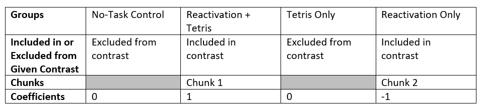
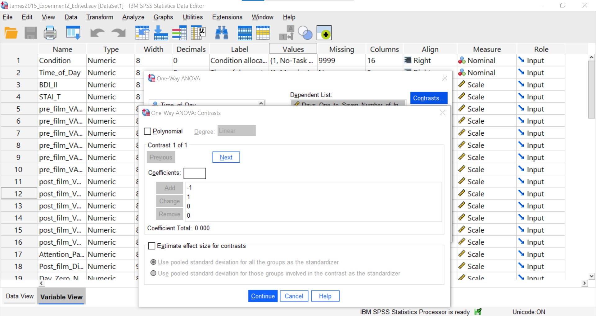
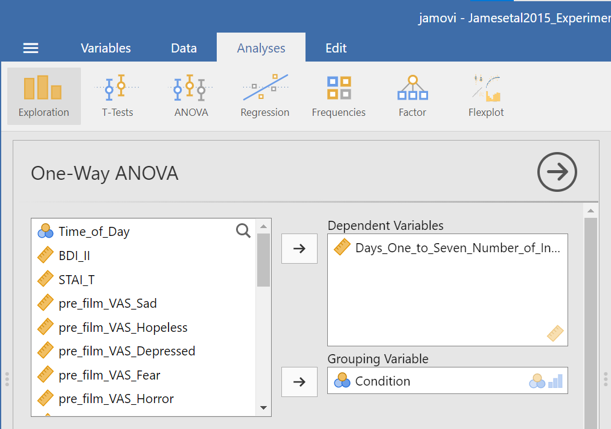
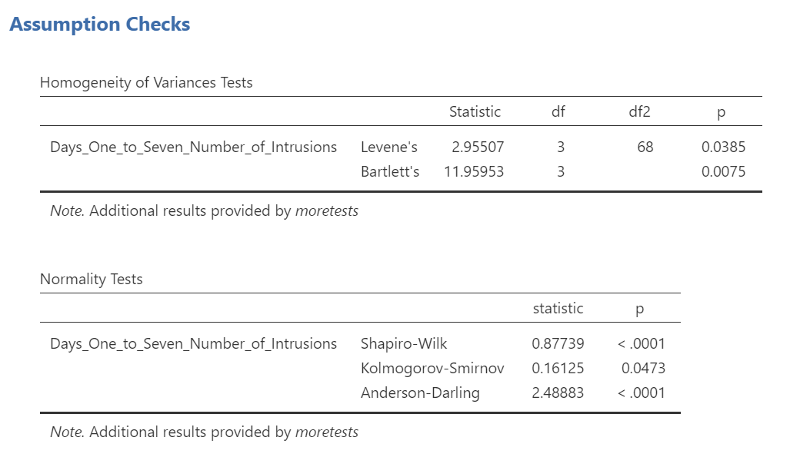
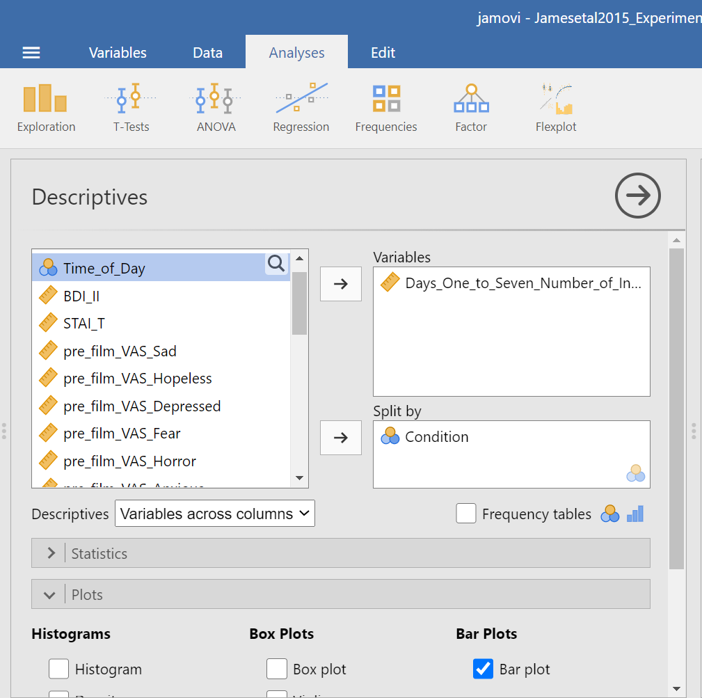
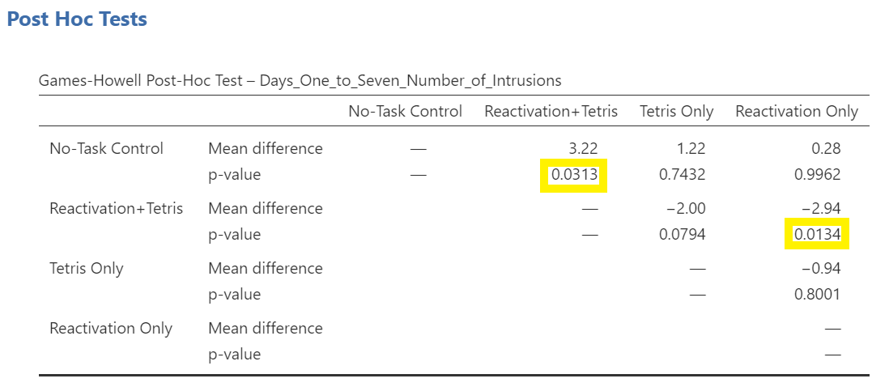
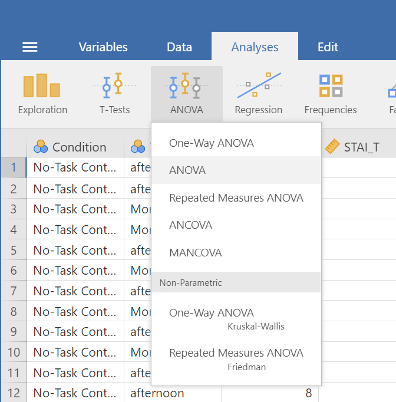
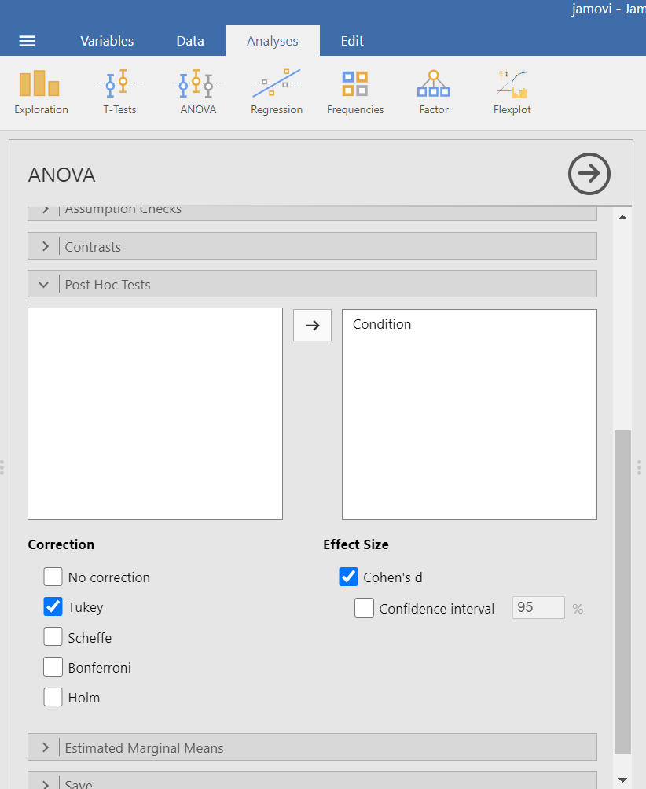
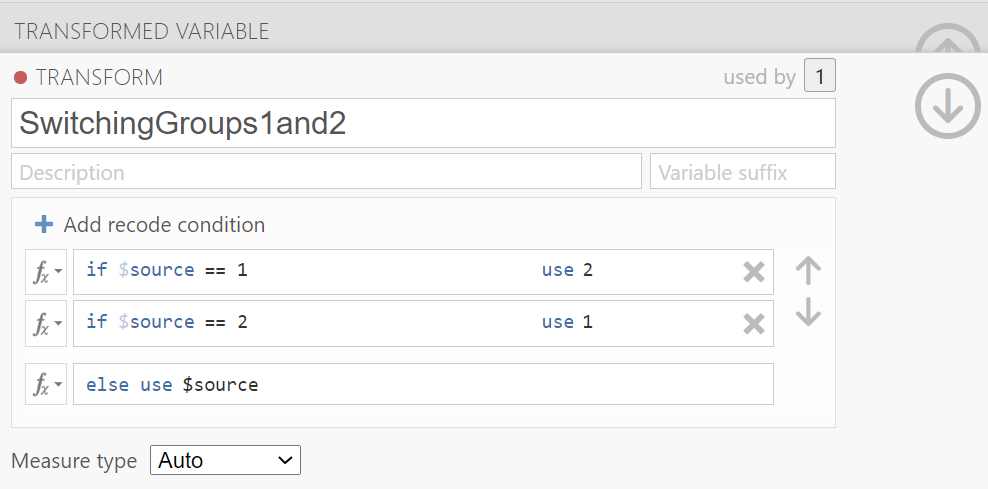

---
output:
  pdf_document: default
  html_document: default
  word_document: default
---
# Lab 7 One-way ANOVA

<script>
$("#coverpic").hide();
</script>

<span class="newthought">
The analysis of variance is not a mathematical theorem, but rather a convenient method of arranging the arithmetic.
---R. A. Fisher
</span>


<div class="marginnote">
This lab is modified and extended from [Open Stats Labs](https://sites.trinity.edu/osl). Thanks to Open Stats Labs (Dr. Kevin P. McIntyre) for their fantastic work.
</div>

## How to not think about bad memories by playing Tetris

This lab activity uses the open data from Experiment 2 of James et al. (2015) to teach one-way ANOVA with planned comparisons. Results of the activity provided below should exactly reproduce the results described in the paper.

### STUDY DESCRIPTION

Following traumatic experiences, some people have flashbacks, which are also called "intrusive memories"" and are characterized by involuntary images of aspects of the traumatic event. Although people often try to simply forget traumatic memories, this approach is not very effective. Instead, previous research suggests that a better approach may be to try to change aspects of the memory after it is formed. For example, some research shows that traumatic memories can be altered and weakened to the point that they are no longer intrusive.

Because intrusive memories of trauma are often visual in nature, James and colleagues (2015) sought to explore whether completing a visuospatial task (e.g., Tetris) after a memory was formed would interfere with the storage of that memory, and thereby reduce the frequency of subsequent intrusions. They hypothesized that  only participants who complete a visuo-spatial task after reactivation of the traumatic memories would experience a  reduction in intrusive memories. In comparison, simply completing a visuo-spatial task (without reactivation) or reactivation (without a visuo-spatial task), would not reduce the occurrence intrusive memories.

In other words, if you play Tetris shortly after you were remembering bad memories, playing Tetris might weaken those memories, which could cause you experience those kinds of intrusive memories less often in the future.

### Study Methods

To test their hypothesis, the  authors conducted an experiment ( N = 72,  n = 18 per condition). The procedure is summarized as follows:

**Trauma Film**: All participants viewed a series of video clips of graphic violence (e.g., a person getting hit by a van while using his phone as he crosses the road) as a way to create memories that should become intrusive memories. Participants then went home and recorded the number of intrusive memories they experienced over the next 24 hours. Because this is before the experimental manipulations, all groups were predicted to have an  equal occurrence of intrusive memories during the first 24-hours (called Day 0).

**Experimental Task**: After this 24-hour period, the participants returned to the lab and completed the experimental task. The experimenters randomly assigned participants to ONE of the following conditions:

1. No-task control: These participants completed a 10-minute music filler task.
2. Reactivation + Tetris: These participants were shown a series of images from the trauma film to reactivate the traumatic memories (i.e., reactivation task). After a 10-minute music filler task, participants played the video game Tetris for 12 minutes.
3. Tetris Only: These participants played Tetris for 12 minutes, but did not complete the reactivation task.
4. Reactivation Only: These participants completed the reactivation task, but did not play Tetris.

**Intrusive Memories**: All participants were asked to record the number of intrusive memories that they experienced over the next seven days (Days 1 to 7).

After the seven days had passed, participants completed an Intrusion-Provocation Task, in which they were shown blurred images from the trauma film and asked to indicate whether the blurred image triggered an intrusive memory.


## Lab Skills Learned

## Important Stuff
- citation: James, E. L., Bonsall, M. B., Hoppitt, L., Tunbridge, E. M., Geddes, J. R., Milton, A. L., & Holmes, E. A. (2015). Computer game play reduces intrusive memories of experimental trauma via re-consolidation-update mechanisms. Psychological Science, 26, 1201-1215.
- [Link to .pdf of article](http://journals.sagepub.com/stoken/default+domain/hQ2W4fbPrZVJ7eyNJaqu/full)
- <a href="https://raw.githubusercontent.com/CrumpLab/statisticsLab/master/data/Jamesetal2015Experiment2.csv" download>Data in .csv format</a>
- [Data in SPSS format](https://drive.google.com/file/d/0Bz-rhZ21ShvOZ1lvQ0dQekZGWU0/view?usp=sharing)

## R

### Load the data

Remember that any line with a \# makes a comment and the code does not run. Below is how to load the .csv data from the online repository, or from a local file (you need to change the file path to where the local file is, if you downloaded it). The data contains all of the measures and conditions from Experiment 2 in the paper.

```{r}
library(data.table)
#fread("https://raw.githubusercontent.com/CrumpLab/statisticsLab/master/data/Jamesetal2015Experiment2.csv")
all_data <- fread("data/Jamesetal2015Experiment2.csv")
```

### Inspect the dataframe

This will give you a big picture of the data frame. Click the button to view it in your browser, then take a look to see what is in it. 

```{r, eval=F}
library(summarytools)
view(dfSummary(all_data))
```

### Get the data you need

Again we have only the data from Experiment 2, so we don't need to get rid of any rows of the data. But we do need look at the columns to see how the independent variable and dependent variables were coded. 

#### The independent variable

There was one important independent variable, and it had four levels. The first column in the data frame is called condition, and it has four levels. The levels are 1, 2, 3, and 4 in the data-frame. These will correspond to the four levels in shown in figure: 

- No-task control
- Reactivation Plus Tetris
- Tetris only
- Reactivation only

Each of these refer to what subjects did after they watched the traumatic film. But, which of these correspond to the numbers 1 to 4 in the data-frame? It turns out the are in the right order, and 1 to 4 refer to:

1. No-task control
2. Reactivation Plus Tetris
3. Tetris only
4. Reactivation only

Let's do ourselves a favor and rename the levels of the `Condition` column with words so we know what they refer to. First, convert the `Condition` column to a factor, then rename the levels. Then.


```{r}
all_data$Condition <- as.factor(all_data$Condition)
levels(all_data$Condition) <- c("Control",
                                "Reactivation+Tetris", 
                                "Tetris_only",
                                "Reactivation_only")
```

#### The dependent variable

The authors showed two figures, one where they analysed intrusive memory frequency as the mean for the week, and the other where the used intrusive memory frequency on Day 7. In this tutorial, we will do the steps to run an ANOVA on the mean for the week data, and you will do follow these steps to run another ANOVA on the Day 7 data.

The mean for the week data for each subject is apparently coded in the column `Days_One_to_Seven_Number_of_Intrusions`.

### Look at the data

Remember before we do any analysis, we always want to "look" at the data. This first pass let's us know if the data "look right". For example, the data file could be messed up and maybe there aren't any numbers there, or maybe the numbers are just too weird. 

In the last two labs, we saw how to show all the data we are interested in looking at in one go. We can do the same things here. For example, in one little piece of code, we can display the means in each condition, the standard errors of the mean, and the individual scores for each subject in each condition. This is a lot to look at, but it's everything we want to look at for starters all in the same place. Looking at the data this way will also give us intuitions about what our ANOVA will tell us before we run the ANOVA. This is helpful for determining whether the results of your ANOVA are accurate or not. Let's do it...also notice that the code is very similar to what we did for the independent t-test. In fact, all I did was copy and paste that code right here, and edited it a little bit. This is really fast, and shows the efficiency of doing things this way.

```{r}
library(dplyr)

library(ggplot2)

# get means and SEs
descriptive_df <- all_data %>% 
                    group_by(Condition) %>% 
                    summarise(means= mean(Days_One_to_Seven_Number_of_Intrusions),
                              SEs = sd(Days_One_to_Seven_Number_of_Intrusions)/sqrt(length(Days_One_to_Seven_Number_of_Intrusions)))

# Make the plot
ggplot(descriptive_df, aes(x=Condition, y=means))+ 
  geom_bar(stat="identity", aes(fill=Condition))+ # add means
  geom_errorbar(aes(ymin=means-SEs,               # add error bars
                    ymax=means+SEs), width=.1) +
  geom_point(data=all_data, aes(x=Condition, y=Days_One_to_Seven_Number_of_Intrusions), alpha=.5)+
  geom_point(alpha=.25)+
  ylab("Intrusive Memories (Mean for Week)")

```


There we have it. A nice graph showing us everything. We can see there was a lot of differences at the level of individual subjects. Some subjects had a mean of 15 intrusive memories for the week. Some had 0. Lots of differences.

And, to be completely honest, this data seems a bit weird to me. It might not be weird, but it might be. The wording in the manuscript is that this data is the mean frequency of intrusive memories over the week. For the people who had 15, this means that every day they had on average 15 intrusive memories. Some people had on average 0 per day. This could be the data. But, it also seems like the data might just be frequency counts and not means at all. For example, the data could be that some people had a total of 15 intrusive over the week. The data might make more sense if these were frequency counts. Otherwise the differences between people are truly very large. For example the person who had an average of 15 intrusive memories per week, must have had 15*7 = 105 intrusive memories, which is a lot more than zero. In any case, this kind of wondering about the data is what happens when you start to notice how numbers work. It's useful develop your data sense.

Let's move on to the ANOVA. By looking at the above graph do you have an intuition about what the ANOVA will tell us? I do, it should easily tell us that we are going to get an F-value that is bigger than one, and a p-value that is probably smaller than .05? How do I know this? I looked at the error bars, which represent the standard errors of the mean. If we look across conditions we can see that that the error bars don't always overlap. This suggests there are differences in the data that don't happen very often by chance. So, we expect a smallish p-value. Why do you think I expect the F-value to be greater than 1? If you can answer this question with a justification and explanation of how F works, pat yourself on the back!

### Conduct the ANOVA

Conducting an ANOVA in R is pretty easy. It's one line of code, just like the t-test.

It's worth knowing that there are a few different packages out there to do an ANOVA, for example Mike Lawrence's `ezANOVA` package is pretty popular. 

For this tutorial we'll show you how to run the ANOVA using the `aov` function from base R (comes pre-installed). This is pretty "easy" too. I put easy in quotes because the first time I saw this, it was not easy for me. Here's a brief digression for me to tell you that I feel your pain. I was first introduced to R by Patrick Bennett (a professor at McMaster University, where I attended graduate school). Pat, like I am doing know, forced us to use R in his statistics class. I remember having zero clue about so many things, and was often very frustrated. So, I imagine some of you are quite frustrated too. I was luck, like some of you, to have had some previous experience with other programming languages, so I was familiar with what R might be doing. What I was most frustrated with, was learning how to tell R what to do. In other words, I didn't know how to write the commands properly. I didn't understand what we call the **syntax** of R.

This was back many years ago now, well before there was so many helpful examples on Google with working code, showing you how the syntax works. All we had was the R help files, which were a total mystery to me. If you want to see the help file for `aov`, just type `?aov()` into the console, and press enter. You will see an "explanation" of how the `aov` function is supposed to work. You can use the same trick for any R function, like this `?name_of_function()`. To be clear, you have to replace the letters `name_of_function`, with the name of the function. Some of you think that might be super obvious, but that is the kind of thing I did not think was obvious. So, when I read the help file for how to use the `aov` function, that is to learn what to put where, I didn't feel like it was showing me what I needed to do. Usually, at the bottom of the help file, there are some examples, and these are helpful, but sometimes they are missing the example you need, and you are expected to generalize your knowledge of how `aov` works, to make it work for your problem. This is a catch-22 because if you don't know how it works, you can't generalize. IMO, you need a lot of examples of things that work. 

So, with that digression, I'm going to explain the syntax for the aov function. It looks like this:

`aov(DV ~ IV, dataframe)`

That probably looks really foreign. Let me explain. First you need write `aov()`. `aov` is the name of the function, followed by the brackets. The brackets are a sandwich. Sandwiches have a top and a bottom, and they enclose the things you put in the sandwich. We then put things inside the `()`, in specific ways to make the `aov` sandwich. The `DV` stands for the name of the dependent variable in the data frame. For us, this will be `Days_One_to_Seven_Number_of_Intrusions`. So, when we add that, our function will look like:


`aov(Days_One_to_Seven_Number_of_Intrusions ~ IV, dataframe)`

Next, the `~` (tilda) stands for the word 'by'. We are saying we want to analyse the Dependent variable **by** the conditions of the independent variable.

The `IV` stands for the name of the column that is your independent variable. Our's is called `Condition`. Adding that in, our formula looks like:

`aov(Days_One_to_Seven_Number_of_Intrusions ~ Condition, dataframe)`

Finally, the last part is the name of the data-frame we are using. The `aov` function only works on long-form data, where each score on the dependent variable has it's own row. Our's is already set up this way! The name of our data-frame is `all_data`. We add that in, and it looks like:

`aov(Days_One_to_Seven_Number_of_Intrusions ~ Condition, all_data)`

In English, this means, do an ANOVA on the dependent variable as a function of the independent variable, and use the data in my data frame.

This is it for now. The `aov` function is very flexible because you can define different kinds of formulas (the `DV ~ IV` part). We'll see other examples in later chapters. For now, this is all we need. Also, what's cool, is that this will work for any single IV with any number of levels (conditions) 2 or greater. Fun. Let's see it in action.

```{r}
aov(Days_One_to_Seven_Number_of_Intrusions ~ Condition, all_data)
```

What is this garbage? I don't see an ANOVA table, what is this? You are seeing the raw print out of the aov function. Clearly, this is not helpful, it's not what we want to see.

Fortunately, R comes with another function called `summary`. What it does is summarize the results of functions like `aov`, and prints them out in a nicer way. Let's see the summary function do it's thing:

```{r}
summary(aov(Days_One_to_Seven_Number_of_Intrusions ~ Condition, all_data))
```

Alright, now we have an ANOVA table we can look at. However, it still looks ugly, at least to me. When you are working inside an R Markdown document, you have some more options to make it look nice. We can use the `kable` and `xtable` function together, like this. 

```{r}
library(xtable)
aov_out<-aov(Days_One_to_Seven_Number_of_Intrusions ~ Condition, all_data)
summary_out<-summary(aov_out)

knitr::kable(xtable(summary_out))
```

Now we see a nicer print out. Especially if we `knit` the document into a webpage.

### Reporting the ANOVA results

Refer tot the textbook on ANOVAs for a deeper discussion of all the things in the ANOVA table. We'll remind about some of those things here.

First, let's look at how we might report the results. There are three very important parts to this. 

1. Saying what test you did to what data
2. Reporting the inferential statistics
3. Reporting the pattern in the means

Here is part 1, we need to say what data we used, and what kind of test we used on that data:


> We submitted the mean intrusive memories for the week from each subject in each condition to a one-factor betwee-subjects ANOVA, with Intervention type (No-task control, Reactivation Plus tetris, Tetris only, Reactivation only) as the sole independent variable. 

Part 2 is saying what the results of the test were. Specifically, we report the values from the inferential test (see the textbook for why these values). Also, you should be able to answer this question: why do we report the values that we do?

> We found a main effect of Intervention type, F(3, 68) = 3.79, MSE = 10.09, p = 0.014.

Part 3 is saying what the pattern was in the means. Remember, that in the ANOVA, a significant effect refers to the global variation among the means. In other words, we can say that there are some differences between the means, but we can't specifically say which pairs of means are different, or which groups of means are different from one another. How can we report this, where are the means? In fact, we already found them when we plotted the data earlier. So, we can copy paste that code, and print out the means, rather than the figure:

```{r}
# get means and SEs
descriptive_df <- all_data %>% 
                    group_by(Condition) %>% 
                    summarise(means= mean(Days_One_to_Seven_Number_of_Intrusions),
                              SEs = sd(Days_One_to_Seven_Number_of_Intrusions)/sqrt(length(Days_One_to_Seven_Number_of_Intrusions)))

knitr::kable(descriptive_df)

```

No we have to use a sentence to describe these means.

> Refer to table 1 for the means and standard errors of the mean in each condition

or,

> Mean intrusive memories per week were 5.11 (SE = .99); 1.89 (SE = .41); 3.89 (SE = .68); and 4.83 (SE= .78), in the Control, Reaction plus Tetris, Tetris Only, and Reactivation only conditions, respectively

Ugh, what a mouthful. Be mindful of how you write results. The above is not helpful because you see a list of numbers, and then a list of conditions, and the reader has to do a lot of work to keep everything straight. I like the table option.

I also like this other kind of option:

> Mean intrusive memories were significantly different between the Control (M = 5.11, SE = .99), Reactivation plus Tetris (M = 3.89, SE = .68), Tetris only (M= 3.89, SE = .68), and Reactivation only (M = 4.83, .78) conditions.

That's a little bit better. Let's put it all in one place to see what it look like:

> We submitted the mean intrusive memories for the week from each subject in each condition to a one-factor betwee-subjects ANOVA, with Intervention type (No-task control, Reactivation Plus tetris, Tetris only, Reactivation only) as the sole independent variable. We found a main effect of Intervention type, F(3, 68) = 3.79, MSE = 10.09, p = 0.014. Mean intrusive memories were significantly different between the Control (M = 5.11, SE = .99), Reactivation plus Tetris (M = 3.89, SE = .68), Tetris only (M= 3.89, SE = .68), and Reactivation only (M = 4.83, .78) conditions.

### Individual comparisons

This next part is complicated, so we intentionally simplify it. There are these things (remember from the textbook), called comparisons. We use them to compare differences between specific conditions of interest. That part isn't very complicated. You just pick the things you want to compare, and compare them. 

What is complicated is exactly what you "should" do to make the comparison. It turns out there are lots of recommendations and disagreements about what you should do. There are also lots of tests that you can do, so you have a lot of options. We are not going to show you here all of the tests. This is beyond the scope of what we are trying to teach you. Instead, we will use tests that you already know, the t-test for independent samples from the last lab. It will do the job for this data.

We think that before you can make good decisions about the kind of comparison test you want to use, you have to have a solid understanding of **what you are comparing** and **what you are not comparing** when you use different tests. We think this understanding is more important than what test you use. More important, is that you know what means you want to compare. In this case, we will talk about what means we want to compare, and then just do a t-test.

#### What did the ANOVA tell us

Remember, the ANOVA we conducted is termed the **omnibus** test in the textbook. What means was it comparing? It wasn't comparing specific means. It was asking a kind of blind and very general question: Are any of these means different. Our answer was yes. Our next question is: What means were different from what other means? The ANOVA doesn't know the answer to this question. It just says I don't know...

#### Comparing specific means and the experimental question

Notice there are 4 means to compare. So, there are (4-1)! = 3! = 3x2x1 = 6 total different comparisons. The ! stands for factorial. What's more important is recognizing that when you have more than two conditions (where you can only make one comparison, A vs. B), you get increasingly more comparisons. For four conditions, A, B, C, D, you get six comparisons, they are:

`AB, AC, AD, BC, BD, and CD` where each letter pair refers to A compared to B (AB), A compared to C (AC), and so on.

Do we actually care about all of these comparisons? Perhaps. What was the point of the experiment? Remember, the experiment was asking a questions, that's why they set-up the condition necessary to produce these means. What question were they asking? What did they want to know? 

They wanted to find out if various interventions after watching the scary movie, would change how many bad intrusive memories people would experience in the week following the movie. They discuss the idea that a memory can become malleable when it is re-activated. They want to "Re-activate" the bad memories, and then while they were changeable, do something to them to make them less likely to be intrusive later on. The big idea was that doing a bit of "re-activation" AND then playing Tetris (which takes up visual cognitive bandwidth) could cause changes to the re-activated memories, that would decrease the number of intrusive memories later on. With that reminder, let's go through some different comparisons that we can make, and talk about what they might mean.

#### Control vs. Reactivation_only

There was a control group that did not do anything special after watching the traumatic movie. The mean number of intrusive memories for the control group, gives some idea of the amount of intrusive memories we would expect to measure, when you do nothing to change that number.

Comparing to the control group is a very sensible thing do to for each of the other groups. If one of the manipulations worked, it should show a different mean (something changed) than the control group.

So, did the Reaction_only group have less intrusive memories over the control group? First we use the `filter` function from `dplyr` to select only the rows from the data frame that have the Control and Reactivation_only conditions. Then we run a t-test

```{r}
comparison_df <- all_data %>% 
                  filter(Condition %in% c('Control','Reactivation_only')==TRUE)
                        
t.test(Days_One_to_Seven_Number_of_Intrusions ~ Condition, 
       comparison_df,
       var.equal=TRUE)
```

The means are both basically 5, not a big difference!. The p-value is large, suggesting that change could easily have produced the tiny differences between the means. In other words, it doesn't look like the "re-activation" phase did anything to suppress the amount of intrusive memories that people would have over one week, compared to control.

Notice, this was a comparison we could make. But, was it an informative one about the goal of the study? Not really. 

#### Control vs. Reactivation+Tetris

What we really want to know is if Reactivation+Tetris cause fewer intrusive memories...but compared to what? Well, if it did something, it should have a smaller mean than the Control group. So, let's do that comparison:

Note: we just change the one level name to the level we want `Reactivation+Tetris`.

```{r}
comparison_df <- all_data %>% 
                  filter(Condition %in% c('Control','Reactivation+Tetris')==TRUE)
                        
t.test(Days_One_to_Seven_Number_of_Intrusions ~ Condition, 
       comparison_df,
       var.equal=TRUE)
```

There is a bigger difference now, roughly 5.1 intrusive memories for control, and 1.9 for Reactivation+Tetris. The p-value is quite small, indicating this difference was not likely produced by chance. Now, we have some evidence that Reactivation+Tetris caused something to change, that condition produced fewer intrusive memories than control. 

#### Control vs. Tetris_only

Now we can really start wondering what caused the difference. Was it just playing Tetris? It wasn't just doing the reactivation, we already found out that didn't do anything. Does just playing Tetris reduce the number of intrusive memories during the week? Let's compare that to control:

```{r}
comparison_df <- all_data %>% 
                  filter(Condition %in% c('Control','Tetris_only')==TRUE)
                        
t.test(Days_One_to_Seven_Number_of_Intrusions ~ Condition, 
       comparison_df,
       var.equal=TRUE)
```

There's mean difference of about 1, but the p-value isn't very small. This suggests chance produces a difference of this size fairly often. If we claimed that just playing Tetris caused a difference based on this data, we could  easily be making a type I error (claiming the result is real when it is not, a false-positive). Still, the difference was in the right direction wasn't it.

#### Tetris_only vs. Reactivation + Tetris

Finally, we might ask if the Reactivation+Tetris group had fewer unwanted memories than the Tetris_only group. Did putting the two things together (reactivation AND Tetris) really do something special here, beyond just playing Tetris.

```{r}
comparison_df <- all_data %>% 
                  filter(Condition %in% c('Tetris_only','Reactivation+Tetris')==TRUE)
                        
t.test(Days_One_to_Seven_Number_of_Intrusions ~ Condition, 
       comparison_df,
       var.equal=TRUE)
```

Well, according to the t-test, the p-value is again fairly small. Suggesting that the difference between Reactivation+Tetris (M=1.89) and Tetris_only (3.89), was not likely to be produced by chance. So, on the basis of this, there is some evidence that Reactivation+Tetris, really does cause fewer intrusive memories.

### Writing it all up.

Because we have spent so much time on individual comparisons, we won't do a full write up of the results. A full write-up would include telling the reader what data was used, what test was conducted, the results of the test, and the pattern of the means, AND then, the results of specific comparisons of interest. You can read the paper to see how the authors did it.


### Food for thought

Think about what we did here. We almost blindly just downloaded the data and ran the same analysis as the authors did. Sure, we looked at the data first, and then did the analysis. But, did we really look? Did you notice anything about what you looked at? What did we not look closely at that might make you skeptical of the conclusions from the research...

Here's a hint. Sample-size. We know that is important. Let's ask the question, was there an equal number of participants in each of the 4 conditions. We can use `dplyr` again to do this. We'll add the `length` function, which counts the number of subjects in each condition:

```{r}
descriptive_df <- all_data %>% 
                    group_by(Condition) %>% 
                    summarise(means= mean(Days_One_to_Seven_Number_of_Intrusions),
                              SEs = sd(Days_One_to_Seven_Number_of_Intrusions)/sqrt(length(Days_One_to_Seven_Number_of_Intrusions)),
                              count = length(Days_One_to_Seven_Number_of_Intrusions))

knitr::kable(descriptive_df)


```

The answer is YES, there were an equal number of subjects. That's good. We should have checked that before. Lesson for next time. For example, if there were only 9 subjects in the Reactivation+Tetris group, we might be suspicious that they got lucky, and accidentally (by chance) assigned people to that group who are unlikely to report having intrusive memories. After all, different people are different, and not everybody is as susceptible to intrusive memories.

Let's do one more thing for fun, and to see everything in action all in one place. Let's consider the role of outliers. Looking at the first graph we can see that most people in all the groups had fewer than 10 intrusive memories (mean we assume) per week. It looks like 5 people had more than that, and they just happened to be in the other groups. Maybe Reactivation+Tetris made those people have way less intrusive memories (which is why no one is above 10), or maybe the researchers got a little bit unlucky, and accidentally didn't get any "outliers" (people with extreme values on the measure) in that group. 

Let's re-run the analysis, but remove anybody with a mean higher than 10. This will only remove 5 subjects, so we will still have a lot left. What happens?

Before we find out, let me point out again the beauty of R. All we need to do is copy and paste our previous code. Then, just filter the data once to remove the outliers, then voila, we redo everything all in one go. It's much more complicated and time consuming to do this in many other software programs. You are lucky to be learning R.

```{r}

# get rid out of outliers

all_data  <- all_data %>%
             filter(Days_One_to_Seven_Number_of_Intrusions < 10)

# get means and SEs

descriptive_df <- all_data %>% 
                    group_by(Condition) %>% 
                    summarise(means= mean(Days_One_to_Seven_Number_of_Intrusions),
                              SEs = sd(Days_One_to_Seven_Number_of_Intrusions)/sqrt(length(Days_One_to_Seven_Number_of_Intrusions)))

# Make the plot

ggplot(descriptive_df, aes(x=Condition, y=means))+ 
  geom_bar(stat="identity", aes(fill=Condition))+ # add means
  geom_errorbar(aes(ymin=means-SEs,               # add error bars
                    ymax=means+SEs), width=.1) +
  geom_point(data=all_data, aes(x=Condition, y=Days_One_to_Seven_Number_of_Intrusions), alpha=.5)+
  geom_point(alpha=.25)+
  ylab("Intrusive Memories (Mean for Week)")

# run and report the ANOVA

aov_out<-aov(Days_One_to_Seven_Number_of_Intrusions ~ Condition, all_data)
summary_out<-summary(aov_out)

knitr::kable(xtable(summary_out))

# conduct critical comparisons

## control vs reactivation+Tetris

comparison_df <- all_data %>% 
                  filter(Condition %in% c('Control','Reactivation+Tetris')==TRUE)
                        
t.test(Days_One_to_Seven_Number_of_Intrusions ~ Condition, 
       comparison_df,
       var.equal=TRUE)

## Tetris_only vs reactivation+Tetris

comparison_df <- all_data %>% 
                  filter(Condition %in% c('Tetris_only','Reactivation+Tetris')==TRUE)
                        
t.test(Days_One_to_Seven_Number_of_Intrusions ~ Condition, 
       comparison_df,
       var.equal=TRUE)

```

The take home is that yes, even after removing outliers, the same basic pattern in the data is observed. Overall, this is a small n study, and ideally the basic findings should be replicated in another lab before we really have full confidence in them. But, I'd say the trends here look promising.

That's ANOVA. Come back next week for another ANOVA tutorial, this time using within-subject data. It's called a repeated measures ANOVA, and it's what's happening next week.

### Generalization Exercise

Your task is to conduct the ANOVA using `Day_Zero_Number_of_Intrusions` as the dependent variable. Report the ANOVA table, a figure to show the means, and a short write-up of the results.


### Writing assignment

(2 points - Graded)

Answer the following questions:

1. Explain why the ANOVA is called an omnibus test, and how the omnibus test is different from comparing specific means with t-tests. (1 point)

2. Explain the general similarity between the ratios that are used to calculate the F value and the t-value (1 point)

General grading. 

- You will receive 0 points for missing answers 
- You must write in complete sentences. Point form sentences will be given 0 points.
- Completely incorrect answers will receive 0 points. 
- If your answer is generally correct but very difficult to understand and unclear you may receive half points for the question


## Excel

How to do it in Excel


## SPSS

In this lab, we will use SPSS to:

1. Perform a One-Factor Analysis of Variance (ANOVA) and Graphing the data
2. Planned comparisons: Use orthogonal contrasts to locate differences
3. Unplanned comparisons: Use a *post-hoc* test to locate differences

### Experiment Background

---


As described at the beginning of this lab manual section, researchers in the James et al. (2015) study sought to explore whether completing a visuo-spatial task (e.g., Tetris) after a memory was formed would interfere with the storage of that memory, and thereby reduce the frequency of subsequent intrusions. They hypothesized that only participants who complete a visuo-spatial task after reactivation of the traumatic memories would experience a reduction in intrusive memories. In comparison, simply completing a visuo-spatial task (without reactivation) or reactivation (without a visuo-spatial task), would not reduce the occurrence intrusive memories. In other words, if you play Tetris shortly after you were remembering bad memories, you will experience intrusive memories less often in the future.

The authors conducted an experiment (N = 72, n = 18 per condition) wherein all participants viewed a series of video clips of graphic violence (e.g., a person getting hit by a van while using his phone as he crosses the road). Over the next 24 hours, participants recorded their intrusive memories. All groups were predicted to have an equal occurrence of intrusive memories during this pre-manipulation period (called Day 0).

Experimental Task: After this 24-hour period, the participants returned to the lab and completed the experimental task. The experimenters randomly assigned participants to ONE of the following conditions:

1. No-Task Control: These participants completed a 10-minute music filler task.
2. Reactivation + Tetris: These participants were shown a series of images from the trauma film to reactivate the traumatic memories (i.e., reactivation task). After a 10-minute music filler task, participants played the video game Tetris for 12 minutes.
3. Tetris Only: These participants played Tetris for 12 minutes, but did not complete the reactivation task.
4. Reactivation Only: These participants completed the reactivation task, but did not play Tetris.

Dependent variable: Intrusive Memories: All participants were asked to record the number of intrusive memories that they experienced over the next seven days (Days 1 to 7).

### Performing a One-Factor Analysis of Variance (ANOVA) & Graphing the data

---


First, let's open the relevant data file; [Here](https://github.com/CrumpLab/statisticsLab/blob/master/data/spssdata/James2015_Experiment2.sav) is the link. It's called "James2015_Experiment2.sav" Open this file in SPSS. Your data should look like this:

```{r , echo=FALSE,dev='png'}
knitr::include_graphics('img/8.4.11.png')
```

In this experiment, there was one important independent variable, called `Condition`, and it has four levels. The levels are 1, 2, 3, and 4 in the spreadsheet. These will correspond to the four levels in shown below:

1. No-Task Control
2. Reactivation + Tetris
3. Tetris Only
4. Reactivation Only

The dependent variable is recorded in the column `Days_One_to_Seven_Number_of_Intrusions`. This represents the mean number of intrusions for that week. We are testing the hypothesis that the number of intrusive memories will be different among the groups (1-4). For now, we will not specify which group we think is going to have the highest or lowest number of memories, but rather we will test if there is a difference SOMEWHERE between these 4 groups.

Let's begin. Go to <span style="color:blue">Analyze</span>, then <span style="color:blue">Compare Means</span>, then select <span style="color:blue">One-Way ANOVA...</span>

```{r , echo=FALSE,dev='png'}
knitr::include_graphics('img/8.4.12.png')
```

The next window will ask you to specify the dependent variable (move the variable `Days_One_to_Seven_Number_of_Intrusions` from the list on the left to the field labeled Dependent Variable) and the "Factor", which is the same thing as the independent variable or grouping variable (remember back to *t*-tests!). Move the variable `Condition` from the list into the field labeled "Factor". Your window should look like this:

```{r , echo=FALSE,dev='png'}
knitr::include_graphics('img/8.4.13.png')
```

Now, click the <span style="color:blue">Options</span> button, and then choose <span style="color:blue">Means plot</span>.

```{r , echo=FALSE,dev='png'}
knitr::include_graphics('img/8.4.14.png')
```

Then, click <span style="color:blue">Continue</span> and <span style="color:blue">OK</span>.

SPSS will produce an output window containing the results of the ANOVA (an ANOVA table), as well as a graph of the group means. It should look as follows:

```{r , echo=FALSE,dev='png'}
knitr::include_graphics('img/8.4.15.png')
```

First, let's look at our ANOVA table: We see our *F*-statistic listed is 3.795, with a *p*-value of .014. This tests the null hypothesis that there is no difference among the groups. Since *p* is less than our likely alpha level (.05), we can reject the null hypothesis and conclude that there IS a difference somewhere among these groups. We may say it more formally as follows:

The effect of condition on mean intrusive memories over days 1-7 was significant, *F*(3, 68) = 3.80, *p* < .05. 

To examine the data further, let's refer to the graph created by SPSS: we can see that the Reactivation + Tetris condition appears to have the smallest mean. As for the others, they are all greater than Reactivation + Tetris, but differ somewhat from each other as well. It is important to know that at this point, we do not know where the significant differences could be. For example, it could be that only Reactivation + Tetris is different from No-Task Control, or it could be that there are other groups different from one another as well. In order to locate where the differences are, we must conduct additional analyses called either planned or unplanned comparisons.

### Follow-Up Tests

In practice, you know before conducting your experiment and analyses whether you have reason to look for specific differences (based on what the literature says, theories that exist, etc.) or you will explore the differences without reason to look at something specific (if you have a significant result in the omnibus ANOVA).  This differentiation will determine whether you will conduct orthogonal linear contrasts / planned comparisons (you had reasons to look for specific differences / *a priori* comparisons) or you will run a *post-hoc* test to explore the differences (you had no reason to look for any specific differences).  

In lab, we are going to take both approaches with the same example just to discuss how to do each type of follow-up. You will **NOT** run conduct both planned comparisons and post-hoc tests in practice – EVER.  We are doing this for demonstration purposes only.

### Planned Comparisons: T-Contrasts 

<div class="marginnote">
Section contributed by Sherry Neville-MacLean, 2021.
</div>

---

#### Planned Comparisons and Ideas to Keep in Mind when Making Orthogonal Contrasts

The first approach we will consider in terms of follow-up tests is planned comparisons. There are some rules about making these comparisons which we call orthogonal linear contrasts. First, we can only make as many comparisons as the number of groups we have minus 1 (*k* - 1, where *k* = number of conditions). 
In our example, we could make up to 3 comparisons because we have 4 groups: 

1. No-Task Control
2. Reactivation + Tetris
3. Tetris Only
4. Reactivation Only

<div class="marginnote">
This section is largely paraphrased from Discovering Statistics Using IBM Statistics, according to its “All rights reserved” copyright license. Thank you Field, A. (2018) for aiding in our understanding of orthogonal contrasts. 
</div>

According to Field (2018), your planned comparisons should also be guided by these rules:

1: Compare only two chunks of variation at a time (within a contrast). If a group is compared to a group containing all other levels in one contrast, that first group should be excluded from any subsequent contrasts.

2: Within a given contrast, assign one chunk of variation positive coefficients and the opposite chunk negative coefficients.

3: The sum of the coefficients for a given contrast should be zero.

4: For a given contrast, excluded groups are given a coefficient of zero.

5: For a given contrast, the coefficients assigned to the group(s) in one chunk of variation should be equal to the number of groups in the opposite chunk of variation.

#### Coefficients for This Example

For the sake of our demonstration, let’s follow the planned comparisons that the researchers reported. It is very likely their planned comparisons were based on the literature about visual images and memory. The report three planned comparisons:

1) No-Task Control vs. Reactivation + Tetris

2) Reactivation + Tetris vs. Tetris Only

3) Reactivation + Tetris vs. Reactivation Only

Let’s consider the orthogonal contrasts before returning to SPSS to request these follow-up tests.
For the first planned comparison, No-Task Control vs. Reactivation + Tetris, we are excluding two groups (Tetris Only and Reactivation Only). Each of those groups will be given a coefficient of zero in the contrast. We are left with two groups to compare. Each can be given a coefficient of 1, but one will need to be a positive 1 and the other will need to be a negative 1. It does not matter which group is given which sign.

Consider the first contrast:

```{r , echo=FALSE,dev='png'}

```

Sum of Coefficients: -1 + 1 + 0 + 0 = 0

For the second planned comparison, Reactivation + Tetris vs. Tetris Only, we are excluding two groups (No-Task Control and Reactivation Only). Each of those groups will be given a coefficient of zero in the contrast. We are left with two groups to compare. Each can be given a coefficient of 1, but one will need to be a positive 1 and the other will need to be a negative 1. It does not matter which group is given which sign.

Consider the second contrast:

```{r , echo=FALSE,dev='png'}

```

Sum of Coefficients: 0 + 1 + -1 + 0 = 0

For the third planned comparison, Reactivation + Tetris vs. Reactivation Only, we are excluding two groups (No-Task Control and Tetris Only). Each of those groups will be given a coefficient of zero in the contrast. We are left with two groups to compare. Each can be given a coefficient of 1, but one will need to be a positive 1 and the other will need to be a negative 1. It does not matter which group is given which sign.

Consider the third contrast:

```{r , echo=FALSE,dev='png'}

```

Sum of Coefficients: 0 + 1 + 0 + -1 = 0

#### Requesting the Planned Comparisons in SPSS

We can request all three planned comparisons at the same time in SPSS. Let's start with the first comparison (Groups 1 and 2; No-Task Control vs. Reactivation + Tetris). Go to <span style="color:blue">Analyze</span>, <span style="color:blue">Compare Means</span>, and then <span style="color:blue">One-Way ANOVA.</span>.

```{r , echo=FALSE,dev='png'}

```

Let's place our dependent variable (`Days_One_to_Seven_Number_of_Intrusions`) in its appropriate field – in the Dependent List field. Then, place `Condition` into the Factor field. 

```{r , echo=FALSE,dev='png'}

```

At this point, we have to click <span style="color:blue">Contrasts</span> to specify our planned comparison. 

```{r , echo=FALSE,dev='png'}

```

**It is important to keep the coefficients for the contrast in the same order as the order in which the groups are included in the data file.** In the data file, No-Task Control, Reactivation + Tetris, Tetris Only, and Reactivation Only are coded as 1, 2, 3, and 4, respectively. Fortunately, we considered our groups in the previously tables in the order they are in the data file. 

```{r , echo=FALSE,dev='png'}

```

Each time you enter a coefficient, you will need to click <span style="color:blue">Add</span> before entering the following coefficient.

```{r , echo=FALSE,dev='png'}

```

You will need to enter each of the four coefficients and click <span style="color:blue">Add</span>. That is sufficient information to have SPSS run the first planned comparison. 

```{r , echo=FALSE,dev='png'}

```

Now, to enter the coefficients for the second contrast (Groups 2 and 3; Reactivation + Tetris vs. Tetris Only), you will need to click <span style="color:blue">Next</span>. 

```{r , echo=FALSE,dev='png'}

```

Follow the steps explained above to include the coefficients for the contrast. You will know your second contrast is included when you see something like this – with the four coefficients reported under a section called "Contrast 2 of 2."

```{r , echo=FALSE,dev='png'}

```

Repeat the process of clicking <span style="color:blue">Next</span> and entering the coefficients for the third contrast (Groups 2 and 4; Reactivation + Tetris vs. Reactivation Only). When you are finished, you will see something like this – with the four coefficients reported under a section called "Contrast 3 of 3."

 ```{r , echo=FALSE,dev='png'}

```

Select "Estimate effect size for contrasts."

```{r , echo=FALSE,dev='png'}

```

Click <span style="color:blue">Continue</span> and then <span style="color:blue">OK</span>. SPSS will produce the standard output tables for the ANOVA, contrasts, and effect sizes. 

```{r , echo=FALSE,dev='png'}

```

As we can see, while considering the violation to the assumption of homogeneity of variance, the *t*-tests are significant. We can report Hedge's correction when considering the effect size. There is indeed a difference between Groups 1 and 2 (No-Task Control vs. Reactivation + Tetris), *t*(22.63) = -2.99, *p* < .05, *g* = -1.00; between Groups 2 and 3 (Reactivation + Tetris vs. Tetris Only), *t*(27.96) = -2.52, *p* < .05, *g* = -0.62; and between Groups 2 and 4 (Reactivation + Tetris vs. Reactivation Only), *t*(25.68) = -3.32, *p* < .05, *g* = -0.92.


### Unplanned Comparisons: *Post-hoc* tests

---


Another way to find the differences between groups in a one-way, or one-factor, ANOVA is to conduct something called a *post-hoc* test. This test is referred to as "unplanned" because you only conduct one when you have a significant overall ANOVA. The *post-hoc test* is neat because it is conveniently summoned during the process of conducting an ANOVA, and its results are presented in a compact table. 

Let's use a *post-hoc* test to look at this data. Although there are many types of *post-hoc* tests, the commonly used is Tukey *post-hoc* test when the assumption of homogeneity of variance is met. When that assumption is violated, Games-Howell is commonly used. Let's begin.

We are going to go through the same steps as before in order to conduct our ANOVA: Go to <span style="color:blue">Analyze</span>, then <span style="color:blue">Compare Means</span>, then <span style="color:blue">One-Way ANOVA...</span>

```{r , echo=FALSE,dev='png'}
knitr::include_graphics('img/8.4.12.png')
```

Place the dependent variable (`Days_One_to_Seven_Number_of_Intrusions`) in its appropriate field – in the “Dependent List” field. Then, place `Condition` into the "Factor" field. Next, click the button labeled <span style="color:blue">Post-hoc</span>. A window will appear with options for various *post-hoc* tests. We are going to choose <span style="color:blue">Games-Howell</span> (**Question: Why are we selecting Games-Howell?**):

```{r , echo=FALSE,dev='png'}

```

Click <span style="color:blue">Continue</span>, and then <span style="color:blue">OK</span>. SPSS will produce the ANOVA table once again, followed by a table that refer to the *post-hoc* test. Let's look at the table named "Multiple Comparisons."


#### Multiple Comparisons

---


```{r , echo=FALSE,dev='png'}

```

In this table, every possible group of 2 conditions is being compared. Notice that the table is redundant; it considers the comparison between No-task Control and Reactivation + Tetris to be different from Reactivation + Tetris vs. No-task Control. However, we know these are the same comparisons. So, we only need to look at half of the table, in essence. 

If you start with row 1, this row compares No-task Control with Reactivation + Tetris. If we find the Sig. column, we see the corresponding *p*-value for this row is .031. Because this is less than our likely alpha level (.05), this means that these two conditions ARE significantly different from one another. Where else is there a Sig. that is less than alpha (.05)?

Reactivation + Tetris compared with Reactivation Only has a *p*-value of .013. This is also a significant difference. These are the only significant differences we see here. This means that, among the 4 groups, only two differences were found: Reactivation + Tetris is different from No-task Control, and Reactivation + Tetris is different from Reactivation Only.


### Other Commands Used to Conduct the One-Way ANOVA in SPSS: General Linear Model

Oftentimes, there is more than one way to accomplish a similar task using SPSS. We have examined how to conduct an ANOVA using the <span style="color:blue">Analyze</span> → <span style="color:blue">Compare Means</span> → <span style="color:blue">One-Way ANOVA...</span> command. Using the same example, let’s look at another set of commands to request an ANOVA.

Go to <span style="color:blue">Analyze</span>, then <span style="color:blue"> General Linear Model</span>, and then <span style="color:blue">Univariate...</span>

```{r , echo=FALSE,dev='png'}

```

You should be presented with a pop-up window similar to the following:

```{r , echo=FALSE,dev='png'}

```

Place the dependent variable (`Days_One_to_Seven_Number_of_Intrusions`) in its appropriate field – in the “Dependent List” field. Then, place `Condition` into the "Fixed Factor(s)" field.

```{r , echo=FALSE,dev='png'}

```

Next, click <span style="color:blue">Options</span>. 

```{r , echo=FALSE,dev='png'}

```

Here, you could request Descriptive Statistics, Estimates of effect sizes, and Homogeneity Tests. For our purposes, let’s request a test of homogeneity of variance.

```{r , echo=FALSE,dev='png'}

```

Click <span style="color:blue">Continue</span> and <span style="color:blue">Ok</span>.

SPSS should generate three output tables in the output file. Let’s focus on the homogeneity test first. As we noted using the other set of commands, you should see that Levene’s test is significant.

```{r , echo=FALSE,dev='png'}

```

Based on that significant result, we would prefer to use an adjusted ANOVA. Recall that adjustment can be requested using the other set of commands: <span style="color:blue">Analyze</span> → <span style="color:blue">Compare Means</span> → <span style="color:blue">One-Way ANOVA...</span> → <span style="color:blue">Options</span> → select the adjustment you want (Brown-Forsythe or Welch).

Although we did not get to request the Brown-Forsythe or Welch adjusted tests, we can compare and contrast the regular overall ANOVA tests. While the Tests of Between-Subjects Effects table generated using these commands is slightly different from the ANOVA table generated using the other commands, you should notice the degrees of freedom, the *F*-statistic, and the *p*-value are the same.

```{r , echo=FALSE,dev='png'}

```

#### Planned Comparisons

You can also request follow-up tests using the <span style="color:blue">Analyze</span> → <span style="color:blue">General Linear Model</span> → <span style="color:blue">Univariate</span> commands. Let’s begin by considering planned comparisons. After having selected the previously noted commands, select <span style="color:blue">Contrasts</span>.

```{r , echo=FALSE,dev='png'}

```

A pop-up window will appear. Notice that the independent variable is listed in the “Factors” field. Also, notice that there is a drop-down menu you can access by clicking the black, downward-facing arrowhead next to “None” which is the default setting in the “Contrasts” field. 

```{r , echo=FALSE,dev='png'}

```

Please visit [SPSS’s website](https://www.ibm.com/docs/en/spss-statistics/28.0.0?topic=contrasts-contrast-types) for more information on the types of contrasts that are programmed into SPSS. In short, Deviation is used to compare the mean of a specific level (first or last) to the mean of all combined levels. Simple is used to compare the mean of a given level (first or last) to the mean of each other level. Difference is also known as Reverse Helmert, and it is used to compare the mean of each level except the first to the mean of the previous levels. Helmert is used to compare the mean of each level except the last to the mean of subsequent levels. Repeated is used to compare the mean of each level except the last to the mean of the subsequent level. Polynomial compares the linear effect, quadratic effect, cubic effect, and so on. 

The best contrast option for our example is Simple; however, our groups are not in the order that allows this comparison. We want to compare Group 1 (No-Task Control) to Group 2 (Reactivation + Tetris), Group 2 (Reactivation + Tetris) to Group 3 (Tetris Only), and Group 2 (Reactivation + Tetris) to Group 4 (Reactivation Only). One way to accomplish a change in order so that we could use Simple is to move the Reactivation + Tetris group to first position in the order. 

Just in case you have not yet encountered recoding or need a refresher, let’s discuss how it is accomplished. First, click <span style="color:blue">Transform</span>, and then click <span style="color:blue">Recode into Different Variable</span>. When the pop-up window appears, move the variable of interest to the “Numeric Variable → Output Variable” field, and enter/create a name for the new variable in the “Name” field under the title “Output Variable” on the far right of the pop-up window. Click <span style="color:blue">Change</span>, and the newly created variable name should be moved to the “Numeric Variable → Output Variable” field near the center of the pop-up window. Next, click <span style="color:blue">Old and New Values…</span>. For our purposes, we will indicate that the “Old Value” of 1 should become the “New Value” of 2, and click <span style="color:blue">Add</span>. We will also indicate that the “Old Value” of 2 should become the “New Value” of 1, and click <span style="color:blue">Add</span> again. To keep the codes for the Tetris Only and Reactivation Only groups, we also need to indicate that the “Old Value” of 3 should become (*or stay the same as*) the “New Value” of 3 and the “Old Value” of 4 should become (*or stay the same as*) the “New Value” of 4, respectively, and to click <span style="color:blue">Add</span> after entering each. 

```{r , echo=FALSE,dev='png'}

```

Click <span style="color:blue">Continue</span> and <span style="color:blue">Ok</span>. The newly created variable – with the levels changed in their order - will appear at the end of the data file. You may want to change the default setting of 2 under Decimals in the Variable View to 0.

Now, we can return to the Contrasts, but move the new variable over. Click <span style="color:blue">Analyze</span>, then <span style="color:blue">General Linear Model</span>, and then <span style="color:blue">Univariate</span> commands. Place the dependent variable (`Days_One_to_Seven_Number_of_Intrusions`) in its appropriate field – in the “Dependent List” field. Then, place `ConditionRecoded` (or whatever you named your new variable) into the "Fixed Factor(s)" field. 

```{r , echo=FALSE,dev='png'}

```

Select <span style="color:blue">Contrasts</span>. Use the drop-down menu by “Contrast” to select Simple. Then, click <span style="color:blue">Change</span>. 

```{r , echo=FALSE,dev='png'}

```

The change to the Simple contrast will be noted in brackets behind the IV listed in the “Factors” field. Be sure to select “First” so that SPSS will compare the first mean to each other group.

```{r , echo=FALSE,dev='png'}

```

Click <span style="color:blue">Continue</span> and <span style="color:blue">Ok</span>.

SPSS will generate the tables we discussed previously plus a new table called “Contrasts Results (K Matrix).” You should notice that although the information is depicted in a different manner, the same *p*-values are being noted for these comparisons as were noted in Section 8.6.4.3 within the “Assumes equal variances” row of the “Contrast Tests” table generated using the <span style="color:blue">Compare Means</span> menu.

```{r , echo=FALSE,dev='png'}

```

While the convenience of a programmed contrast may be appealing, you should also notice a drawback of accessing the contrasts via the <span style="color:blue">General Linear Model</span> menu: not only are we unable to access the adjustments for the *F*-test, but also we are unable to look at contrast with corrections for the violation to the assumption of homogeneity of variance. It is a good idea to check your data set before deciding which menu provides the best options for you.

##### Unplanned Comparisons

Now, let’s look at the options for follow-up tests that are performed when you do not have *a priori* hypotheses, but you do have a significant overall *F*-test. Again, you can click <span style="color:blue">Analyze</span>, then <span style="color:blue">General Linear Model</span>, and then <span style="color:blue">Univariate</span> commands. Place the dependent variable (`Days_One_to_Seven_Number_of_Intrusions`) in its appropriate field – in the “Dependent List” field. Then, place `Condition` into the "Fixed Factor(s)" field. This time, click <span style="color:blue">Post Hoc…</span>

```{r , echo=FALSE,dev='png'}

```

Move `Condition` to the “Post Hoc Tests for” field by clicking the arrow between the two fields. 

```{r , echo=FALSE,dev='png'}

```

You should notice that options for adjustments which assume homogeneity of variance and options for adjustments which assume heterogeneity of variance are available. Since we noticed a violation to the assumption of homogeneity of variance and have seen the results of Games-Howell in a previous section, let’s select that option.

```{r , echo=FALSE,dev='png'}

```

Click <span style="color:blue">Continue</span> and then <span style="color:blue">OK</span>.

Notice that the “Multiple Comparisons” table presented in the output file looks the same as the one we observed using the <span style="color:blue">Compare Means</span> menu.

```{r , echo=FALSE,dev='png'}

```

Again, although you could calculate the effect sizes, we were not able to request that SPSS generate them using this <span style="color:blue">General Linear Model</span> menu.


### Homework questions

___

See [Moodle](https://moodle.stfx.ca/course/view.php?id=25132).


## JAMOVI

<div class="marginnote">
This section is copied almost verbatim, with some editorial changes, from [Answering questions with data: The lab manual for R, Excel, SPSS and JAMOVI, Lab 7, Section 7.6, SPSS](https://www.erinmazerolle.com/statisticsLab/lab-7-one-way-anova.html#spss-7), according to its [CC license](https://creativecommons.org/licenses/by-sa/4.0/deed.ast). Thank you to Crump, Krishnan, Volz, &   Chavarga (2018). 
</div>

In this lab (and the next lab), we will use JAMOVI to:

1. Perform a One-Factor Analysis of Variance (ANOVA) and Graph the data
2. Planned comparisons: Use programmed contrasts to locate differences 
3. Unplanned comparisons: Use a *post-hoc* test to locate differences

### Experiment Background

---


As described at the beginning of this lab manual section, researchers in the James et al. (2015) study sought to explore whether completing a visuo-spatial task (e.g., Tetris) after a memory was formed would interfere with the storage of that memory, and thereby reduce the frequency of subsequent intrusions. They hypothesized that only participants who complete a visuo-spatial task after reactivation of the traumatic memories would experience a reduction in intrusive memories. In comparison, simply completing a visuo-spatial task (without reactivation) or reactivation (without a visuo-spatial task), would not reduce the occurrence intrusive memories. In other words, if you play Tetris shortly after you were remembering bad memories, you will experience intrusive memories less often in the future.

The authors conducted an experiment (*N* = 72, *n* = 18 per condition) wherein all participants viewed a series of video clips of graphic violence (e.g., a person getting hit by a van while using his phone as he crosses the road). Over the next 24 hours, participants recorded their intrusive memories. All groups were predicted to have an equal occurrence of intrusive memories during this pre-manipulation period (called Day 0).

Experimental Task: After this 24-hour period, the participants returned to the lab and completed the experimental task. The experimenters randomly assigned participants to ONE of the following conditions:

1. No-Task Control: These participants completed a 10-minute music filler task.
2. Reactivation + Tetris: These participants were shown a series of images from the trauma film to reactivate the traumatic memories (i.e., reactivation task). After a 10-minute music filler task, participants played the video game Tetris for 12 minutes.
3. Tetris Only: These participants played Tetris for 12 minutes, but did not complete the reactivation task.
4. Reactivation Only: These participants completed the reactivation task, but did not play Tetris.

Dependent variable: Intrusive Memories: All participants were asked to record the number of intrusive memories that they experienced over the next seven days (Days 1 to 7).


### Checking Assumptions
Recall that the ANOVA is a parametric test, and the ANOVA test assumes: 
1. The sampling distributions are normally distributed. Consider the central limit theorem and histograms. 
2. The data are measured using an interval or a ratio scale. Consider what you know about how the data were collected and/or look at the variable attributes in the JAMOVI data spreadsheet.
3. The scores are independent. Consider the experimental design and/or look at the JAMOVI data spreadsheet to verify whether or not different participants or subjects contribute to the means.
4. The variances in the populations are roughly equal. Consider the result of Levene’s test.


### Performing a One-Factor Analysis of Variance (ANOVA) & Graphing the data

---


First, let's open the relevant data file. [Here](https://moodle.stfx.ca/mod/resource/view.php?id=901719) is the link. The file is called "Jamesetal2015_Experiment 2_Edited.omv". Open this file in JAMOVI. Your data should look like this:

```{r , echo=FALSE,dev='png'}
knitr::include_graphics('img/DataFileLooksLikeThis.png')
```

In this experiment, there was one important independent variable, called `Condition`, and it has four levels. In the variable attribute’s information, we see the levels are 1, 2, 3, and 4. These will correspond to the four levels in shown below (and these labels are shown in the data spreadsheet):

1. No-Task Control
2. Reactivation + Tetris
3. Tetris Only
4. Reactivation Only

The dependent variable is recorded in the column `Days_One_to_Seven_Number_of_Intrusions`. This represents the mean number of intrusions for that week. We are testing the hypothesis that the number of intrusive memories will be different among the groups (1-4). For now, we will not specify which group we think is going to have the highest or lowest number of memories, but rather we will test if there is a difference SOMEWHERE between these 4 groups.

Let's begin. Go to <span style="color:blue">Analyses</span>, then <span style="color:blue">ANOVA</span>, then select <span style="color:blue">One-Way ANOVA...</span>

```{r , echo=FALSE,dev='png'}
knitr::include_graphics('img/OneWayANOVACommands.png')
```

Look at the the One-Way ANOVA commands panel on the left. Here, you will specify the dependent variable (by moving the variable `Days_One_to_Seven_Number_of_Intrusions` from the list of variables on the left to the field to the right labeled “Dependent Variables”) and the factor, which is the same thing as the independent variable or grouping variable as you may remember from your experience with the *t*-tests (by moving the variable `Condition` from the variable list into the field labeled "Grouping Variable” on the right). Your window should look like this:

```{r , echo=FALSE,dev='png'}

```

Now, consider the default setting for other commands and whether we might need more information. Under **Additional Statistics**, we could click the <span style="color:blue">Descriptives table</span> and <span style="color:blue"> Descriptives plots</span>.

```{r , echo=FALSE,dev='png'}
knitr::include_graphics('img/OneWayANOVACommandsWithDescriptiveStatsSelected.png')
```

In the Results panel, JAMOVI will produce some output depicting the descriptive statistics and an associated graph. 

```{r , echo=FALSE,dev='png'}
knitr::include_graphics('img/OneWayANOVAResultsDescriptiveTable.png')
```

```{r , echo=FALSE,dev='png'}
knitr::include_graphics('img/OneWayANOVAResultsDescriptivePlot.png')
```

Although the titles of the conditions on the x-axis are not easy to read, the graph can be helpful. Remember that we looked at the four conditions (1 = No-Task Control, 2 = Reactivation+Tetris, 3 = Tetris Only, and 4 = Reactivation Only).

Then, under **Variances**, we could click <span style="color:blue">Assume equal (Fisher’s)</span> just in case we believe the assumption of homogeneity of variance is upheld. With that assumption in mind, under **Assumption Checks**, we should also select <span style="color:blue">Homogeneity test</span>. You might also request <span style="color:blue">Normality test (Fisher’s)</span>; however, you might not make this selection if you already checked the data set to see if it met this assumption.

```{r , echo=FALSE,dev='png'}

```

In the Results panel, JAMOVI will produce some output depicting the results of the ANOVA (an ANOVA table) and the results of the assumption checking tests. The Assumption Checks will appear after the Descriptives Table, but before the Plots. That output should look something like this:

```{r , echo=FALSE,dev='png'}

```

Levene’s test is significant (*p* <.05) suggesting that there is a violation of the assumption of homogeneity of variance. In other words, we cannot assume equal variances. Remember that this interpretation of Levene’s test only tells us how to proceed when interpreting the results of the ANOVA. It tells us if we should report the ANOVA using Welch’s adjustment (unequal variances among groups; heterogeneity of variance) or if we could report Fisher’s statistic (equal variances among groups; homogeneity of variance).

Above the the Assumption Checks and the Group Descriptives table are the results of the One-Way ANOVA. Let’s look at this table. 

```{r , echo=FALSE,dev='png'}
knitr::include_graphics('img/OneWayANOVAResultsANOVATable.png')
```

Because Levene’s test is significant, we should report the ANOVA with Welch’s adjustment.

```{r , echo=FALSE,dev='png'}
knitr::include_graphics('img/OneWayANOVAResultsANOVATableReadingWelchs.png')
```

We see our *F*-statistic listed is 6.0824, with a *p*-value of .0019. This tests the null hypothesis that there is no difference among the groups. Since *p* is less than our likely alpha level (.05), we can reject the null hypothesis and conclude that there IS a difference somewhere among these groups. We may say it more formally as follows:

The effect of condition on mean intrusive memories over days 1-7 was significant, *F*(3, 35.75) = 6.08, *p* < .05. 

#### Some APA formatting reminders for writing results sections

1. Always note the name of the test you performed (in this case, one-way analysis of variance, or ANOVA) and whether the result is significant or non-significant *(**Note**: We do not use the word insignificant.)*. 

2. We usually round to two decimal places, except for *p*-values. If your *p*-value was .0001, it would be okay to write *p* = .0001 or *p* < .001.

3. Do not include a leading 0 before the decimal for the *p*-value (*p* = .001 not *p* = 0.001, or *p* < .05 not *p* < 0.05).

<div class="marginnote">
Yes, I'm serious. No, I don't know why. Yes, it does seem a bit silly. Yes, you lose points if you don't adhere to APA format when requested to do so.
</div>

4. Pay attention to spaces, parentheses, etc. APA is very picky about that. For example, it's *F*(3, 35.75) = 6.08 **not** *F*(3,35.75)=6.08. There are spaces on either side of =, >, or < symbols.

5. Italicize symbols such as **M*, *SD*, *p*, *t*, *d*, and *F*.


Had Levene’s test been non-significant, we might have reported Fisher’s statistic. 

```{r , echo=FALSE,dev='png'}

```

In that row of the One-Way ANOVA results table, we see our *F*-statistic listed is 3.7948, with a *p*-value of .014. Since *p* is less than our likely alpha level (.05), we would have rejected the null hypothesis and concluded that there IS a difference somewhere among these groups. We might have said it more formally as follows:

The effect of condition on mean intrusive memories over days 1-7 was significant, *F*(3, 68) = 3.80, *p* < .05. 

To examine the data further, let's refer to the graph created by JAMOVI: 

```{r , echo=FALSE,dev='png'}
knitr::include_graphics('img/OneWayANOVAResultsDescriptivePlot.png')
```

Remember 1 = No-Task Control, 2 = Reactivation+Tetris, 3 = Tetris Only, and 4 = Reactivation Only.

Alternatively, you could request an appropriate graph for these means in JAMOVI. Recall that a line graph would be useful if the variable represented on the *x*-axis (the independent variable) was measured using a quasi-interval, an interval or a ratio scale; a bar graph would be appropriate if that variable was measured using a nominal or ordinal scale. 

Also, recall that when you looked at descriptive statistics for your data set, you can easily add options to view **Plots**. Plots can be considered synonymous with graphs. To get these plots, click <span style="color:blue">Analyses</span>, <span style="color:blue">Exploration</span>, and <span style="color:blue">Descriptives</span>. Move the dependent variable to the “Variables” field and the independent variable to the “Split by” field. Under the **Plots** ribbon, select the appropriate graph. For the current example, select <span style="color:blue">Bar plot</span>.


```{r , echo=FALSE,dev='png'}

```

The resulting graph is much easier to read.


```{r , echo=FALSE,dev='png'}

```


We can see that the Reactivation + Tetris condition appears to have the smallest mean. As for the others, they are all greater than Reactivation + Tetris, but differ somewhat from each other as well. It is important to know that at this point, we do not know where the significant differences could be. For example, it could be that Reactivation + Tetris is different from only No-Task Control, or it could be that it is different from other groups as well. In order to locate where the differences are, we must conduct additional analyses called either planned or unplanned comparisons.

### Follow-Up Tests

In practice, you know before conducting your experiment and analyses whether you have reason to look for specific differences (based on what the literature says, theories that exist, etc.) or you will explore the differences without reason to look at something specific (if you have a significant result in the omnibus ANOVA).  This differentiation will determine whether you will conduct orthogonal linear contrasts / planned comparisons (you had reasons to look for specific differences / *a priori* comparisons) or you will run a *post-hoc* test to explore the differences (you had no reason to look for any specific differences).  

In lab, we are going to take both approaches with the same example just to discuss how to do each type of follow-up. You will **NOT** run conduct both planned comparisons and *post-hoc* tests in practice – EVER.  We are doing this for demonstration purposes only.

#### Unplanned Comparisons: *Post-hoc* tests

---

One way to find the differences between groups in a one-way, or one-factor, ANOVA is to conduct something called a *post-hoc* test. This test is referred to as "unplanned" because you only conduct one when you have a significant overall ANOVA. The *post-hoc test* is neat because it is conveniently summoned during the process of conducting an ANOVA, and its results are presented in a compact table. 

Let's use a *post-hoc* test to look at this data. Although there are many types of *post-hoc* tests, a commonly used one is Tukey *post-hoc* test when the assumption of homogeneity of variance is met. When that assumption is violated, Games-Howell is commonly used. Let's begin.

We are going to go through similar steps as discussed in order to conduct our ANOVA: Go to <span style="color:blue">Analyses</span>, then <span style="color:blue">ANOVA</span>, then <span style="color:blue">One-Way ANOVA...</span>

Place the dependent variable (`Days_One_to_Seven_Number_of_Intrusions`) in its appropriate field – in the “Dependent Variables” field. Then, place `Condition` into the "Grouping Variable" field. 

```{r , echo=FALSE,dev='png'}
knitr::include_graphics('img/OneWayANOVACommands_BeforeFollowUps.png')
```

Next, click the ribbon labeled <span style="color:blue">Post-Hoc Tests</span>. Below the ribbon, options for various *post-hoc* tests are available. We are going to choose <span style="color:blue">Games-Howell</span> (**Question: Why are we selecting Games-Howell?**):

```{r , echo=FALSE,dev='png'}

```

In the Results pane, JAMOVI will produce the ANOVA table, and tables for descriptive statistics and assumption checks if you requested them, followed by a table that refers to the *post-hoc* test. Let's look at the table:


```{r , echo=FALSE,dev='png'}
knitr::include_graphics('img/GamesHowellPostHocTest.png')
```

Notice that the table avoids redundancy; it considers the comparison between No-task Control and Reactivation + Tetris to be same as that between Reactivation + Tetris and No-task Control. In essence, we only need to look at half of the table. To simplify what we need to read, the JAMOVI output shows only the top right triangle (and excludes the bottom left triangle). 

If you start reading along row 1, we see this row compares No-task Control with Reactivation + Tetris. We see the corresponding *p*-value for this row is .031. Because this is less than our likely alpha level (.05), this means that these two conditions ARE significantly different from one another. 

```{r , echo=FALSE,dev='png'}
knitr::include_graphics('img/GamesHowellPostHocTest_SigPValue.png')
```

Look through the table: Are there other *p*-values that are less than alpha (.05)?

Reactivation + Tetris compared with Reactivation Only has a *p*-value of .013. This is also a significant difference. These are the only significant differences we see here. This means that, among the 4 groups, only two differences were found: Reactivation + Tetris is different from No-task Control, and Reactivation + Tetris is different from Reactivation Only.

```{r , echo=FALSE,dev='png'}

```

```{r , echo=FALSE,dev='png'}
knitr::include_graphics('img/GamesHowellPostHocTest_SigAndNonSigPValues.png')
```

Notice that those *p*-values in yellow boxes are significant while those in black boxes are not significant. (Note: We could have asked JAMOVI to flag the significant *p*-values.)

There is no option to request the effect sizes of these differences here; however, you could calculate them.

##### Writing the Results 

An ANOVA using the Welch adjustment revealed a significant effect of condition on number of image-based intrusive memories recorded in the diary after intervention, *F*(3, 35.75) = 6.08, *p*= .002. A post-hoc Games-Howell test indicated that the mean number of memories for the Reactivation + Tetris group was significantly different from the mean of two other groups: No-Task Control, *p* = .031, and Reactivation Only, *p* = .013. The mean number of memories for the Reactivation + Tetris group was not significantly different from the mean of the Tetris Only group, *p* > .05. Specifically, the Reactivation + Tetris group reported fewer memories (*M* = 1.89, *SD* = 1.75) than the No-Task Control group (*M* = 5.11, *SD* = 4.23) and the Reactivation Only group (*M* = 4.83, *SD* = 3.33), but not significantly fewer memories than the Tetris Only group (*M* = 3.89, *SD* = 2.89). No significant differences were found between any other groups, *p* > .05.

##### Other Commands Used to Conduct the One-Way ANOVA in JAMOVI: ANOVA

Oftentimes, there is more than one way to accomplish a similar task using JAMOVI. We have examined how to conduct an ANOVA using the <span style="color:blue">Analyses</span> → <span style="color:blue">ANOVA</span> → <span style="color:blue">One-Way ANOVA</span> commands. Using the same example, let’s look at another set of commands to request an ANOVA.

Click on <span style="color:blue">Analyses</span>, <span style="color:blue"> ANOVA</span>, and then <span style="color:blue">ANOVA</span>.

```{r , echo=FALSE,dev='png'}

```

Place the dependent variable (`Days_One_to_Seven_Number_of_Intrusions`) in its appropriate field – in the “Dependent List” field. Then, place `Condition` into the "Fixed Factor(s)" field.

```{r , echo=FALSE,dev='png'}
knitr::include_graphics('img/ANOVACommandsWithVariablesSelected.png')
```

Under the “Assumption Checks” ribbon, you could request <span style="color:blue"> Homogeneity test</span>. You could also request <span style="color:blue"> Normality test</span>; however, if you have previously checked the data to see if it met the assumption of normality, you would not need to do so here again. 

```{r , echo=FALSE,dev='png'}

```


JAMOVI should generate three output tables in the output file. Let’s focus on the homogeneity test first. As we noticed when using the other set of commands, you should see that Levene’s test is significant.

```{r , echo=FALSE,dev='png'}

```

Based on that significant result, we would prefer to use an ANOVA with Welch's adjustment (robust ANOVA). Recall that adjustment can be requested using the other set of commands (<span style="color:blue">Analyses</span> → <span style="color:blue">ANOVA</span> → <span style="color:blue">One-Way ANOVA</span>), and by default, the adjustment we might use was selected (Welch's). The selection reads as <span style="color:blue">Don’t assume equal (Welch’s)</span>. This robust ANOVA is not available to using the current menu options (<span style="color:blue">Analyses</span> → <span style="color:blue">ANOVA</span> → <span style="color:blue">ANOVA</span>). That is a drawback to this set of commands. This is to say that this set of commands is only useful when homogeneity of variances can be assumed.

Although we did not get to request the test both with and without the adjustment using this second set of commands (<span style="color:blue">Analyses</span> → <span style="color:blue">ANOVA</span> → <span style="color:blue"> ANOVA</span>), we can compare and contrast the regular overall ANOVA tests. While the table generated using these commands is slightly different from the ANOVA table generated using the other commands, you should notice the degrees of freedom, the *F*-statistic, and the *p*-value are the same in this table as they were for the row reporting Fisher’s statistic in the table generated with the other set of commands.

In the Results pane, you should see this ANOVA table:
```{r , echo=FALSE,dev='png'}
knitr::include_graphics('img/ANOVAResultsANOVATable.png')
```

Let's compare the values found in it to the values found in the table we generated with the other set of commands.

```{r , echo=FALSE,dev='png'}
knitr::include_graphics('img/ANOVAResultsANOVATable_StatsHighlighted.png')
```

```{r , echo=FALSE,dev='png'}
knitr::include_graphics('img/OneWayANOVAResultsANOVATable_StatsHighlighted.png')
```
Both tables report the same statistics.

#### Unplanned Comparisons

Now, let’s look at the options for follow-up tests that are performed when you do not have *a priori* hypotheses, but you do have a significant overall *F*-test. Again, you can click <span style="color:blue">Analyses</span>, then <span style="color:blue">ANOVA</span>, and then <span style="color:blue">ANOVA</span> commands. Place the dependent variable (`Days_One_to_Seven_Number_of_Intrusions`) in its appropriate field – in the “Dependent Variables” field. Then, place `Condition` into the "Fixed Factor(s)" field. Alternatively, highlight the results generated in the Results pane. 
This time, click the <span style="color:blue">Post Hoc</span> ribbon. Move the `Condition` variable from the left field to the right field by highlighting the variable and clicking the right-facing arrow. 

```{r , echo=FALSE,dev='png'}
knitr::include_graphics('img/ANOVAPostHocCommands.png')
```

```{r , echo=FALSE,dev='png'}
knitr::include_graphics('img/ANOVAPostHocCommands2.png')
```

You should notice that by default, Tukey’s correction is selected. You might also notice that there is no option to request Games-Howell. Since we noticed a violation to the assumption of homogeneity of variance and have seen the results of Games-Howell in a previous section, we would have like to have had that option.


```{r , echo=FALSE,dev='png'}

```

You do not need to rerun the commands; you can just look at the results shown for this hypothetical situation:
While we cannot view request Games-Howell with this set of commands (<span style="color:blue">Analyses</span> → <span style="color:blue">ANOVA</span> → <span style="color:blue"> ANOVA</span>), you can see that had we been looking for Tukey’s correction with the other set of commands (<span style="color:blue">Analyses</span> → <span style="color:blue">ANOVA</span> → <span style="color:blue"> One-Way ANOVA</span> and requesting Tukey’s), we would have generated the same results in that case as we did using this set of commands.

```{r , echo=FALSE,dev='png'}
knitr::include_graphics('img/OneWayANOVAPostHocCommands_Tukeys.png')
```


Although the lack of the Games-Howell adjustment is a drawback to this set of commands, an advantage to this set of commands is that you could request the effect sizes here. To request that JAMOVI generate them, click on <span style="color:blue">Effect size</span>.
```{r , echo=FALSE,dev='png'}

```

Remember: It is a good idea to check whether the data set meets the assumption of homogeneity of variance before deciding which menu provides the best options for you.


#### Planned Comparisons

For the sake of our demonstration, let’s follow the planned comparisons that the researchers reported. It is very likely their planned comparisons were based on the literature about visual images and memory. They report three planned comparisons:

1) No-Task Control vs. Reactivation + Tetris

2) Reactivation + Tetris vs. Tetris Only

3) Reactivation + Tetris vs. Reactivation Only

We did not discuss how to access planned comparisons in the first set of menu options in JAMOVI (<span style="color:blue">Analyses</span> → <span style="color:blue">ANOVA</span> → <span style="color:blue">One-Way ANOVA</span>) because it would require us to transform the grouping variable or independent variable for each and every comparison and then to use a different type of analysis. This is tedious work.

You can more easily request *a priori* follow-up tests using the <span style="color:blue">Analyses</span> → <span style="color:blue">ANOVA</span> → <span style="color:blue">ANOVA</span> commands. After having selected the previously noted commands, click on the “Contrasts” ribbon and click the black arrow next to the word "none" in the field to the right. You should see a menu appear giving you options for programmed contrasts.

```{r , echo=FALSE,dev='png'}
knitr::include_graphics('img/ANOVAPlannedContrastsOptions.png')
```

Please visit [Learning Statistics with Jamovi]( https://davidfoxcroft.github.io/lsj-book/) for more information on the types of contrasts that are programmed into JAMOVI. For a quick reference, let’s refer to Table 14.15 from Navarro and Foxcroft (2019). 

<div class="marginnote">
This following table is copied from [Learning statistics with jamovi: A tutorial for psychology students and other beginners, Version 0.70](https://www.learnstatswithjamovi.com/), according to its [CC license](https://creativecommons.org/licenses/by-sa/4.0/deed.ast). Thank you to Navarro & Foxcroft (2019). </div>

```{r , echo=FALSE,dev='png'}
knitr::include_graphics('img/ContrastTypesTableFromLSJ.png')
```

The best contrast option for our example is Simple; however, our groups are not in the order that allows this comparison. We want to compare Group 1 (No-Task Control) to Group 2 (Reactivation + Tetris), Group 2 (Reactivation + Tetris) to Group 3 (Tetris Only), and Group 2 (Reactivation + Tetris) to Group 4 (Reactivation Only). One way to accomplish a change in order so that we could use Simple is to move the Reactivation + Tetris group to first position in the order. 

Just in case you have not yet encountered recoding or need a refresher, let’s discuss one way it is accomplished in JAMOVI. First, click <span style="color:blue">Data</span>, and then, while the variable to be change is highlighted (which can be accomplished by clicking on the top of that column) click <span style="color:blue">Transform</span>. When the variable-attributes pane appears, rename the “new variable” to something that makes sense. We will use `Condition_Recoded` for our purposes. Also, under “using transform,” select <span style="color:blue">Create New Transform…</span>.

```{r , echo=FALSE,dev='png'}

```

When the pane regarding the transformation appears, indicate what should be changed. In our current example, we want to switch the first and second groups in terms of their position (We want Reactivation + Tetris to be in the first place and No-Task Control to be in the second place when the comparisons are made). Click <span style="color:blue">Add recode condition</span> to begin recoding.

```{r , echo=FALSE,dev='png'}
knitr::include_graphics('img/TransformationForPlannedContrasts.png')
```

```{r , echo=FALSE,dev='png'}
knitr::include_graphics('img/TransformationForPlannedContrasts2.png')
```

Click <span style="color:blue">Add recode condition</span> to add other conditions. We do not want any changes to Groups 3 (Tetris Only) or 4 (Reactivation Only).

```{r , echo=FALSE,dev='png'}

```

We can close out the transformation by clicking the downward-facing arrow and then the upward-facing arrow.

```{r , echo=FALSE,dev='png'}

```

```{r , echo=FALSE,dev='png'}
knitr::include_graphics('img/ClosingTransformation2.png')
```

In the data, you will see the newly created variable for recoding condition, `Condition_Recoded`.

```{r , echo=FALSE,dev='png'}
knitr::include_graphics('img/RecodedConditionVariableResults.png')
```

Now, we can return to the planned contrasts, and move the new variable over. Click <span style="color:blue">Analyses</span>, then <span style="color:blue">ANOVA</span>, and then <span style="color:blue">ANOVA</span> commands. Place the dependent variable (`Days_One_to_Seven_Number_of_Intrusions`) in its appropriate field – in the “Dependent Variable” field. Then, place `Condition_Recoded` (or whatever you named your new variable) into the "Fixed Factor(s)" field. 

```{r , echo=FALSE,dev='png'}
knitr::include_graphics('img/ANOVACommandsWithRecodedCondition.png')
```

Click on the “Contrasts” ribbon. Use the drop-down menu by the word "none" to select Simple.  

```{r , echo=FALSE,dev='png'}
knitr::include_graphics('img/ANOVACommandsWithRecodedCondition.png')
```


```{r , echo=FALSE,dev='png'}
knitr::include_graphics('img/ANOVACommandsWithPlannedContrast.png')
```

In the Results pane, JAMOVI will generate an ANOVA table similar to what we discussed previously plus a novel table called “Contrasts”.

```{r , echo=FALSE,dev='png'}
knitr::include_graphics('img/ANOVAResultsANOVATable2.png')
```

```{r , echo=FALSE,dev='png'}
knitr::include_graphics('img/ANOVAPlannedContrastsResults.png')
```

While the convenience of a programmed contrast may be appealing, you should also notice a drawback of accessing the contrasts via the <span style="color:blue">Analyses</span> → <span style="color:blue">ANOVA</span> → <span style="color:blue">ANOVA</span> commands: not only are we unable to request both the regular and the robust ANOVA, but also we are unable to look at contrasts with corrections for the violation to the assumption of homogeneity of variance. As you may recall from class, it would be better to look at these follow-up tests with Hedge’s correction.

Remember: It is a good idea to check your data set before deciding whether a menu and set of commands is helpful in a given case. 


