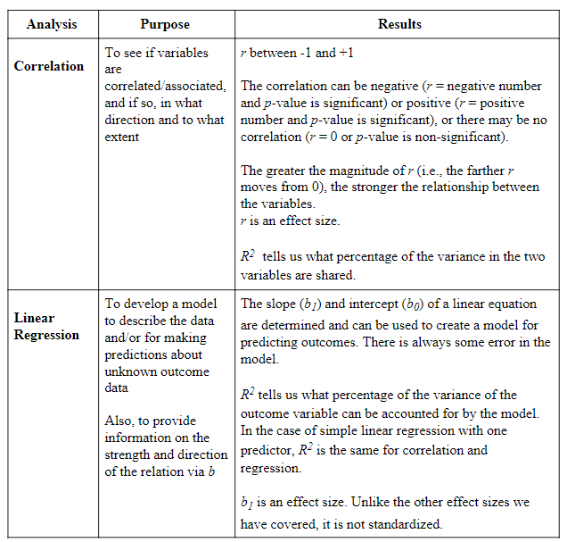
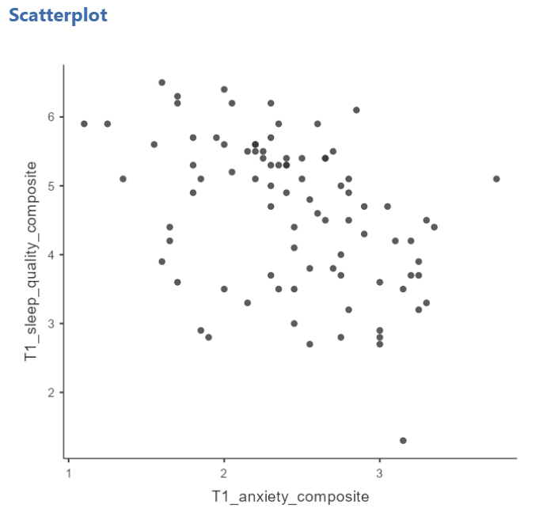
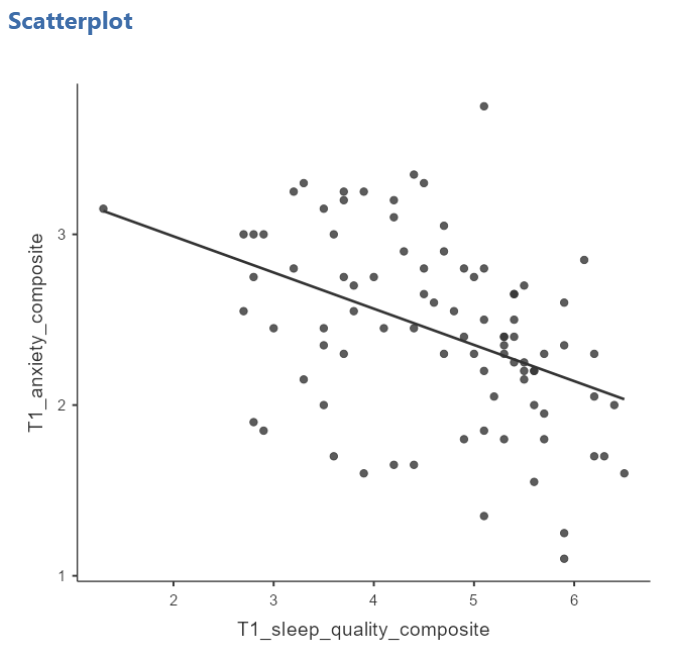
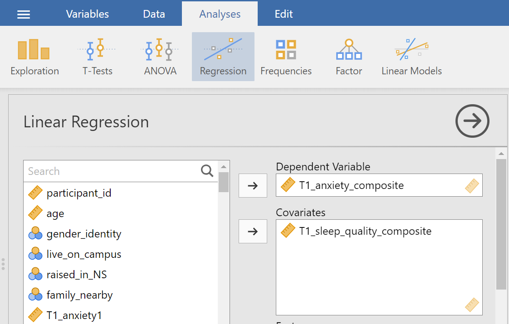
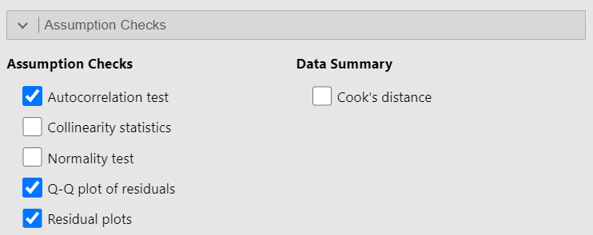
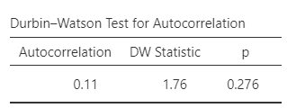
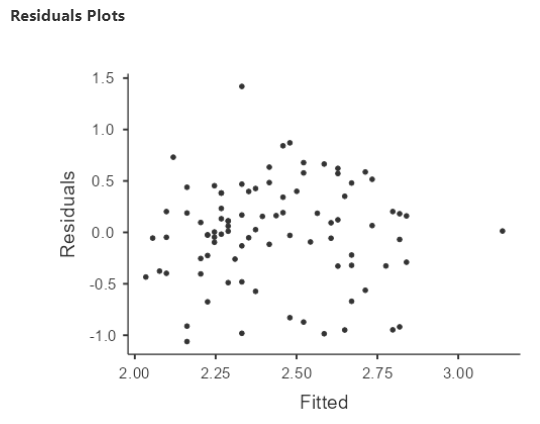
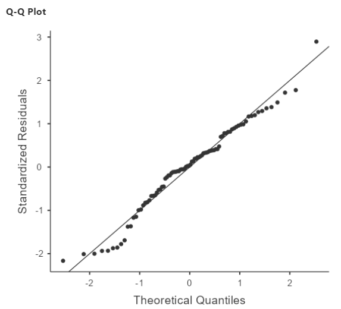
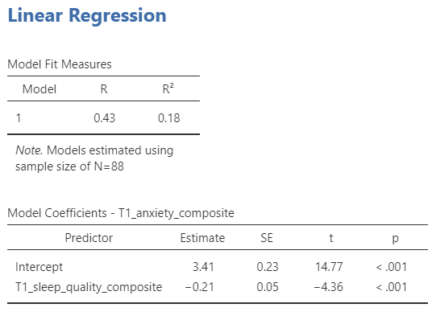
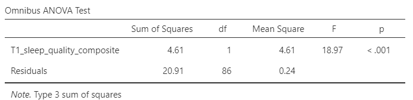

# Lab 7: Linear Regression

```{=html}
<script>
$("#coverpic").hide();
</script>
```

## What is the difference beteween correlation and regression?

```{r , echo=FALSE,dev='png'} 
 
``` 

## Lab Skills Learned

In this lab, we will use JAMOVI to conduct a simple linear regression. We will learn how to: 

1. Request the statistical information for building a model to predict an outcome variable 
2. Read the results to interpret if the model is more helpful than knowing the mean 
3. Build the model with those statistics if appropriate 


## Background

### Assumptions of linear regression

As linear regression is a parametric analysis, there are assumptions which must be met for the results of the analysis to make sense. The assumptions of linear regression include: 

**1. Linearity:** Outcome variable should be linearly related to the predictor variable. (*Question*: Based on what you have learned thus far, how do you believe we can check this assumption?) 

**2. Independent Errors:** For any 2 observations, the residual terms should be uncorrelated. 

**3. Homoscedasticity (AKA homogeneity of variance):** The variability in the outcome variable around the regression line should be the same for all values of the predictor variable.  

**4. Normally Distributed Errors:** The residuals in the model are normally distributed with a mean of 0. 

### Context of data

For this week’s lab demonstration, let’s return to the a version of the PSYC 291 survey data that contains "composite" scores (Version 2) to see if sleep quality scores at the beginning of the semester could be used to predict anxiety at that time. To clarify, this is the research question: *Can we predict anxiety scores with sleep quality scores?* 

## Checking one assumption before conducting the analysis

Before we conduct the analysis, we can check the first assumption using a scatterplot. Click <span style="color:blue">Analyses</span>, <span style="color:blue">Exploration</span>, and <span style="color:blue">Scatterplot</span>. Move one variable to Y-Axis field and the other variable to X-Axis field.  

```{r , echo=FALSE,dev='png'} 
 
``` 

Remember: At this point, you can look at the scatterplot with either variable on the *x*-axis, but typically, as we progress and talk about predictor variables and outcome variables, we would place the predictor variable on the *x*-axis and the outcome variable on the *y*-axis. Also, you can add the line of best fit if you select Linear under Regression Line in the Analysis panel. 

```{r , echo=FALSE,dev='png'} 
 
``` 

Looking at the resulting graph (depicted above), do you feel the assumption of linearity is met or violated? 

We can consider whether the data meet the other assumptions while conducting the analysis in JAMOVI. 

## Conducting the analysis 

To request linear regression, click <span style="color:blue">Analyses</span>, <span style="color:blue">Regression</span>, and <span style="color:blue">Linear Regression</span>. Move the outcome variable to the Dependent Variable field. In our example, `T1_anxiety_composite` is the outcome variable. Move the predictor variable to the to the Covariates window if the variable is measured on at least an interval scale or to the Factors window if the variable is measured on an ordinal or nominal scale).. In our example, `T1_sleep_quality_composite` is the predictor variable, it is measured at least at the interval scale, and we will place it in the Covariates window. 

```{r , echo=FALSE,dev='png'} 
 
``` 

Before we start interpreting the model, we should return to checking assumptions. Under the  Assumption Checks ribbon, click to select the Autocorrelation test, the Q-Q Plot, and the Residuals plot.
 
```{r , echo=FALSE,dev='png'} 
 
``` 

Recall that for the independence of error assumption, we indicated, for any two observations, the residual terms should be uncorrelated (or independent). When we selected Autocorrelation test, the Durbin-Watson test was conducted, and its results are displayed in the Results panel. When interpreting these results, know a value for the “DW Statistic” (as it is labeled in the table) close to 2 would indicate the assumption is upheld. Values less than 1 or greater than 3 are problematic and indicate we are violating this assumption. We also look at the *p*-value. A *p*-value representing a significant result (*p* < .05) indicates a violation of the assumption. 

```{r , echo=FALSE,dev='png'} 
 
``` 

*Question*: Given the DW statistic value is 1.76 and the *p*-value is .276, is the assumption of independent errors met or violated? 

For the assumption of homoscedasticity to be upheld, the variance of the residual terms should be constant at each level of the predictor vatriance. We will look to the Residuals plot. Notice that JAMOVI provides one plot of the overall model (Fitted) and one for each of your variables (predictor and outcomes). We will focus on the fitted plot. To meet the assumption, the residuals should appear as a random scattering of dots – evenly dispersed around 0 on the *y*-axis. Residuals appearing to be distributed in a funnel shape – with a wide spread on one end of the *x*-axis and a narrow spread on the other end of that axis – suggests a violation to the assumption of homoscedasticity.  

```{r , echo=FALSE,dev='png'} 
 
``` 

*Question*: Given given the distribution of the residuals, is the assumption of homoscedasticity met or violated? 

To determine whether the residuals are normally distributed, we can look at the Q-Q plot of the residuals. You may recall from earlier lessons about checking your data that the more closely the data (in this case the residual terms) hover around the line in a Q-Q plot, the more confidence we have that they are normally distributed. 

```{r , echo=FALSE,dev='png'} 
 
``` 

*Question*: Considering where the residual terms are located in relation to the line, is the assumption of normality of the residual terms met or violated? 

If we feel confident about meeting the assumptions, we can continue with the linear regression analysis. Having used the <span style="color:blue">Analyses</span>, <span style="color:blue">Regression</span>, and <span style="color:blue">Linear Regression</span> commands, two tables were generated in the Results panel. 

```{r , echo=FALSE,dev='png'} 
 
```  

The *R^2^* term in the first table tells us what percentage of the variance of the outcome variable can be accounted for by the model. According to our results, this linear regression model based on impression would account for 18% of the variance of anxiety at the beginning of the term The second table tells us about the slope of our regression line. We see that the *p*-value for the slope is significantly different from zero when we read the line for `T1_sleep_quality_composite`, where *p* < .001.  

We also want to be sure that this model is better than simply knowing and using the mean to make our predictions. As such, under the Model Coefficients ribbon, select the ANOVA test under Omnibus Test. The following table should appear in your Results panel: 

```{r , echo=FALSE,dev='png'} 
 
``` 

Looking at the *p*-value, we see a significant result. As such, we have reason to believe this model has more predictive power than simply knowing the mean.  

## Developing the regression model from the statistics 

You likely remember the linear equation from previous education: y = mx + b. The regression model (or equation) is derived from the linear equation, where *b~0~* represents the intercept of the line, *b~1~* represents the slope of the line, and *Ɛ~i~* represents the error in the model. 

Ŷ~i~ = (b~0~ + b~1~X~i~) + Ɛ~i~ 

Estimate of Outcome Variable = b~0~ + b~1~(Predictor Variable) + Ɛ~i~ 

Estimate of anxiety = 3.41 - 0.21(sleep quality) + Ɛ~i~ 

## Reporting the Results 

A regression model was created and is significant [*F*(1, 86) = 18.97, *p* < .001].  
This model can account for approximately 18% of the variability in Intellect scores (*R^2^* = .18). The slope of the regression line was significantly different from zero (B = -0.21, *t*(86) = -4.36, *p* < .001). 

## Homework 

See [Moodle](https://moodle.stfx.ca/)