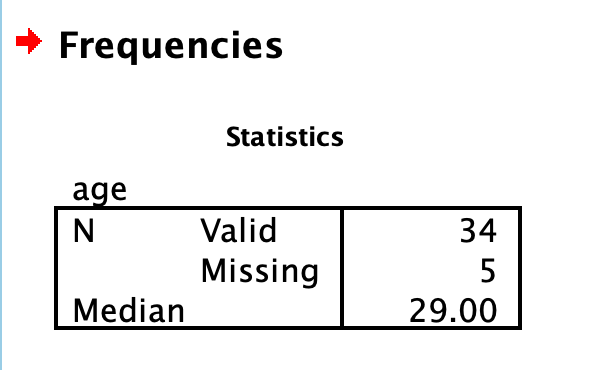
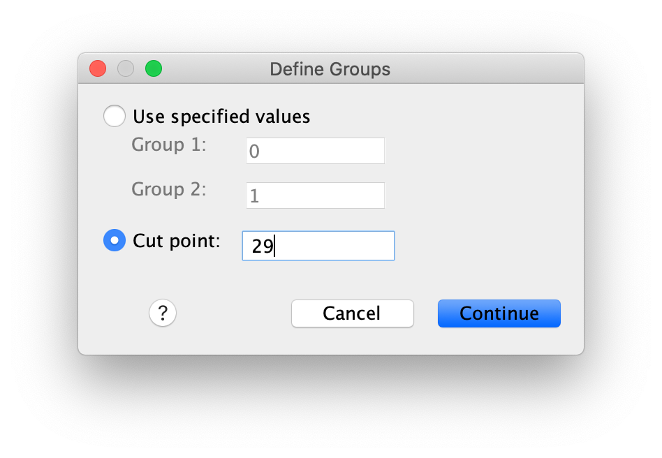
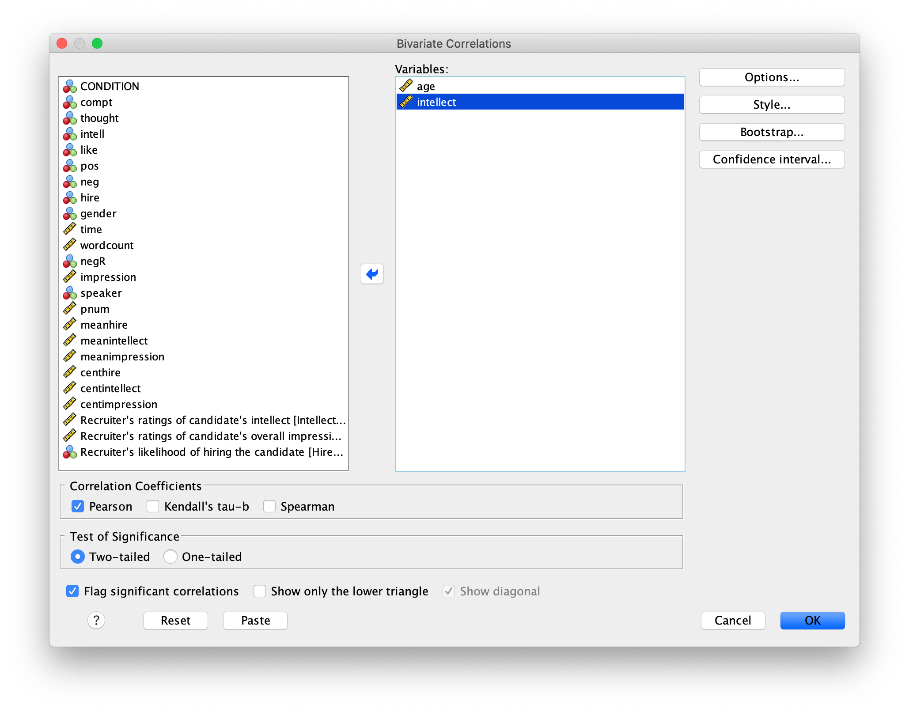
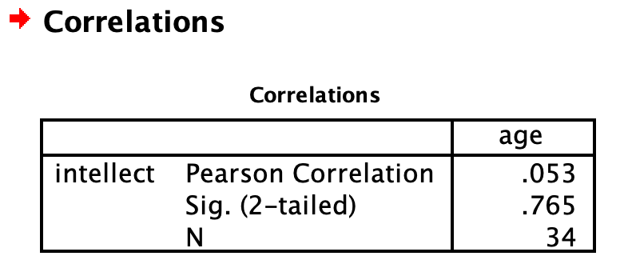
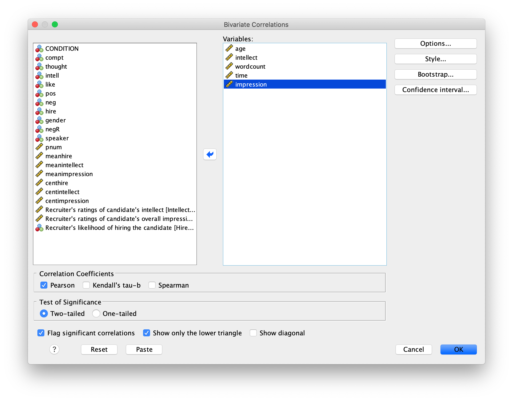
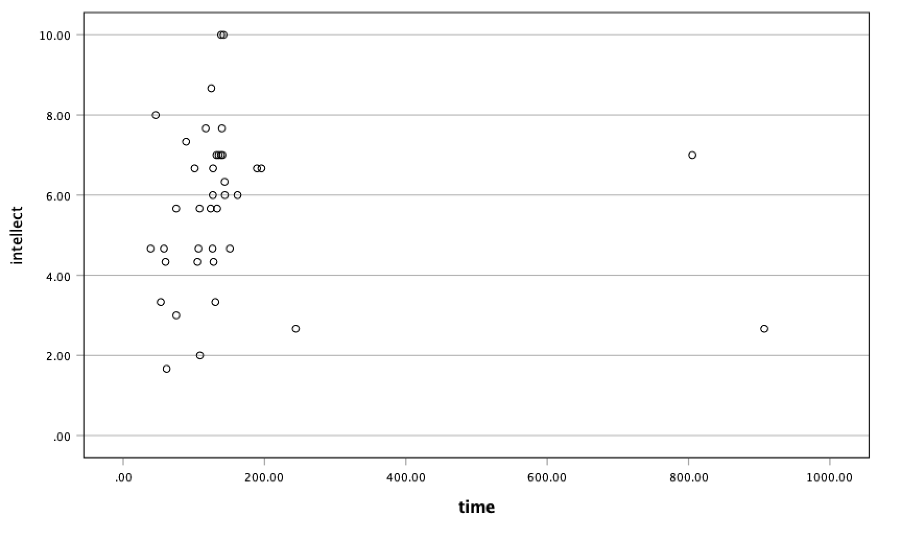
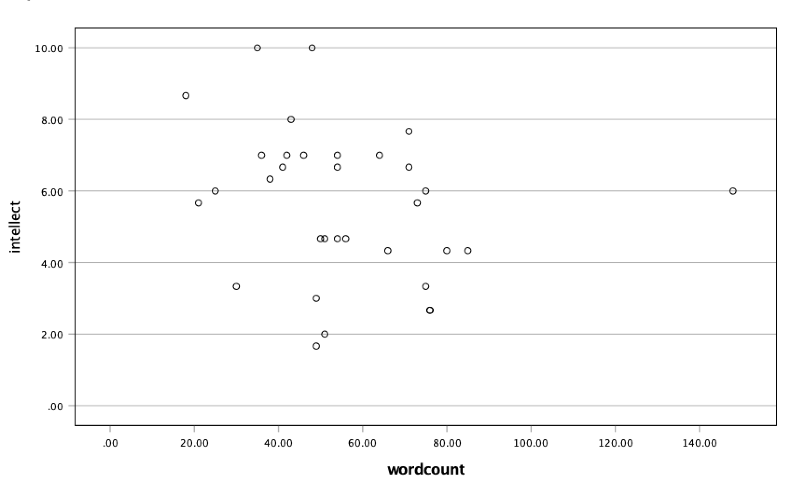

# Lab 7: *t*-test (Independent Sample)

<script>
$("#coverpic").hide();
</script>


<span class="newthought">
I think he [Gosset] was really the big influence in
statistics... he asked the questions and Pearson and Fisher put them into statistical language, and then Neyman came to work with the mathematics. But I think
most of it came from Gosset.
---F. N. David
</span>


<div class="marginnote">
This lab is modified and extended from [Open Stats Labs](https://sites.trinity.edu/osl). Thanks to Open Stats Labs (Dr. Kevin P. McIntyre) for their fantastic work.
</div>

## Do you come across as smarter when people read what you say or hear what you say?

### STUDY DESCRIPTION

Imagine you were a job candidate trying to pitch your skills to a potential employer. Would you be more likely to get the job after giving a short speech describing your skills, or after writing a short speech and having a potential employer read those words? That was the question raised by Schroeder and Epley (2015).The authors predicted that a person’s speech (i.e., vocal tone, cadence, and pitch) communicates information about their intellect better than their written words (even if they are the same words as in the speech).

To examine this possibility, the authors randomly assigned 39 professional recruiters for Fortune 500 companies to one of two conditions. In the audio condition, participants listened to audio recordings of a job candidate’s spoken job pitch. In the transcript condition, participants read a transcription of the job candidate’s pitch. After hearing or reading the pitch, the participants rated the job candidates on three dimensions: intelligence, competence, and thoughtfulness. These ratings were then averaged to create a single measure of the job candidate’s intellect, with higher scores indicating the recruiters rated the candidates as higher in intellect. The participants also rated their overall impression of the job candidate (a composite of two items measuring positive and negative impressions). Finally, the participants indicated how likely they would be to recommend hiring the job candidate (0 - not at all likely, 10 - extremely likely).

What happened? Did the recruiters think job applicants were smarter when they read the transcripts, or when the heard the applicants speak? We have the data, we can find out.

## Lab skills learned

1. Conduct independent samples *t*-tests
2. Generate figures
3. Discuss the results and implications

## Important Stuff
- citation: Schroeder, J., & Epley, N. (2015). The sound of intellect: Speech reveals a thoughtful mind, increasing a job candidate’s appeal. Psychological Science, 26, 877-891.
- [Link to .pdf of article](http://journals.sagepub.com/stoken/default+domain/PhtK6MPtXvkgnYRrnGbA/full)
- <a href="https://raw.githubusercontent.com/CrumpLab/statisticsLab/master/data/SchroederEpley2015data.csv" download>Data in .csv format</a>
- [Data in SPSS format](https://drive.google.com/open?id=0Bz-rhZ21ShvOVXlDMjEzQU1oY1k)


## R

### Load the data

Remember that any line with a \# makes a comment and the code does not run. Below is how to load the .csv data from the online repository, or from a local file (you need to change the file path to where the local file is, if you downloaded it). The data contains all of the measures and conditions from Experiment 4.

```{r}
library(data.table)
# load from github repo
#all_data <- fread("https://raw.githubusercontent.com/CrumpLab/statisticsLab/master/data/SchroederEpley2015data.csv")

all_data <- fread("data/SchroederEpley2015data.csv") # load from file on computer

```

### Inspect data frame

This will give you a big picture of the data frame. Click the button to view it in your browser, then take a look to see what is in it. 

```{r, eval=F}
library(summarytools)
view(dfSummary(all_data))

```


### Find the data you need

This time the data comes pre-filtered for us. The authors ran lots of experiments, but we only have the data from Experiment 4. This is great, we don't need to subset the data frame to find all of the data that we need. But, we do still need to understand what data we want to analyze. Let's start with identify the column that codes the experimental conditions for whether or not the evaluator read a transcript or heard the interview.

#### Condition variable

Lucky for us, the condition variable is called `CONDITION`! Let's take a look. We printed it out just by writing down `all_data$CONDITION`. There 0s and 1s for each condition (audio vs. transcript). But which one is which? This isn't clear from the data, and it isn't clear from the paper, or from the repository. We have to do some guess work. I went ahead and computed the means for the Intellect_rating between each condition, and then compared those to the graph in the paper for E4. It looks like 1 = audio condition, and 0 =  transcript condition.

```{r}
all_data$CONDITION
aggregate(Intellect_Rating~CONDITION,all_data,mean)
```

Let's use words instead of 0s and 1s to refer to our experimental conditions. To do this, we will chance the values of 0 and 1, to the words `transcript` and `audio`. We can do this in two steps. First we convert the CONDITION column to a factor. This will automatically turn the 0s and 1s into strings (not numbers, text). Factors have an internal variable for the names of the levels, which will be 0 and 1. We can simply change the level names to transcript and audio.

```{r}
all_data$CONDITION <- as.factor(all_data$CONDITION)
levels(all_data$CONDITION) <- c("transcript","audio")
```

Now if you look at the `all_data` variable, you will see the words transcript and audio, where 0s and 1s used to be.

#### Dependent Measures

Next it's time to find the dependent measure columns. The graph from the paper shows three different measures in each condition. These included `Intellect`, `General Impression`, and `Hiring Likelihood`. Every evaluator (either given a transcript or audio recording of the interview) gave ratings on a scale of 1 to 10 for each of those concepts. It's not immediately clear which columns in `all_data` correspond to those three measures. There are lots of different measures that could be the ones they reported. It turns out the relevant ones are called

1. `Intellect_Rating`
2. `Impression_Rating`
3. `Hire_Rating`

In this tutorial we are going to walk through doing an independent samples *t*-test for the first measure, `Intellect_Rating`. You can follow these same steps to complete the same kind of *t*-test for the other two variables.

### Look at the dependent variable.

<div class="marginnote">
**Question:** Why do we always want to look at the data?
</div>

What is the first thing we do before even considering an inferential test? Look at the data. Always look at the data. We could make a dot plot or histogram of the data from the `Intellect_ratings`. But, from our last lab we already learned how to make graphs showing most of the information we would want to look at. For example, we could make a bar graph that has the means for each condition (transcript vs. audio), standard errors of the mean and the actual scores as little dots. This would be great to look at it. Not only will it tell us if there are really weird numbers in the data (who knows maybe the data file is corrupted, you need to look), it will also give us strong intuitions about what to expect for the *t*-test. 

We can plot each score as a dot using the `all_data` data frame. If we want to add on a layer for the sample means, and for the sample standard errors, we have to compute those and put them in a new data frame first. Then we use both data frames with ggplot to plot all of the information.

We will use `dplyr` to quickly get the means and the standard errors and put them in a new data frame called `decriptive_df`.

```{r}
library(dplyr)
library(ggplot2)

# get means and SEs
descriptive_df <- all_data %>% 
                    group_by(CONDITION) %>% 
                    summarise(means= mean(Intellect_Rating),
                              SEs = sd(Intellect_Rating)/sqrt(length(Intellect_Rating)))

# Make the plot
ggplot(descriptive_df, aes(x=CONDITION, y=means))+ 
  geom_bar(stat="identity", aes(fill=CONDITION))+ # add means
  geom_errorbar(aes(ymin=means-SEs,               # add error bars
                    ymax=means+SEs), width=.1) +
  geom_point(data=all_data, aes(x=CONDITION, y=Intellect_Rating), alpha=.5)+
  geom_point(alpha=.25)+
  ylab("Rating")
```

This plot is very useful. First, we can see the numbers in our dependent measure are behaving sensibly. We know that the numbers have to be between 1-10, because those were the only options in the scale. If we found numbers bigger or smaller, we would know something was wrong. Checking for things that are obviously wrong in the data is one reason why we always look at first. We are checking for obvious errors. There are other ways to check to, but looking is fast and easy.

<div class="marginnote">
**Question:** Why are the standard errors of each sample an appropriate thing to use for error bars?
</div>

Now that you can see the patterns in the data, you should form an intuition about how the independent samples *t*-test will turn out. You can see how big the error bars (+1/-1 standard error of each sample man). The *t*-test will tell us whether the observed difference  (or greater) is likely due to chance. Should we find a big *t*-value or a small *t*-value? Should we find a big *p*-value or a small *t*-value. If you understand how *t*-values and *p*-values work, the answer should be very clear from the graph. You should already know how the *t*-test will turn out before you run it. Running it will confirm what you already suspect to be true.

### Conduct Independent samples *t*-test

<div class="marginnote">
**Question:** Why are we conducting an independent samples *t*-test, and not a one-sample or paired samples *t*-test?
</div>

We use the very same `t.test` function that we used last time to conduct a *t*-test. The only difference is that we don't tell the R to use a paired sample *t*-test. We leave the `paired=TRUE` statement out, and R automatically knows we want to do an independent samples *t*-test. Remember to set the `var.equal=TRUE`, otherwise R will compute a different version of the *t*-test. 

You can use different syntax to run the *t*-test. Because our data is already in a data frame we can use this syntax.

```{r}
t.test(Intellect_Rating~CONDITION, data=all_data, var.equal=TRUE)
```

The `t.test` function also will work on two variables, not in a data frame. For example, the following does the same thing. But, it's harder to read, and the means are described in terms of X and Y, not terms of `transcript` and `audio`, like the report above.

```{r}
t.test(all_data[all_data$CONDITION=='transcript',]$Intellect_Rating,
       all_data[all_data$CONDITION=='audio',]$Intellect_Rating,
       var.equal=T)

```

<div class="marginnote">
**Question:** What conclusions do we draw from the *t*-test? Based on these results, if you were being evaluated for a job interview, would you rather have the evaluator read a transcript of your interview or listen to an audio recording?
</div>

So, now we have the *t*-test. It shows the *t*-value, the *p*-value, and the means for each group. You can double-check with the paper to see if we found the same results as reported by the authors.

### Remaining ratings

Now, you should use what you have learned to analyse the last two ratings for the dependent variables `Impression_Rating`, and `Hire_Rating`. This is your task for the generalization exercise. Remember to plot the data for each, and conduct a *t*-test for each. Then compare what you found to the original article. What did you find, and what do the results mean?

### Reconstructing the graph from the paper

The results from Experiment 4 in the paper plot the means and error bars (+1 / -1 SEM) for all three dependent measures, for both experimental conditions. We can do this in ggplot using the data. We will have to make a couple changes to the data frame. But, it won't be too hard. What we need to do is make a fully long form data frame. Remember a long form data frame has one row per dependent measure. 

The `all_data` frame is partly long and partly wide. If we are only interested in one dependent measure, then it is a long data frame for that measure. For example, example if we are only interested in plotting `Intellect_Rating`, then we already have one observation of that dependent measure for each row. But, in the other columns, the dependent measures for `Impression_Rating` and `Hire_Rating` are in the same rows. 

Before continuing, it is very much worth mentioning that this part of data analysis happens a lot, and it is kind of annoying. I call it the rubix cube problem, because we need to "rotate" and transform the format of the data to accomplish different kinds of analysis goals. It's good to be able to know how to do this. This problem occurs all of the time, and can occur for any software package. It's a good thing you are learning R, because we can do these things easily in R. They are not often so easy to do without a computer programming language like R. The worst thing to do is transform the data by hand. That really sucks. Believe me you don't want to do it. Why? Because you will make mistakes, and you will mess up the data, then you will mess up your analysis. And, you won't be able to find your mistakes, and it will take you ages to correct them. That sucks.

There's more than one way to transform data in R. For example the `cast` and `melt` functions do this kind of thing. You can look those up. In this example we will not use those functions. Instead we will show some steps to build the required data frame one step at a time.

```{r}
# repeat CONDITION column three times

condition <- rep(all_data$CONDITION,3)

# make a ratings variable with all three ratings in one variable

ratings <- c(all_data$Intellect_Rating,
             all_data$Impression_Rating,
             all_data$Hire_Rating)

# make a new factor variable with the names of the ratings
# need to repeat each level name the appropriate number of times

num_to_repeat <- length(all_data$CONDITION)

rating_type <- rep(c("Intellect","Impression","Hire"),num_to_repeat)

# put the new variables into a data frame

plot_all <- data.frame(condition,rating_type,ratings)

# Get the means and standard errors for each rating by condition

descriptive_all <- plot_all %>% 
                    group_by(condition,rating_type) %>% 
                    summarise(means= mean(ratings),
                              SEs = sd(ratings)/sqrt(length(ratings)))

# Make the plot

ggplot(descriptive_all, aes(x=rating_type, y=means, group=condition))+ 
  geom_bar(stat="identity", aes(fill=condition), position='dodge')+ 
  geom_errorbar(aes(ymin=means-SEs,               
                    ymax=means+SEs), 
                width=.1, 
                position = position_dodge(width=.9)) +
  geom_point(data=plot_all, aes(x=rating_type, 
                                y=ratings, 
                                group=condition), 
             alpha=.25, 
             position = position_dodge(width=.9))+
  geom_point(alpha=.25)+
  ylab("Rating")

```

Well, we didn't make the exact graph. We have the bars, the error bars, and we added the individual scores because they are useful to look at. Otherwise, it's the same graph (except the the ordering of bars is determined alphabetically here. We change that in ggplot, but we won't do that today.)

### Generalization Exercise

(1 point - Pass/Fail)

Complete the generalization exercise described in your R Markdown document for this lab.

Now, you should use what you have learned to analyse the last two ratings for the dependent variables `Impression_Rating`, and `Hire_Rating`. Report the *t*-tests and means for each.

### Writing assignment

(2 points - Graded)

Complete the writing assignment described in your R Markdown document for this lab. When you have finished everything. Knit the document and hand in your stuff (you can submit your .RMD file to blackboard if it does not knit.)

1. Answer the following questions

a. Explain the difference between a paired-samples *t*-test and an independent samples *t*-test.  ( 1 point )

b. Imagine you were to conduct a between-subjects experiment with two groups, where the manipulation had no effect whatsoever. If you repeated this experiment (that doesn't work) 100 times and computed a *t*-test each time, approximately how many of the experiments out of 100 would you expect find the associated *p*-value is .05 or smaller? Explain (1 point)

General grading. 

- You will receive 0 points for missing answers 
- You must write in complete sentences. Point form sentences will be given 0 points.
- Completely incorrect answers will receive 0 points. 
- If your answer is generally correct but very difficult to understand and unclear you may receive half points for the question


## Excel

How to do it in Excel

## SPSS

In this lab, we will use SPSS to:

1. Perform an independent-samples *t*-test
2. Graph the data

### Experiment Background

---


Schroeder and Epley (2015) conducted an experiment to determine whether a person’s speech (i.e., vocal tone, cadence, and pitch) communicates information about their intellect better than their written words (even if they are the same words as in the speech).

To conduct this study, the authors randomly assigned 39 professional recruiters for Fortune 500 companies to one of two conditions. In the audio condition, participants listened to audio recordings of a job candidate’s spoken job pitch. In the transcript condition, participants read a transcription of the job candidate’s pitch. After hearing or reading the pitch, the participants rated the job candidates on three dimensions: intelligence, competence, and thoughtfulness. These ratings were then averaged to create a single measure of the job candidate’s intellect, with higher scores indicating the recruiters rated the candidates as higher in intellect. The participants also rated their overall impression of the job candidate (a composite of two items measuring positive and negative impressions). Finally, the participants indicated how likely they would be to recommend hiring the job candidate (0 - not at all likely, 10 - extremely likely).

So, what happened? Did the recruiters think job applicants were smarter when they read the transcripts, or when the heard the applicants speak? We have the data, we can find out.

### Performing an independent-samples *t*-test

---


First, let's open the relevant data file in SPSS. You should have already downloaded this data file from section 0.2.3 of the lab manual - we used it when we worked through the exercises in Chapter 12 of the lab manual. The file we are working with in this lesson is called "SchroederEpley2015_Study4_data.sav". Your data should look like this:

```{r , echo=FALSE,dev='png'}
knitr::include_graphics('img/7.4.11.png')
```

For our analysis, we will focus on only one of the three measures mentioned above: `intellect`. We want to know if perceived intellect is different in the audio condition (where recruiters listened to a job pitch) than in the transcript condition (where recruiters read a transcript of a job pitch). 

Before we run the *t*-test, let's review a button at the top of our SPSS spreadsheet window. This will be important for identifying the values assigned to groups later on. The button I refer to here is highlighted below; it has two boxes, one with an A and one with a 1 on it, with arrows in-between. 

```{r , echo=FALSE,dev='png'}
knitr::include_graphics('img/7.4.12.png')
```

Press this button and see what happens to your data spreadsheet:

```{r , echo=FALSE,dev='png'}
knitr::include_graphics('img/7.4.13.png')
```

Notice that this button has revealed the values used to signify the Audio and Transcript groups. We will need to know that these groups are signified by 0s and 1s when we come to running our *t*-test. If you click the button again, the cells will go back to displaying their labels. Keep in mind that revealing the values or labels does not change anything about the data itself or any subsequent analyses; it is merely a cosmetic change. 

Now, we're ready to run the independent-samples *t*-test. Go to <span style="color:blue">Analyze</span>, then <span style="color:blue">Compare Means</span>, then <span style="color:blue">Independent Samples *t*-test...</span>

```{r , echo=FALSE,dev='png'}
knitr::include_graphics('img/7.4.14.png')
```

A window will appear asking you to specify which variable to use in this analysis. Remember, we are only using `intellect`, so find this variable in the lef*t*-hand list and move it into the "Test Variable(s)" field on the right using the arrow. For the field labeled "Grouping Variable", we will specify which variable is our independent variable. That variable is `CONDITION` (we have two conditions: audio and transcript). Move `CONDITION` into the "Grouping Variable" field. Notice that next to the variable name there are two question marks and the OK button is disabled:

```{r , echo=FALSE,dev='png'}
knitr::include_graphics('img/7.4.15.png')
```

Here, SPSS wants to know the values used to signify these conditions (remember the 0s and 1s?). So, click <span style="color:blue">Define Groups</span>, and place 0 and 1 in the fields that ask for Values for Group 1 and Group 2.

```{r , echo=FALSE,dev='png'}
knitr::include_graphics('img/7.4.16.png')
```

Click <span style="color:blue">Continue</span>, and then <span style="color:blue">OK</span>. SPSS will produce output tables as follows:

```{r , echo=FALSE,dev='png'}
knitr::include_graphics('img/7.4.17.png')
```

The *t*-test output has similarities with the paired *t*-test output we saw in Chapter 6 of this lab manual. Like the paired *t*-test output, the first table contains useful descriptive statistics that help us understand the pattern of results and contextualize our inferential statistics. 

In the case of an independent-samples *t*-test, there is one special consideration to be made: the equality of variances. One of the assumptions of a *t*-test is that the groups being compared have roughly equal variances. Conveniently, the independent-samples *t*-test in SPSS performs another test automatically to determine if the variances are equal or not: this test is called the Levene's test. 

In the second output table, there is a section dedicated to Levene's test. The rule is as follows: If the Sig. value under the Levene's test heading is smaller than your alpha level, then your variances are **not** equal and you must refer to the values in the second row of the table, labeled "Equal variances not assumed." If the Sig. value for Levene's test is larger than alpha, then you can use the top row labeled "Equal variances assumed." However, I recommend that you **always** use the "Equal variances not assumed" row. 

In this case, the Sig. value associated with the Levene's test is .35, which is greater than the conventional alpha level of .05, so you might use the "Equal variances assumed" row, but we are still going to use the "Equal variances not assumed" row. The *t*-statistic for our independent-samples *t*-test is -3.48, the degrees of freedom are adjusted to 33.43, and the *p*-value for the *t*-test is .001. **Note**: Be sure to look at the *p*-value associated with the *t*-test and not Levene's test when you are interpreting your *t*-test results. 

What does the *t*-test tell us about the data? We can put our finding into words to clarify:

Recruiter ratings for audio job pitches (M = 6.63, SD = 1.61) are higher than ratings for transcripts of pitches (M = 4.65, SD = 1.91). This difference is significant, *t*(33.43) = -3.48, *p* < .05.

The default SPSS output also includes effect sizes in the third table. You can include Cohen's *d* in your results sentence as well. Find it in the `Independent Samples Effect Sizes` table in the first row, in the `Point Estimate` column. For example:

Recruiter ratings for audio job pitches (M = 6.63, SD = 1.61) are higher than ratings for transcripts of pitches (M = 4.65, SD = 1.91). This difference is significant according to an independent samples *t*-test, *t*(33.43) = -3.48, *p* < .05, *d* = 1.13.

**Some formatting guidelines for writing results sections: **

All of the numbers are rounded to two decimal places, but if your *p*-value was .0001, it would be OK to to write *p* < .001. 

Italicize symbols such as *p* and *t*.

There are spaces on either side of =, >, or < symbols. 

### Graphing your data

---


`CONDITION` in this experiment represents a discrete, categorical variable. Therefore, we will be using a bar chart to visualize this data. To begin, go to <span style="color:blue">Graphs</span>, then <span style="color:blue">Legacy Dialogs</span>, then <span style="color:blue">Bar...</span>

```{r , echo=FALSE,dev='png'}
knitr::include_graphics('img/7.4.18.png')
```

Next, choose <span style="color:blue">Simple</span> in the window that appears, then click <span style="color:blue">Define</span>.

```{r , echo=FALSE,dev='png'}
knitr::include_graphics('img/7.4.19.png')
```

In the next window, make sure that under "Bars Represent", you have chosen <span style="color:blue">Other statistic</span>. Move your variable of interest (`intellect`) into the field labeled "Variable." Then, move `CONDITION` to the "category axis" field. 

```{r , echo=FALSE,dev='png'}
knitr::include_graphics('img/7.4.20.png')
```

Next, click <span style="color:blue">Options</span>. Then choose <span style="color:blue">Display Error Bars</span>, and have them represent <span style="color:blue">Standard Error</span> with a <span style="color:blue">multiplier of 1</span>. 

```{r , echo=FALSE,dev='png'}
knitr::include_graphics('img/7.4.21.png')
```

Click <span style="color:blue">Continue</span>, then <span style="color:blue">OK</span>.

SPSS will produce a bar graph of your mean ratings for both audio and transcript conditions. 

```{r , echo=FALSE,dev='png'}
knitr::include_graphics('img/7.4.22.png')
```

**Note**: It's always a good idea to compare your graph to the descriptive statistics to make sure it looks right. 

### Optional exercises (good practice and review for the take-home final exam)

---

At this point, you've covered everything you need to successfully complete the homework assignment below. However, there are a number of different analyses we can practice with this dataset. This section walks you through some optional analyses to consolidate what we've already covered as well as add breadth. If you're running out of time, skip down to the Homework now. You can return to these exercises later (i.e., when studying).

#### Using a cut point to define groups for an independent *t*-test

Sometimes you will see groups defined with a non-nominal independent variable. For example, in class we talked about defining countries as "overweight" or "not overweight" depending on whether 50% of their population was classified as overweight. The rate of overweight is known for each country, but we can divide the countries into two groups at an arbitrary cut point (in this case, a rate of 50%). Aside: This is a good example of how an ordinal, interval, or ratio variable might be considered to have distinct categories - you have to define the boundaries of the categories yourself first.

A commonly used cut point is the median value (this is called a "median split"). Let's use the example of `age` in the current dataset. You can find the median value of `age` via many menus. Let's go <span style="color:blue">Analyze</span>, then <span style="color:blue">Descriptive Statistics</span>, then <span style="color:blue">Frequencies...</span>. Move `age` to the `Variable(s)` box and then click <span style="color:blue">Statistics</span>. Select `Median`, then click <span style="color:blue">Continue</span> and then <span style="color:blue">OK</span>. The first output table contains the median:

```{r , echo=FALSE,dev='png'}

```

We can use the median of 29 as the cut point. We'll be running an independent *t*-test to determine whether there is a significant difference in `intellect` between candidates under 29 years old and over 29 years old. 

Click <span style="color:blue">Analyze</span>, then <span style="color:blue">Compare Means</span>, then <span style="color:blue">Independent Samples *t*-test...</span>

It's likely that `intellect` is already selected as your `Test Variable(s)`, but do so if not. Then, move `age` to the `Grouping Variable` (you may need to move `CONDIITION` out first). Then click <span style="color:blue">Define Groups...</span> Select <span style="color:blue">Cut point</span> and input 29 as follows:

```{r , echo=FALSE,dev='png'}

```

Click <span style="color:blue">Continue</span> and then <span style="color:blue">OK</span>. You should get the following output tables: 

```{r , echo=FALSE,dev='png'}
knitr::include_graphics('img/7.4.25.png')
```

Practice writing a sentence describing the results, and then compare it to #1 in the "Example answers to practice problems" below.

#### Review: Correlation

Let's say you had a different research question: Is the age of the candidate correlated with intellect ratings? You could answer this question with the same variables analyzed in the section above, but using correlation instead of an independent *t*-test. Click <span style="color:blue">Analyze</span>, then <span style="color:blue">Correlation</span>, then <span style="color:blue">Bivariate...</span> and move `age` and `intellect` into the `Variables` box:

```{r , echo=FALSE,dev='png'}

```

Click <span style="color:blue">OK</span>. The output table should look as follows:

```{r , echo=FALSE,dev='png'}
knitr::include_graphics('img/7.4.27.png')
```

As we noted in the previous lab session on correlations, some of the information in this output table is redundant or not useful. We can clean that up by changing some of the options in the `Bivariate Correlations` dialog. Click <span style="color:blue">Analyze</span>, then <span style="color:blue">Correlation</span>, then <span style="color:blue">Bivariate...</span>, but this time, select <span style="color:blue">Show only the lower triangle</span> and unselect <span style="color:blue">Show diagonal</span> (both found near the bottom). Click <span style="color:blue">OK</span>. Now the output is tidier: 

```{r , echo=FALSE,dev='png'}

```

Write a sentence describing the results of this test. Compare your answer to #2 in the "Example answers to practice problems" below. 

Now, assume you are in the mood to do some exploratory data analysis. We can run multiple bivariate correlations at the same time in the same dialog. Click <span style="color:blue">Analyze</span>, then <span style="color:blue">Correlation</span>, then <span style="color:blue">Bivariate...</span> again. To the `Variables` box, add `wordcount`,  `time`, and `impression`, in addition to `age` and `intellect`:

```{r , echo=FALSE,dev='png'}

```

Click <span style="color:blue">OK</span>. Now our output table contains the *r*- and *p*-values for each possible pair of the five variables:

```{r , echo=FALSE,dev='png'}
knitr::include_graphics('img/7.4.30.png')
```

SPSS flags significant correlations for us with an `*` or `**`. In this case, we see a `**` next to the correlation between `impression` and `intellect`. The note at the bottom of the table indicates that the correlation is significant at the 0.01 level. SPSS automatically indicates whether correlations are significant at .05 or .01. If your Sig. (*p*-value) is between .05 and .01, SPSS will flag it as * (significant at the 0.05 level) and if your Sig. (*p*-value) is less than .01, SPSS will flag it as ** (significant at the 0.01 level). 

Let's pick a few pairs of variables and make scatterplots. We have a good range of different correlations in this table, so we can use these data to practice identifying correlations of different strengths. Click <span style="color:blue">Graphs</span>, <span style="color:blue">Legacy Dialogs</span>, and then <span style="color:blue">Scatter/Dot...</span>. Then click <span style="color:blue">Simple Scatter</span> and then <span style="color:blue">Define</span>. Move `intellect` into the `Y axis` and `age` into the `X axis`. Click <span style="color:blue">OK</span>. This should produce a scatterplot in the output file. Repeat for all correlations with `intellect`, using `intellect` on the `Y axis` each time to make it easier to compare to the example answers below (#3). Compare the pattern of dots in each scatterplot to the *r*-values reported in the tables. Can you see the differences between the plots? Can you tell from the scatterplots whether we have violated any of the assumptions of Pearson's *r* (i.e., linearity, no outliers)?

### Lab Homework #7

___


1. Use the same data file from this lab’s tutorial to test whether `intellect` ratings were different between the `gender` categories (use alpha = .05). Which `gender` category had higher `intellect` ratings? Was this difference significant? What was the effect size? Report your result in a sentence or two, using the example and guidelines above to help with the format and structure. Be sure to submit your writing on Moodle.

2. Graph this result (including 1 SEM error bars) as a bar graph. Submit the .spv file containing your independent *t*-test and graph on Moodle.

Grading: TBD

### Example answers to practice problems

___

1. Intellect ratings for candidates aged 29 or younger (M = 5.33, SD = 1.94) were not significantly different from intellect ratings for candidates over age 29 (M = 5.88, SD = 2.28), as demonstrated by an independent *t*-test [*t*(29.70) = -0.74, *p* > .05].
**Note**: If you included Cohen's *d*, the value was -0.26, but we often don't report effect size if the effect was not significant. 

2. Intellect ratings were not significantly correlated with the age of the candidates, *r* = .05, *p* > .05.

3. You should have created four scatterplots. They are included below as well as some notes about each. 

```{r , echo=FALSE,dev='png'}
knitr::include_graphics('img/7.4.31.png')
```
For the correlation between `age` and `intellect`, we found *r* was very close to 0, at .05. This is reflected in the pattern of dots, which are spread fairly uniformly across the entire plot. There are no concerns with violating the assumption of linearity on this plot. There are also no outliers.

```{r , echo=FALSE,dev='png'}

```
For the correlation between `time` and `intellect`, we found *r* was also close to 0 but negative, at -.07. It is harder to link the *r* with the plot in this case because of the two dots far to the right in the plot. These might be outliers and could be investigated further, but how to do so is not covered in PSYC 292. 

```{r , echo=FALSE,dev='png'}

```
The correlation between `wordcount` and `intellect` was *r* = -.24. This is a fairly weak correlation but if you focus on the cluster of dots on the left, you can get the impression that there are more dots in the top left and bottom right than the other two quadrants. The dot to the far right might be an outlier and could be investigated further, but how to do so is not covered in PSYC 292. 

```{r , echo=FALSE,dev='png'}
knitr::include_graphics('img/7.4.34.png')
```
For `impression` and `intellect`, a correlation of *r* = .83 was observed. In the scatterplot, you can see the dots cluster around an imaginary line that goes from the bottom left corner to the top left corner. There are no concerns that the assumption of linearity has been violated. There is also no evidence of outliers.


## JAMOVI

In this lab, we will use jamovi to:

1. Perform an independent-samples *t*-test
2. Graph the data

### Experiment Background

---


Schroeder and Epley (2015) conducted an experiment to determine whether a person’s speech (i.e., vocal tone, cadence, and pitch) communicates information about their intellect better than their written words (even if they are the same words as in the speech).

To conduct this study, the authors randomly assigned 39 professional recruiters for Fortune 500 companies to one of two conditions. In the audio condition, participants listened to audio recordings of a job candidate’s spoken job pitch. In the transcript condition, participants read a transcription of the job candidate’s pitch. After hearing or reading the pitch, the participants rated the job candidates on three dimensions: intelligence, competence, and thoughtfulness. These ratings were then averaged to create a single measure of the job candidate’s intellect, with higher scores indicating the recruiters rated the candidates as higher in intellect. The participants also rated their overall impression of the job candidate (a composite of two items measuring positive and negative impressions). Finally, the participants indicated how likely they would be to recommend hiring the job candidate (0 - not at all likely, 10 - extremely likely).

So, what happened? Did the recruiters think job applicants were smarter when they read the transcripts, or when the heard the applicants speak? We have the data, we can find out.

### Performing an independent-samples *t*-test

---


First, let's open the relevant data file in jamovi. You should have already downloaded this data file from section 0.2.3 of the lab manual - we used it when we worked through the exercises in Chapter 12 of the lab manual. The file we are working with in this lesson is called "SchroederEpley2015_Study4_data.sav". Your data should look like this:

```{r , echo=FALSE,dev='png'}
knitr::include_graphics('img/7.4.11.png')
```

For our analysis, we will focus on only one of the three measures mentioned above: `intellect`. We want to know if perceived intellect is different in the audio condition (where recruiters listened to a job pitch) than in the transcript condition (where recruiters read a transcript of a job pitch). 

Before we run the *t*-test, let's review a button at the top of our jamovi spreadsheet window. This will be important for identifying the values assigned to groups later on. The button I refer to here is highlighted below; it has two boxes, one with an A and one with a 1 on it, with arrows in-between. 

```{r , echo=FALSE,dev='png'}
knitr::include_graphics('img/7.4.12.png')
```

Press this button and see what happens to your data spreadsheet:

```{r , echo=FALSE,dev='png'}
knitr::include_graphics('img/7.4.13.png')
```

Notice that this button has revealed the values used to signify the Audio and Transcript groups. We will need to know that these groups are signified by 0s and 1s when we come to running our *t*-test. If you click the button again, the cells will go back to displaying their labels. Keep in mind that revealing the values or labels does not change anything about the data itself or any subsequent analyses; it is merely a cosmetic change. 

Now, we're ready to run the independent-samples *t*-test. Go to <span style="color:blue">Analyze</span>, then <span style="color:blue">Compare Means</span>, then <span style="color:blue">Independent Samples *t*-test...</span>

```{r , echo=FALSE,dev='png'}
knitr::include_graphics('img/7.4.14.png')
```

A window will appear asking you to specify which variable to use in this analysis. Remember, we are only using `intellect`, so find this variable in the lef*t*-hand list and move it into the "Test Variable(s)" field on the right using the arrow. For the field labeled "Grouping Variable", we will specify which variable is our independent variable. That variable is `CONDITION` (we have two conditions: audio and transcript). Move `CONDITION` into the "Grouping Variable" field. Notice that next to the variable name there are two question marks and the OK button is disabled:

```{r , echo=FALSE,dev='png'}
knitr::include_graphics('img/7.4.15.png')
```

Here, jamovi wants to know the values used to signify these conditions (remember the 0s and 1s?). So, click <span style="color:blue">Define Groups</span>, and place 0 and 1 in the fields that ask for Values for Group 1 and Group 2.

```{r , echo=FALSE,dev='png'}
knitr::include_graphics('img/7.4.16.png')
```

Click <span style="color:blue">Continue</span>, and then <span style="color:blue">OK</span>. jamovi will produce output tables as follows:

```{r , echo=FALSE,dev='png'}
knitr::include_graphics('img/7.4.17.png')
```

The *t*-test output has similarities with the paired *t*-test output we saw in Chapter 6 of this lab manual. Like the paired *t*-test output, the first table contains useful descriptive statistics that help us understand the pattern of results and contextualize our inferential statistics. 

In the case of an independent-samples *t*-test, there is one special consideration to be made: the equality of variances. One of the assumptions of a *t*-test is that the groups being compared have roughly equal variances. Conveniently, the independent-samples *t*-test in jamovi performs another test automatically to determine if the variances are equal or not: this test is called the Levene's test. 

In the second output table, there is a section dedicated to Levene's test. The rule is as follows: If the Sig. value under the Levene's test heading is smaller than your alpha level, then your variances are **not** equal and you must refer to the values in the second row of the table, labeled "Equal variances not assumed." If the Sig. value for Levene's test is larger than alpha, then you can use the top row labeled "Equal variances assumed." However, I recommend that you **always** use the "Equal variances not assumed" row. 

In this case, the Sig. value associated with the Levene's test is .35, which is greater than the conventional alpha level of .05, so you might use the "Equal variances assumed" row, but we are still going to use the "Equal variances not assumed" row. The *t*-statistic for our independent-samples *t*-test is -3.48, the degrees of freedom are adjusted to 33.43, and the *p*-value for the *t*-test is .001. **Note**: Be sure to look at the *p*-value associated with the *t*-test and not Levene's test when you are interpreting your *t*-test results. 

What does the *t*-test tell us about the data? We can put our finding into words to clarify:

Recruiter ratings for audio job pitches (*M* = 6.63, *SD* = 1.61) are higher than ratings for transcripts of pitches (*M* = 4.65, *SD* = 1.91). This difference is significant, *t*(33.43) = -3.48, *p* < .05.

The default jamovi output also includes effect sizes in the third table. You can include Cohen's *d* in your results sentence as well. Find it in the `Independent Samples Effect Sizes` table in the first row, in the `Point Estimate` column. For example:

Recruiter ratings for audio job pitches (*M* = 6.63, *SD* = 1.61) are higher than ratings for transcripts of pitches (*M* = 4.65, *SD* = 1.91). This difference is significant according to an independent samples *t*-test, *t*(33.43) = -3.48, *p* < .05, *d* = 1.13.

**Some formatting guidelines for writing results sections: **

All of the numbers are rounded to two decimal places, but if your *p*-value was .0001, it would be OK to to write *p* < .001. 

Italicize symbols such as *p* and *t*.

There are spaces on either side of =, >, or < symbols. 

### Graphing your data

---


`CONDITION` in this experiment represents a discrete, categorical variable. Therefore, we will be using a bar chart to visualize this data. To begin, go to <span style="color:blue">Graphs</span>, then <span style="color:blue">Legacy Dialogs</span>, then <span style="color:blue">Bar...</span>

```{r , echo=FALSE,dev='png'}
knitr::include_graphics('img/7.4.18.png')
```

Next, choose <span style="color:blue">Simple</span> in the window that appears, then click <span style="color:blue">Define</span>.

```{r , echo=FALSE,dev='png'}
knitr::include_graphics('img/7.4.19.png')
```

In the next window, make sure that under "Bars Represent", you have chosen <span style="color:blue">Other statistic</span>. Move your variable of interest (`intellect`) into the field labeled "Variable." Then, move `CONDITION` to the "category axis" field. 

```{r , echo=FALSE,dev='png'}
knitr::include_graphics('img/7.4.20.png')
```

Next, click <span style="color:blue">Options</span>. Then choose <span style="color:blue">Display Error Bars</span>, and have them represent <span style="color:blue">Standard Error</span> with a <span style="color:blue">multiplier of 1</span>. 

```{r , echo=FALSE,dev='png'}
knitr::include_graphics('img/7.4.21.png')
```

Click <span style="color:blue">Continue</span>, then <span style="color:blue">OK</span>.

jamovi will produce a bar graph of your mean ratings for both audio and transcript conditions. 

```{r , echo=FALSE,dev='png'}
knitr::include_graphics('img/7.4.22.png')
```

**Note**: It's always a good idea to compare your graph to the descriptive statistics to make sure it looks right. 

### Optional exercises (good practice and review for the take-home final exam)

---

At this point, you've covered everything you need to successfully complete the homework assignment below. However, there are a number of different analyses we can practice with this dataset. This section walks you through some optional analyses to consolidate what we've already covered as well as add breadth. If you're running out of time, skip down to the Homework now. You can return to these exercises later (i.e., when studying).

#### Using a cut point to define groups for an independent *t*-test

Sometimes you will see groups defined with a non-nominal independent variable. For example, in class we talked about defining countries as "overweight" or "not overweight" depending on whether 50% of their population was classified as overweight. The rate of overweight is known for each country, but we can divide the countries into two groups at an arbitrary cut point (in this case, a rate of 50%). Aside: This is a good example of how an ordinal, interval, or ratio variable might be considered to have distinct categories - you have to define the boundaries of the categories yourself first.

A commonly used cut point is the median value (this is called a "median split"). Let's use the example of `age` in the current dataset. You can find the median value of `age` via many menus. Let's go <span style="color:blue">Analyze</span>, then <span style="color:blue">Descriptive Statistics</span>, then <span style="color:blue">Frequencies...</span>. Move `age` to the `Variable(s)` box and then click <span style="color:blue">Statistics</span>. Select `Median`, then click <span style="color:blue">Continue</span> and then <span style="color:blue">OK</span>. The first output table contains the median:

```{r , echo=FALSE,dev='png'}

```

We can use the median of 29 as the cut point. We'll be running an independent *t*-test to determine whether there is a significant difference in `intellect` between candidates under 29 years old and over 29 years old. 

Click <span style="color:blue">Analyze</span>, then <span style="color:blue">Compare Means</span>, then <span style="color:blue">Independent Samples *t*-test...</span>

It's likely that `intellect` is already selected as your `Test Variable(s)`, but do so if not. Then, move `age` to the `Grouping Variable` (you may need to move `CONDIITION` out first). Then click <span style="color:blue">Define Groups...</span> Select <span style="color:blue">Cut point</span> and input 29 as follows:

```{r , echo=FALSE,dev='png'}

```

Click <span style="color:blue">Continue</span> and then <span style="color:blue">OK</span>. You should get the following output tables: 

```{r , echo=FALSE,dev='png'}
knitr::include_graphics('img/7.4.25.png')
```

Practice writing a sentence describing the results, and then compare it to #1 in the "Example answers to practice problems" below.

#### Review: Correlation

Let's say you had a different research question: Is the age of the candidate correlated with intellect ratings? You could answer this question with the same variables analyzed in the section above, but using correlation instead of an independent *t*-test. Click <span style="color:blue">Analyze</span>, then <span style="color:blue">Correlation</span>, then <span style="color:blue">Bivariate...</span> and move `age` and `intellect` into the `Variables` box:

```{r , echo=FALSE,dev='png'}

```

Click <span style="color:blue">OK</span>. The output table should look as follows:

```{r , echo=FALSE,dev='png'}
knitr::include_graphics('img/7.4.27.png')
```

As we noted in the previous lab session on correlations, some of the information in this output table is redundant or not useful. We can clean that up by changing some of the options in the `Bivariate Correlations` dialog. Click <span style="color:blue">Analyze</span>, then <span style="color:blue">Correlation</span>, then <span style="color:blue">Bivariate...</span>, but this time, select <span style="color:blue">Show only the lower triangle</span> and unselect <span style="color:blue">Show diagonal</span> (both found near the bottom). Click <span style="color:blue">OK</span>. Now the output is tidier: 

```{r , echo=FALSE,dev='png'}

```

Write a sentence describing the results of this test. Compare your answer to #2 in the "Example answers to practice problems" below. 

Now, assume you are in the mood to do some exploratory data analysis. We can run multiple bivariate correlations at the same time in the same dialog. Click <span style="color:blue">Analyze</span>, then <span style="color:blue">Correlation</span>, then <span style="color:blue">Bivariate...</span> again. To the `Variables` box, add `wordcount`,  `time`, and `impression`, in addition to `age` and `intellect`:

```{r , echo=FALSE,dev='png'}

```

Click <span style="color:blue">OK</span>. Now our output table contains the *r*- and *p*-values for each possible pair of the five variables:

```{r , echo=FALSE,dev='png'}
knitr::include_graphics('img/7.4.30.png')
```

jamovi flags significant correlations for us with an `*` or `**`. In this case, we see a `**` next to the correlation between `impression` and `intellect`. The note at the bottom of the table indicates that the correlation is significant at the 0.01 level. jamovi automatically indicates whether correlations are significant at .05 or .01. If your Sig. (*p*-value) is between .05 and .01, jamovi will flag it as * (significant at the 0.05 level) and if your Sig. (*p*-value) is less than .01, jamovi will flag it as ** (significant at the 0.01 level). 

Let's pick a few pairs of variables and make scatterplots. We have a good range of different correlations in this table, so we can use these data to practice identifying correlations of different strengths. Click <span style="color:blue">Graphs</span>, <span style="color:blue">Legacy Dialogs</span>, and then <span style="color:blue">Scatter/Dot...</span>. Then click <span style="color:blue">Simple Scatter</span> and then <span style="color:blue">Define</span>. Move `intellect` into the `Y axis` and `age` into the `X axis`. Click <span style="color:blue">OK</span>. This should produce a scatterplot in the output file. Repeat for all correlations with `intellect`, using `intellect` on the `Y axis` each time to make it easier to compare to the example answers below (#3). Compare the pattern of dots in each scatterplot to the *r*-values reported in the tables. Can you see the differences between the plots? Can you tell from the scatterplots whether we have violated any of the assumptions of Pearson's *r* (i.e., linearity, no outliers)?

### Lab Homework #7

___


1. Use the same data file from this lab’s tutorial to test whether `intellect` ratings were different between the `gender` categories (use alpha = .05). Which `gender` category had higher `intellect` ratings? Was this difference significant? What was the effect size? Report your result in a sentence or two, using the example and guidelines above to help with the format and structure. Be sure to submit your writing on Moodle.

2. Graph this result (including 1 SEM error bars) as a bar graph. Submit the .spv file containing your independent *t*-test and graph on Moodle.

Grading: TBD

### Example answers to practice problems

___

1. Intellect ratings for candidates aged 29 or younger (*M* = 5.33, *SD* = 1.94) were not significantly different from intellect ratings for candidates over age 29 (*M* = 5.88, *SD* = 2.28), as demonstrated by an independent *t*-test [*t*(29.70) = -0.74, *p* > .05].
**Note**: If you included Cohen's *d*, the value was -0.26, but we often don't report effect size if the effect was not significant. 

2. Intellect ratings were not significantly correlated with the age of the candidates, *r* = .05, *p* > .05.

3. You should have created four scatterplots. They are included below as well as some notes about each. 

```{r , echo=FALSE,dev='png'}
knitr::include_graphics('img/7.4.31.png')
```
For the correlation between `age` and `intellect`, we found *r* was very close to 0, at .05. This is reflected in the pattern of dots, which are spread fairly uniformly across the entire plot. There are no concerns with violating the assumption of linearity on this plot. There are also no outliers.

```{r , echo=FALSE,dev='png'}

```
For the correlation between `time` and `intellect`, we found *r* was also close to 0 but negative, at -.07. It is harder to link the *r* with the plot in this case because of the two dots far to the right in the plot. These might be outliers and could be investigated further, but how to do so is not covered in PSYC 292. 

```{r , echo=FALSE,dev='png'}

```
The correlation between `wordcount` and `intellect` was *r* = -.24. This is a fairly weak correlation but if you focus on the cluster of dots on the left, you can get the impression that there are more dots in the top left and bottom right than the other two quadrants. The dot to the far right might be an outlier and could be investigated further, but how to do so is not covered in PSYC 292. 

```{r , echo=FALSE,dev='png'}
knitr::include_graphics('img/7.4.34.png')
```
For `impression` and `intellect`, a correlation of *r* = .83 was observed. In the scatterplot, you can see the dots cluster around an imaginary line that goes from the bottom left corner to the top left corner. There are no concerns that the assumption of linearity has been violated. There is also no evidence of outliers.


