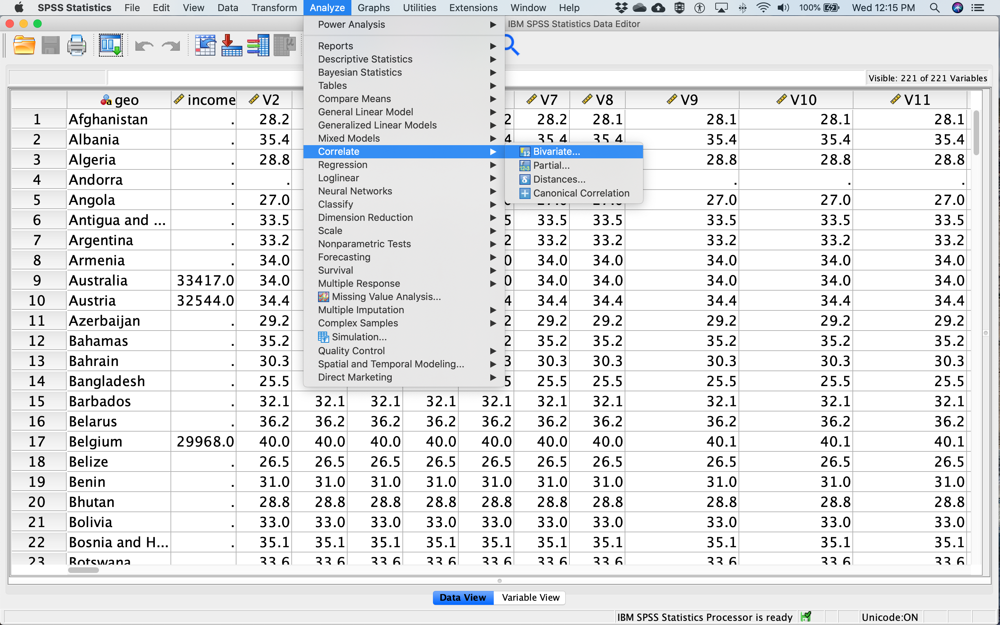
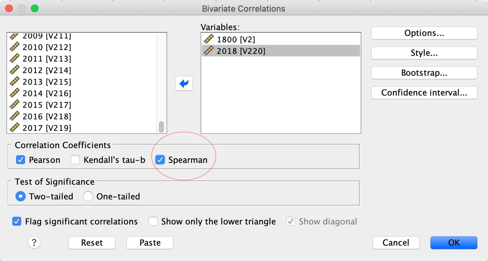
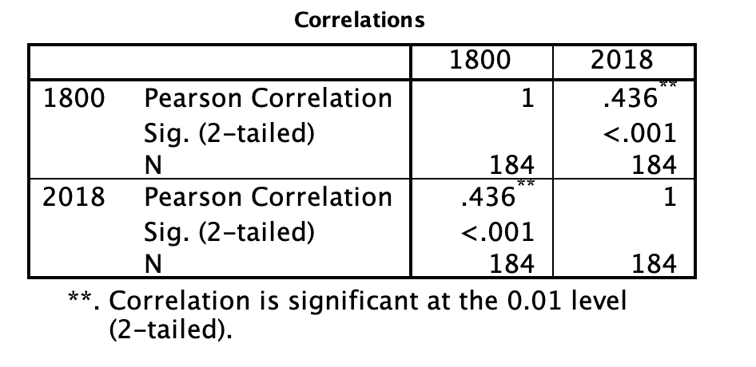
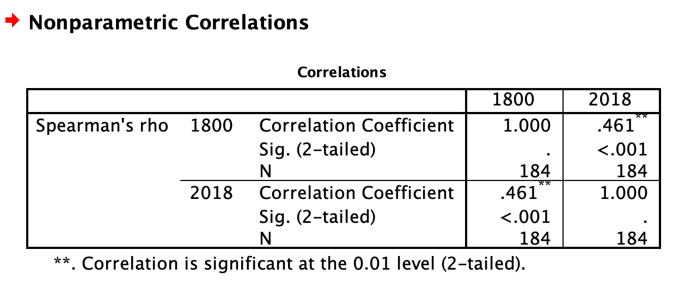
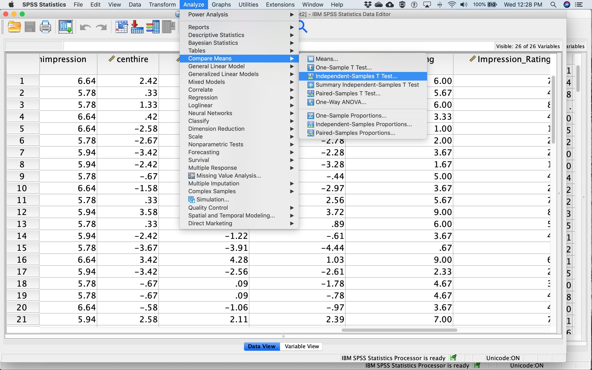
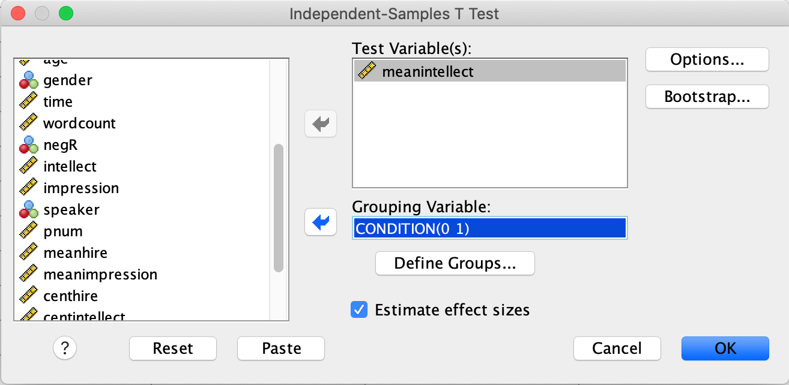
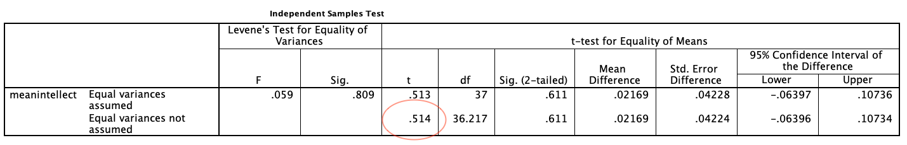
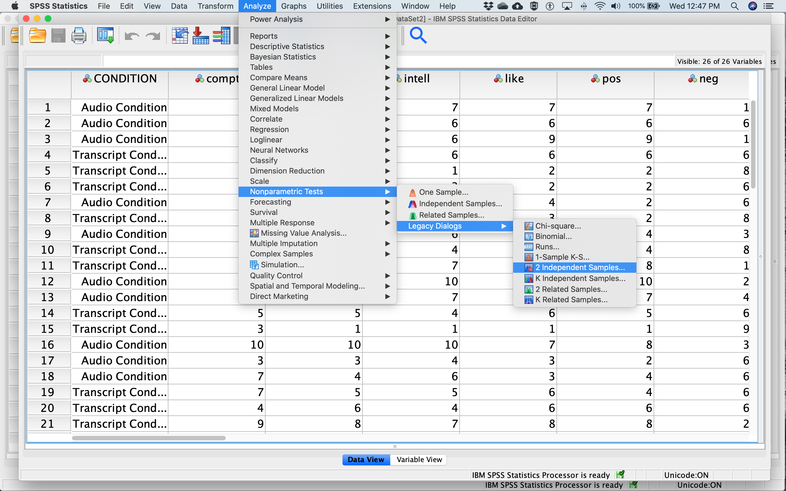
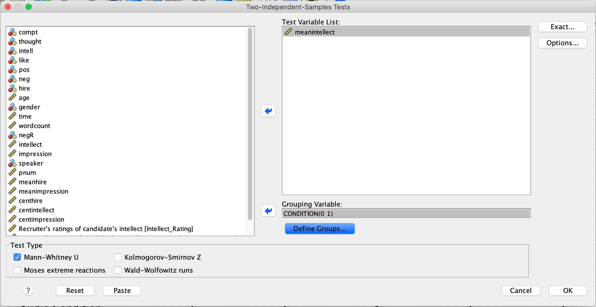
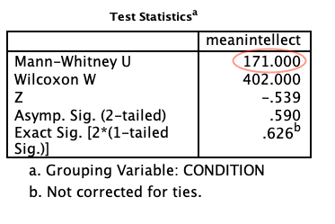

---
output:
  pdf_document: default
  html_document: default
---
# Lab 12: Choosing an appropriate statistical test

```{r setup, include=FALSE}
knitr::opts_chunk$set(echo = TRUE)
```
<script>
$("#coverpic").hide();
</script>

## General Goals

Considering the scale of measurement of your variables and the research question, select the appropriate statistical test from the following options: Pearson's *r* correlation coefficient, Spearman's *r* correlation coefficient, independent *t*-test, and Mann-Whitney *U*-test.

## Summary of the tests

### Pearson's *r* correlation coefficient

Pearson's *r* tests for a linear relation between two variables. The scale of measurement of the variables must be interval or ratio. An example research question that could be addressed with Pearson's *r* is: What is the correlation between height (measured in metres) and weight (measured in kilograms)?

### Spearman's *r* correlation coefficient

Spearman's *r* tests for a linear relation between the ranks of two variables. The scale of measurement of the variables must be ordinal, interval or ratio. Spearman's *r* is a good choice when outliers are present. An example research question that could be addressed with Spearman's *r* is: What is the correlation between height category (very short, short, average, tall, very tall) and weight category (very low, low, average, high, very high)?

### Independent *t*-test

The independent *t*-test determines whether there is a difference between the mean of two groups. The groups must be independent (i.e., made up of different participants) and the dependent variable (the one being compared between the groups) must be measured on an interval or ratio scale. An example research question that could be addressed with an independent *t*-test is: Is there a difference in mean weight between short and tall individuals? 

### Mann-Whitney *U*-test

The Mann-Whitney *U*-test determines whether the distribution is different between two groups. The dependent variable (the one being compared between the groups) must be measured on an ordinal, interval, or ratio scale. In this class, we are going to apply the Mann-Whitney *U*-test to independent groups (i.e., the groups are made up of different participants). An example research question that could be addressed with a Mann-Whitney *U*-test is: Is there a difference in the distribution of weight categories (very low, low, average, high, very high) between short and tall individuals? 

## SPSS

### Pearson and Spearman Correlation
To demonstrate correlation, we will use the life_expectancy.sav file downloaded from section 0.2.3 of this lab manual. 

Both Pearson's and Spearman's *r* can be accessed in SPSS via the <span style="color:blue">Analyze</span> menu. Select <span style="color:blue">Correlate</span>, and then <span style="color:blue">Bivariate...</span> 

```{r , echo=FALSE,dev='png'}

```

Select two variables from the list on the left (in this case, the life expectancy data from the year 1800 and the year 2018) and drag them to the box on the right, or use the arrow in the middle. Under <span style="color:blue">Correlation Cefficients</span>, <span style="color:blue">Pearson</span> will be checked on by default. Check <span style="color:blue">Spearman</span> as well to get both (see red circle in figure below).

```{r , echo=FALSE,dev='png'}

```

Click <span style="color:blue">OK</span>. In your output window, you will see two output tables. The first displays the results of the Pearson correlations, and the second displays the results of the Spearman correlations. The tables show the correlation between 1800 and 2018, as well as the correlation between 2018 and 1800 - these work out to be the same, of course. The Pearson correlation coefficient is .436 and the Spearman correlation coefficient is .461 - make sure you can find those numbers on the tables below. Why are the correlation coefficients different for Pearson and Spearman?

```{r , echo=FALSE,dev='png'}

```

```{r , echo=FALSE,dev='png'}

```

#### Interpreting and reporting the results

The first thing to note about the output of both Pearson and Spearman's correlation analysis is that the tables include redundant information. You can see from the first row and first column of the table that the Pearson's correlation between life expectancy in 1800 and 1800 is 1. This is a perfect correlation because you are correlating the variable with itself. You will see that the correlation is equal to 1 along the diagonal of the table as each variable is correlated with itself. You will also see that the first row, second column contains the same information as the second row, first column. This tells you that the correlation between life expectancy in 1800 and 2018 is the same as the correlation between life expectancy in 2018 and 1800. This is always true - the order the variables are input to SPSS never impacts the correlation. If you aren't sure why, go back and look at the equation for *r* we covered in class or in the textbook.  

To determine the output of the correlation between life expectancy in 1800 and 2018 (i.e., the analysis of interest), look to the first row, second column. The correlation coefficient, *r*, is labelled "Pearson's correlation" and has a value of .436. It has two asterisks next to it, which you can see from the note at the bottom of the table means "Correlation is significant at the 0.01 level (2-tailed)." We will get more into what "2-tailed" means in class, but the important thing to note here is that your correlation is statistically significant. "Significant" is a special word in statistics that doesn't mean what it means in normal language. It does not mean important, or interesting, or anything like that. In statistics, "significant" means that you have rejected the null hypothesis. You can think of it like this: it means the data you analyzed "signify" something. 
In addition to the two asterisks, you can also check whether your correlation is significant by looking at the number labelled "Sig. (2-tailed)." For the correlation between life expectancy in 1800 and 2018, the "Sig. (2-tailed)" row says "<.001." This is also called a *p*-value, which we talked about in class. By convention, when the *p*-value is less than .05, we reject the null hypothesis. In this case, .05 is your alpha or cutoff value. You can set your alpha to whatever you like, but typically we use .05.   

For both Pearson's and Spearman's *r*, you must report the *r*-value and the *p*-value. Both of these can be found in the tables. For example, for Pearson's *r*, you might write the following sentence in your Results section:
The correlation between life expectancy in 1800 and life expectancy in 2018 was significant (*r* = .44, *p* < .05). 
For Spearman's *r*, you might write the following sentence in your Results section: 
The correlation between life expectancy in 1800 and life expectancy in 2018 was significant (*r* = .46, *p* < .05). 

Note that for this class, we are going to round test statistics like *r* to two decimal places. Can you find these numbers in the tables above? Where is the .05 coming from?

### Independent *t*-test

To demonstrate independent *t*-tests, we will use the SchroederEpley2015_Study4_data.sav file downloaded from section 0.2.3 of this lab manual.

Schroeder and Epley (2015) conducted an experiment to determine whether a person’s speech (i.e., vocal tone, cadence, and pitch) communicates information about their intellect better than their written words (even if they are the same words as in the speech). 

To conduct this study, the authors randomly assigned 39 professional recruiters for Fortune 500 companies to one of two conditions. In the audio condition, participants listened to audio recordings of a job candidate’s spoken job pitch. In the transcript condition, participants read a transcription of the job candidate’s pitch. After hearing or reading the pitch, the participants rated the job candidates on three dimensions: intelligence, competence, and thoughtfulness. 

So, what happened? Did the recruiters think job applicants were smarter when they read the transcripts, or when the heard the applicants speak? We have the data, we can find out.

Before we run the *t*-test, let's introduce a button at the top of our SPSS spreadsheet window. This will be important for identifying the values assigned to groups later on. The button I refer to here is highlighted below; it has two boxes, one with an A and one with a 1 on it, with arrows in-between.

```{r , echo=FALSE,dev='png'}
knitr::include_graphics('img/7.4.12.png')
```

Press this button and see what happens to your data spreadsheet. Notice that this button has revealed the values used to signify the Audio and Transcript groups. We will need to know that these groups are signified by 0s and 1s when we come to running our *t*-test. If you click the button again, the cells will go back to displaying their labels. Keep in mind that revealing the values or labels does not change anything about the data itself or any subsequent analyses; it is merely a cosmetic change.

The independent *t*-test can be accessed via the <span style="color:blue">Analyze</span> menu as well. Select <span style="color:blue">Compare Means</span>, and then <span style="color:blue">Independent Samples T Test...</span>

```{r , echo=FALSE,dev='png'}

```

The dependent variable is moved by dragging or with the arrow from the list of variables on the left to the <span style="color:blue">Test Variable(s)</span> box on the right. Move `meanintellect` to the <span style="color:blue">Test Variable(s)</span> box. The <span style="color:blue">Grouping Variable</span> defines the groups. Move `CONDITION` to the <span style="color:blue">Grouping Variable</span> box. Next, click <span style="color:blue">Define Groups...</span> Place `0` and `1` in the fields that ask for Values for Group 1 and Group 2 and click <span style="color:blue">Continue</span>. The dialog box should look like this:

```{r , echo=FALSE,dev='png'}

```

Then click <span style="color:blue">OK</span>.

You will get three tables in your output file. Focus on the second one for now. The *t*-value you are interested in can be found in the red circle below: 

```{r , echo=FALSE,dev='png'}

```

#### Interpreting and reporting the results

There are two rows in the *t*-test output. We are going to focus on the second row, labelled "Equal variances not assumed" because it is always OK to use this row. Sometimes it is OK to use the top row and sometimes it isn't. We will get into the reasons why when we cover *t*-tests in more detail in class. 

For *t*-tests, we must report the *t* value, degrees of freedom (df), and *p*-value. Degrees of freedom are closely linked to sample size for *t*-tests; we may discuss further in class if time allows. Like for correlation, the *p*-value is labelled "Sig. (2-tailed)." By convention, when the *p*-value is less than .05, we reject the null hypothesis. In this case, .05 is your alpha or cutoff value. You can set your alpha to whatever you like, but typically we use .05.   

For example, you might write the following sentence in your Results section:
There was not a significant difference in mean intellect between the Audio and Transcript groups [*t*(36.22) = 0.51, *p* > 0.05].
Note that for this class, we are going to round test statistics like *t* to two decimal places. Can you find these numbers in the tables above? Where is the .05 coming from?

### Mann-Whitney *U*-test

We will use the same data and variables from the independent *t*-test example to try out the Mann-Whitney *U*-test.

The Mann-Whitney *U*-test can be accessed via the <span style="color:blue">Analyze</span> menu as well. Select <span style="color:blue"> Nonparametric Tests</span>, and then <span style="color:blue">Legacy Dialogs</span>, and then <span style="color:blue">2 Independent Samples ...</span> 

```{r , echo=FALSE,dev='png'}

```
Like we did for the independent *t*-test, move `meanintellect` to the <span style="color:blue">Test Variable List</span> box and move `CONDITION` to the <span style="color:blue">Grouping Variable</span> box. Next, click <span style="color:blue">Define Groups...</span> Place `0` and `1` in the fields that ask for Values for Group 1 and Group 2 and click <span style="color:blue">Continue</span>. The dialog box should look like this:

```{r , echo=FALSE,dev='png'}

```

Note that <span style="color:blue">Mann-Whitney U</span> is checked on by default. Click <span style="color:blue">OK</span>. This time you will get two tables in your output file. Focus on the second one. The *U* value is highlighted with a red circle in the figure below:

```{r , echo=FALSE,dev='png'}

```

#### Interpreting and reporting the results

For Mann-Whitney *U*-tests, we must report the *U* value and *p*-value. The *p*-value is labelled as "Asymp. Sig. (2-tailed)." By convention, when the *p*-value is less than .05, we reject the null hypothesis. In this case, .05 is your alpha or cutoff value. You can set your alpha to whatever you like, but typically we use .05.   

For example, you might write the following sentence in your Results section:
There was not a significant difference in mean intellect between the Audio and Transcript groups (*U* = 171.00, *p* > 0.05).
Note that for this class, we are going to round test statistics like *U* to two decimal places. Can you find these numbers in the tables above? Where is the .05 coming from?


## Homework (Mar 9 and 10)

To be added

## Homework (Feb 23 and 24) YOU HAVE ALREADY COMPLETED THIS - DO NOT DO IT AGAIN
A simplified version of the SchroederEpley2015_Study4_data.sav file, entitled Chap12Homework.sav has been uploaded to Moodle. Download Chap12Homework.sav and use it to address the following research questions. 

Your task is to create and submit **one SPSS output file** (*.spv format) showing that you have run the appropriate statistical analyses for the four questions. The output file should include four analyses and show that you ran the correct analyses on the correct variables.

Remember to check the <span style="color:blue">Measure</span> column in <span style="color:blue">Variable View</span>.

**Research Questions:**

Is the number of words in a candidate’s pitch related to the recruiter’s perception of the candidate’s intellect?

Are recruiters’ hiring rankings of candidates related to their perception of candidates’ intellect?

Is there a difference between recruiters’ perceptions of candidates’ intellect between the audio recording and written transcript conditions?

Is there a difference between recruiters’ hiring rankings of candidates between the audio recording and written transcript conditions?

