--- 
title: "Answering questions with data: Lab Manual"
author: 
- "Matthew J. C. Crump, Anjali Krishnan, Stephen Volz, and Alla Chavarga"
- "Adapted for PSYC 292, St. Francis Xavier University, by Erin L. Mazerolle and Sherry Neville-MacLean"
date: "2018: Last Compiled 2021-06-23"
site: bookdown::bookdown_site
output: 
  bookdown::gitbook:
    includes:
      in_header: includeme.html
      before_body: testpic.html
    css: [tufte.css, style.css]
    fontsettings:
      theme: white
      family: sans
      size: 1
documentclass: book
bibliography: [book.bib, packages.bib, MyLibrary.bib]
biblio-style: apalike
link-citations: yes
#github-repo: rstudio/bookdown-demo
description: "A lab manual for Psyc 3400"
---

# Preface {-}

Placeholder


## Important notes
### Attributions
### CC BY-SA 4.0 license
### Copying the lab manual
### Acknowledgments
## Data
### Data Repository
### CSV format
### SPSS format
## R
### Why R?
### Installing R and R Studio
### R studio notes and tips
#### Console
#### Script Editor
#### Workspace and History
#### File, Plot, Packages, Help
### How to complete the R Labs
#### R projects
#### Installing libraries
#### Quick install
#### R markdown
#### R markdown lab templates
### Screencast tutorial
### R-studio Cloud
## Excel 
## SPSS
### Installing SPSS
### Notes and Tips
#### Discrepancies in Visuals
#### Hidden Toolbars
### Opening SPSS and the SPSS layout
#### Reviewing variable properties and the Variable View tab
### Practice Problems 
## JAMOVI
### Getting Started with jamovi
#### Installing jamovi
#### Starting jamovi up
### Analyses 
### The Spreadsheet
#### Variables
#### Computed Variables
##### Copy and Paste
##### Syntax Mode
### Loading Data in jamovi
#### Importing Data from CSV Files
### Importing Unusual Data Files
#### Loading Data from Text Files
##### Loading Data from SPSS (and other statistics packages)
##### Loading Excel Files 
### Changing Data from One Level to Another
### Installing Add-on Modules into jamovi 
### Quitting jamovi 
### Summary

<!--chapter:end:index.Rmd-->


# Lab 1: Graphing Data

Placeholder


## General Goals
### Important info
## R 
### Download the lab templates
### Get some data
### Look at the data
#### summarytools
### Make Plots to answer questions
#### Where are the most film permits being requested?
#### What kind of "films" are being made, what is the category?
### ggplot2 basics
#### ylab() changes y label
#### xlab() changes x label
#### ggtitle() adds title
#### color adds color
#### fill fills in color
#### get rid of the legend
#### theme_classic() makes white background
#### Sometimes layer order matters
#### Font-size
#### ggplot2 summary
### More questions about NYC films
#### What are the sub-categories of films?
#### Categories by different Boroughs
### Gapminder Data
#### Look at the data frame
### Asking Questions with the gap minder data
#### Life Expectancy histogram
#### Life Expectancy by year Scatterplot
#### One country, life expectancy by year
#### Multiple countries scatterplot
#### geom_line() connecting the dots
### Generalization Exercise
### Writing assignment
## Excel
## SPSS
### Opening SPSS and the SPSS layout
### Reviewing variable properties and the Variable View tab
### Opening a data file and producing different types of graphs
#### Bar Graphs
#### Histograms
#### Scatterplots
### Homework
## JAMOVI
### Opening jamovi and reviewing the jamovi layout
### Reviewing variable properties and the Settings button
### Opening a data file and producing different types of graphs
#### Bar Graphs
#### Histograms
### Homework
### Thinking about Data - Practice Questions

<!--chapter:end:01-Graphing.Rmd-->


# Lab 2: Descriptive Statistics (and more graphs)

Placeholder


## General Goals
### Important info
## R
### Descriptives basics in R
#### Making numbers in R
#### Sum
#### Length
### Central Tendency
#### Mean
#### Median
#### Mode
### Variation
#### range
#### var = variance
#### sd = standard deviation
#### All Descriptives
### Descriptives by conditions
#### group_by and summarise
#### multiple descriptives
### Describing gapminder
#### What are some descriptive for Life expectancy by continent?
### Generalization Exercise
### Writing assignment
## Excel
## SPSS
### Calculating Descriptive Statistics
### Descriptive Statistics and Histograms
### Editing graphs
#### Editing the axes
#### Editing the bin width
### Boxplots
### Homework
## JAMOVI
### Calculating Descriptive Statistics
### Descriptive Statistics and Histograms
### Editing graphs
### Boxplots
### Homework
### Practice Questions

<!--chapter:end:02-Descriptives.Rmd-->


# Lab 3: Correlation

Placeholder


## General Goals
### Important Info
## R
### cor for correlation
#### scatterplots
#### lots of scatterplots
#### computing the correlations all at once
#### Chance correlations
### World Happiness Report
#### Load the data
#### Look at the data
#### My Question #1
#### My Question #2
### Generalization Exercise
### Writing assignment
## Excel
## SPSS
### Correlation Coefficient for Bivariate Data: Two Variables
### Correlation Matrix
### Correlation and Scatterplots
### Splitting a File
### Practice Problems
## JAMOVI

<!--chapter:end:03-Correlation.Rmd-->


# Lab 4: Normal Distribution & Central Limit Theorem

Placeholder


## General Goals
## R
### Generating Numbers in R
#### sample
#### runif uniform distribution
#### rbinom the binomial distribution
#### rnorm the normal distribution
#### mixing it up
#### summary
### sampling distribution of the mean.
#### Taking multiple samples of the same size
#### Getting the means of the samples
#### histogram for the means of the samples
#### simulating the distribution of sample means
### Sampling distributions for any statistic
### Central limit theorem
### The normal distribution
#### Graphing the normal distribution
#### calculating the probability of specific ranges.
#### summary pnorm
### z-scores
#### Calculating z-scores
### Generalization Exercise
### Writing assignment
## Excel
## SPSS
### Saving data as standardized values.
### Computing variables
### Practice Problems
## JAMOVI

<!--chapter:end:04-NormalDist.Rmd-->


# Lab 5: Fundamentals of Hypothesis Testing

Placeholder


## R
### The Crump Test
#### Make assumptions about the distribution for your measurement
#### Make assumptions about N
#### Choose the number of simulations to run
#### Run the simluation
#### find the range
#### Make inferences 
#### Planning your experiment
### Crumping real data
#### Test-enhanced learning
#### Brief summary
#### Estimate the paramaters of the distribution
#### Findings from the original study
#### Run the simulation
### The Randomization Test
#### Run the randomization test
#### Decision criteria
#### Finding the critical region
### Generalization Exercise
### Writing assignment
## Excel
## SPSS
### Experiment Background
### Calculate difference scores between pairs of measures
### Conduct a sign test
### Entering data for sign test problems
### Practice Problems
## JAMOVI

<!--chapter:end:05-HypothesisTesting.Rmd-->

# Lab 6: t-Test (one-sample, paired sample)

<script>
$("#coverpic").hide();
</script>

<span class="newthought">
Any experiment may be regarded as forming an individual of a 'population' of experiments which might be performed under the same conditions. A series of experiments is a sample drawn from this population.
---William Sealy Gossett
</span>


<div class="marginnote">
This lab is modified and extended from [Open Stats Labs](https://sites.trinity.edu/osl). Thanks to Open Stats Labs (Dr. Kevin P. McIntyre) for their fantastic work.
</div>

## Does Music Convey Social Information to Infants?

This lab activity uses the open data from Experiment 1 of Mehr, Song, and Spelke (2016) to teach one-sample and paired samples *t*-tests. Results of the activity provided below should exactly reproduce the results described in the paper.

### STUDY DESCRIPTION

Parents often sing to their children and, even as infants, children listen to and look at their parents while they are singing. Research by Mehr, Song, and Spelke (2016) sought to explore the psychological function that music has for parents and infants, by examining the hypothesis that particular melodies convey important social information to infants. Specifically, melodies convey information about social affiliation.

The authors argue that melodies are shared within social groups. Whereas children growing up in one culture may be exposed to certain songs as infants (e.g., “Rock-a-bye Baby”), children growing up in other cultures (or even other groups within a culture) may be exposed to different songs. Thus, when a novel person (someone who the infant has never seen before) sings a familiar song, it may signal to the infant that this new person is a member of their social group.

To test this hypothesis, the researchers recruited 32 infants and their parents to complete an experiment. During their first visit to the lab, the parents were taught a new lullaby (one that neither they nor their infants had heard before). The experimenters asked the parents to sing the new lullaby to their child every day for the next 1-2 weeks.

Following this 1-2 week exposure period, the parents and their infant returned to the lab to complete the experimental portion of the study. Infants were first shown a screen with side-by-side videos of two unfamiliar people, each of whom were silently smiling and looking at the infant. The researchers recorded the looking behavior (or gaze) of the infants during this ‘baseline’ phase. Next, one by one, the two unfamiliar people on the screen sang either the lullaby that the parents learned or a different lullaby (that had the same lyrics and rhythm, but a different melody). Finally, the infants saw the same silent video used at baseline, and the researchers again recorded the looking behavior of the infants during this ‘test’ phase.For more details on the experiment’s methods, please refer to Mehr et al. (2016) Experiment 1.

## Lab skills learned

1. Conducting a one-sample *t*-test
2. Conducting a paired samples *t*-test
3. Plotting the data
4. Discussing inferences and limitations


## Important Stuff
- citation: Mehr, S. A., Song. L. A., & Spelke, E. S. (2016). For 5-month-old infants, melodies are social. Psychological Science, 27, 486-501.
- [Link to .pdf of article](http://journals.sagepub.com/stoken/default+domain/d5HcBHg85XamSXGdYqYN/full)
- <a href="https://raw.githubusercontent.com/CrumpLab/statisticsLab/master/data/MehrSongSpelke2016.csv" download>Data in .csv format</a>
- [Data in SPSS format](https://drive.google.com/open?id=0Bz-rhZ21ShvOa3c4X3hqOWxwcUU)

## R

### Loading the data

The first thing to do is download the .csv formatted data file, using the link above, or just click [here](https://drive.google.com/open?id=0Bz-rhZ21ShvOdW1wV0pmUTJSSk0). It turns out there are lots of ways to load .csv files into R.

1. Load the data.table library. Then use the `fread` function and supply the web address to the file. Just like this. No downloading required.


```r
library(data.table)
all_data <- fread("https://raw.githubusercontent.com/CrumpLab/statisticsLab/master/data/MehrSongSpelke2016.csv")
```

2. Or, if you downloaded the .csv file. Then you can use `fread`, but you need to point it to the correct file location. The file location in this next example will not work for you, because the file is on my computer. 


```r
library(data.table)
all_data <- fread("data/MehrSongSpelke2016.csv")
```

### Inspect the data frame

When you have loaded data it's always a good idea to check out what it looks like. You can look at all of the data in the environment tab on the top right hand corner. The data should be in a variable called `all_data`. Clicking on `all_data` will load it into a viewer, and you can scroll around. This can be helpful to see things. But, there is so much data, can be hard to know what you are looking for.

#### summarytools

The `summarytools` packages give a quick way to summarize all of the data in a data frame. Here's how. When you run this code you will see the summary in the viewer on the bottom right hand side. There's a little browser button (arrow on top of little window) that you can click to expand and see the whole thing in a browser.


```r
library(summarytools)
view(dfSummary(all_data))
```

### Get the data for Experiment one

The data contains all of the measurements from all five experiments in the paper. By searching through the `all_data` data frame, you should look for the variables that code for each experiment. For example, the third column is called `exp1`, which stands for experiment 1. Notice that it contains a series of 1s. If you keep scrolling down, the 1s stop. These 1s identify the rows associated with the data for Experiment 1. We only want to analyse that data. So, we need to filter our data, and put only those rows into a new variable. We do this with the `dplyr` library, using the `filter` function.


```r
library(dplyr)
```

```
## 
## Attaching package: 'dplyr'
```

```
## The following objects are masked from 'package:data.table':
## 
##     between, first, last
```

```
## The following objects are masked from 'package:stats':
## 
##     filter, lag
```

```
## The following objects are masked from 'package:base':
## 
##     intersect, setdiff, setequal, union
```

```r
experiment_one <- all_data %>% filter(exp1==1)
```

Now if you look at the new variable `experiment_one`, there are only 32 rows of data. Much less than before. Now we have the data from experiment 1.

### Baseline phase: Conduct a one sample *t*-test

You first want to show that infants' looking behavior did not differ from chance during the baseline trial. The baseline trial was 16 seconds long. During the baseline, infants watched a video of two unfamiliar people, one of the left and one on the right. There was no sound during the baseline. Both of the actors in the video smiled directly at the infant.

The important question was to determine whether the infant looked more or less to either person. If they showed no preference, the infant should look at both people about 50% of the time. How could we determine whether the infant looked at both people about 50% of the time?

The `experiment_one` data frame has a column called `Baseline_Proportion_Gaze_to_Singer`. All of these values show how the proportion of time that the infant looked to the person who would later sing the familiar song to them. If the average of these proportion is .5 across the infants, then we would have some evidence that the infants were not biased at the beginning of the experiment. However, if the infants on average had a bias toward the singer, then the average proportion of the looking time should be different than .5.

Using a one-sample *t*-test, we can test the hypothesis that our sample mean for the `Baseline_Proportion_Gaze_to_Singer` was not different from .5.

To do this in R, we just need to isolate the column of data called `Baseline_Proportion_Gaze_to_Singer`. We will do this using the `$` operator. The `$` operator is placed after any data frame variable, and allows you to select a column of the data. The next bit of code will select the column of data we want, and put it into a new variable called `Baseline`. Note, if you type `exp1$` then R-Studio should automatically bring up all the columns you can choose from.


```r
baseline <- experiment_one$Baseline_Proportion_Gaze_to_Singer
```

#### Look at the numbers

<div class="marginnote">
**Question:** Why is it important to look at your numbers? What could happen if you didn't?
</div>

OK, we could just do the *t*-test right away, it's really easy, only one line of code. But, we haven't even looked at the numbers yet. Let's at least do that. First, we'll just use plot. It will show every data point for each infant as a dot.


```r
plot(baseline)
```


That's helpful, we see that the dots are all over the place. Let's do a histogram, so we can get a better sense of the frequency of different proportions.


```r
hist(baseline)
```


#### Look at the descriptives

Let's get the mean and standard deviation of the sample


```r
mean(baseline)
```

```
## [1] 0.5210967
```

```r
sd(baseline)
```

```
## [1] 0.1769651
```

OK, so just looking at the mean, we see the proportion is close to .5 (it's .521). And, we see there is a healthy amount of variance (the dots were all over the place), as the standard deviation was about .176.

<div class="marginnote">
**Question:** Based on the means and standard deviations can you make an educated guess about what the *t* and *p* values might be? Learn how to do this and you will be improving your data-sense.
</div>

Now, before we run the *t*-test, what do you think is going to happen? We are going to get a t-value, and an associated p-value. If you can make a guess at what those numbers would be right now in your head, and those end up being pretty close to the ones we will see in a moment, then you should pat yourself on the back. You have learned how to have intuitions about the data. As I am writing this I will tell you that 1) I can't remember what the *t* and *p* was from the paper, and I haven't done the test yet, so I don't know the answer. So, I am allowed to guess what the answer will be. Here are my guesses *t*(31) = 0.2, *p* = .95. The numbers in the brackets are degrees of freedom, which we know are 31 (*df*= *n* - 1 = 32 - 1 = 31). More important than the specific numbers I am guessing (which will probably be wrong), I am guessing that the p-value will be pretty large, it will not be less than .05, which the author's set as their alpha rate. So, I am guessing we will not reject the hypothesis that .52 is different from .5.

Let's do the *t*-test and see what happens.

#### Conduct t.test


```r
t.test(baseline, mu=.5)
```

```
## 
## 	One Sample t-test
## 
## data:  baseline
## t = 0.67438, df = 31, p-value = 0.5051
## alternative hypothesis: true mean is not equal to 0.5
## 95 percent confidence interval:
##  0.4572940 0.5848994
## sample estimates:
## mean of x 
## 0.5210967
```

<div class="marginnote">
**Question:** Why was the baseline condition important for the experiment? What does performance in this condition tell us?
</div>

So, there we have it. We did a one-sample *t*-test. Here's how you would report it, *t*(31) = .67, *p* = .505. Or, we might say something like:

> During the baseline condition, the mean proportion looking time toward the singer was .52, and was not significantly different from .5, according to a one-sample test, *t*(31) = .67, *p* = .505.

You should take the time to check this result, and see if it is the same one that was reported in the paper.

### Test phase

Remember how the experiment went. Infants watched silent video recordings of two women (Baseline). Then each person sung a song, one was familiar to the infant (their parents sung the song to them many times), and one was unfamiliar (singing phase). After the singing phase, the infants watched the silent video of the two singers again (test phase). The critical question was whether the infants would look more to the person who sung the familiar song compared to the person who sun the unfamiliar song. If the infants did this, they should look more than 50% of the time to the singer who sang the familiar song. We have the data, we can do another one sample *t*-test to find out. We can re-use all the code we already wrote to do this. I'll put it all in one place. If we run all of this code, we will see all of the things we want to see.

We only need to make two changes. We will change `experiment_one$Baseline_Proportion_Gaze_to_Singer` to `experiment_one$Test_Proportion_Gaze_to_Singer`, because that column has the test phase data. And, instead of putting the data into the variable `baseline`. We will make  a new variable called `test_phase` to store the data.


```r
test_phase <- experiment_one$Test_Proportion_Gaze_to_Singer
plot(test_phase)
```


```r
hist(test_phase)
```


```r
mean(test_phase)
```

```
## [1] 0.5934913
```

```r
sd(test_phase)
```

```
## [1] 0.1786884
```

```r
t.test(test_phase, mu = .5)
```

```
## 
## 	One Sample t-test
## 
## data:  test_phase
## t = 2.9597, df = 31, p-value = 0.005856
## alternative hypothesis: true mean is not equal to 0.5
## 95 percent confidence interval:
##  0.5290672 0.6579153
## sample estimates:
## mean of x 
## 0.5934913
```

<div class="marginnote">
**Question:** Why was the test condition important for the experiment? What does performance in this condition tell us?
</div>

Alright. What did we find? You should take a stab at writing down what we found. You can use the same kind of language that I used from the first one sample-test. You should state the mean proportion, the *t*-value, the *df*s, and the *p*-value. You should be able to answer the question, did the infants look longer at the singer who sang the familiar song? And, did they look longer than would be consist with chance at 50%.

### Paired-samples *t*-test

The paired samples *t*-test is easy to do. We've already made two variables called `baseline`, and `test_phase`. These contain each of the infants looking time proportions to the singer for both parts of the experiment. We can see if the difference between them was likely or unlikely due to chance by running a paired samples *t*-test. We do it like this in one line:


```r
t.test(test_phase, baseline, paired=TRUE, var.equal=TRUE)
```

```
## 
## 	Paired t-test
## 
## data:  test_phase and baseline
## t = 2.4164, df = 31, p-value = 0.02175
## alternative hypothesis: true difference in means is not equal to 0
## 95 percent confidence interval:
##  0.01129217 0.13349698
## sample estimates:
## mean of the differences 
##              0.07239458
```

<div class="marginnote">
**Question:** Why was the paired samples *t*-test necessary if we already did two one sample *t*-test? What new question is the paired samples *t*-test asking?
</div>


I'll leave it to you to interpret these values, and to see if they are the same as the ones in the paper. Based on these values what do you conclude? Is there a difference between the mean proportion looking times for the baseline and testing phase?


#### Relationship between one-sample and paired sample *t*-test

<div class="marginnote">
**Question:** Why is it that a paired samples *t*-test can be the same as the one sample *t*-test? What do you have to do the data in the paired samples *t*-test in order to conduct a one-sample *t*-test that would give you the same result?
</div>

We've discussed in the textbook that the one-sample and paired sample *t*-tests are related, they can be the same test. The one-sample test is to determine whether a sample mean is different from some particular mean. The paired sample *t*-test is to determine whether one sample mean is different from another sample mean. If you take the scores for each variable in a paired samples *t*-test, and subtract them from one another, then you have one list of difference scores. Then, you could use a one sample *t*-test to test whether these difference scores are different from 0. It turns out you get the same answer from a paired sample *t*-test testing the difference between two sample means, and the one sample *t*-test testing whether the mean difference of the difference scores between the samples are different from 0. We can show this in r easily like this:


```r
t.test(test_phase, baseline, paired=TRUE, var.equal=TRUE)
```

```
## 
## 	Paired t-test
## 
## data:  test_phase and baseline
## t = 2.4164, df = 31, p-value = 0.02175
## alternative hypothesis: true difference in means is not equal to 0
## 95 percent confidence interval:
##  0.01129217 0.13349698
## sample estimates:
## mean of the differences 
##              0.07239458
```

```r
difference_scores<-test_phase-baseline
t.test(difference_scores, mu=0)
```

```
## 
## 	One Sample t-test
## 
## data:  difference_scores
## t = 2.4164, df = 31, p-value = 0.02175
## alternative hypothesis: true mean is not equal to 0
## 95 percent confidence interval:
##  0.01129217 0.13349698
## sample estimates:
##  mean of x 
## 0.07239458
```

#### Usefulness of difference scores

OK fine, the paired samples *t*-test can be a one sample *t*-test if you use the difference scores. This might just seem like a mildly useful factoid you can use for stats trivia games (which no one plays). The point of drawing your attention to the relationship, is to get you to focus on the difference scores. These are what we are actually interested in.

Let's use the difference scores to one more useful thing. Sometime the results of a *t*-test aren't intuitively obvious. By the *t*-test we found out that a small difference between the test phase and baseline was not likely produced by chance. How does this relate to the research question about infants using familiar songs as cues for being social? Let's ask a very simple question. How many infants actually showed the bias? How many infants out of 32 looked longer at the singer who sang the familiar song during test, compared to during baseline.

We can determine this by calculating the difference scores. Then, asking how many of them were greater than zero:


```r
difference_scores <- test_phase-baseline
length(difference_scores[difference_scores>0])
```

```
## [1] 22
```

So, 22 out of 32 infants showed the effect. To put that in terms of probability, 68.75% of infants showed the effect. These odds and percentages give us another way to appreciate how strong the effect is. It wasn't strong enough for all infants to show it.

### Graphing the findings

It is often useful to graph the results of our analysis. We have already looked at dot plots and histograms of the individual samples. But, we also conducted some *t*-tests on the means of the baseline and test_phase samples. One of the major questions was whether these means are different. Now, we will make a graph that shows the means for each condition. Actually, we will make a few different graphs, so that you can think about what kinds of graphs are most helpful. There are two major important things to show: 1) the sample means, and 2) a visual aid for statistical inference showing whether the results were likely due to chance.

We will use the ggplot2 package to make our graphs. Remember, there are two steps to take when using ggplot2. 1) put your data in a long form data frame, where each measure has one row, and 2) define the layers of the ggplot.

#### Make the dataframe for plotting

To start we will need 2 columns. One column will code the experimental phase, Baseline or Test. There are 32 observations in each phase, so we want the word `Baseline` to appear 32 times, followed by the word `Test` 32 times. Then we want a single column with each of the proportions for each infant.


```r
Phase <- rep(c("Baseline","Test"), each = 32)
Proportions <- c(baseline,test_phase)
plot_df <- data.frame(Phase,Proportions)
```

#### Dot plot of raw scores

This shows every scores value on the y-axis, split by the baseline and test groups. If you just looked at this, you might not think the test phase was different from the baseline phase. Still very useful to see the spread of individual scores. Supports the intuition that the scores are still kind of in a similar ballpark.


```r
library(ggplot2)
ggplot(plot_df, aes(x=Phase, y=Proportions))+
  geom_point()
```


#### Dot plot with means and raw scores

<div class="marginnote">
**Question:** What kinds of inferences about the role of chance in producing the difference between the means can we make from this graph? What is missing?
</div>

`ggplot2` is great because it let's us add different layers on top of an existing plot. It would be good to see where the mean values for each sample lie on top of the sample scores. We can do this. But, to do it, we need to supply ggplot with another data frame, one that contains the means for each phase in long form. There are are only two phases, and two means, so we will make a rather small data.frame. It will have two columns, a Phase column, and Mean_value column. There will only be two rows in the data frame, one for the mean for each phase.

To make the smaller data frame for the means we will use the `aggregate` function. This allows us to find the means for each phase from the plot_df data frame. It also automatically returns the data frame we are looking for.


```r
mean_df <- aggregate(Proportions ~ Phase, plot_df, mean)

ggplot(plot_df, aes(x=Phase, y=Proportions))+ 
  geom_point()+
  geom_point(data=mean_df, color="Red", size=2)
```


#### Bar plot

It's very common to use bars in graphs. We can easily do this by using `geom_bar`, rather than `geom_point`. Also, we can plot bars for the means, and keep showing the dots like this...(note this will be messed up, but I want to show you why).

Also look for these changes. 

1. added `stat="identity"` Necessary for bar plot to show specific numbers
2. added `aes(fill=Phase)` Makes each bar a different color, depending on which phase it comes from


```r
ggplot(plot_df, aes(x=Phase, y=Proportions))+ 
  geom_point()+
  geom_bar(data=mean_df, stat="identity",aes(fill=Phase))
```


OK, we see the bars and some of the dots, but not all of them. What is going on? Remember, ggplot2 works in layers. Whatever layer you add first will be printed first in the graph, whatever layer you add second will be printed on top of the first. We put the bars on top of the dots. Let's change the order of the layers so the dot's go on top of the bars.


```r
ggplot(plot_df, aes(x=Phase, y=Proportions))+ 
  geom_bar(data=mean_df, stat="identity",aes(fill=Phase))+
  geom_point()
```


#### Bar plot with error bars

So far we have only plotted the means and individual sample scores. These are useful, but neither of them give us clear visual information about our statistical test. Our paired sample *t*-test suggested that the mean difference between Baseline and Test was not very likely by chance. It could have happened, but wouldn't happen very often.

<div class="marginnote">
**Question:** Why would the standard deviation of each mean, or the standard error of each mean be inappropriate to use in this case?
</div>

<div class="marginnote">
**Question:** How would error bars based on the standard error of the mean differences aid in visual inference about the role of chance in producing the difference?
</div>

Error bars are commonly used as an aid for visual inference. The use of error bars can be a subtle nuanced issue. This is because there a different kinds of error bars that can be plotted, and each one supports different kinds of inference. In general, the error bar is supposed to represent some aspect of the variability associated with each mean. We could plot little bars that are +1 or -1 standard deviations of each mean, or we would do +1 or -1 standard errors of each mean. In the case of paired samples, neither or these error bars would be appropriate, they wouldn't reflect the variability associated with mean we are interested in. In a paired samples *t*-test, we are interested in the variability of the mean of the difference scores. Let's calculate the standard error of the mean (SEM) for the difference scores between Baseline and Test, and then add error bars to the plot.


```r
difference_scores <- baseline-test_phase #calculate difference scores
standard_error <- sd(difference_scores)/sqrt(length(difference_scores)) #calculate SEM


ggplot(plot_df, aes(x=Phase, y=Proportions))+ 
  geom_bar(data=mean_df, stat="identity",aes(fill=Phase))+
  geom_errorbar(data=mean_df, aes(ymin=Proportions-standard_error, 
                                  ymax=Proportions+standard_error), width=.1) +
  geom_point(alpha=.25)
```


<div class="marginnote">
**Question:** What is one reason why these error bars (standard error of the mean difference between Baseline and Test) are appropriate to use. What is one reason they are not appropriate to use?
</div>


We have done something that is useful for visual inference. From the textbook, we learned that differences of about 2 standard errors of the mean are near the point where we would claim that chance is unlikely to have produced the difference. This is a rough estimate. But, we can see that the top of the error bar for Baseline is lower than the bottom of the error bar for Test, resulting in a difference greater than 2 standard error bars. So, based on this graph, we might expect the difference between conditions to be significant. We can also complain about what we have done here, we are placing the same error bars from the mean difference scores onto the means for each condition. In some sense this is misleading. The error bars are not for the depicted sample means, they are for the hidden single set of difference scores. To make this more clear, we will make a bar plot with a single bar only for the differences scores.


```r
difference_scores <- test_phase-baseline #calculate difference scores
standard_error <- sd(difference_scores)/sqrt(length(difference_scores)) #calculate SEM
mean_difference <- mean(difference_scores)

qplot(x="MeanDifference", y=mean_difference)+
  geom_bar(stat="identity", width=.5, alpha=.5)+
  geom_hline(yintercept=0)+
  geom_point(aes(y=difference_scores), alpha=.25)+
  geom_errorbar(aes(ymin=mean_difference-standard_error, 
                                  ymax=mean_difference+standard_error), width=.1)
```


<div class="marginnote">
**Question:** Why is is it more appropriate to put the standard error of the difference on this bar graph? What important aspects of the original results shown in the previous graph are missing from this graph?
</div>

This plot is very useful, too; it gives us some new information. We can see that the mean difference (test - baseline) was greater than 0. And, we are plotting the standard error of the mean differences, which are the error bars that more formally belong to this graph. Still, we are in a position to make some guesses for visual inference. The lower error bar represents only 1 SEM. It does not cross 0, but the fact that 1 SEM does not cross zero isn't important. For SEMs it's usually closer to 2. We can sort of visually guesstimate that that 2 SEMs would not cross zero, which would suggest we would obtain a small p-value. We also see each of the mean difference scores. It's very clear that they are all over the place. This means that not every infant showed a looking time preference toward the singer of the familiar song. Finally, this single bar plot misses something. It doesn't tell us what the values of the original means were.

#### Bar plot with confidence intervals

Confidence intervals are also often used for error bars, rather than the standard error (or other measure of variance). If we use 95% confidence intervals, then our error bars can be even more helpful for visual inference. Running the `t.test` function produces confidence interval estimates, and we can pull them out and use them for error bars.


```r
t_test_results <- t.test(difference_scores)
lower_interval<- t_test_results$conf.int[1]
upper_interval<- t_test_results$conf.int[2]

qplot(x="MeanDifference", y=mean_difference)+
  geom_bar(stat="identity", width=.5, alpha=.5)+
  geom_hline(yintercept=0)+
  geom_point(aes(y=difference_scores), alpha=.25)+
  geom_errorbar(aes(ymin=lower_interval, 
                                  ymax=upper_interval), width=.1)
```


Notice that the 95% confidence intervals around the mean are wider than the SEM error bars from the previous graph. These new confidence intervals tell us that 95% of the time our sample mean will fall between the two lines. The bottom line is slightly above 0, so we can now visually see support for our statistical inference that chance was unlikely to produce the result. If chance was likely to produce the result, the horizontal line indicating 0, would be well inside the confidence interval. We can also notice that the mean difference was just barely different from chance, that lower bar is almost touching 0.

### Data-simulation

We can do a little bit of data simulation to get a better feel for this kind of data. For example, we saw that the dots in our plots were quite variable. We might wonder about what chance can do in the current experiment. One way to do this is to estimate the standard deviation of the looking time proportions. Perhaps the best way to do that would be to an average of the standard deviation in the baseline and test_phase conditions. Then, we could simulate 32 scores from a normal distribution with mean = .5, and standard deviation equaling our mean standard deviation. We could calculate the mean of our simulated sample. And, we could do this many times, say 1000 times. Then, we could look at a histogram of our means. This will show the range of sample means we would expect just by chance. This is another way to tell whether the observed difference in this experiment in the testing phase was close or not close from being produced by chance. Take a look at the histogram. What do you think?


```r
sample_sd   <- (sd(baseline)+sd(test_phase))/2

simulated_means <- length(1000)
for(i in 1:1000){
 simulated_means[i] <- mean(rnorm(32,.5, sample_sd))
}

hist(simulated_means)
```


#### Simulating the mean differences

We can do the simulation slightly differently to give us a different look at chance. Above we simulated the sample means from a normal distribution centered on .5. The experimental question of interest was whether the mean difference between the baseline and test_phase condition was different. So, we should do a simulation of the difference scores. First, we estimate the standard deviation of the difference scores, and then run the simulation with a normal distribution centered on 0 (an expected mean difference of 0). This shows roughly how often we might expect mean differences of various sizes to occur. One major limitation is that we likely had only a rough estimate of the true standard deviation of these mean differences, after all there were only 32 of them, so we should take this with a grain of salt. Nevertheless, the pattern in the simulation fits well with the observations in that we already made from the data.


```r
sample_sd   <- sd(baseline-test_phase)

simulated_mean_difference <- length(1000)
for(i in 1:1000){
 simulated_mean_difference[i] <- mean(rnorm(32,0, sample_sd))
}

hist(simulated_mean_difference)
```


### Generalization Exercise

( 1 point - Pass/Fail )

The following code creates two variables with simulated means for each of 20 subjects in two conditions (A and B). Each sample comes from a normal distribution with mean = 100, and standard deviation = 25.


```r
Condition_A <- rnorm(20,100,25)
Condition_B <- rnorm(20,100,25)
```

1. Conduct a paired samples *t*-test on sample data stored in the variables `Condition_A`, and `Condition_B`. Report the results of the *t*-test, and the mean difference between conditions

2. The above code assumes no difference in the means between Condition A and Condition B. Both samples come from the same normal distribution. Change the mean for one of the distributions. Make the change large enough so that you find a significant *p*-value (p < 0.05) when you conduct the *t*-test on the new simulated data. Report the *t*-test and the means for each condition

### Writing assignment

(2 points - Graded)

Complete the writing assignment described in your R Markdown document for this lab. When you have finished everything. Knit the document and hand in your stuff (you can submit your .RMD file to blackboard if it does not knit.)

1. Answer the following questions

a. Explain the general concept of a *t*-value, and how it is different from a mean and the standard error. (.33 points)

b. Imagine you obtained a *t*-value with an associated *p*-value of .25. Explain what this means. (.33 points)

c. Imagine the critical *t*-value for a particular test was 2.6. What does the critical *t*-value mean (assuming alpha = 0.05 and the test is two-tailed). (.33 points)

d. Explain the differences between a one-sample and paired-sample *t*-test. ( 1 point )

General grading. 

- You will receive 0 points for missing answers 
- You must write in complete sentences. Point form sentences will be given 0 points.
- Completely incorrect answers will receive 0 points. 
- If your answer is generally correct but very difficult to understand and unclear you may receive half points for the question


## Excel

How to do it in Excel

## SPSS

In this lab, we will use SPSS to:

1. Perform a one sample *t*-test
2. Perform a paired samples *t*-test
3. Graph the data
4. Assess the relationship between a one-sample and a paired-samples *t*-test
5. Practice using descriptive statistics to give context to inferential statistics

### Experiment Background

---


For this lab, we will be using the data from Mehr, Song, and Spelke's (2016) study of how music may convey important social information to infants. 

To test their hypothesis, the researchers recruited 32 infants and their parents to complete an experiment. During their first visit to the lab, the parents were taught a new lullaby (one that neither they nor their infants had heard before). The experimenters asked the parents to sing the new lullaby to their child every day for the next 1-2 weeks.

Following this exposure period, the parents and their infants returned to the lab to complete the experimental portion of the study. Infants were first shown a screen with side-by-side videos of two unfamiliar people, each of whom were silently smiling and looking at the infant. The researchers recorded the looking behavior (or gaze) of the infants during this ‘baseline’ phase. Next, one by one, the two unfamiliar people on the screen sang either the lullaby that the parents learned or a different lullaby (that had the same lyrics and rhythm, but a different melody). Finally, the infants saw the same silent video used at baseline, and the researchers again recorded the looking behavior of the infants during this ‘test’ phase.

### OPTIONAL: Performing a one sample *t*-test

---


First, let's open the relevant data file. The data file has been simplified and is available on the lab Moodle page under "T-Tests." Click on "Mehr et al. Simplified Data File" to download it, note the filename and where you've downloaded it to, and then open it in SPSS. Your data should look like this:

<!-- -->

We will use SPSS to determine whether the infants looked equally at each of the people in the side-by-side videos at baseline. Let's think about why this is important. The infants in this experiment watched silent video recordings of two women (Baseline). Later, each person in the videos sang a song, one familiar (their parents had sang the song to them many times), and one unfamiliar. Afterwards, the infants watched the silent video of the two singers again (test phase). The critical question was whether the infants would look more to the person who sang the familiar song compared to the person who sang the unfamiliar song.

If the measure of what infants "like" or "prefer" is based on how long they look at a stimulus (in this case, a person in a video), we need to know that at baseline (before either of the people were associated with a song), infants looked equally at each person. If one of the people in the video was more memorable or attractive to the infants, then they would have a preferential bias towards looking at one person over the other. This could mean that the results of the study may have nothing to do with the songs, but rather an inherent bias towards the appearance of one of the people. This is why it is important to ensure that the infants looked at the people equally to start with (at baseline). 

In our data file, the variable we will use is called "Baseline_Proportion_Gaze_to_Singer"; this variable represents the proportion of time (out of 100%) that the infant spent looking at the person who would later be the singer of the familiar song. If the infant looks equally at each person, then the proportion of time spent looking at one out of the two people should be .5, or half of the time. Thus, we want to test whether the proportions measured are different from .5. Whenever we want to compare a sample data set (the proportions measured for all 32 infants) to a known mean (.5, or the proportion we expect if infants looked equally at both people), we use a one sample *t*-test.

In order to run the *t*-test, go to the <span style="color:blue">Analyze</span> menu, then choose <span style="color:blue">Compare Means</span> and then <span style="color:blue">One-Sample T-test</span>:

<!-- -->

This will open up a window in which you will specify which variable contains the relevant sample data. Remember, we are interested in the variable labeled `Baseline_Proportion_Gaze_to_Singer`, so let's choose this variable from the list on the left and move it to the right-hand field using the arrow. 

Next, make sure to change the value in the field labeled "Test Value" to the mean to which you are comparing the sample. Since we are comparing our sample's proportions to the proportion that represents equal time spent looking at both people in the video, we are going to use .5 as our test value. Enter this number in the appropriate field. Your window should look like this:

<!-- -->

Now, click <span style="color:blue">OK</span>. SPSS will produce several output tables.

<!-- -->

The first table contains descriptive statistics related to the sample. We can see from this table that the average proportion of time spent looking at the person who would later be the familiar song singer is .52. This is very close to .50. 

The second table contains the information resulting from our *t*-test: The t-statistic calculated is .67, with 31 (N-1) degrees of freedom. The p-value is listed under "Sig. (2-tailed)". The fact that this value is not less than our alpha level (set at .05) means we fail to reject the null hypothesis. In other words, the proportion of time infants spent looking at the singer was not different from .50. We might formally words this as follows:

During the baseline condition, the mean proportion looking time toward the singer was .52, and was not significantly different from .50, according to a one-sample test, *t*(31) = 0.67, *p* = .51.

Alternatively, you could also write: 
During the baseline condition, the mean proportion looking time toward the singer was .52, and was not significantly different from .50, according to a one-sample test, *t*(31) = 0.67, *p* > .05.


### Performing a paired-samples *t*-test

---


In this example, we will be comparing data from two measurements taken from the same individuals. In the same data file as above, we have two variables named `Baseline_Proportion_Gaze_to_Singer` and `Test_Proportion_Gaze_to_Singer`. These variables represent the proportion of time spent looking at the familiar song singer at baseline, and then again in the test phase (after the 1-2 week period in which infants have been familiarized with the song). Because each infant was measured once (baseline), and then re-measured again (test), we will use a paired samples *t*-test.

**Important terminology note:** `Baseline_Proportion_Gaze_to_Singer` and `Test_Proportion_Gaze_to_Singer` are represented as two variables in SPSS, but they refer to two levels of a single independent variable. You can think of the independent variable as timepoint with two levels: baseline and test.

In order to run the paired-samples *t*-test, go to <span style="color:blue">Analyze</span>, then <span style="color:blue">Compare Means</span>, then <span style="color:blue">Paired-Samples T-test..</span>.

<!-- -->

A window will appear with a list of all variables in a field on the left. We must choose the two variables that contain our data: `Baseline_Proportion_Gaze_to_Singer` and `Test_Proportion_Gaze_to_Singer`. Move these into the right-hand field individually using the arrow. Make sure that they appear next to each other in the right-hand field, as follows:

<!-- -->

Click <span style="color:blue">OK</span>, and SPSS will produce several output tables. The tables are as follows:

<!-- -->

The paired samples *t*-test produces a *t*-value (i.e., our observed *t*), degrees of freedom (N-1), and a *p*-value. You can interpret these values the same way as in the previous example. 

During the baseline condition, the difference between infants' mean proportion looking time toward the singer at baseline and the test phase was -0.07, and this difference was significant according to a paired samples *t*-test, t(31) = -2.42, *p* < .05.

### Graphing your results

---


In order to visualize the difference between means (for a paired-samples *t*-test, in this case), it is most appropriate to create a bar chart, or bar plot. Because our two conditions (baseline and test) make up a discrete (and not continuous) categorical variable (also called a nominal variable), a bar chart is most appropriate. Let's begin by going to <span style="color:blue">Graphs</span>, then <span style="color:blue">Chart Builder...</span>

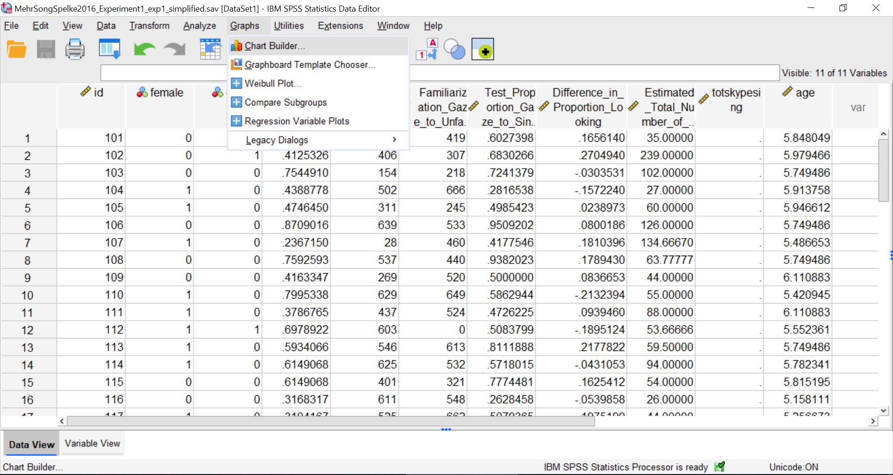<!-- -->

The Chart Builder window will open and look like this:

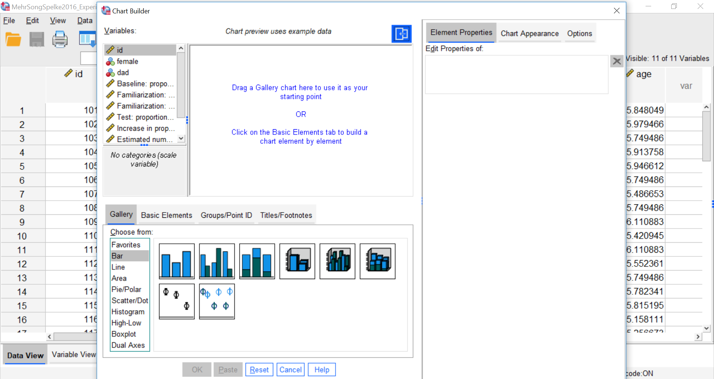<!-- -->

We are going to choose a simple bar chart, which is represented by the bar icon at the top left of the set of chart options. Click on this icon and drag it into the chart window as follows:

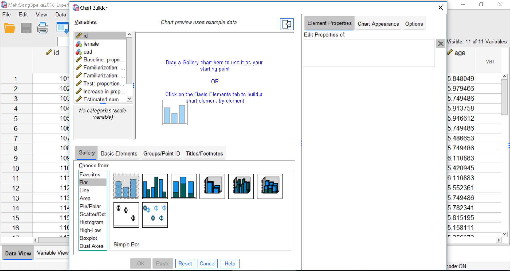<!-- -->

Once you do this, your window should look like this:

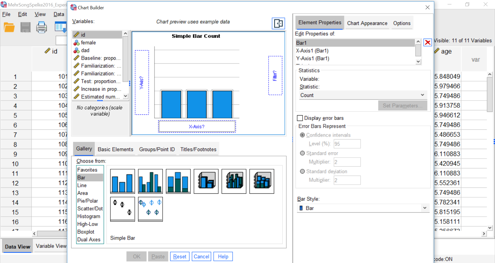<!-- -->

From here, you must indicate which variables should be included in the chart on the y-axis. We will first take the `Baseline_Proportion_Gaze_to_Singer` variable, found in the list on the left of the window, and drag it to the y-axis in the chart window. You will see that the y-axis area will highlight with a red border when you do this. 


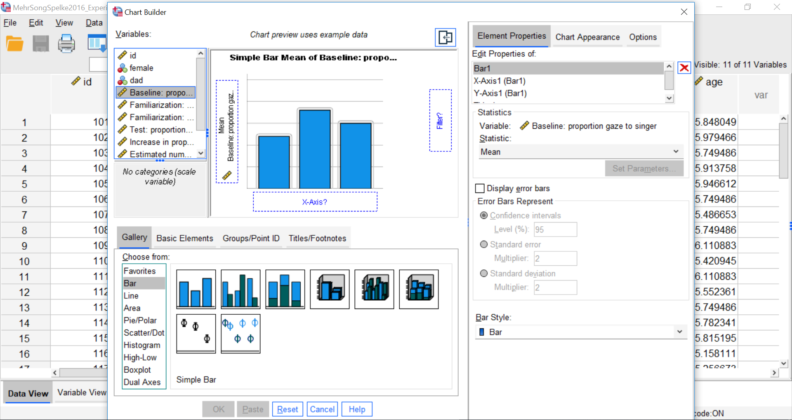<!-- -->

Now, take the next variable, `Test_Proportion_Gaze_to_Singer`, and drag it over the same y-axis title, but this time aim for the very top of the variable field. You will know you're doing it right when a red plus sign appears in this area as you hover:

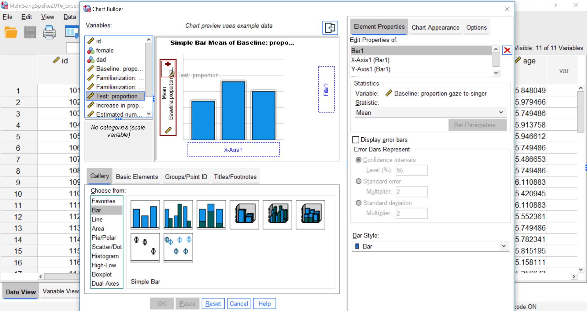<!-- -->

Drop this variable into this field once you see the plus sign. A window will pop us asking if you want both variables on this axis. <span style="color:blue">Click OK</span>. 

<!-- -->

The result will look like this (both variables' means, baseline and test, appear in the chart). 

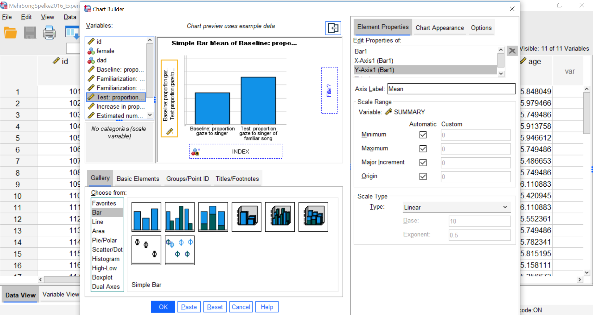<!-- -->

From here, you can customize the appearance of the graph. One thing we will do is add Error Bars. Find the window to the right of the main chart builder window, and select <span style="color:blue">Error Bars</span>. You will have the option to select Confidence Intervals, Standard Error, etc. Choose <span style="color:blue">Standard Error</span> and set the <span style="color:blue">Multiplier to 2</span>. Click <span style="color:blue">Apply</span>. Now, you should be able to see the bars in the chart builder window. 

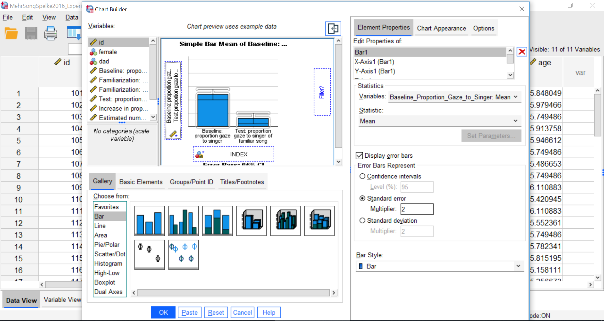<!-- -->

If you are satisfied with the chart, click OK and it will appear in an SPSS output window:

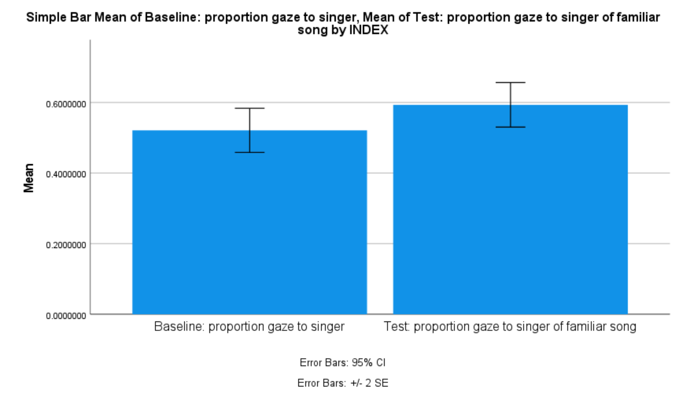<!-- -->

### OPTIONAL: The relationship between the one-sample and the paired-samples *t*-test

---


This section is dedicated to demonstrating that the one-sample and paired-samples *t*-tests are almost the very same thing. In order to understand this, we must reframe how we think about the paired-samples *t*-test. We typically consider it a comparison between two samples in which observations have been repeated (like in a before-after scenario, for example). We can also think of the paired samples *t*-test as testing the difference scores between two conditions. If the difference between two conditions is 0, then there is no difference, or there is no effect of the independent variable. If the difference is non-zero, then we can say there is a difference. 

Thus, the paired-samples *t*-test is exactly the same as the one-sample *t*-test if we consider it as a comparison of the mean difference score to 0. Let's demonstrate this using SPSS. 

We'll continue using the same data as above. Specifically, locate the variable named `Difference_in_Proportion_Looking`. This variable contains the difference score between the baseline and test conditions for each infant. We're going to treat this as our one sample (as in the one-sample *t*-test), and we'll be comparing it to a mean of 0. 

Let's begin. Go to <span style="color:blue">Analyze</span>, then <span style="color:blue">Compare Means</span>, then <span style="color:blue">One-Sample *t*-test...</span>

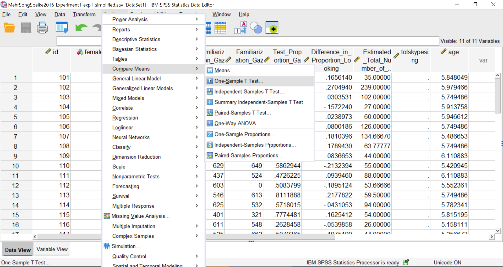<!-- -->

A window will appear. Move the variable of interest, `Difference_in_Proportion_Looking`, into the "Test Variable(s)" field. Below that, make sure to enter 0 in the "Test Value" field. 

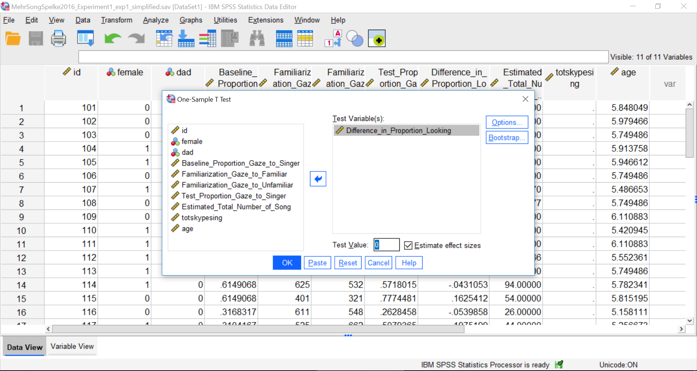<!-- -->

Then click <span style="color:blue">OK</span>. SPSS will generate several tables in the output window. They should look like this:

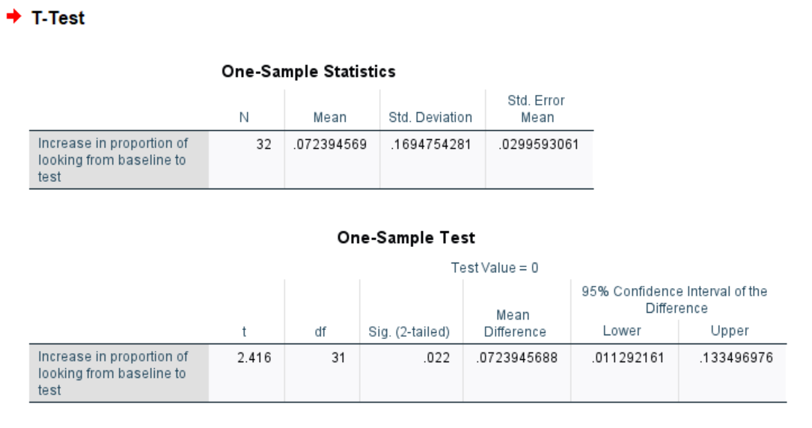<!-- -->

You will see that the t-statistic and p-value are identical to the ones obtained when we conducted a paired-samples *t*-test. Therefore, a paired-samples *t*-test conducted on two samples is equivalent to a one-sample *t*-test conducted on the difference scores (calculated on the two samples) compared against 0. 

Nota Bene: You will see that in the previous paired-samples *t*-test we obtained a t-statistic of -2.42, but here the t-statistic is positive. This difference comes from the fact that SPSS automatically subtracts the later-occurring variable in your spreadsheet from the earlier-occurring one. If your variables were ordered differently, you would obtain a positive t-statistic as well. In other words, the sign does not matter; it results from the order of the variables. 

### Using descriptive statistics to give context to inferential statistics

---

In Section 2.4.1 of the lab manual, you learned how to request descriptive statistics. If you return to the output generated by SPSS when we ran the paired-samples *t*-test, you should notice that the first table depicted in the output provides the mean, the sample size, the standard deviation, and the standard error of the mean for each measurement - Baseline_Proportion_Gaze_to_Singer and Test_Proportion_Gaze_to_Singer. 

<!-- -->

These descriptive statistics are useful for contextualizing the inferential statistics. In this case, we see that, for Baseline_Proportion_Gaze_to_Singer, the mean is 0.52 while for Test_Proportion_Gaze_to_Singer, the mean for 0.59. The standard deviation for both rounds to 0.18. In Section 6.6.3, we reported the mean difference of -0.07 was significant according to the paired-samples *t*-test. Now, we might add another sentence to explain the difference. 

Using the means and the standard deviations for each level of the independent variable, we will generate a more detailed interpretation which includes a statement about whether there is an increase or a decrease:

There was a significant difference between infants' mean proportion looking time toward the singer between the baseline (*M* = 0.52; *SD* = 0.18) and the test phase (*M* = 0.59; *SD* = 0.18). This difference was significant according to a paired samples *t*-test, *t*(31) = -2.42, *p* < .05. 


### Lab Homework #6

___


1. Use the data file from this lab to test whether the number of frames the baby spent gazing at the familiar song is significantly different than the number of frames spent gazing at the unfamiliar song (use alpha = .05). Hint: If you are having trouble figuring out what variables to use, remember to check the <span style="color:blue">Label</span> column in <span style="color:blue">Variable View</span>. Complete the Moodle quiz, which will ask you about both descriptive and inferential statistics.

2. Graph this result (including 1 SEM error bars) as a bar graph. Upload your output file, including the graph, to Moodle.


## JAMOVI

<div class="marginnote">
This section is  copied almost verbatim, with some editorial changes, from [Answering questions with data: The lab manual for R, Excel, SPSS and JAMOVI, Lab 2, Section 6.6, SPSS](https://www.erinmazerolle.com/statisticsLab/lab-6-t-test-one-sample-paired-sample.html#spss-6), according to its [CC license](https://creativecommons.org/licenses/by-sa/4.0/deed.ast). Thank you to Crump, Krishnan, Volz, &   Chavarga (2018). 
</div>

In this lab, we will use jamovi to:

1. Perform a one-sample *t*-test
2. Perform a paired-samples *t*-test
3. Graph the data
4. Assess the relationship between a one-sample and a paired-samples *t*-test
5. Practice using descriptive statistics to give context to inferential statistics

### Experiment Background

---


For this lab, we will be using the data from Mehr, Song, and Spelke's (2016) study of how music may convey important social information to infants. You can access that [data set](MAYBE A LINK TO MOODLE OR ONEDRIVE) here.

To test their hypothesis, the researchers recruited 32 infants and their parents to complete an experiment. During their first visit to the lab, the parents were taught a new lullaby (one that neither they nor their infants had heard before). The experimenters asked the parents to sing the new lullaby to their child every day for the next 1-2 weeks.

Following this exposure period, the parents and their infants returned to the lab to complete the experimental portion of the study. Infants were first shown a screen with side-by-side videos of two unfamiliar people, each of whom were silently smiling and looking at the infant. The researchers recorded the looking behavior (or gaze) of the infants during this ‘baseline’ phase. Next, one by one, the two unfamiliar people on the screen sang either the lullaby that the parents learned or a different lullaby (that had the same lyrics and rhythm, but a different melody). Finally, the infants saw the same silent video used at baseline, and the researchers again recorded the looking behavior of the infants during this ‘test’ phase.

### OPTIONAL: Performing a one-sample *t*-test

---


First, let's open the relevant data file. The data file has been simplified and is available [here](link). Right click on "Mehr et al. Simplified Data File" and indicate that you want it opened it in jamovi. Your data should look like this:

<!-- -->

We will use jamovi to determine whether the infants looked equally at each of the people in the side-by-side videos at baseline. Let's think about why this is important. The infants in this experiment watched silent video recordings of two people (baseline). Later, each person in the videos sang a song, one familiar (their parents had sang the song to them many times), and one unfamiliar. Afterwards, the infants watched the silent video of the two singers again (test phase). The critical question was whether the infants would look more to the person who sang the familiar song compared to the person who sang the unfamiliar song.

If the measure of what infants "like" or "prefer" is based on how long they look at a stimulus (in this case, a person in a video), we need to know that, at baseline (before either of the people were associated with a song), infants looked equally at each person. If one of the people in the video was more memorable or attractive to the infants, then they would have a preferential bias towards looking at one person over the other. This could mean that the results of the study may have nothing to do with the songs, but rather an inherent bias towards the appearance of one of the people. This is why it is important to ensure that the infants looked at the people equally to start with (at baseline). 

In our data file, the variable we will use is called "Baseline_Proportion_Gaze_to_Singer"; this variable represents the proportion of time (out of 100%) that the infant spent looking at the person who would later be the singer of the familiar song. If the infant looks equally at each person, then the proportion of time spent looking at one out of the two people should be .5, or half of the time. Thus, we want to test whether the proportions measured are different from .5. Whenever we want to compare a sample data set (the proportions measured for all 32 infants) to a known mean (.5, or the proportion we expect if infants looked equally at both people), we use a one-sample *t*-test.

In order to run the *t*-test, go to the <span style="color:blue">Analyses</span> menu option, then choose <span style="color:blue">T-Tests</span> and then <span style="color:blue">One Sample T-test</span>:

<!-- -->

This will open up a window in which you will specify which variable contains the relevant sample data. Remember, we are interested in the variable labeled `Baseline_Proportion_Gaze_to_Singer`, so let's choose this variable from the list on the left by highlighting it, and then use the arrow to move it to the “Dependent Variables” window which is the field to the right. 

Next, make sure to change the value in the field labeled <span style="color:blue">Test Value</span>, which is show under the <span style="color:blue">Hypothesis</span> label, to the mean to which you are comparing the sample. Since we are comparing our sample's proportions to the proportion that represents equal time spent looking at both people in the video, we are going to use .5 as our test value. Enter this number in the appropriate field. Your window should look like this:

<!-- -->

Now, if you look to the Results panel, you should see a table indicating the results of the one-sample *t*-test.

<!-- -->


The table contains the information resulting from our *t*-test: The *t*-statistic calculated is 0.67, with 31 (N-1) degrees of freedom. The *p*-value is listed as .505 which will be rounded to .51. The fact that this *p*-value is greater than our alpha level (set at .05) means we fail to reject the null hypothesis. In other words, the proportion of time infants spent looking at the singer was not different from .50. We might formally words this as follows:

During the baseline condition, the mean proportion looking time toward the singer was not significantly different from .50, according to a one-sample test, *t*(31) = 0.67, *p* = .51.

Typically, however, we would include the descriptive statistics in this write-up as well. Remember to use the skills you learned in Lab 2 to request the descriptive statistics for this variable (Click on <span style="color:blue">Analyses</span> menu option, <span style="color:blue">Exploration </span> and then <span style="color:blue">Descriptives</span>. Then, move the variable of interest to the Variables window, and select the desired statistics that are appropriate based on the scale of measurement.). Look to the Results panel for the Descriptives table.

<!-- -->


We can see from this table that the average proportion of time spent looking at the person who would later be the familiar song singer is .52. This is very close to .50. 

To add to the previously recommended write-up, we might write:

During the baseline condition, the mean proportion looking time toward the singer was .52, and was not significantly different from .50, according to a one-sample test, *t*(31) = 0.67, *p* = .51.

Alternatively, we could also write: 
During the baseline condition, the mean proportion looking time toward the singer was .52, and was not significantly different from .50, according to a one-sample test, *t*(31) = 0.67, *p* > .05.

### Performing a paired-samples *t*-test

---


In this example, we will be comparing data from two measurements taken from the same individuals. In the same data file as above, we have two variables named `Baseline_Proportion_Gaze_to_Singer` and `Test_Proportion_Gaze_to_Singer`. These variables represent the proportion of time spent looking at the familiar song singer at baseline, and then again in the test phase (after the 1-2 week period in which infants have been familiarized with the song). Because each infant was measured once (baseline), and then re-measured again (test), we will use a paired-samples *t*-test.

**Important terminology note:** `Baseline_Proportion_Gaze_to_Singer` and `Test_Proportion_Gaze_to_Singer` are represented as two variables in jamovi, but they refer to two levels of a single independent variable. You can think of the independent variable as time point with two levels: baseline and test.

In order to run the paired-samples *t*-test, go to <span style="color:blue">Analyses</span>, then <span style="color:blue">T-Tests</span>, then <span style="color:blue">Paired Samples T-test</span>.

<!-- -->

A window will appear with a list of all variables in a field on the left. We must choose the two variables that contain our data: `Baseline_Proportion_Gaze_to_Singer` and `Test_Proportion_Gaze_to_Singer`. Move these into the right-hand field, labelled “Paired Variables,” using the arrow. You can move one level of the variable at a time, or you can highlight both and move them at the same time. Make sure that they appear next to each other in the right-hand field, as follows:

<!-- -->

Notice that rather than going back into the <span style="color:blue">Analyses</span> menu, jamovi offers the option to produce the Descriptives table for the two levels of the variable within the pop-up window for the *t*-tests. Click to select the <span style="color:blue">Descriptives</span>. You may also want to select the <span style="color:blue">Mean difference</span> if you plan to report it in your Results. Alternatively, you will report the means and standard deviations for the two levels of the variable.

<!-- -->

In the Results panel, you should see two tables. The first table shows the results of the paired-samples *t*-test produces. It indicates a *t*-value (i.e., our observed *t*), degrees of freedom (N-1), and a *p*-value. You can interpret these values the same way as in the previous example. The second table is the Descriptives table. We might report our results in this way:

During the baseline condition, the difference between infants' mean proportion looking time toward the singer at baseline and the test phase was -0.07, and this difference was significant according to a paired-samples *t*-test, *t*(31) = -2.42, *p* < .05.
OR
According to a paired-samples *t*-test, there is a significant difference between infants' mean proportion looking time toward the singer at baseline (*M* = 0.52, *SD* = 0.18) and the test phase (*M* = -.59, *SD* = 0.18), *t*(31) = -2.42, *p* = .02. 

<!--chapter:end:06-tTest1.Rmd-->


# Lab 7: *t*-test (Independent Sample)

Placeholder


## Do you come across as smarter when people read what you say or hear what you say?
### STUDY DESCRIPTION
## Lab skills learned
## Important Stuff
## R
### Load the data
### Inspect data frame
### Find the data you need
#### Condition variable
#### Dependent Measures
### Look at the dependent variable.
### Conduct Independent samples *t*-test
### Remaining ratings
### Reconstructing the graph from the paper
### Generalization Exercise
### Writing assignment
## Excel
## SPSS
### Experiment Background
### Performing an independent-samples *t*-test
### Graphing your data
### Optional exercises (good practice and review for the take-home final exam)
#### Using a cut point to define groups for an independent *t*-test
#### Review: Correlation
### Lab Homework #7
### Example answers to practice problems
## JAMOVI
### Experiment Background
### Performing an independent-samples *t*-test
### Graphing your data
### Optional exercises (good practice and review for the take-home final exam)
#### Using a cut point to define groups for an independent *t*-test
#### Review: Correlation
### Lab Homework #7
### Example answers to practice problems

<!--chapter:end:07-tTest2.Rmd-->


# Lab 8 One-way ANOVA

Placeholder


## How to not think about bad memories by playing Tetris
### STUDY DESCRIPTION
### Study Methods
## Lab Skills Learned
## Important Stuff
## R
### Load the data
### Inspect the dataframe
### Get the data you need
#### The independent variable
#### The dependent variable
### Look at the data
### Conduct the ANOVA
### Reporting the ANOVA results
### Individual comparisons
#### What did the ANOVA tell us
#### Comparing specific means and the experimental question
#### Control vs. Reactivation_only
#### Control vs. Reactivation+Tetris
#### Control vs. Tetris_only
#### Tetris_only vs. Reactivation + Tetris
### Writing it all up.
### Food for thought
### Generalization Exercise
### Writing assignment
## Excel
## SPSS
### Experiment Background
### Performing a One-Factor Analysis of Variance (ANOVA) & Graphing the data
### Planned Comparisons: T-tests
### Unplanned Comparisons: Post-hoc tests
#### Multiple Comparisons
#### Homogeneous Subsets
### Practice Problems
## JAMOVI

<!--chapter:end:08-ANOVA.Rmd-->


# Lab 9 Repeated Measures ANOVA

Placeholder


## Betcha can't type JHDBZKCO very fast on your first try
### STUDY DESCRIPTION
### Study Methods
## Lab Skills Learned
## Important Stuff
## R
### Load the data
### Inspect the dataframe
### Get the data you need
#### The independent variable
#### The dependent variables
### Look at the data
### Look at the means
### Conduct the repeated Measures ANOVA
#### Report the means too
### Follow-up comparisons
#### Normal vs Bigrams
####  Bigrams vs Random
### Reporting everything
#### First way
#### Second way
### Generalization Exercise
### Writing assignment
## Excel
## SPSS
### Experiment Background
### Produce a frequency histogram and remove outliers
### Conduct and graph One-Factor Repeated Measures ANOVA
### Conduct planned comparisons using a paired-samples t-test
### Practice Problems
## JAMOVI

<!--chapter:end:09-RMANOVA.Rmd-->


# Lab 10: Factorial ANOVA

Placeholder


## Does standing up make you focus more?
### STUDY DESCRIPTION
### Study Methods
## Lab Skills Learned
## Important Stuff
## R
### Load the data
### Inspect the dataframe
### Get the data you need
### Get the data into the format you want
#### The independent variables
#### The dependent variables
### Look at the data
### Look at the means
### Conduct the ANOVA
### Between Subjects ANOVA
#### ANOVA write-up
### Repeated measures ANOVA
#### ANOVA write-up
### Follow-up comparisons
#### Sitting Stroop
#### Standing Stroop
### Generalization Exercise
### Writing asignment
## Excel
## SPSS
### Experiment Background
### Conduct a Between-Subjects Two-Factor Analysis of Variance (ANOVA)
### Calculate simple effects
### Conduct a Repeated Measures Two-Factor Analysis of Variance (ANOVA)
### Calculate simple effects
### Practice Problems
## JAMOVI

<!--chapter:end:10-Factorial.Rmd-->


# Lab 11: Mixed Factorial ANOVA

Placeholder


## Do you remember things better when you take pictures of them?
### Study description
## Lab Skills Learned
## Important Stuff
## R
### Load the data
### Inspect the dataframe
### Get the data you need
### Get the data into the format you want
#### The independent variables
#### The dependent variable
#### Transforming the data
### Look at the data
### Look at the means
### Conduct the ANOVA
### Generalization Exercise
### Writing assignment
## Excel
## SPSS
### Experiment Background
### Conduct a Mixed-Factorial Analysis of Variance (ANOVA)
### Calculate simple effects
### Practice Problems
## JAMOVI

<!--chapter:end:11-Factorial2.Rmd-->


# Lab 12: Choosing an appropriate statistical test

Placeholder


## General Goals
## Summary of the tests
### Pearson's *r* correlation coefficient
### Spearman's *r* correlation coefficient
### Independent *t*-test
### Mann-Whitney *U*-test
## SPSS
### Pearson and Spearman Correlation
#### Interpreting and reporting the results
### Independent *t*-test
#### Interpreting and reporting the results
### Mann-Whitney *U*-test
#### Interpreting and reporting the results
## Homework (Mar 9 and 10)
## Homework (Feb 23 and 24) YOU HAVE ALREADY COMPLETED THIS - DO NOT DO IT AGAIN

<!--chapter:end:12-ChoosingTest.Rmd-->

