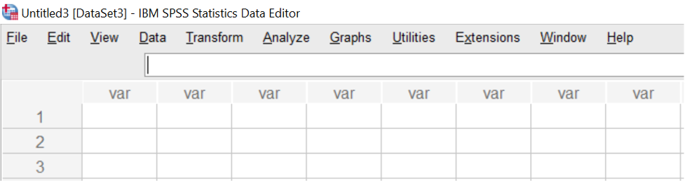
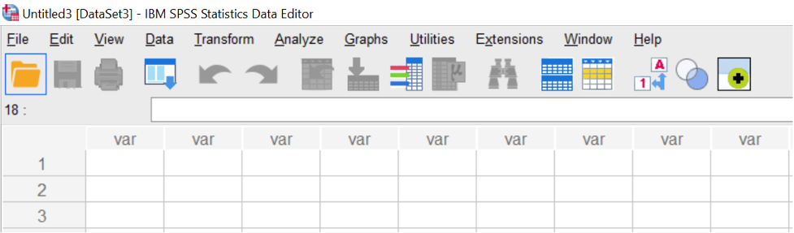

--- 
title: "Answering questions with data: Lab Manual"
author: 
- "Matthew J. C. Crump, Anjali Krishnan, Stephen Volz, and Alla Chavarga"
- "Adapted for PSYC 292, St. Francis Xavier University, by Erin L. Mazerolle, Sherry Neville-MacLean, Christine D. Lomore, and Margaret Vail. "
date: "Last Compiled `r Sys.Date()`"
site: bookdown::bookdown_site
output: 
  bookdown::gitbook:
    includes:
      in_header: includeme.html
      before_body: testpic.html
    css: [tufte.css, style.css]
    fontsettings:
      theme: white
      family: sans
      size: 1
documentclass: book
bibliography: [book.bib, packages.bib, MyLibrary.bib]
biblio-style: apalike
link-citations: yes
#github-repo: rstudio/bookdown-demo
description: "A lab manual for Psyc 292 at StFX"
---

```{r setup, include=FALSE}
knitr::opts_chunk$set(message=FALSE,warning=FALSE, cache=TRUE)
```


# Preface {-}

```{r,eval=FALSE,echo=F,fig.align="center"}
knitr::include_graphics("LabmanualCover.png")
```

This is the companion lab to our free introductory statistics for undergraduates in psychology textbook, [Answering questions with data](https://www.erinmazerolle.com/statistics/).

This lab manual involves step by-step tutorials to solve data analysis problems in software. We use open-data sets that are usually paired with a primary research article.

Each lab has a separate guide for solving the problems in R & R-studio, Excel, SPSS, and JAMOVI.

The manual is a free and open resource. See below for more information about copying, making change, or contributing to the lab manual.

## Important notes

This lab manual is released under a creative commons licence [CC BY-SA 4.0](https://creativecommons.org/licenses/by-sa/4.0/). Click the link to read more about the license, or read more below in the license section.

This lab manual is part of a larger OER course package for teaching undergraduate statistics in Psychology. Team members include, Matthew Crump, Alla Chavarga, Anjali Krishnan, Jeffrey Suzuki, and Stephen Volz. As this OER comes together, we will be providing a [course website](https://crumplab.github.io/psyc3400/), written in R Markdown, as well as slide decks for the lectures (these will be more fully available by the end of fall 2018). As a result, this textbook, the lab manual, the course website, and the slide decks will all be free, under a creative commons license. The source code for all material is contained in the GitHub repositories for each, and they are a written in R-markdown, so they are relatively easy to copy and edit. Have Fun!

### Attributions and Versions

**First Draft (version 0.9 = August 15th, 2018)**

This was the version we used to adapt the lab manual. That project can be found [here](https://crumplab.github.io/statisticsLab/). It was authored by Matt Crump (R exercises), Anjali Krishnan (JAMOVI exercises), Stephen Volz (EXCEL exercises), and Alla Chavarga (SPSS exercises). Labs 6, 7, and 8 were adapted and expanded from [Open Stats Labs](https://sites.trinity.edu/osl). Thanks to Open Stats Labs (Dr. Kevin P. McIntyre) for their fantastic work.

**Version 1.0 = April, 2021**

This version was our first edit of the lab manual for PSYC 292 at StFX (Winter 2021), and was completed by Erin Mazerolle and Sherry Neville-MacLean. The changes were mainly focused on the SPSS sections of Labs 1, 2, 3, 6, and 7, and in particular, the homework questions. We also added Lab 12.

**In progress: Version 2.0.** Last Compiled: `r Sys.Date()`

We are currently working on updating the lab manual to include JAMOVI activities that will use in PSYC 292 at StFX.

Section 0.6 of Lab 0 was adapted nearly verbatim, with some editorial changes, from Chapter 3, "Getting started with jamovi," from Navarro, D.J., & Foxcroft, D.R. (2019). Learning statistics with jamovi: A tutorial for psychology students and other beginners. (Version 0.70) while adhering to its license that states "The book is released under a creative commons CC BY-SA 4.0 licence. This means that this book can be reused, remixed, retained, revised and redistributed (including commercially) as long as appropriate credit is given to the authors. If you remix, or modify the original version of this open textbook, you must redistribute all versions of this open textbook under the same license - [CC BY-SA](https://creativecommons.org/licenses/by-sa/4.0/deed.ast). DOI: 10.24384/hgc3-7p15


### CC BY-SA 4.0 license

This license means that you are free to:

- Share: copy and redistribute the material in any medium or format
- Adapt: remix, transform, and build upon the material for any purpose, even commercially.

The licensor cannot revoke these freedoms as long as you follow the license terms.

Under the following terms:

- Attribution: You must give appropriate credit, provide a link to the license, and indicate if changes were made. You may do so in any reasonable manner, but not in any way that suggests the licensor endorses you or your use.
- ShareAlike: If you remix, transform, or build upon the material, you must distribute your contributions under the same license as the original.
- No additional restrictions: You may not apply legal terms or technological measures that legally restrict others from doing anything the license permits.

### Copying the lab manual

This lab manual was written in R-Studio, using R Markdown, and compiled into a web-book format using the bookdown package. 

All of the source code for this book is available in a GitHub repository: [https://github.com/erinmaz/statisticsLab](https://github.com/erinmaz/statisticsLab)

In addition, the source code for  project this book was based on can be found at: [https://github.com/CrumpLab/statisticsLab](https://github.com/CrumpLab/statisticsLab)

In principle, anybody could fork or otherwise download this repository. Load the Rproj file in R-studio, and then compile the entire book. Then, the individual .rmd files for each chapter could be edited for content and style to better suit your needs.

If you want to contribute to this version of the lab manual, you could make pull requests on GitHub, or discuss issues and request on the issues tab.


### Acknowledgments

Thanks to the librarians at Brooklyn College of CUNY, especially Miriam Deutch, and Emily Fairey, for their support throughout the process. Thanks to CUNY for supporting OER development, and for the grant we received to develop this work.

Development of version 2.0 (described above) was funded by the [Council of Atlantic University Libraries](https://www.caul-cbua.ca/) through an AtlanticOER Development Grant awarded to Erin Mazerolle, Christine Lomore, Margaret Vail, Derrick Lee, Sherry Neville-MacLean, and Lindsay Berrigan. 

# Software {-}

<script>
$("#coverpic").hide();
</script>

## Data

Data files used for the labs are all taken from open data sources. Links are provided for each lab. For convenience, all of the data files are also available here as single files in the github repository for this lab manual

### Data Repository

[https://github.com/CrumpLab/statisticsLab/tree/master/data](https://github.com/CrumpLab/statisticsLab/tree/master/data)

### CSV format

All of the data files in .csv format are also available to [download as a .zip file](https://raw.githubusercontent.com/CrumpLab/statisticsLab/master/data/data_csv.zip)

### SPSS format

All of the data files in SPSS format are also available to [download as a .zip file](https://raw.githubusercontent.com/CrumpLab/statisticsLab/master/data/spssdata/spss_data.zip)


## R

<div class="marginnote">

```{r 2rlogo, echo=FALSE,dev='png'}
knitr::include_graphics('figures/rlogo.jpg')
```
</div>

In this course we will be using R as a tool to analyze data, and as a tool to help us gain a better understanding of what our analyses are doing. Throughout each lab we will show you how to use R to solve specific problems, and then you will use the examples to solve homework and lab assignments. R is a very deep programming language, and in many ways we will only be skimming the surface of what R can do. Along the way, there will be many pointers to more advanced techniques that interested students can follow to become experts in using R for data-analysis, and computer programming in general.

R is primarily a computer programming language for statistical analysis. It is *free*, and *open-source* (many people contribute to developing it), and runs on most operating systems. It is a powerful language that can be used for all sorts of mathematical operations, data-processing, analysis, and graphical display of data. I even used R to write this lab manual. And, I use R all the time for my own research, because it makes data-analyis fast, efficient, transparent, reproducible, and exciting.

<div class="marginnote">
Statistics Software

-   [SPSS](http://www-01.ibm.com/software/analytics/spss/)
-   [SAS](http://www.sas.com/en_us/home.html)
-   [JMP](http://www.jmp.com)
-   [R](http://www.r-project.org)
-   [Julia](http://julialang.org)
-   [Matlab](http://www.mathworks.com/products/matlab/)

</div>

### Why R?

There are lots of different options for using computers to analyze data, why use R?. The options all have pros and cons, and can be used in different ways to solve a range of different problems. Some software allows you to load in data, and then analyze the data by clicking different options in a menu. This can sometimes be fast and convenient. For example, once the data is loaded, all you have to do is click a couple buttons to analyse the data! However, many aspects of data-analysis are not so easy. For example, particular analyses often require that the data be formatted in a particular way so that the program can analyze it properly. Often times when a researcher wants to ask a new question of an existing data set, they have to spend time re-formatting the data. If the data is large, then reformatting by hand is very slow, and can lead to errors. Another option, is to use a scripting language to instruct the computer how reformat the data. This is very fast and efficient. R provides the ability to everything all in one place. You can load in data, reformat it any way you like, then anlayze it anyway you like, and create beautiful graphs and tables (publication quality) to display your findings. Once you get the hang of R, it becomes very fast and efficient.

### Installing R and R Studio

Download and install R onto your computer. The R website is: <http://www.r-project.org>

Find the download R using the link. This will take you to a page with many different mirror links. You can click any of these links to download a version of R that will work on your computer. After you have installed R you can continue.

After you have installed R on your computer, you should want to install another program called R studio. This program provides a user-friendly interface for using R. You must already have installed R before you perform this step. The R-studio website is: <http://www.rstudio.com>

Find the download link on the front-page, and then download R studio desktop version for your computer. After you have installed R studio you will be ready to start using R.

<div class="marginnote">
The website [R-fiddle](http://www.r-fiddle.org) allows you to run R scripts in the cloud, so you can practice R from your web-browser!
</div>

### R studio notes and tips

```{r 2rstudiod, fig.cap="The R-studio workspace", echo=FALSE,dev='png'}
knitr::include_graphics('figures/FigRstudio.pdf')
```


#### Console

When you open up R studio you will see three or four main windows (the placement of each are configurable). In the above example, the bottom left window is the command line (terminal or console) for R. This is used to directly enter commands into R. Once you have entered a command here, press enter to execute the command. The console is useful for entering single lines of code and running them. Oftentimes this occurs when you are learning how to correctly execute a line of code in R. Your first few attempts may be incorrect resulting in errors, but trying out different variations on your code in the command line can help you produce the correct code. Pressing the up arrow while in the console will scroll through the most recently executed lines of code.

#### Script Editor

The top left corner contains the script editor. This is a simple text editor for writing and saving R scripts with many lines. Several tabs can be opened at once, with each tab representing a different R script. R scripts can be saved from the editor (resulting in a .r file). Whole scripts can be run by copy and pasting them into the console and pressing enter. Alternatively, you can highlight portions of the script that you want to run (in the script editor) and press command-enter to automatically run that portion in the console (or press the button for running the current line/section: green arrow pointing right).

#### Workspace and History

The top right panel contains two tabs, one for the workspace and another for history. The workspace lists out all of the variables and functions that are currently loaded in R’s memory. You can inspect each of the variables by clicking on them. This is generally only useful for variables that do not contain large amounts of information. The history tab provides a record of the recent commands executed in the console.

#### File, Plot, Packages, Help

The bottom-right window has four tabs for files, plots, packages, and help. The files tab allows browsing of the computers file directory. An important concept in R is the **current working directory**. This is file folder that R points to by default. Many functions in R will save things directly to this direct, or attempt to read files from this directory. The current working directory can be changed by navigating to the desired folder in the file menu, and then clicking on the more option to set that folder to the current working directory. This is especially important when reading in data to R. The current working directory should be set to the folder containing the data to be inputted into R. The plots tab will show recent plots and figures made in R. The packages tab lists the current R libraries loaded into memory, and provides the ability to download and enable new R packages. The help menu is an invaluable tool. Here, you can search for individual R commands to see examples of how they are used. Sometimes the help files for individual commands are opaque and difficult to understand, so it is necessary to do a Google search to find better examples of using these commands.

### How to complete the R Labs

Each of the labs focuses on particular data-analysis problems, from graphing data, computing descriptive statistics, to running inferential tests in R. All of the labs come in three parts, a training part, a generalization part, and a writing part. The training part includes step-by-step examples of R code that solves particular problems. The R code is always highlighted in grey. The generalization part gives short assignments to change parts of the provided code to solve a new problem. The writing part tasks you with answering questions about statitiscal concepts. 

The way to complete each lab is to open a new R Markdown document in R-studio, and then document your progression through each of the parts. By doing this, you will become familiar with how R and R-studio works, and how to create documents that preserve both the code and your notes all in one place. There are a few tricks to getting started that are outline below.

1. Open R-studio

#### R projects

2. Create a new R project
    a. Go to the file menu and select new project, or go to the top right-hand corner of  R-studio, you should see a blue cube with an R in it, then select New project from the dropdown menu
3. Save the new R project somewhere that you can find it. If you are working on a lab computer, then save the new R project to the desktop.

What is an R project? When you create a new R project you are creating two things, 1) a new folder on your computer, and 2) a ".Rproj" file. For example, if you gave your R project the name "Lab1", then you will have created a folder title "Lab1", and inside the folder you will find an R project file called "Lab1.Rproj".

As you work inside R-studio you will be creating text documents, and you will be doing things like loading data, and saving the results of your analyses. As your work grows and becomes more complex, you can often find yourself creating many different files. **The R project folder is a very useful way of organizing your files all in one place so you can find them later.** If you double-clik an R project file, R-studio will automatically load and restore your last session. In the labs, you will be using your R project folder to:

1. save data files into this folder
2. save R-markdown files that you will use to write your R-code and lab notes
3. save the results of your analysis

#### Installing libraries

When you install R and R-studio, you get what is called Base R. Base R contains many libraries that allow you to conduct statistical anlayses. Because R is free and open-source, many other developers have created add-on libraries that extend the functionality of R. **We use some of these libraries, and you need to install them before you can do the labs**.

For example, in any of the labs, whenever you see a line code that uses the word library like this `library(libraryname)`, this line of code telling R to load up that library so it can be used. The `libraryname` would be replaced with the actual name of the library. For example, you will see code like this in the labs:

```
library(data.table)
```

This line of code is saying that the `data.table` library needs to be loaded. You can check to see if any library is already loaded by clicking on the "packages" tab in the bottom right hand panel. You will see many packages listed in alphabetical order. Packages that are currently loaded and available have a checkmark. If you scroll down and find that you **do not** have `data.table` installed, then you need to install it. To install any package follow these steps:

1. Click on the packages tab
2. Find the "install" button in the top left hand corner of the packages tab.
3. Click the install button
4. Make sure "install from:" is set to CRAN repository
5. Make sure "dependencies" is clicked on (with a checkmark)
6. type the name of the library into the search bar. 
7. As you type, you should see the names of different packages you can install pop-up in a drop-down menu. **You must be connected to the internet to install packages from CRAN**
8. Once you find the package (e.g., `data.table`), click it, or just make sure the full, correctly spelled name, is in the search bar
9. Press the install button

You should see some text appear in the console while R installs the package.

10. After you have installed the package, you should now see that it is listed in the packages tab.
11. You can turn the package on by clicking it in the package tab.
12. OR, you can turn the packge on by running the command `library(data.table)` in the console, to do this type `library(data.table)` into the console, and press enter.

#### Quick install

If you are using R on one of the lab computers, you may find that some of the packages are not installed. The lab computers get wiped everynight, so it may be necessary to install packages each time you come back to the lab. Fortunately, we can tell R to install all of the packages we need in one go. Copy the following lines of code into the console, and press enter. Note you can select all of the lines at once, then copy them, then paste all of them into the console, and press enter to run them all. After each of the packages are installed, you will then be able to load them using `library()`.

```
install.packages(ggplot2)
install.packages(dplyr)
install.packages(data.table)
install.packages(summarytools)
install.packages(gapminder)
install.packages(ggpubr)
```

#### R markdown

Once you have the necessary packages installed you can begin creating R markdown documents for each lab. We admit that at the beginning, R markdown documents might seem a little bit confusing, but you will find they are extremely useful and flexible. Basically, what R markdown allows you to do is combine two kinds of writing, 1) writing R code to conduct analyses, and 2) writing normal text, with headers, sub-headers, and paragraphs. You can think of this like a lab journal, that contains both your writing about what you are doing (e.g., notes to self), and the code that you use for analysis. Additionally, when your code does something like make a graph, or run a statistical test, you can ask R markdown to print the results.

The R markdown website has an excellent tutorial that is well worth your time to check out: [https://rmarkdown.rstudio.com/lesson-1.html](https://rmarkdown.rstudio.com/lesson-1.html)

#### R markdown lab templates

We have created a set of template documents for each lab that can be downloaded here: [download lab templates](https://github.com/CrumpLab/statisticsLab/raw/master/RMarkdownsLab.zip).

When you unzip the file you should find the following:

1. A new folder titled "RMarkdownsLab"
2. Inside the folder you will see the "RMarkdownsLab.Rproj" file
3. A data folder containing data files for the labs
4. A "LabTemplates" folder containing the R markdown templates for each lab.

To get started with Lab 1, follow these steps:

1. copy the template file for lab 1, "Lab 01 Graphing_Student Name.Rmd", and place it into the "RMarkdownsLab" (copy it out of the template folder, and into the RMarkdownsLab folder).
2. Rename the file to add your own name, eg., "Lab1GraphingMattCrump.Rmd"
2. double-click the "RMarkdownsLab.Rproj" file
3. R-studio will now load up.
4. If you click the files tab, you will see all of the files and folders inside the "RMarkdownsLab" folder
5. Click on your lab1 .rmd file, it will now load into the editor window. 

Each lab template .rmd file contains three main sections, one for each part of the lab. You will write things inside each section to complete the lab.

### Screencast tutorial

Follow this guide to get up running for Lab 1.

### R-studio Cloud

R-studio is also in the cloud. This means that if you want to use R and R-studio through your web-browser you can do that without even installing R or R-studio on your computer. It's also free!

1. sign up for an R-studio cloud account here: [https://rstudio.cloud](https://rstudio.cloud)

2. You can make new R projects, work inside them, and everything is saved in the cloud!

3. To see how everything would work, follow the steps in this video. You will need to download this [.zip file to your computer to get started](https://github.com/CrumpLab/statisticsLab/raw/master/RstudioCloud.zip)

The link to the video is [https://www.youtube.com/watch?v=WsbnV0t7FE4](https://www.youtube.com/watch?v=WsbnV0t7FE4), or you can watch it here:

<iframe width="560" height="315" src="https://www.youtube.com/embed/WsbnV0t7FE4?rel=0" frameborder="0" allow="autoplay; encrypted-media" allowfullscreen></iframe>


## Excel 

## SPSS
In this course, we will be using SPSS to help us with the analyses about which we are learning in classes. Throughout each lab, we will show you how to use SPSS to solve specific problems, and then you will use the examples to solve in-lab assignments, homework, and the analysis for your team project.

### Installing SPSS
We will be using SPSS version 27. The file to download and installation instructions can be found here: https://stfx.teamdynamix.com/TDClient/1764/Portal/KB/ArticleDet?ID=44882

### Notes and Tips

#### Discrepancies in Visuals
Throughout the lab manual, you will encounter visuals of screens in SPSS. If an image looks slightly different from what you observe on your screen, the discrepancy may be due to a difference in version (27 vs older versions) or operating system (Mac vs PC). Most images are not from version 27 – which was made available to us in January of 2021. From time to time, you may notice that the layout of a pop-up window or the set of commands for an analysis differs for you. A difference in layout is likely due to the difference in our operating systems. The difference in the set of commands may be slight and based on our operating systems, or it may be just a matter of there being more than one correct way to accomplish the same task. If you encounter a difference, let us know so that we can share it with other students and update this manual. 

#### Hidden Toolbars
If the toolbar is hidden when you enter SPSS, you can select View, Toolbars, and Data Editor to access the images used for shortcuts.
```{r , fig.cap="View without Shortcuts", echo=FALSE,dev='png'}

```
```{r , fig.cap="View with Shortcuts", echo=FALSE,dev='png'}

```


####Adjusting the Font Size
The default font size in SPSS files is small for many readers. If you would like to increase the size of the font in the data file, please click View and Fonts to adjust the font for your preferences. Increasing the size of the font in the output file seems a bit more complicated. You can increase the size of the font in the output pane easily by clicking View and Outline Size; however, the font within the main section of the file is not so easily changed. To increase the size of the tables generated, please click Edit and Options and select the Pivot Tables tab. Within the pop-up window (shown below), change from System Default to Large Font (click to highlight this option) and click OK.

### Opening SPSS and the SPSS layout
Your lab instructor will take you through the process of opening the SPSS program. You may double-click on its icon located on the desktop of your lab computer, or you may find it using the Start menu. Once the program loads,  you will be prompted with a pop-up window that asks you which file you would like to open. For now, we will be examining the basic layout of SPSS without a data set, so you can click <span style="color:blue">Cancel</span>. 

Once you do, the main SPSS spreadsheet should open. It will look like this, a basic spreadsheet:

```{r , fig.cap="Empty SPSS spreadsheet", echo=FALSE,dev='png'}
knitr::include_graphics('img/1.4.11.png')
```
Notice at the bottom of your window there are two tabs; "Data View" and "Variable View". In data view, we enter data into our spreadsheet. You will notice that rows are numbered on the left-hand side of the spreadsheet, while columns are labeled "var". This is an indication of the general structure of SPSS: Variables are contained in the columns, and rows indicate individual observations.  For example, if you obtained the heights (in inches) of 5 people {x= 64, 70, 63, 62, 65} and wanted to enter their data into SPSS, each person's height would be entered in a new row, not across the columns, as seen below:


```{r , echo=FALSE,dev='png'}
knitr::include_graphics('img/1.4.12.png')
```

#### Reviewing variable properties and the Variable View tab
Now that we have some data entered, we might want to name our variable so that it's evident our measurements represent heights. In order to view or modify variable names and other properties, look to the bottom of your SPSS window and switch over to the "Data View" tab. Once you do this, your window will appear as follows:


```{r , echo=FALSE,dev='png'}
knitr::include_graphics('img/1.4.13.png')
```

Here, you can edit the name of your variables, and specify their properties. Variable names can be anything you like, with the restriction that you cannot use numbers or spaces. Next, notice several other important properties of variables you may at some point need to set or modify:

+ Name: the name of your variable that will appear as a colum header in Data View. No spaces or numerals.
+ Type: Your data will most often be Numeric, but sometimes, as in data representing currency or data in scientific notation, you may change the data type appropriately. If your data is simply a label, word, or response (such as an open-ended response to a survey question), choose "String": this tells SPSS not to treat this variable as a number. (Nota bene: if you select the wrong type of variable, SPSS may not be able to process your requested calculations, so always remember to check this parameter!)
+ Width: This refers to how many digits will be visible by default.
+ Decimals: This refers to how many decimal places will be visible by default.
+ Label: This is a description of the variable. Any information too long to be included in the variable name goes here.
+ Values: For nominal scale data, let's say 1 represents male and 2 represents female, this is where you include the values and their corresponding labels. 
+ Measure: This variable property allows you to specify the nature of your data. Depending on the kind of scale you are using, you will choose a different measure type. Nominal and ordinal are chosen for nominal and ordinal scales, respectively. "Scale" is used when your data is measured on a ratio or interval scale.

### Practice Problems 

1. In your assigned breakout room, collect information to use in a data file. For each member of your group, collect preferred name, year of study (1, 2, 3, etc.), and type of personal device used (Mac, PC, Chromebook, etc.). Remember to check the settings of the variables in Variable View. You should each create an SPSS data file with the collected information, and upload that file in Moodle under the “SPSS Basics – Data File Submission” link.

2. A data file has been provided for you in Moodle. Open that file and answer the questions in the Moodle quiz entitled “Reading an SPSS Data File.”


## JAMOVI


In our lab sessions, we will be using jamovi to help us with the analyses about which we are learning in classes. Throughout each lab, we will show you how to use jamovi to solve specific problems, and then you will use the examples to solve in-lab assignments, homework, and the analysis for your team project.

### Getting Started with jamovi

<div class="marginnote">
This section is copied almost verbatim, with some editorial changes, from [Learning statistics with jamovi: A tutorial for psychology students and other beginners, Version 0.70](https://www.learnstatswithjamovi.com/), according to its [CC license](https://creativecommons.org/licenses/by-sa/4.0/deed.ast). Thank you to Navarro & Foxcroft (2019). 
</div>

In this [section], I'll discuss how to get started in jamovi. I'll briefly talk about how to download and install jamovi, but most of the chapter will be focused on getting you started with finding your way around the jamovi GUI. Our goal in this chapter is not to learn any statistical concepts: we're just trying to learn the basics of how jamovi works and get comfortable interacting with the system. To do this, we'll spend a bit of time looking at datasets and variables. In doing so, you'll get a bit of a feel for what it's like to work in jamovi. 

However, before going into any of the specifics, it's worth talking a little about why you might want to use jamovi at all. Given that you're reading this, you've probaby got your own reasons. However, if those reasons are *because that's what my stats class uses*, it might worth explaining a little why your lecturer has chosen to use jamovi for the class. Of course, I don't really know why *other* people choose jamovi, so I'm really talking about why I use it.

- It's sort of obvious but worth saying anyway: doing your statistics on a computer is faster, easier and more powerful than doing statistics by hand. Computers excel at mindless repetitive tasks, and a lot of statistical calculations are both mindless and repetitive. For most people, the only reason to ever do statistical calculations with pencil and paper is for learning purposes. In my class, I do occasionally suggest doing some calculations that way, but the only real value to it is pedagogical. It does help you to get a "feel" for statistics to do some calculations yourself, so it's worth doing it once. But only once!

- Doing statistics in a conventional spreadsheet (e.g., Microsoft Excel) is generally a bad idea in the long run. Although many people likely feel more familiar with them, spreadsheets are very limited in terms of what analyses they allow you do. If you get into the habit of trying to do your real life data analysis using spreadsheets, then you've dug yourself into a very deep hole.

- Avoiding proprietary software is a very good idea. There are a lot of commercial packages out there that you can buy, some of which I like and some of which I don't. They're usually very glossy in their appearance and generally very powerful (much more powerful than spreadsheets). However, they're also very expensive. Usually, the company sells "student versions" (crippled versions of the real thing) very cheaply, and then they sell full-powered "educational versions" at a price that makes me wince. They will also sell commercial licenses with a staggeringly high price tag. The business model here is to suck you in during your student days and then leave you dependent on their tools when you go out into the real world. It's hard to blame them for trying, but personally I'm not in favour of shelling out thousands of dollars if I can avoid it, and you can avoid it. If you make use of packages like jamovi that are open source and free, you never get trapped having to pay exorbitant licensing fees. 

- Something that you might not appreciate now, but will love later on if you do anything involving data analysis, is the fact that jamovi is basically a sophisticated front end for the free \R\ statistical programming language. When you download and install \R\ you get all the basic ``packages'' and those are very powerful on their own. However, because \R\ is so open and so widely used, it's become something of a standard tool in statistics and so lots of people write their own packages that extend the system. And these are freely available too. One of the consequences of this, I've noticed, is that if you look at recent advanced data analysis textbooks then a *lot* of them use \R. 

<br>
Those are the main reasons I use jamovi. It's not without its flaws, though. It's relatively new^1^[As of writing this in August 2018.] so there is not a huge set of textbooks and other resources to support it, and it has a few annoying quirks that we're all pretty much stuck with, but on the whole I think the strengths outweigh the weakness; more so than any other option I've encountered so far. <br>

#### Installing jamovi
<br>
Okay, enough with the sales pitch. Let's get started. Just as with any piece of software, jamovi needs to be installed on a *computer*, which is a magical box that does cool things and delivers free ponies. Or something along those lines; I may be confusing computers with the iPad marketing campaigns. Anyway, jamovi is freely distributed online and you can download it from the jamovi homepage, which is:


[jamovi Homepage](https://www.jamovi.org/)


At the top of the page, under the heading "Download," you'll see separate links for Windows users, Mac users, and Linux users. If you follow the relevant link, you'll see that the online instructions are pretty self-explanatory. As of this writing, the current version of jamovi is 0.9, but they usually issue updates every few months, so you'll probably have a newer version.^2^[Athough jamovi is updated frequently, it doesn't usually make much of a difference for the sort of work we'll do in this book. In fact, during the writing of the book, I upgraded several times, and it didn't make much difference at all to what is in this book.]


#### Starting jamovi up

One way or another, regardless of what operating system you're using, it's time to open jamovi and get started. When first starting jamovi, you will be presented with a user interface which looks something like Figure \ref{fig:startingjamovi}.

\begin{figure}[ht]
\begin{center}
\epsfig{file=../img/introj/startingjamovi.png,clip=true,width=14cm}
\caption{jamovi looks like this when you start it.}
%\HR
\label{fig:startingjamovi}
\end{center}
\end{figure}

To the left is the spreadsheet view, and to the right is where the results of statistical tests appear. Down the middle is a bar separating these two regions, and this bar can be dragged to the left or the right to change the sizes of the two view. 

It is possible to simply begin typing values into the jamovi spreadsheet as you would in any other spreadsheet software. Alternatively, existing data sets in the CSV (.csv) file format can be opened in jamovi. Additionally, you can easily import SPSS, SAS, Stata and JASP files directly into jamovi. To open a file, select the File tab (three horizontal lines signify this tab) at the top left hand corner, select `Open` and then choose from the files listed on "Browse" depending on whether you want to open an example or a file stored on your computer.

### Analyses 

Analyses can be selected from the analysis ribbon or menu along the top. Selecting an analysis will present an `Options` panel for that particular analysis, allowing you to assign different variables to different parts of the analysis and to select different options. At the same time, the results for the analysis will appear in the right `Results` panel and will update in real-time as you make changes to the options.

When you have the analysis set up correctly, you can dismiss the analysis options by clicking the arrow to the top right of the optional panel. If you wish to return to these options, you can click on the results that were produced. In this way, you can return to any analysis that you (or say, a colleague) created earlier.

If you decide you no longer need a particular analysis, you can remove it with the results context menu. Right-clicking on the analysis results will bring up a menu, and by selecting `Analysis` and then `Remove`, the analysis can be removed. But more on this later. First, let's take a more detailed look at the spreadsheet view.

### The Spreadsheet

In jamovi, data is represented in a spreadsheet with each column representing a ***variable*** and each row representing a ***case*** or ***participant***.

#### Variables

The most commonly used variables in jamovi are **Data Variables**, these variables simply contain data either loaded from a data file, or *typed in* by the user. Data variables can be one of three measurement levels:

\begin{figure}[ht]
\epsfig{file=../img/introj/measurementlevels.png, width = 12cm}
\end{figure}

These levels are designated by the symbol in the header of the variable's column.

The ***ID*** variable type is unique to jamovi. It's intended for variables that contain identifiers that you would almost never want to analyze, for example, a person’s name or a participant ID. Specifying an ID variable type can improve performance when interacting with very large data sets.

***Nominal*** variables are for categorical variables which are text labels, for example, a column called Gender with the values Male and Female would be nominal. So would a person's name. Nominal variable values can also have a numeric value. These variables are used most often when importing data which codes values with numbers rather than text. For example, a column in a dataset may contain the values 1 for males and 2 for females. It is possible to add nice, *human-readable* labels to these values with the variable editor (more on this later).

***Ordinal*** variables are like Nominal variables, except the values have a specific order. An example is a Likert scale with 3 being *strongly agree* and -3 being *strongly disagree*.

***Continuous*** variables are variables which exist on a continuous scale. Examples might be height or weight. Continuous scales are also referred to as **Interval** or **Ratio** scale.

In addition, you can also specify different data types: variables have a data type of either *Text*, *Integer*, or *Decimal*. 

When starting with a blank spreadsheet and typing values in, the variable type will change automatically depending on the data you enter. This is a good way to get a feel for which variable types go with which sorts of data. Similarly, when opening a data file, jamovi will try to guess the variable type from the data in each column. In both cases, this automatic approach may not be correct, and it may be necessary to manually specify the variable type with the variable editor.

The variable editor can be opened by selecting `Setup` from the data tab or by double-clicking on the variable column header. The variable editor allows you to change the name of the variable and, for data variables, the variable type, the order of the levels, and the label displayed for each level. Changes can be applied by clicking the `tick` to the top right. The variable editor can be dismissed by clicking the `Hide` arrow.

New variables can be inserted or appended to the data set using the `Add` button from the data ribbon. The `Add` button also allows the addition of computed variables.

#### Computed Variables

Computed Variables are those which take their value by performing a computation on other variables. Computed Variables can be used for a range of purposes, including log transforms, z-scores, sum-scores, negative scoring, and means.

Computed variables can be added to the data set with the `Add` button available on the data tab. This will produce a formula box where you can specify the formula. The usual arithmetic operators are available. Some examples of formulas are:

A + B 

LOG10(len)

MEAN(A, B)

(dose - VMEAN(dose)) / VSTDEV(dose)

In order, these are the sum of A and B, a log (base 10) transform of len, the mean of A and B, and the z-score of the variable dose. Figure \ref{fig:computedvariable} below shows the jamovi screen for the new variable computed as the z-score of dose (from the `Tooth Growth' example data set).

\vspace*{1cm}
\begin{figure}[ht]
\begin{center}
\epsfig{file=../img/introj/computedvariable.png,clip=true,width=14cm}
\caption{A newly computed variable, the z-score of `dose'.}
\HR
\label{fig:computedvariable}
\end{center}
\end{figure}


*V-functions*
Several functions are already available in jamovi and available from the drop down box labelled  *f~x~*. A number of functions appear in pairs, one prefixed with a V and the other not. V functions perform their calculation on a variable as a whole whereas non-V functions perform their calculation row by row. For example, MEAN(A, B) will produce the mean of A and B for each row whereas VMEAN(A) gives the mean of all the values in A.

##### Copy and Paste

jamovi produces nice American Psychological Association (APA) formatted tables and attractive plots. It is often useful to be able to copy and paste these, perhaps into a Word document, or into an email to a colleague. To copy results, right click on the object of interest, and from the menu, select exactly what you want to copy. The menu allows you to choose to copy only the image or the entire analysis. Selecting `copy` copies the content to the clipboard, and this content can be pasted into other programs in the usual way. You can practice this later on when we do some analyses.

##### Syntax Mode

jamovi also provides an "\R\ Syntax Mode". In this mode, jamovi produces equivalent \R\ code for each analysis. To change to syntax mode, select the Application menu to the top right of jamovi (a button with three vertical dots) and click the "Syntax mode" checkbox there. You can turn off syntax mode by clicking this a second time.

In syntax mode, analyses continue to operate as before, but now they produce \R\ syntax and *ascii output* like an \R\ session. Like all results objects in jamovi, you can right click on these items (including the \R\ syntax) and copy and paste them, for example into an \R\ session. At present, the provided \R\ syntax does not include the data import step and so this must be performed manually in \R. There are many resources explaining how to import data into \R\ and if you are interested we recommend you take a look at these; just search on the interweb. 

### Loading Data in jamovi

There are several different types of files that are likely to be relevant to us when doing data analysis. There are two in particular that are especially important from the perspective of this book:

- ***jamovi files*** are those with an .omv file extension. This is the standard kind of file that jamovi uses to store data, variables, and analyses. 

- ***Comma separated value (csv) files*** are those with a .csv file extension. These are just regular old text files and they can be opened with many different software programs. It's quite typical for people to store data in csv files, precisely because they're so simple.


There are also several other kinds of data file that you might want to import into jamovi. For instance, you might want to open Microsoft Excel spreadsheets (.xls files), or data files that have been saved in the native file formats for other statistics software, such as SPSS or SAS.  Whichever file formats you are using, it's a good idea to create a folder or folders especially for your jamovi data sets and analyses and to make sure you keep these backed up regularly. 

#### Importing Data from CSV Files

One quite commonly used data format is the humble *comma separated value* file, also called a csv file, and usually bearing the file extension .csv. csv files are just plain old-fashioned text files, and what they store is basically just a table of data. This is illustrated in Figure~\ref{fig:booksalescsv}, which shows a file called \filename{booksales.csv} that I've created. As you can see, each row represents the book sales data for one month. The first row doesn't contain actual data though; it has the names of the variables.

\begin{figure}
\begin{center}
\epsfig{file = ../img/mechanics/booksalescsv.eps, clip=true,width = 14cm}
\caption{The \filename{booksales.csv} data file. On the left, I've opened the file using a spreadsheet program (OpenOffice), which shows that the file is basically a table. On the right, the same file is open in a standard text editor (the TextEdit program on a Mac), which shows how the file is formatted. The entries in the table are wrapped in quote marks and separated by commas.}
\HR
\label{fig:booksalescsv}
\end{center}
\end{figure} 

It's easy to open csv files in jamovi. From the top left menu (the button with three parallel lines), choose `Open` and browse to where you have stored the csv file on your computer. If you're on a Mac, it'll look like the usual Finder window that you use to choose a file; on Windows, it looks like an Explorer window. An example of what it looks like on a Mac is shown in Figure~\ref{fig:fileopen}. I'm assuming that you're familiar with your own computer, so you should have no problem finding the csv file that you want to import! Find the one you want, and then click on the ``Open'' button. 

\begin{figure}[t]
\begin{center}
\epsfig{file = ../img/mechanics/openscreen.eps,clip=true, width = 14cm}
\caption{A dialog box on a Mac asking you to select the csv file jamovi should try to import. Mac users will recognize this immediately; it's the usual way in which a Mac asks you to find a file. Windows users won't see this; instead, they'll see the usual Explorer window that Windows always gives you when it wants you to select a file.}
\HR
\label{fig:fileopen}
\end{center}
\end{figure} 

There are a few things that you can check to make sure that the data gets imported correctly: 

- Heading. Does the first row of the file contain the names for each variable - a `header` row? The {booksales.csv} file has a header, so that's a yes.

- Separator. What character is used to separate different entries? In most csv files, this will be a comma (it is "comma separated" after all).

- Decimal. What character is used to specify the decimal point? In English-speaking countries, this is almost always a period (i.e., {.}). That's not universally true though. Many European countries use a comma. 

- Quote. What character is used to denote a block of text? That's usually going to be a double quote mark ({"}). It is for the {booksales.csv} file.


### Importing Unusual Data Files

Throughout this book, I've assumed that your data are stored as a jamovi {.omv} file or as a "properly" formatted csv file. However, in real life, that's not a terribly plausible assumption to make so I'd better talk about some of the other possibilities that you might run into. 

#### Loading Data from Text Files

The first thing I should point out is that if your data are saved as a text file but aren't *quite* in the proper csv format, then there's still a pretty good chance that jamovi will be able to open it. You just need to try it and see if it works. Sometimes, though, you will need to change some of the formatting. The ones that I've often found myself needing to change are:

- *header*. A lot of the time when you're storing data as a csv file, the first row actually contains the column names and not data. If that's not true, then it's a good idea to open up the csv file in a spreadsheet programme such as Open Office and add the header row manually. 

- *sep*. As the name "comma separated value" indicates, the values in a row of a csv file are usually separated by commas. This isn't universal, however. In Europe, the decimal point is typically written as {,} instead of {.}, and as a consequence, it would be somewhat awkward to use {,} as the separator. Therefore, it is not unusual to use {;} instead of {,} as the separator. At other times, I've seen a TAB character used. 

- *quote*. It's conventional in csv files to include a quoting character for textual data. As you can see by looking at the {booksales.csv} file, this is usually a double quote character, {"}. But sometimes there is no quoting character at all, or you might see a single quote mark (') used instead. 

- *skip*. It's actually very common to receive csv files in which the first few rows have nothing to do with the actual data. Instead, they provide a human readable summary of where the data came from, or maybe they include some technical info that doesn't relate to the data. 

- *missing values*. Often, you'll be given data with missing values. For one reason or another, some entries in the table are missing. The data file needs to include a "special" value to indicate that the entry is missing. By default, jamovi assumes that this value is {99}^3^[You can change the default value for missing values in jamovi from the top right menu (three vertical dots), but this only works at the time of importing data files into jamovi. The default missing value in the dataset should not be a valid number associated with any of the variables, e.g. you could use {-9999} as this is unlikely to be a valid value.], for both numeric and text data, so you should make sure that, where necessary, all missing values in the csv file are replaced with {99} (or {-9999}; whichever you choose) before opening / importing the file into jamovi. Once you have opened / imported the file into jamovi, all the missing values are converted to blank cells in the jamovi spreadsheet view.


##### Loading Data from SPSS (and other statistics packages)

The commands listed above are the main ones we'll need for data files in this book. But, in real life, we have many more possibilities. For example, you might want to read data files from other statistics programs. Since SPSS is probably the most widely used statistics package in psychology, it's worth mentioning that jamovi can also import SPSS data files (.sav file extension). Just follow the instructions above for how to open a csv file, but this time navigate to the .sav file you want to import. For SPSS files, jamovi will regard all values as missing if they are regarded as "system missing" files in SPSS. The `Default missing' value does not seem to work as expected when importing SPSS files, so be aware of this - you might need another step: import the SPSS file into jamovi, and then export as a csv file before re-opening in jamovi.^4^[I know this is a bot of a fudge, but it does work, and hopefully this will be fixed in a later version of jamovi.].

And that's pretty much it, at least as far as SPSS goes.  As far as other statistical software goes, jamovi can also directly open / import SAS and STATA files. 

##### Loading Excel Files 

A different problem is posed by Excel files. Despite years of yelling at people for sending data to me encoded in a proprietary data format, I get sent a lot of Excel files. The way to handle Excel files is to open them up first in Excel or another spreadsheet programme that can handle Excel files, and then export the data as a csv file before opening / importing the csv file into jamovi. 

### Changing Data from One Level to Another

Sometimes you want to change the variable level. This can happen for all sorts of reasons. Sometimes when you import data from files, it can come to you in the wrong format. Numbers sometimes get imported as nominal, text values. Dates may get imported as text. ParticipantID values can sometimes be read as continuous: nominal values can sometimes be read as ordinal or even continuous. There's a good chance that sometimes you'll want to convert a variable from one measurement level into another one. Or, to use the correct term, you want to *coerce* the variable from one class into another. 

In Section 0.6.3, we saw how to specify different variable levels, and if you want to change a variable's measurement level, then you can do this in the jamovi data view for that variable. Just click the check box for the measurement level you want - continuous, ordinal, or nominal. 


### Installing Add-on Modules into jamovi 

A really great feature of jamovi is the ability to install add-on modules from the jamovi library. These add-on modules have been developed by the jamovi community, i.e., jamovi users and developers who have created special software add-ons that do other, usually more advanced, analyses that go beyond the capabilities of the base jamovi program. 

To install add-on modules, just click on the large \large{"+"} in the top right of the jamovi window, select `jamovi-library` and then browse through the various add-on modules that are available. Choose the one(s) you want, and then install them, as in Figure \ref{fig:modules}. It's that easy. The newly installed modules can then be accessed from the `Analyses` button bar. Try it...useful add-on modules to install include `scatr` (added under `Descriptives`) and `\R\ j`. 

\begin{figure}[htb]
\begin{center}
\epsfig{file = ../img/graphics/modules.png, clip=true,width =14cm} 
\caption{Installing add-on modules in jamovi}
\label{fig:modules}
\HR
\end{center}
\end{figure}

### Quitting jamovi 

There's one last thing I should cover in this chapter: how to quit jamovi. It's not hard, just close the program the same way you would any other program. However, what you might want to do before you quit is save your work! There are two parts to this: saving any changes to the data set, and saving the analyses that you ran.

It is good practice to save any changes to the data set as a *new* data set. That way you can always go back to the original data. To save any changes in jamovi, select `Export...Data` from the main jamovi menu (button with three horizontal bars in the top left) and create a new file name for the changed data set.

Alternatively, you can save *both* the changed data and any analyses you have undertaken by saving as a jamovi file. To do this, from the main jamovi menu select `Save as` and type in a file name for this `jamovi file (.omv)`. Remember to save the file in a location where you can find it again later. I usually create a new folder for specific data sets and analyses.  


### Summary

Every book that tries to teach a new statistical software program to novices has to cover roughly the same topics, and in roughly the same order. Ours is no exception, and so in the grand tradition of doing it just the same way everyone else did it, this chapter covered the following topics:

- In Section 0.6.1, we downloaded and installed jamovi, and started it up.
- In Section 0.6.2, we very briefly oriented to the part of jamovi where analyses are done and results appear, but then deferred this until later in the book.
- In Section 0.6.3, we spent more time looking at the spreadsheet part of jamovi, and considered different variable types, and how to compute new variables.
- In Section 0.6.4, we also saw how to load data files in jamovi.
- Then, in Section 0.6.5, we figured out how to open other data files, from different file types.
- In Section 0.6.6, we saw that sometimes we need to coerce data from one type to another.
- According to Section 0.6.7, installing add-on modules from the jamovi community really extends jamovi capabilities.
- Finally, in Section 0.6.8, we looked at good practice in terms of saving your data set and analyses when you have finished and are about to quit jamovi.


\noindent
We still haven't arrived at anything that resembles data analysis. Maybe the next Chapter will get us a bit closer!

